# E2B 组件架构与沙箱启动流程

## 1. 说明

本文基于 `infra` 仓库中的真实控制面与节点侧源码，重新梳理 E2B 的组件协作方式，以及一次 `POST /sandboxes` 请求如何最终变成一个可用的 sandbox。

这次分析不再停留在“概念级推断”，而是尽量沿着真实调用链展开：

`API handler -> API orchestrator -> node manager -> orchestrator gRPC server -> sandbox factory -> network/rootfs/memory/Firecracker -> envd init`

本文特别关注三个问题：

1. 控制面在创建前到底准备了什么
2. 节点侧到底是“冷启动 VM”还是“恢复快照”
3. `envd` 在启动链路中到底扮演什么角色

## 1.1 整体运行流程图

先看两张总览图。

第一张偏“全貌与对比”，适合快速看出 E2B 的分层、恢复源和关键执行阶段：

第二张偏“严格时序”，适合和其他项目的沙箱启动链路逐步对照：

## 2. 组件架构：基于真实源码的职责划分

### 2.1 SDK 与 API 层

SDK 的职责仍然是发请求和装配客户端，但在 `infra` 源码里，真正的创建入口是 API 服务的 `PostSandboxes()`：

- `packages/api/internal/handlers/sandbox_create.go`
- `packages/api/internal/handlers/sandbox.go`

这一层做的事情比“转发请求”多得多：

- 解析请求体
- 解析模板引用 `templateID`
- 通过模板缓存把 alias 解析成真实模板和 build
- 计算 timeout / autoPause / autoResume
- 校验 network 配置
- 按需生成 `envdAccessToken`
- 按需转换 volume mounts

所以 API 层已经开始做“创建请求归一化”。

### 2.2 API Orchestrator

第二层是 API 侧的 orchestrator：

- `packages/api/internal/orchestrator/create_instance.go`
- `packages/api/internal/orchestrator/nodemanager/*.go`

它负责：

- 做团队并发数控制
- 获取最新 sandbox 元数据
- 把 API 输入转换成 gRPC `SandboxCreateRequest`
- 生成 `trafficAccessToken`
- 组装网络配置
- 进行节点放置
- 把 sandbox 记录写入 API 侧 store

这一层并不直接操作 Firecracker，但它决定“在哪个节点、以什么配置启动什么 sandbox”。

### 2.3 Node Manager

Node Manager 是 API 控制面与具体 orchestrator 节点之间的桥：

- `packages/api/internal/orchestrator/nodemanager/sandbox_create.go`
- `packages/api/internal/orchestrator/nodemanager/metadata.go`

它会：

- 选择目标节点对应的 gRPC client
- 给请求附带边缘路由元数据
- 调用节点上的 `Sandbox.Create`

这说明 API 服务本身不直接创建 VM，而是把创建动作委派给目标 orchestrator 节点。

### 2.4 Orchestrator Server

节点上的 orchestrator gRPC server 是真正的执行入口：

- `packages/orchestrator/pkg/server/sandboxes.go`

这里会：

- 校验节点并发容量
- 从 template cache 取模板 build 产物
- 合并最终网络配置
- 构造 `sandbox.Config`
- 调用 `sandboxFactory.ResumeSandbox(...)`

这里有一个非常关键的事实：

> 普通创建 sandbox 时，节点侧不是调用 `CreateSandbox()`，而是调用 `ResumeSandbox()`。

也就是说，用户创建一个新 sandbox，本质上是“从模板 build 产物恢复一个新的 sandbox”，而不是“从头冷启动一个空白 VM”。

### 2.5 Template Cache / Template Build Artifacts

模板相关的关键代码在：

- `packages/orchestrator/pkg/sandbox/template/cache.go`
- `packages/orchestrator/pkg/sandbox/template/storage_template.go`
- `packages/orchestrator/pkg/template/build/...`

模板 cache 会为某个 build ID 拉取并缓存：

- `rootfs`
- `memfile`
- `snapfile`
- `metadata`

这意味着模板在运行期并不是一个 Docker image，而是一组可直接供 Firecracker 恢复的构件。

### 2.6 Sandbox Factory

节点执行面的核心在：

- `packages/orchestrator/pkg/sandbox/sandbox.go`

Factory 有两条能力：

- `CreateSandbox()`：用于模板构建阶段的冷启动 build sandbox
- `ResumeSandbox()`：用于运行阶段从 build/snapshot 恢复 sandbox

在真实线上创建用户 sandbox 时，走的是 `ResumeSandbox()`。

### 2.7 Network Subsystem

网络相关代码在：

- `packages/orchestrator/pkg/sandbox/network/pool.go`
- `packages/orchestrator/pkg/sandbox/network/network.go`
- `packages/orchestrator/pkg/sandbox/network/slot.go`

网络子系统的职责不是简单发 IP，而是：

- 从 pool 获取 slot
- 创建 network namespace
- 创建 `veth` / `vpeer` / `tap`
- 设置 host 与 guest 的路由和 NAT
- 初始化 firewall
- 下发 egress 规则
- 为 hyperloop / NFS / portmapper 建立重定向规则

所以“准备网络”在 E2B 里是一整套数据平面初始化流程。

### 2.8 Firecracker Runtime

Firecracker 相关代码在：

- `packages/orchestrator/pkg/sandbox/fc/process.go`

它封装了两条路径：

- `Create()`：从 boot source + rootfs 启动全新 VM
- `Resume()`：加载 snapshot + rootfs + UFFD 内存恢复已有 VM

运行期创建 sandbox 使用的是 `Resume()`。

### 2.9 `envd`

`envd` 相关代码在：

- `packages/orchestrator/pkg/sandbox/envd.go`
- `packages/orchestrator/pkg/sandbox/health.go`

`envd` 在启动链路中不是被动存在的。节点在恢复 VM 后还会主动调用 `POST /init`，向 `envd` 注入：

- env vars
- hyperloop IP
- access token
- default user / workdir
- volume mounts

因此真正的“sandbox ready”不是 Firecracker 进程启动完成，而是 `envd init` 成功完成。

## 3. 一个关键澄清：创建 sandbox 与构建模板不是同一条路径

源码显示，E2B 里有两种不同的“启动”：

### 3.1 模板构建阶段

模板构建时会调用：

- `packages/orchestrator/pkg/template/build/layer/create_sandbox.go`
- `sandboxFactory.CreateSandbox(...)`

这条路径会：

- 创建新的 memfile
- 冷启动 Firecracker
- `WaitForEnvd()`
- 执行模板构建步骤
- 产出新的 build 产物

所以模板构建阶段是真正的“冷启动 build sandbox”。

### 3.2 用户创建 sandbox 阶段

用户调用 `POST /sandboxes` 时，节点最终调用的是：

- `packages/orchestrator/pkg/server/sandboxes.go`
- `sandboxFactory.ResumeSandbox(...)`

这条路径会：

- 从模板 build 产物获取 rootfs / memfile / snapfile / metadata
- 准备网络
- 启动 UFFD
- 恢复 Firecracker snapshot
- 调用 `envd /init`

所以用户创建 sandbox 的真实语义是：

`从模板 build snapshot 恢复一个新的运行时实例`

而不是：

`重新从 Dockerfile 或 rootfs 冷启动一台全新 VM`

## 4. 从 `POST /sandboxes` 到 sandbox ready 的逐项流程

下面按真实代码顺序拆解。

### 4.1 API 接收请求并解析 body

入口：

- `packages/api/internal/handlers/sandbox_create.go:50`

`PostSandboxes()` 会先：

1. 读取 team 信息
2. 解析请求体 `PostSandboxesJSONRequestBody`
3. 解析模板引用 `id.ParseName(body.TemplateID)`

这里请求还只是“用户意图”，还不是最终可执行配置。

### 4.2 解析模板 alias 并定位到具体 build

同一函数里接着会做：

- `templateCache.ResolveAlias(...)`
- `templateCache.Get(...)`

得到的结果是：

- 真实 template ID
- 对应 build
- build 的 kernel / firecracker / envd / 资源规格等信息

这一步决定了后面恢复时要用哪套构件。

### 4.3 在 API 层归一化运行参数

API handler 会继续把用户输入归一化为真正的运行参数：

- `autoPause`
- `envVars`
- `metadata`
- `timeout`
- `autoResume`
- `volumeMounts`
- `allowInternetAccess`
- `network`

其中 network 会先转换成数据库/内部结构：

- ingress: `AllowPublicAccess`、`MaskRequestHost`
- egress: `AllowedAddresses`、`DeniedAddresses`

### 4.4 生成 `envdAccessToken`

如果请求里 `secure=true`，API 层会在创建前生成 `envdAccessToken`：

- `packages/api/internal/handlers/sandbox_create.go`

这个 token 不是启动后再补的，而是在控制面就生成，并会一路传到 orchestrator 节点和 `envd /init`。

### 4.5 校验公网访问与 secure 的约束

API 层还有一个关键约束：

如果 `allowPublicTraffic=false`，但没有启用 secure envd access，则直接拒绝创建。

这意味着：

- “关闭公开访问”
- “启用受保护的 envd”

在 E2B 里是绑定约束，而不是两个完全独立的开关。

### 4.6 构造 `SandboxMetadata` 闭包

API handler 最后把前面解析出的数据包装成 `getSandboxData`：

- build
- metadata
- env vars
- network
- alias
- template ID
- base template ID
- autoPause / autoResume
- volume mounts
- envdAccessToken

然后交给：

- `startSandbox()`
- `startSandboxInternal()`

### 4.7 API orchestrator 做并发控制与 fresh metadata 获取

入口：

- `packages/api/internal/orchestrator/create_instance.go`

`CreateSandbox()` 先做：

1. 团队并发数控制 `sandboxStore.Reserve(...)`
2. 获取最新 `SandboxMetadata`
3. 解析 Firecracker 版本能力，例如 huge pages

这一步的目标是：

- 先确定“能不能创建”
- 再确定“要用什么能力创建”

### 4.8 生成 `trafficAccessToken`

如果 network ingress 指定不允许公开访问，API orchestrator 会生成：

- `trafficAccessToken`

随后把它塞到最终的 ingress 配置里。

因此：

- `envdAccessToken` 用于保护 `envd`
- `trafficAccessToken` 用于保护公网流量入口

两者职责不同。

### 4.9 构造最终 gRPC `SandboxCreateRequest`

接下来 API orchestrator 会把 API 侧数据组装成：

- `orchestrator.SandboxCreateRequest`

里面包含：

- `TemplateId`
- `BaseTemplateId`
- `BuildId`
- `SandboxId`
- `ExecutionId`
- `KernelVersion`
- `FirecrackerVersion`
- `EnvdVersion`
- `EnvdAccessToken`
- `EnvVars`
- `Metadata`
- `AutoPause`
- `AutoResume`
- `AllowInternetAccess`
- `Network`
- `VolumeMounts`
- `TotalDiskSizeMb`

这一步是整个系统里最重要的“配置冻结点”。

### 4.10 节点放置

随后 API orchestrator 调用：

- `placement.PlaceSandbox(...)`

来决定最终把 sandbox 放到哪个 orchestrator 节点上。

如果是恢复 paused sandbox，且原 node 还可用，会优先尝试放回原节点。

### 4.11 通过 Node Manager 发起节点侧 gRPC Create

Node Manager 调用：

- `Node.SandboxCreate()`
- `client.Sandbox.Create(ctx, sbxRequest)`

同时在 metadata 里附带边缘路由事件，用于 catalog / routing 体系感知这个 sandbox 的创建。

到这里为止，API 控制面的职责结束，真正的执行动作开始发生在目标节点。

### 4.12 节点侧接收 Create 请求

入口：

- `packages/orchestrator/pkg/server/sandboxes.go`

节点的 `Server.Create()` 会：

1. 设置请求超时
2. 做 tracing / feature flags 上下文注入
3. 检查本节点并发上限
4. 从 template cache 取模板

关键调用：

- `templateCache.GetTemplate(buildID, snapshotFlag, false)`

### 4.13 从 template cache 取 build 产物

Template cache 会为 build 准备：

- `snapfile`
- `metafile`
- `memfile`
- `rootfs`

对应代码：

- `packages/orchestrator/pkg/sandbox/template/cache.go`
- `packages/orchestrator/pkg/sandbox/template/storage_template.go`

这一步说明：

E2B 启动 sandbox 时依赖的是 build artifact storage，而不是重新构建镜像。

### 4.14 合并最终网络配置

节点侧还会再做一次网络归一化：

- 如果全局配置禁止 internet，则覆盖 egress 为 deny all
- 将 API 传下来的 network 复制到最终 config

然后构造：

- `sandbox.NewConfig(...)`

其中把：

- network
- envd metadata
- firecracker config
- volume mounts

统一组进执行面配置。

### 4.15 调用 `ResumeSandbox()` 而不是 `CreateSandbox()`

最关键的一步：

- `sandboxFactory.ResumeSandbox(...)`

普通创建 sandbox 时就进入这里。

这意味着：

- build 阶段产出的 snapshot 是用户启动的基础
- 用户启动不是 guest OS 从零引导

### 4.16 获取网络 slot

`ResumeSandbox()` 一开始会并发准备几个资源，其中第一个是网络：

- `getNetworkSlot()`
- `networkPool.Get(ctx, networkConfig)`

network pool 会：

1. 从新建池或复用池拿 slot
2. 调用 `slot.ConfigureInternet(...)`
3. 在 sandbox 清理时把 slot 归还给 pool

### 4.17 真正创建网络 namespace、veth、tap 和 NAT

slot 的底层创建逻辑在：

- `packages/orchestrator/pkg/sandbox/network/network.go`

`CreateNetwork()` 会：

1. 创建独立 network namespace
2. 创建 `veth` / `vpeer`
3. 创建 `tap0` 给 Firecracker 使用
4. 配置地址和默认路由
5. 配置 host 与 namespace 间的 NAT / FORWARD 规则
6. 配置 hyperloop / NFS / portmapper 的 PREROUTING 重定向
7. 初始化 firewall

这就是真实的“获取网络”。

### 4.18 准备 rootfs overlay

`ResumeSandbox()` 的第二个并发资源是 rootfs：

- `t.Rootfs()`
- `rootfs.NewNBDProvider(...)`

这里不是重新造 rootfs，而是：

1. 拿到模板只读 rootfs
2. 为当前 sandbox 创建基于 NBD 的 overlay/provider
3. 异步启动 rootfs provider

所以这里更准确的说法是：

`准备当前 sandbox 的 rootfs 访问层`

### 4.19 准备 memfile 与 UFFD 内存恢复

`ResumeSandbox()` 的第三个并发资源是内存：

- `t.Memfile(ctx)`
- `uffd.New(...)`
- `serveMemory(...)`

这一步会：

1. 从模板取 memfile
2. 创建 UFFD 服务
3. 在 Firecracker 恢复时通过 userfaultfd 提供内存页
4. 如果 metadata 里有 prefetch mapping，则启动预取

所以恢复路径并不是一次性把所有内存加载完，而是带有懒加载/预取的。

### 4.20 创建 cgroup

在真正启动 Firecracker 之前，节点还会创建 cgroup：

- `createCgroup(...)`

这用于：

- 资源统计
- 进程归属
- 后续资源控制

### 4.21 创建 Firecracker 进程对象

然后通过：

- `fc.NewProcess(...)`

构造 Firecracker 进程包装器。

这里会生成启动脚本，并准备：

- Firecracker socket
- metrics FIFO
- rootfs path
- kernel path

### 4.22 先启动 Firecracker 进程，再恢复 snapshot

`fc.Process.Resume()` 的真实动作顺序是：

1. 先把 rootfs link 临时指向 `/dev/null`
2. `configure()` 启动 Firecracker 进程并等待 API socket 就绪
3. 等待 UFFD socket ready
4. 把真正的 rootfs provider path symlink 到缓存路径
5. `setMetrics()`
6. `loadSnapshot()`
7. `setTxRateLimit()`
8. `resumeVM()`
9. `setMmds()`

对应代码：

- `packages/orchestrator/pkg/sandbox/fc/process.go`

这就是源码级别的：

`创建 firecracker -> load snapshot -> resume vm`

### 4.23 `resumeVM()` 之后，sandbox 还没完全 ready

这一点非常重要。

Firecracker 恢复成功后，节点代码并不会立刻返回，而是继续执行：

- `sbx.WaitForEnvd(...)`

说明在 E2B 语义里：

- “VM resumed” 不等于 “sandbox ready”

### 4.24 节点主动调用 `envd /init`

`WaitForEnvd()` 内部会调用：

- `initEnvd()`

而 `initEnvd()` 会对：

`http://<sandbox-host-ip>:49983/init`

持续重试发起 `POST /init`，请求体里包含：

- `EnvVars`
- `HyperloopIP`
- `AccessToken`
- `DefaultUser`
- `DefaultWorkdir`
- `VolumeMounts`
- `Timestamp`

这一步的含义是：

恢复出来的 VM 只是运行了 `envd` 进程，而真正让当前 sandbox 拥有“本次实例的运行时上下文”，靠的是这次 `/init`。

### 4.25 `envd` 就绪后才标记 sandbox running

`WaitForEnvd()` 成功后：

- 更新 startedAt
- 记录 wait for envd 耗时
- `Sandboxes.MarkRunning(...)`

直到这一步，节点才把 sandbox 标记为真正运行中。

### 4.26 API 侧写入 sandbox store 并返回响应

节点创建成功返回后，API orchestrator 会：

- `sandboxStore.Add(...)`
- 记录 sandbox 元数据

最终 API 把这些信息返回给客户端：

- `sandboxId`
- `domain`
- `envdVersion`
- `envdAccessToken`
- `trafficAccessToken`

此时 SDK 才能据此继续连接 `envd`、执行命令和文件操作。

## 5. 把全过程压缩成一条真实时序

一次普通 `POST /sandboxes` 的真实路径可以概括为：

1. API 解析 body、模板 alias、build 和 network
2. API 生成 `envdAccessToken` / `trafficAccessToken`
3. API orchestrator 组装 `SandboxCreateRequest`
4. API orchestrator 选择节点
5. Node Manager 把请求发给目标 orchestrator
6. 节点从 template cache 拉取 build 的 `rootfs` / `memfile` / `snapfile` / `metadata`
7. 节点从 network pool 获取 slot，并初始化 namespace、veth、tap、NAT、firewall
8. 节点准备 rootfs overlay 和 UFFD 内存服务
9. 节点创建 cgroup
10. 节点启动 Firecracker 进程
11. 节点加载 snapshot 并恢复 VM
12. 节点通过 `POST /init` 初始化 `envd`
13. 节点将 sandbox 标记为 running
14. API 返回 sandbox 连接信息

## 6. 回答最关心的三个问题

### 6.1 `POST /sandboxes` 之后会不会先准备 rootfs？

会，但不是“重新制作 rootfs”。真实动作是：

- 从模板 build 产物拿只读 rootfs
- 为当前 sandbox 建一个可运行的 overlay/provider

### 6.2 会不会先获取网络？

会。`ResumeSandbox()` 在恢复 Firecracker 前就并发获取 network slot。实际动作包括 namespace、veth、tap、iptables/NAT/firewall，不只是分配一个 IP。

### 6.3 是先创建 Firecracker 再 restore 吗？

是。真实实现是：

- 先启动 Firecracker 进程并等 API socket ready
- 再 `loadSnapshot()`
- 再 `resumeVM()`

### 6.4 `envd` 是怎么启动的？

分两层：

- 模板 build 时，rootfs 里已经写入并启用了 `envd.service`
- 运行期恢复后，节点还会主动调用 `POST /init`，把这次实例的 env vars、token、挂载等上下文注入进去

所以准确说法不是单纯“启动 envd”，而是：

`恢复 VM 中已有的 envd 服务，并对其做本次 sandbox 的运行时初始化`

## 7. 与之前分析相比，最需要修正的点

基于 `infra` 源码，之前的分析里有三处需要修正：

1. 普通创建 sandbox 不是默认冷启动
- 真实路径是从模板 build snapshot 恢复

2. `envd` ready 不是被动结果
- orchestrator 会主动调用 `/init`

3. “获取网络”远比抽象描述更重
- 它包含 namespace、tap、route、NAT、firewall 和代理重定向配置

## 8. 关键源码锚点

- API 创建入口：`../E2B/infra/packages/api/internal/handlers/sandbox_create.go`
- API 启动桥接：`../E2B/infra/packages/api/internal/handlers/sandbox.go`
- API orchestrator：`../E2B/infra/packages/api/internal/orchestrator/create_instance.go`
- Node Manager 调用：`../E2B/infra/packages/api/internal/orchestrator/nodemanager/sandbox_create.go`
- 节点侧创建入口：`../E2B/infra/packages/orchestrator/pkg/server/sandboxes.go`
- sandbox factory：`../E2B/infra/packages/orchestrator/pkg/sandbox/sandbox.go`
- Firecracker 创建/恢复：`../E2B/infra/packages/orchestrator/pkg/sandbox/fc/process.go`
- 网络池与 slot：`../E2B/infra/packages/orchestrator/pkg/sandbox/network/pool.go`
- 网络 namespace 创建：`../E2B/infra/packages/orchestrator/pkg/sandbox/network/network.go`
- `envd` 初始化：`../E2B/infra/packages/orchestrator/pkg/sandbox/envd.go`
- 模板 cache：`../E2B/infra/packages/orchestrator/pkg/sandbox/template/cache.go`
- build 产物模板：`../E2B/infra/packages/orchestrator/pkg/sandbox/template/storage_template.go`
- 模板构建期冷启动 sandbox：`../E2B/infra/packages/orchestrator/pkg/template/build/layer/create_sandbox.go`
