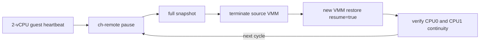

# Cloud Hypervisor ARM64 原生 Snapshot/Restore 对照实验报告

## 1. 结论

2026-07-22 在 `root@192.168.25.90` 完成 Cloud Hypervisor 原生快照对照。结论不是
“任意 Cloud Hypervisor 版本都可用”，而是：

1. CubeSandbox v0.5.1 同源的 `cube-hypervisor v28.0.0` 能创建 full snapshot，但恢复时
   失败于 GICv3 ITS 状态写回，错误为 `SetDeviceAttribute(EINVAL)`。
2. 当日最新正式版 Cloud Hypervisor v52.0 能启动和 pause，但 snapshot 失败于 ARM64
   core register 读取，错误为 `GetAarchCoreRegister(EINVAL)`。该现象与 v52.0 发布后合入的
   SVE 保存/恢复修复路径一致。
3. 固定到同时包含 SVE 修复 PR #8268 和 ARM guest clock 修复 PR #8343 的上游提交
   `eb1c64e4f01c9dd882e623795b139a129691ccfa` 后，2 vCPU 原生 full snapshot/restore
   **连续 100/100 通过**。

因此，`.90` 当前的 ARM64/KVM 环境具备运行 Cloud Hypervisor 原生 snapshot/restore 的
能力；成功基线是 post-v52 固定提交，而不是 CubeSandbox 当前 v28 fork 或 v52.0 正式版。
这个结果可作为 CubeSandbox 验证的 VMM/KVM 正向对照，但不能替代完整 CubeSandbox
Template、存储、网络、vsock 和 guest agent 回归。

## 2. 环境和输入身份

| 项目 | 值 |
| --- | --- |
| 主机 | `master` / `192.168.25.90` |
| 架构 | `aarch64` |
| 宿主内核 | `6.6.0-132.0.0.111.oe2403sp3.aarch64` |
| KVM | `/dev/kvm` 可读写 |
| vCPU / 内存 | 2 vCPU / 128 MiB |
| guest kernel SHA-256 | `7c227b2ba09988bb4380a95658d1ebe6e17e2f95fac60ed6eb6e42f4a676d8e5` |
| 成功组 VMM SHA-256 | `b77de55bb0472698c437ba24e1b611cc198c83282a9f39b1b12900cc504a0c09` |
| 成功组 `ch-remote` SHA-256 | `6afb2f75603cd24fb72fee10e71d41cec66671dd5f9b759fd1ad173b25fc08a5` |
| 上游固定提交 | `eb1c64e4f01c9dd882e623795b139a129691ccfa` |
| 远端实验根目录 | `/data/cubelet/experiments/ch-native-snapshot-control-20260722-183238` |

上游版本选择依据：

- v52.0 于 2026-05-14 发布。
- [PR #8268](https://github.com/cloud-hypervisor/cloud-hypervisor/pull/8268) 于
  2026-05-22 合入，补齐 AArch64 SVE 寄存器保存和恢复。
- [PR #8343](https://github.com/cloud-hypervisor/cloud-hypervisor/pull/8343) 于
  2026-06-19 合入，修正 AArch64 snapshot/restore 和 migration 的 guest clock。
- 固定提交 `eb1c64e4...` 是 PR #8343 合入后的提交，并包含 PR #8268 的代码路径。

[v52.0 静态二进制](https://github.com/cloud-hypervisor/cloud-hypervisor/releases/tag/v52.0)
来自 Cloud Hypervisor 官方 GitHub Release，下载后按 Release API 的 SHA-256 校验：

```text
cloud-hypervisor-static-aarch64
  bf004ddc1a148f47caa87ac49a783b8dbd6bf9bc27abe522ed197df7b982d3b1
ch-remote-static-aarch64
  94d1dbcae65df9be8e5a2ec6ded9c6f8cbc1b3a0b95f199450146cdb9fb1b5bb
```

## 3. 验证设计

guest 是静态链接的 `/init`，创建两个线程并分别绑定到 CPU0 和 CPU1。每 200 ms 输出：

```text
CH_NATIVE_HEARTBEAT worker=1 requested_cpu=1 actual_cpu=1 \
seq=281 monotonic_ns=63022423460 affinity_rc=0
```

每轮执行以下完整冷恢复链路：



每轮验收条件：

- pause 和 snapshot API 成功；
- `config.json`、`state.json`、`memory-ranges` 均非空；
- snapshot 中 `boot_vcpus == 2`；
- 源 VMM 已结束，由新 VMM 进程恢复；
- CPU0、CPU1 的 `seq` 和 `monotonic_ns` 均大于 snapshot 前；
- 两个 worker 的实际 CPU 和亲和设置正确；
- 恢复日志中不得再次出现 `CH_NATIVE_BOOT`。

可复现程序：

- [guest init](scripts/cloud_hypervisor_native_snapshot_guest.c)
- [远端循环脚本](scripts/run_cloud_hypervisor_native_snapshot_control.sh)

## 4. 版本阶梯结果

| 版本 | Snapshot | Restore | 结果 |
| --- | --- | --- | --- |
| CubeSandbox v0.5.1 同源 v28.0.0 | full snapshot 成功 | GICv3 ITS `SetDeviceAttribute(EINVAL)` | 失败 |
| 官方 v52.0 | `GetAarchCoreRegister(EINVAL)` | 未进入 | 失败 |
| 上游 `eb1c64e4...` | 成功 | 成功 | 100/100 通过 |

v28 的错误链见[恢复日志](remote-results/cloud-hypervisor-native-snapshot-control-20260722/v28-smoke/artifacts/vm-001.log)。
它与 Cloud Hypervisor [Issue #6966](https://github.com/cloud-hypervisor/cloud-hypervisor/issues/6966)
在 Kunpeng/openEuler 6.6 上报告的 GIC restore 失败形态一致。

v52.0 的错误链见[snapshot 输出](remote-results/cloud-hypervisor-native-snapshot-control-20260722/v52-release-smoke/artifacts/cycle-001.snapshot.out)。
错误发生于 core regs 读取；结合 v52 后合入的 PR #8268，可判断该版本未覆盖 `.90` 的 SVE
快照路径。该判断是版本和代码路径推断，不把单条 API 错误等同于对具体寄存器 ID 的直接取证。

## 5. 100 轮结果

[机器可读摘要](remote-results/cloud-hypervisor-native-snapshot-control-20260722/eb1c64-run-100/artifacts/summary.json)：

```json
{
  "vcpus": 2,
  "guest_memory_mib": 128,
  "requested_cycles": 100,
  "passed_cycles": 100,
  "failed_cycles": 0,
  "explicit_resume_required_cycles": 0
}
```

延迟来自[逐轮 TSV](remote-results/cloud-hypervisor-native-snapshot-control-20260722/eb1c64-run-100/artifacts/cycles.tsv)：

| 阶段 | min | avg | p50 | p95 | max |
| --- | ---: | ---: | ---: | ---: | ---: |
| pause | 3 ms | 3.17 ms | 3 ms | 4 ms | 4 ms |
| full snapshot | 43 ms | 47.42 ms | 47 ms | 48 ms | 88 ms |
| cold restore + resume + 双 vCPU heartbeat | 106 ms | 131.95 ms | 107 ms | 315 ms | 316 ms |

状态连续性复核：

- 101 个 VMM 日志中只有 1 个 `CH_NATIVE_BOOT`，证明后续 100 次是状态恢复而非重新启动。
- CPU0、CPU1 的状态序号均从 0 推进到 281，100 轮边界检查无回退。
- 552 条完整 heartbeat 的 worker/实际 CPU/affinity 全部正确。
- 9 条串口行在源 VMM 终止边界被截断；这些行字段不完整，不参与状态判断，也未造成相邻
  snapshot 边界的序号或时钟回退。
- 实验结束后无残留 Cloud Hypervisor 进程；同期 host kernel journal 未出现 KVM、RCU stall、
  soft lockup、hard lockup、panic 或 oops。

## 6. 与 CubeSandbox 的对照含义

本实验支持以下结论：

1. `.90` 的硬件、当前 stock openEuler 内核和 KVM 不是“完全不能做 ARM64 快照恢复”。
2. ARM64 snapshot 支持具有明显版本条件。仅依据 Cloud Hypervisor 声称支持 snapshot，不能
   推导 CubeSandbox v28 fork 在该机器上可用。
3. post-v52 上游在同机 2 vCPU 最小负载下稳定，说明 CubeSandbox 后续 A/B 应优先比较完整的
   SVE、timer/counter offset 和 GIC 变更集合，不能只回移 PR #8343 的局部逻辑。
4. CubeSandbox 历史故障包含 Template rootfs、virtio-pmem/fs/net/vsock、guest agent 和
   CubeShim 编排。本控制组没有覆盖这些组件，不能据此撤销 CubeSandbox 的 100/100 门禁。
5. 本次使用的是当前 stock host kernel；此前 sbench-irqbypass 自定义内核上的 KVM vtimer
   active 根因仍属于另一组环境，不能由本控制组直接否定。

## 7. 证据和保留状态

本地精简证据位于：

```text
remote-results/cloud-hypervisor-native-snapshot-control-20260722/
```

其中包含三个版本的失败/成功日志、100 轮摘要、API info、metadata 校验、VMM 日志和构建日志。
为避免复制约 14 GiB 的远端实验目录，本地证据不包含 `memory-ranges`；远端原始 full
snapshots 保留在实验根目录。成功组可执行文件保留在：

```text
/data/cubelet/experiments/ch-native-snapshot-control-20260722-183238/bin/upstream-eb1c64/
```

完整本地证据由同目录 `SHA256SUMS` 校验。

## 8. 边界

- 这是串行 100 轮，不是并发 snapshot/restore 压力测试。
- guest 为 128 MiB initramfs，只验证 CPU、内存、SVE、timer、vGIC 和串口状态连续性。
- 未覆盖磁盘写入一致性、网络连接、vsock、virtio-fs/pmem、guest agent 和 CubeSandbox API。
- `eb1c64e4...` 是固定的 post-v52 上游提交，不是 v52.0 正式发布二进制。
- Snapshot/restore 制品不应跨 Cloud Hypervisor 版本混用；本实验每组均由同一版本创建和恢复。
