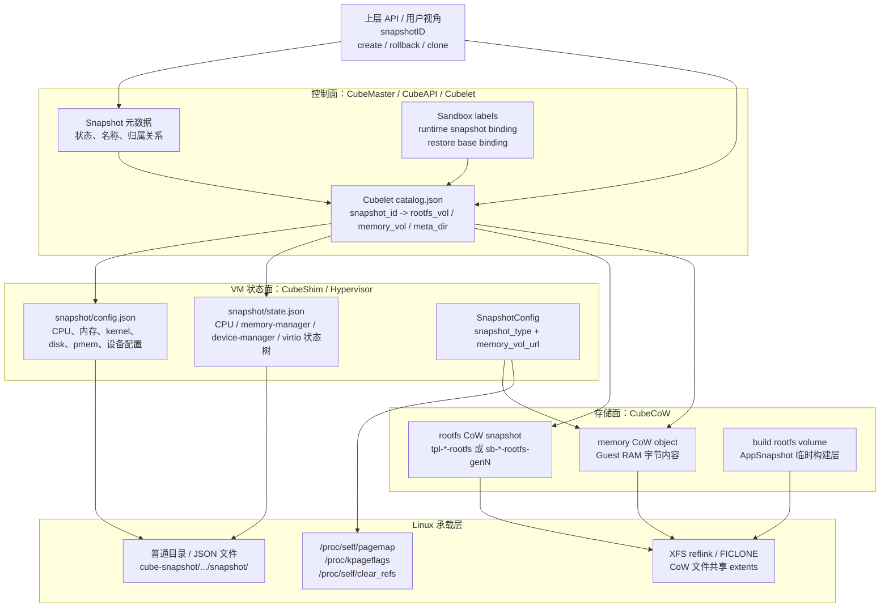

# CubeSandbox Snapshot 深入分析

本文用于系统分析 CubeSandbox 的 Snapshot 技术。第一部分先回答最基础但最重要的问题：项目里说的 snapshot 到底是什么，它包含哪些内容，在 Linux 机器上由什么资源承载，以及这些底层资源如何对应到上层的 Snapshot、Rollback、Clone 能力。

## 第一部分：什么是 Snapshot

### 1. 一句话定义

在 CubeSandbox 中，snapshot 不是 Docker/containerd 里的镜像层快照，也不是单纯的文件系统快照。它表示一个沙箱在某一时刻的可恢复运行态检查点。

更准确地说：

> CubeSandbox snapshot = VM 运行态元数据 + Guest 内存状态 + rootfs/可写层 CoW 状态 + Cubelet 本地 catalog 映射。

这个定义有两个关键点：

1. 它是一个运行态概念，不只是磁盘数据。
2. 它是一个组合对象，不是 Linux 内核中的单个 snapshot 对象。

因此，CubeSandbox 可以基于 snapshot 实现：

- 从某个 snapshot 启动一个新 sandbox。
- 将已有 sandbox rollback 到某个历史状态。
- 从同一个 snapshot clone 出多个 sandbox。
- 在运行中 commit 当前 sandbox 状态，生成新的 runtime snapshot。

### 2. 它不是什么

理解 CubeSandbox snapshot 时，需要先排除几个容易混淆的概念。

第一，它不是 containerd snapshotter 中的 snapshot。containerd snapshotter 主要负责容器镜像层和 rootfs 的挂载视图，例如 overlayfs snapshot。CubeSandbox 代码里确实存在 containerd/image 相关的 snapshot 概念，但博客和 API 中的 Snapshot/Rollback/Clone 指的是沙箱运行态快照。

第二，它不是只保存 rootfs 的文件系统快照。只保存 rootfs 可以恢复文件，但不能恢复进程、内存、CPU 状态、virtio 设备状态，也无法做到“回到运行中的某一刻”。

第三，它不是虚拟机磁盘镜像的完整复制。CubeSandbox 当前的 CubeCoW reflink 后端依赖 XFS reflink/FICLONE，用 CoW 文件承载 rootfs 和 memory 对象，避免每次 snapshot 都全量复制大文件。

### 3. Snapshot 的内容分层

一个 CubeSandbox snapshot 可以拆成四层。

| 层级 | 保存什么 | 主要作用 |
|---|---|---|
| 控制面 | `snapshotID`、状态、catalog 记录 | 让 API 和调度系统能通过逻辑 ID 找到真实快照 |
| VM 配置面 | `config.json` | 恢复 VM 的 CPU、内存、kernel、disk、pmem、设备配置 |
| VM 状态面 | `state.json`、Guest memory | 恢复 CPU、内存管理器、设备管理器、virtio 设备等运行状态 |
| 存储面 | rootfs CoW snapshot、memory CoW object | 保存文件系统状态和内存字节内容 |

其中 `config.json` 和 `state.json` 来自 hypervisor 的 snapshot/restore 机制，rootfs 和 memory 对象由 CubeCoW 承载，逻辑索引由 Cubelet 写入 `catalog.json`。

下面这张图把上层 snapshot 概念和 Linux 节点上的实际承载物放在同一视图里：



### 4. Linux 机器上的目录和文件形态

一个典型 snapshot 在节点上的目录形态大致如下：

```text
/usr/local/services/cubetoolbox/cube-snapshot/
└── cubebox/
    └── <snapshotID>/
        └── 2C2000M/
            ├── catalog.json
            ├── memory.dev
            └── snapshot/
                ├── config.json
                └── state.json
```

这里的 `2C2000M` 表示该 snapshot 对应的资源规格目录，例如 2 vCPU、2000 MiB 内存。实际规格名由 Cubelet 根据 sandbox resource spec 生成。

#### 4.1 `config.json`

`config.json` 保存 VM 的恢复配置。仓库测试中出现过一个简化形态：

```json
{
  "payload": {
    "kernel": "/opt/cube/kernel/image.vm"
  },
  "pmem": [
    {
      "id": "_pmem0",
      "file": "/opt/cube/guest-image.ext4"
    },
    {
      "id": "pmem-cubebox-image-0",
      "file": "/opt/cube/app-image.ext4"
    }
  ]
}
```

真实文件通常会更大。它本质上是 hypervisor 当前 `VmConfig` 的 JSON 序列化结果，用于在 restore 时创建一个结构相同的 VM。

对应核心逻辑：

- hypervisor 在 snapshot 发送阶段打开 `<destination>/config.json`。
- 将当前 VM 配置序列化为 JSON。
- 写入文件并 `sync_all()`，保证跨机器或异常场景下文件落盘。

相关代码：

- `hypervisor/vmm/src/vm.rs`: `Vm::send`
- `hypervisor/vmm/src/migration.rs`: `SNAPSHOT_CONFIG_FILE = "config.json"`

#### 4.2 `state.json`

`state.json` 保存 VM 的组件状态树。它的外形可以理解为：

```json
{
  "id": "vm",
  "snapshots": {
    "cpu-manager": {
      "id": "cpu-manager",
      "snapshots": {},
      "snapshot_data": {}
    },
    "memory-manager": {
      "id": "memory-manager",
      "snapshots": {},
      "snapshot_data": {}
    },
    "device-manager": {
      "id": "device-manager",
      "snapshots": {},
      "snapshot_data": {}
    }
  },
  "snapshot_data": {},
  "metadata": {
    "snapshot_type": "soft-dirty"
  }
}
```

这里的 `snapshots` 是一个组件树。顶层 VM snapshot 下面挂 CPU manager、memory manager、device manager 等子组件。叶子节点通过 `snapshot_data` 保存具体状态。

对应核心逻辑：

- VM 对自身和子组件调用 `snapshot()`。
- 得到一棵 `vm_migration::Snapshot` 状态树。
- 在写入前补充 `metadata.snapshot_type`，例如 `full`、`incremental` 或 `soft-dirty`。
- 将状态树序列化写入 `<destination>/state.json`。

相关代码：

- `hypervisor/vm-migration/src/lib.rs`: `Snapshot`
- `hypervisor/vmm/src/vm.rs`: `Vm::send`
- `hypervisor/vmm/src/migration.rs`: `SNAPSHOT_STATE_FILE = "state.json"`

#### 4.3 Guest memory

Guest memory 不一定保存在 snapshot 目录里的 `memory-ranges` 文件中。CubeSandbox 会优先传入 `memory_vol_url`，让 hypervisor 把内存写到单独的 CubeCoW memory object。

`memory.dev` 是 Cubelet 写入的辅助索引文件，内容是 memory 对象的可访问路径：

```text
/data/cubelet/storage/volumes/tpl-snap-abc-memory/tpl-snap-abc-memory
```

在旧式或未传 `memory_vol_url` 的场景，hypervisor 会把内存写到：

```text
snapshot/memory-ranges
```

但在 CubeSandbox 的 CubeCoW 路径下，内存通常由外部 memory volume 承载。

对应核心逻辑：

- Cubelet 创建或 reflink-clone 一个 memory object。
- Cubelet 调用 `cube-runtime snapshot` 时传入 `--memory-vol <path>`。
- CubeShim 将该路径作为 `SnapshotConfig.memory_vol_url` 传给 hypervisor。
- hypervisor 的 MemoryManager 根据 snapshot 类型写入内存页。

相关代码：

- `Cubelet/services/cubebox/appsnapshot.go`: `buildCubeRuntimeSnapshotArgs`、`writeMemoryDevFile`
- `CubeShim/shim/src/snapshot/mod.rs`: `api_snapshot_vm`
- `hypervisor/vmm/src/memory_manager.rs`: `MemoryManager::send`

#### 4.4 `catalog.json`

`catalog.json` 是 Cubelet 的本地权威索引。它把逻辑 `snapshotID` 绑定到真实的 CubeCoW 对象和元数据路径。

示例：

```json
{
  "snapshot_id": "snap-abc",
  "instance_type": "cubebox",
  "spec_dir": "2C2000M",
  "snapshot_path": "/usr/local/services/cubetoolbox/cube-snapshot/cubebox/snap-abc/2C2000M",
  "meta_dir": "/usr/local/services/cubetoolbox/cube-snapshot/cubebox/snap-abc/2C2000M",
  "rootfs_vol": "tpl-snap-abc-rootfs",
  "rootfs_kind": "snapshot",
  "memory_vol": "tpl-snap-abc-memory",
  "memory_kind": "volume",
  "rootfs_size_bytes": 1073741824,
  "kind": "runtime_snapshot",
  "created_at": "2026-06-13T10:00:00Z"
}
```

这个文件很关键。CubeMaster 和用户 API 可以只关心 `snapshotID`，但真正执行 rollback 或 create-from-snapshot 的 Cubelet 必须知道：

- rootfs 对象叫什么。
- rootfs 对象是 `volume` 还是 `snapshot`。
- memory 对象叫什么。
- memory 对象是 `volume` 还是 `snapshot`。
- hypervisor restore 元数据目录在哪里。

对应核心逻辑：

- `WriteSnapshotCatalog` 将条目写入 `<snapshotPath>/catalog.json`。
- `GetLocalSnapshot` 先查内存索引，未命中时扫描 snapshot root。
- Rollback 和 create-from-snapshot 都通过 catalog 将逻辑 snapshot ID 解析为本地物理对象。

相关代码：

- `Cubelet/storage/snapshot_catalog.go`
- `Cubelet/services/cubebox/snapshot_catalog_rpc.go`

### 5. Snapshot 创建路径

CubeSandbox 中有两类常见 snapshot 生产路径：`AppSnapshot` 和 `CommitSandbox`。

#### 5.1 AppSnapshot：从镜像制作可启动模板

`AppSnapshot` 更接近“制作模板”。它的核心流程如下：

1. Cubelet 接收 `AppSnapshotRequest`。
2. 校验请求中必须带 app snapshot 相关 annotation。
3. 创建一个临时 cubebox。
4. 从 containerd spec annotation 中读取 VM 配置，包括 resource、disk、pmem、kernel。
5. 创建 template memory volume。
6. 调用 `cube-runtime snapshot --app-snapshot --vm-id ... --path ... --memory-vol ...`。
7. CubeShim pause VM，并请求 hypervisor 写 `config.json`、`state.json` 和 memory 数据。
8. Cubelet 从 build rootfs 生成 template rootfs snapshot。
9. 销毁临时 cubebox。
10. 写 `memory.dev` 和 `catalog.json`。

这条路径通常使用 `full` memory snapshot，因为它是在制作一个新的 template 基线。

#### 5.2 CommitSandbox：运行中沙箱生成 runtime snapshot

`CommitSandbox` 是把一个正在运行的 sandbox 当前状态提交成新的 runtime snapshot。它比 `AppSnapshot` 更复杂，因为它要尽量避免全量写内存。

核心流程如下：

1. 校验 sandbox 正在运行，且满足可 commit 条件。
2. 读取当前 sandbox 的 VM spec。
3. 解析当前 rootfs 对象。
4. 对 rootfs 做 CubeCoW snapshot。
5. 准备 memory artifact。
6. 调用 `cube-runtime snapshot` 写 VM 状态和内存数据。
7. 成功后更新 sandbox 的 runtime snapshot binding label。
8. 写 `memory.dev`、`catalog.json`。

memory artifact 的准备有三档降级逻辑：

| 档位 | 基线来源 | hypervisor snapshot 类型 | 说明 |
|---|---|---|---|
| Tier 1 | 上一个 runtime snapshot 的 memory object | `soft-dirty` | 最优路径，只写上次 snapshot 后变脏的页 |
| Tier 2 | 上次 restore 来源 snapshot 的 memory object | `incremental` | 用 pagemap_anon 写自上次 restore 后变成匿名 CoW 的页 |
| Tier 3 | 新建空 memory volume | `full` | 最保守路径，写完整 Guest memory |

这个设计说明 CubeSandbox 的 snapshot 不是简单“保存当前文件”。它会维护 snapshot lineage，让后续 snapshot 尽量基于已有 memory object 做增量写入。

### 6. Rollback 使用 Snapshot 的方式

Rollback 的目标是把一个运行中的 sandbox 切回某个 snapshot。

核心流程如下：

1. Cubelet 收到 `RollbackSandboxRequest`，包含 `sandboxID`、`snapshotID`、`newGen` 等。
2. 通过 `snapshotID` 查本地 `catalog.json`。
3. 解析得到 `rootfs_vol`、`memory_vol`、`memory_kind`、`meta_dir`。
4. 从 snapshot rootfs 派生一个新的 rootfs generation，例如 `sb-<sandboxID>-rootfs-gen<N>`。
5. 构造 restore config。
6. 通过 containerd task update 把 rollback action 和 restore config 传给 CubeShim。
7. CubeShim 删除当前 VM。
8. CubeShim 调用 restore 路径，用 `config.json`、`state.json`、memory volume、新 rootfs 恢复 VM。

restore config 的形态类似：

```json
{
  "source_url": "file:///usr/local/services/cubetoolbox/cube-snapshot/cubebox/snap-abc/2C2000M/snapshot",
  "memory_vol_url": "/data/cubelet/storage/volumes/tpl-snap-abc-memory/tpl-snap-abc-memory",
  "disks": [
    {
      "path": "/data/cubelet/storage/volumes/sb-sandbox-rootfs-gen3/sb-sandbox-rootfs-gen3",
      "id": "rootfs"
    }
  ]
}
```

其中：

- `source_url` 指向 hypervisor 元数据目录，也就是包含 `config.json` 和 `state.json` 的目录。
- `memory_vol_url` 指向 Guest memory 数据。
- `disks` 将 VM config 中的 rootfs disk 替换为 rollback 派生出的新 rootfs。

### 7. Linux 承载层与上层 Snapshot 的精确对齐

| 上层 Snapshot 概念 | Linux/CubeSandbox 承载物 | 负责模块 | 作用 |
|---|---|---|---|
| `snapshotID` | `catalog.json` 中的 `snapshot_id`，以及 snapshot 目录名 | Cubelet | 用户和控制面看到的逻辑 ID |
| VM 配置 | `snapshot/config.json` | hypervisor | restore 时重建 VM 形态 |
| VM 组件状态 | `snapshot/state.json` | hypervisor | restore CPU、memory manager、device manager、virtio 状态 |
| Guest memory | CubeCoW memory object，或 fallback 的 `memory-ranges` | hypervisor + CubeCoW | 保存 Guest RAM 字节 |
| rootfs 状态 | CubeCoW rootfs snapshot | CubeCoW | 保存文件系统可写层状态 |
| 增量内存追踪 | `/proc/self/pagemap`、`/proc/kpageflags`、`/proc/self/clear_refs` | Linux kernel + hypervisor | 判断哪些内存页需要写入 |
| 快照索引 | `<snapshotPath>/catalog.json` | Cubelet | 将逻辑 ID 映射为本地物理对象 |
| rollback 目标 rootfs | 从 rootfs snapshot 派生的新 generation | CubeCoW | 避免直接修改原 snapshot |
| clone 目标 rootfs | 从同一 snapshot 派生出的多个 CoW rootfs | CubeCoW | 多个 sandbox 共享基线，各自写时复制 |

这里最容易误解的是 memory。Guest memory 虽然属于 VM 运行态，但在 Linux host 上最终也是一个文件或块设备路径。区别在于，哪些字节需要写入这个文件，是由 hypervisor 结合 Linux 页表信息决定的。

### 8. 对 Snapshot 的准确心智模型

可以把 CubeSandbox snapshot 想象成一个“恢复配方”，而不是一个单独文件。

这个配方包括：

1. 用什么 VM 配置恢复：`config.json`。
2. 恢复到什么 VM 组件状态：`state.json`。
3. Guest 内存从哪里读：`memory_vol_url` 或 `memory-ranges`。
4. rootfs 用哪个 CoW 基线派生：`rootfs_vol`。
5. 上层 API 的 `snapshotID` 怎么找到这些对象：`catalog.json`。

因此，当用户说“从 snapshot 启动”时，实际发生的是：

1. Cubelet 用 `snapshotID` 找到本地 catalog。
2. CubeCoW 准备 rootfs 和 memory 对象。
3. CubeShim/hypervisor 用 snapshot 元数据恢复 VM。
4. 新 sandbox 基于同一份 snapshot 基线启动，但拥有自己的 CoW 写入层。

当用户说“rollback 到 snapshot”时，实际发生的是：

1. 当前 VM 被删除。
2. 从 snapshot rootfs 派生新的 rootfs generation。
3. 用 snapshot 的 `config.json`、`state.json`、memory object 恢复 VM。
4. sandbox 的运行态回到 snapshot 对应的时间点。

### 9. 本部分结论

CubeSandbox 的 snapshot 是一个跨越控制面、VM 状态面和存储面的组合技术。

它在上层表现为一个简单的 `snapshotID`，但在 Linux 节点上实际由以下资源共同承载：

- 普通目录和 JSON 文件：保存 VM config、VM state、Cubelet catalog。
- CubeCoW reflink 文件：保存 rootfs 和 memory 的 CoW 数据。
- Linux `/proc` 页表接口：帮助 hypervisor 做增量内存快照。
- Cubelet 元数据和 labels：维护 snapshot lineage，支持后续 commit、rollback 和 clone。

如果只说“snapshot 是文件系统快照”，就会漏掉 VM 状态和内存。如果只说“snapshot 是 VM 快照”，又会漏掉 CubeCoW rootfs 和 Cubelet catalog。更完整的表述应该是：

> CubeSandbox snapshot 是一个可恢复的沙箱运行态检查点，由 hypervisor 保存 VM 配置和状态，由 CubeCoW 保存 rootfs 与 memory 数据，由 Cubelet catalog 将逻辑 snapshot ID 映射到这些 Linux 上的实际资源。
