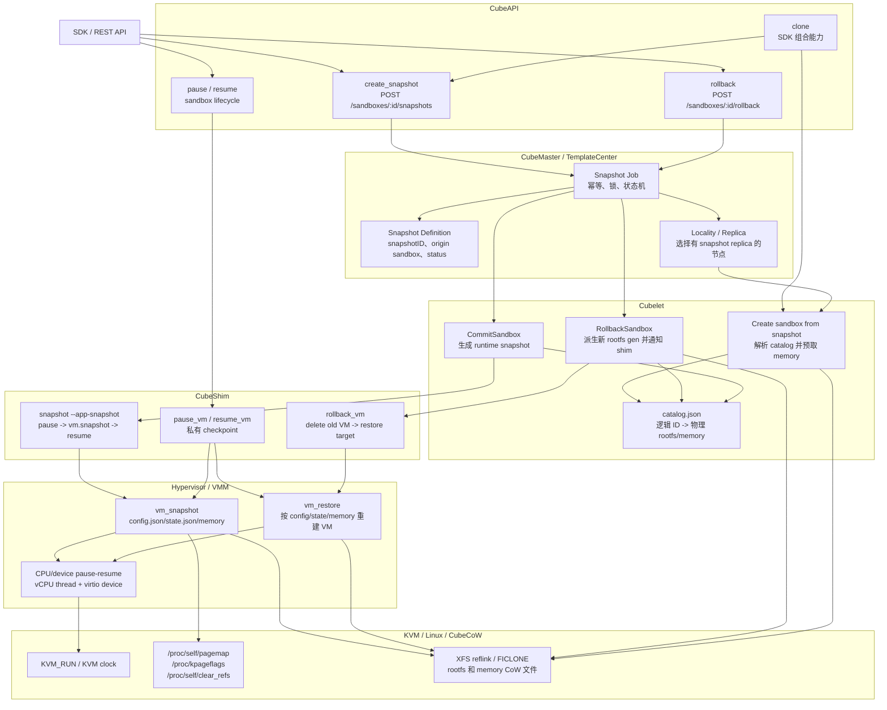
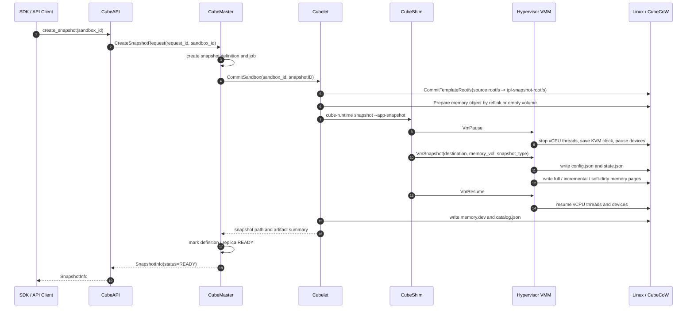
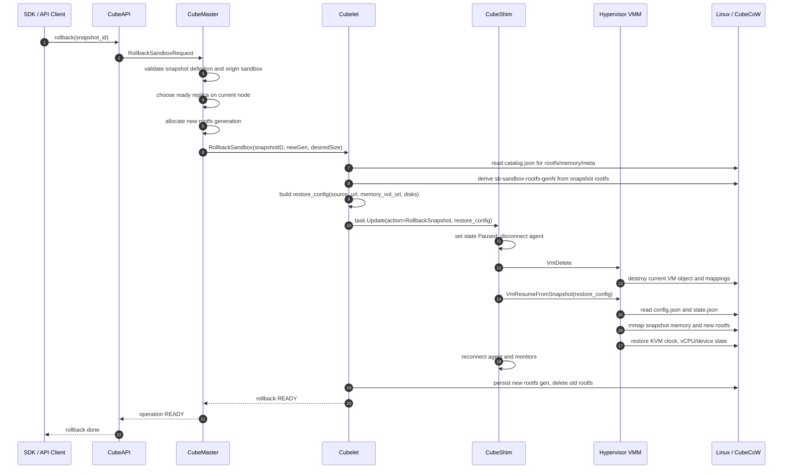
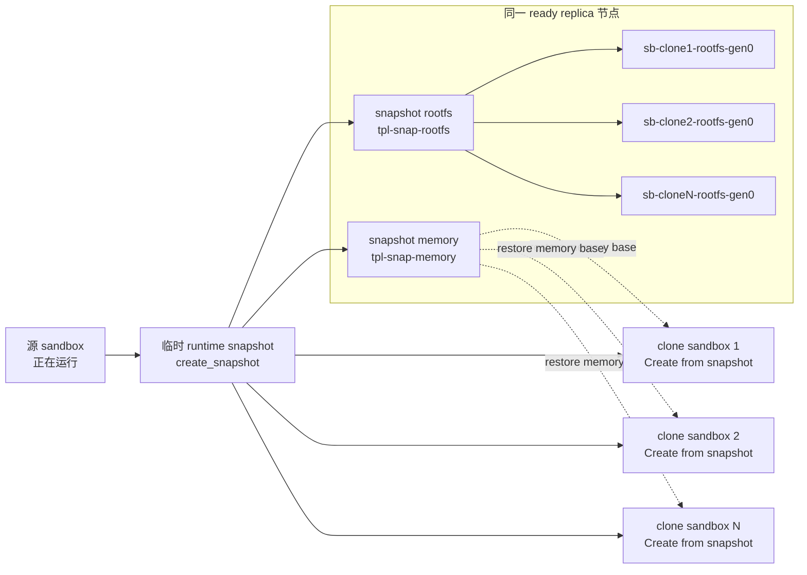
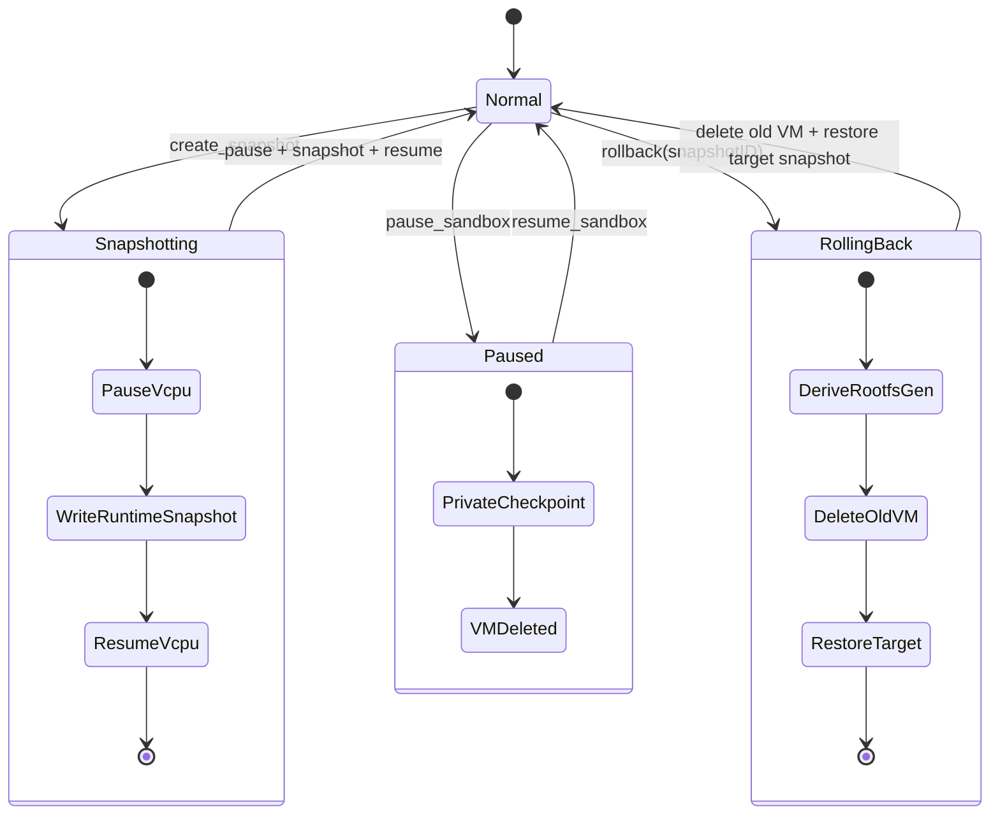
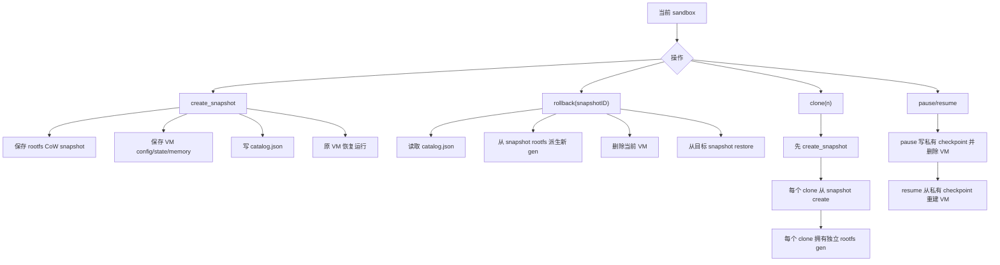

# CubeSandbox Runtime Snapshot 运行机制深入分析

本文是 Snapshot 分析的第二部分。上一篇文档回答了“什么是 snapshot”：它不是单一文件，也不是单纯的 rootfs 快照，而是由 VM 配置、VM 状态、Guest memory、rootfs CoW 对象和 Cubelet 本地 catalog 共同组成的可恢复运行态检查点。

本文继续分析运行时 snapshot 的四类关键能力：

- `create`：从一个正在运行的 sandbox 导出可复用 snapshot。
- `rollback`：把一个正在运行的 sandbox 回退到指定 snapshot。
- `clone`：以当前 sandbox 为源，创建多个状态相同的新 sandbox。
- `resume`：把被暂停的 sandbox 从 shim 私有 checkpoint 中恢复运行。

这四个能力都和“恢复 VM 状态”有关，但它们不是同一个底层操作。CubeSandbox 的设计里至少有两类 snapshot：

| 类型 | 是否用户可见 | 典型入口 | 保存在哪里 | 主要用途 |
|---|---:|---|---|---|
| runtime snapshot | 是 | `create_snapshot`、`rollback`、`Sandbox.create(template=snapshotID)` | Cubelet snapshot 目录、CubeCoW rootfs/memory、`catalog.json` | 持久化、回滚、克隆、跨 API 生命周期复用 |
| pause checkpoint | 否 | `pause_sandbox`、`resume_sandbox` | CubeShim 的私有 pause snapshot 目录 | 暂停 VM 释放运行对象，随后原地恢复 |

如果把二者混在一起，很容易误解 `resume`。`resume` 并不是从用户创建的 snapshot 恢复；它恢复的是 `pause` 时 shim 写下的临时 checkpoint。而 `rollback` 才是从用户可见的 runtime snapshot 恢复。

## 1. 总览：从 API 到 Linux 的运行路径

运行时 snapshot 能力跨越五层：



这张图可以先记住三个结论：

1. `CubeMaster` 主要管理逻辑状态、任务状态和节点选择，不持有 rootfs/memory 的物理引用。
2. `Cubelet` 是物理 snapshot 工件的权威：它写 `catalog.json`，解析 rootfs/memory CoW 对象，并把 restore 配置传给 shim。
3. `CubeShim` 和 hypervisor 才真正触碰 VM 运行态：暂停 vCPU、写 `config.json`/`state.json`、增量写 Guest memory、删除旧 VM、恢复新 VM。

## 2. create：从运行中 sandbox 导出 runtime snapshot

### 2.1 用户入口

Python SDK 的 `Sandbox.create_snapshot()` 调用 CubeAPI：

```text
SDK Sandbox.create_snapshot()
  -> POST /sandboxes/{sandbox_id}/snapshots
  -> CubeAPI SnapshotService.create()
  -> CubeMaster /cube/snapshot
```

核心逻辑不是 SDK 做 snapshot。SDK 只发起请求并返回 `SnapshotInfo`。真正的流程从 CubeAPI 开始。

CubeAPI 的 `SnapshotService::create` 做三件事：

1. 生成 `request_id`，用于幂等和后续 operation 追踪。
2. 构造 `CreateSnapshotRequest`，带上 `sandbox_id`、显示名称和上下文参数。
3. 调用 CubeMaster 的 snapshot 接口，并要求返回的 snapshot 状态已经是 `READY`。

也就是说，当前实现对 API 调用者表现为同步完成：请求返回时，snapshot 已经创建成功或失败。

### 2.2 CubeMaster：把 create 变成 Snapshot Job

CubeMaster 的入口在 `CubeMaster/pkg/service/httpservice/cube/snapshot.go`。它解析请求后进入 `templatecenter.SubmitSandboxSnapshot`。

`SubmitSandboxSnapshot` 的核心处理逻辑是：

1. 校验 `sandboxID`、`requestID`、snapshot 名称和当前 sandbox 状态。
2. 读取原 sandbox 的创建请求，得到它的资源规格、模板信息、annotation 和 label。
3. 生成新的 `snapshotID`，形如 `snap-...`。
4. 把这个 `snapshotID` 写入创建请求的 annotation：
   - `CubeAnnotationAppSnapshotTemplateID = snapshotID`
5. 创建 snapshot definition：
   - 类型是 `TemplateKindSnapshot`。
   - 来源是 origin sandbox 和 origin node。
   - 存储后端是 `cow`。
   - 状态先是 `Creating`。
6. 创建并运行 snapshot job：
   - operation 是 `JobOperationSnapshotCreate`。
   - phase 从 `Snapshotting` 开始。
   - job 负责调用 Cubelet 的 `CommitSandbox`。

这层的关键设计是：Master 管“snapshot 是否存在、属于谁、在哪个节点有 ready replica”，但不把 rootfs/memory 的设备路径存到自己的核心状态里。物理引用由 Cubelet 本地 catalog 承担。

### 2.3 Cubelet：CommitSandbox 生成物理工件

Cubelet 的入口是 `Cubelet/services/cubebox/template_ops.go` 中的 `CommitSandbox`。这是 `create_snapshot` 的物理核心。

它的处理逻辑可以按顺序理解：

1. 校验请求：
   - 必须有 `sandboxID`。
   - 必须有 `templateID`，这里的 `templateID` 实际就是 `snapshotID`。
   - storage backend 必须是 cubecow。
2. 对 sandbox 加锁，避免 snapshot、rollback、delete 等操作并发破坏一致性。
3. 读取当前 sandbox 信息和 rootfs volume。
4. 从 containerd spec annotation 中取出 cubebox snapshot spec。
5. 提交 rootfs：
   - `storage.CommitTemplateRootfs(ctx, sourceRootfs, snapshotID)`
   - 内部调用 CubeCoW 的 `CreateSnapshot`，生成 `tpl-<snapshotID>-rootfs` 这类 rootfs CoW snapshot。
6. 准备 memory 工件：
   - 尝试找到当前 runtime snapshot 绑定的 base memory。
   - 找不到则尝试找到上一次 restore base memory。
   - 仍然找不到则创建一个空 memory volume。
7. 调用 CubeShim / cube-runtime 执行 VM snapshot：
   - `executeCubeRuntimeSnapshot(...)`
   - 参数中带 `--snapshot-type` 和 `--memory-vol file://...`。
8. 写辅助文件：
   - `memory.dev`
   - `catalog.json`
   - snapshot flag
9. 释放或 deactive CoW 对象，保证 catalog 中记录的是逻辑对象名，后续按需 resolve dev path。

create 的关键是第 5 步和第 7 步：rootfs 和 VM 运行态不是由同一个组件保存的。rootfs 由 CubeCoW 做 reflink snapshot；VM 状态由 hypervisor 写 `config.json`、`state.json` 和 memory bytes。

### 2.4 memory snapshot 的三种模式

`Cubelet/services/cubebox/snapshot_base_memory.go` 会为 hypervisor 决定 `snapshot_type`：

| 模式 | 触发条件 | 含义 |
|---|---|---|
| `soft-dirty` | 找到当前 runtime snapshot 绑定的 base memory | 目标 memory 文件已经 reflink 继承 base，只写 soft-dirty 页面 |
| `incremental` | 找到上一次 restore base memory | 目标 memory 文件继承 restore base，只写匿名 CoW 页面 |
| `full` | 找不到可用 base | 创建空 memory volume，写全量 Guest RAM |

这里的设计很重要。CubeSandbox 不是每次都把 Guest RAM 全量复制一份，而是尽量先 reflink clone 一个已有 memory 文件，然后让 hypervisor 只覆盖发生变化的页。

对应到 Linux：

- memory 文件是宿主机上的普通文件或块设备路径。
- CubeCoW 使用 reflink 让新 memory 对象和 base memory 共享未修改 extents。
- hypervisor 用 `/proc/self/pagemap`、`/proc/kpageflags` 和 `/proc/self/clear_refs` 识别需要写出的页面。

### 2.5 CubeShim：暂停 VM，调用 hypervisor snapshot，再恢复

Cubelet 不直接操作 VMM，它启动 `cube-runtime snapshot --app-snapshot`。CubeShim 的 `Snapshot::do_app_snapshot` 执行如下逻辑：

```text
do_app_snapshot
  -> api_pause_vm
  -> api_snapshot_vm
       destination_url = file://<snapshotPath>/snapshot
       memory_vol_url  = file://<memory object path>
       snapshot_type   = full / incremental / soft-dirty
  -> store_metadata
  -> api_resume_vm
```

这解释了为什么 create snapshot 对运行中的 sandbox 通常是短暂停顿而不是永久停机：shim 在 snapshot 前暂停 VM，snapshot 完成后恢复 VM。

注意：这里调用的是 hypervisor 的 `VmPause`、`VmSnapshot`、`VmResume` 组合，不是生命周期 pause/resume 的私有 checkpoint 路径。

### 2.6 Hypervisor：写出 VM 配置、状态和内存

hypervisor 的 create snapshot 核心在 `hypervisor/vmm/src/lib.rs` 和 `hypervisor/vmm/src/vm.rs`：

```text
vm_pause()
  -> Vm::pause()

vm_snapshot(snapshot_config)
  -> Vm::snapshot()
  -> Vm::send(snapshot, snapshot_config)

vm_resume()
  -> Vm::resume()
```

`Vm::pause()` 做的事情包括：

1. VM 状态从 `Running` 转为 `Paused`。
2. 在 KVM x86_64 下保存 KVM clock。
3. pause CPU manager：
   - 设置 `vcpus_pause_signalled = true`。
   - 向 vCPU thread 发信号，中断正在执行的 `KVM_RUN` ioctl。
   - 每个 vCPU thread 检查 pause 标志并进入暂停状态。
4. pause device manager：
   - virtio、block、net 等设备进入可 snapshot 的一致状态。

`Vm::send()` 写出三类数据：

1. `config.json`：当前 VM 配置。
2. `state.json`：CPU manager、memory manager、device manager、device tree 的状态树。
3. memory：根据 `snapshot_type` 写全量或增量 Guest RAM。

memory 写入逻辑在 `hypervisor/vmm/src/memory_manager.rs`：

| `snapshot_type` | VMM 行为 | Linux 依赖 |
|---|---|---|
| `full` | 遍历所有 Guest memory region，完整写入目标 memory 文件 | mmap memory region |
| `incremental` | 通过 pagemap/kpageflags 找匿名 CoW 页，只覆盖这些页 | `/proc/self/pagemap`、`/proc/kpageflags` |
| `soft-dirty` | 利用 soft-dirty bit 识别本轮变更页，只覆盖 dirty 页，然后清 dirty 标记 | `/proc/self/clear_refs`、pagemap bit 55 |

可以把 create 的底层视图画成：



## 3. rollback：用 snapshot 替换当前运行态

### 3.1 用户入口

SDK 的 `Sandbox.rollback(snapshot_id)` 调用 CubeAPI：

```text
SDK Sandbox.rollback(snapshot_id)
  -> POST /sandboxes/{sandbox_id}/rollback
  -> CubeAPI SnapshotService.rollback()
  -> CubeMaster RollbackSandboxToSnapshot()
```

SDK 在 rollback 成功后会重置本地 HTTP connection pool。原因是 rollback 会删除并重建 VM 内部运行态，旧连接指向的 guest 进程和网络状态可能已经不存在。

### 3.2 CubeMaster：校验 snapshot 和 sandbox 的关系

CubeMaster 的 `RollbackSandboxToSnapshot` 不直接恢复 VM，它先保证“这个 rollback 是合法且可执行的”：

1. 校验 snapshot definition 存在、类型是 snapshot、状态是 `Ready`。
2. 校验 snapshot 的 origin sandbox 与目标 sandbox 匹配。
3. 校验 storage backend 是 `cow`。
4. 找到目标 sandbox 当前所在节点。
5. 找到该节点上的 ready replica。runtime snapshot 默认具有强节点亲和：物理 rootfs/memory 工件在 Cubelet 本地。
6. 检查没有正在进行的 snapshot job。
7. 为 sandbox 分配新的 rootfs generation：
   - `newGen = allocateNextRollbackGen(...)`
8. 计算目标 rootfs 大小：
   - `desiredSize = max(snapshotRootfsSize, currentSandboxSize)`
9. 创建 rollback job 并调用 Cubelet `RollbackSandbox`。

这里的 generation 是 rollback 正确性的关键。rollback 不是直接把当前 rootfs 文件覆盖成旧文件，而是从 snapshot rootfs 派生出一个新的 `sb-<sandboxID>-rootfs-genN`，然后把 sandbox 指向这个新代际。

### 3.3 Cubelet：派生 rootfs，构造 restore_config

Cubelet 的 `RollbackSandbox` 是 rollback 的物理核心。

它的处理逻辑如下：

1. 校验请求和锁定 sandbox。
2. 获取当前 rootfs，检查 sandbox 正在运行。
3. 解析 rollback 目标：
   - 如果请求里带了显式 rootfs/memory/meta，直接使用。
   - 否则通过 `snapshotID` 读取 Cubelet 本地 `catalog.json`。
4. 调用 `storage.ResolveSnapshotForRollback`：
   - 解析 snapshot rootfs CoW object。
   - 解析 snapshot memory CoW object。
5. 调用 `storage.RollbackDeriveNewGen`：
   - 从 snapshot rootfs 派生新的 sandbox rootfs generation。
   - 名称类似 `sb-<sandboxID>-rootfs-gen<newGen>`。
   - 如果新 rootfs 小于当前要求，执行 resize。
6. 构造 `RollbackRestoreConfig`：
   - `source_url = file://<snapshotMetaDir>/snapshot`
   - `memory_vol_url = file://<snapshotMemoryDevPath>`
   - `disks = ...`
   - disks 中会把原 rootfs disk path 替换为新 rootfs dev path。
7. 把 sandbox 标为 rolling back。
8. 通过 containerd task update annotation 通知 CubeShim：
   - `cube.shimapi.update.action = RollbackSnapshot`
   - `cube.shimapi.update.rollback.restore_config = <json>`
9. CubeShim 成功后：
   - 重置 sandbox 状态。
   - 持久化新的 rootfs generation。
   - 写 runtime snapshot binding 和 restore-base binding。
   - 删除旧 rootfs。
   - 同步本地状态。

第 6 步是 rollback 与普通 restore 的对齐点：hypervisor 只知道“从某个 VM snapshot 目录恢复，并用这些 disk/memory 路径覆盖配置”。Cubelet 负责把 CubeSandbox 的 snapshot catalog 翻译成 hypervisor 能理解的 `RestoreConfig`。

### 3.4 CubeShim：删除旧 VM，再从目标 snapshot 恢复

CubeShim 收到 rollback update 后进入 `rollback_vm(target_config)`。

它的逻辑不是“暂停当前 VM 并覆盖内存”。代码注释非常明确：

```text
Rollback: delete the current VM, then resume from a caller-supplied snapshot.
Uses VmDelete instead of a temporary checkpoint snapshot,
which avoids the I/O cost of writing VM memory to disk.
```

实际流程：

1. 要求 sandbox 处于 `Normal`。
2. 如果还有 exec task，拒绝 rollback。
3. 状态改为 `Paused`，断开 guest agent。
4. 调用 `delete_vm()` 删除当前 VM 对象。
   - VMM 进程还在。
   - 旧 VM 对象和 vCPU/device/memory 映射被销毁。
5. 清理 hypervisor 事件队列中旧 VM shutdown 事件，避免污染新 VM。
6. 调用 `resume_vm_with_config(Some(target_config))`。
7. 重新连接 guest agent，重建 OOM/watch/monitor 任务。
8. 状态改回 `Normal`。

这个选择牺牲了 rollback 失败后的本地回退能力，但避免在 rollback 前额外写一份当前 VM checkpoint。对“我要回到旧 snapshot”的语义来说，这是更直接的路径。

### 3.5 Hypervisor：按 snapshot 重建 VM

CubeShim 调用 hypervisor 的 `VmResumeFromSnapshot(restore_config)`，进入 `vm_resume_from_snapshot -> vm_restore`。

`vm_restore` 做的事情：

1. 要求当前 VMM 中没有已经创建的 VM，避免覆盖运行对象。
2. 从 `restore_config.source_url` 读取 `config.json`。
3. 用 `restore_config` 中的覆盖项修改配置：
   - rootfs disk path 指向 rollback 派生出的新 rootfs generation。
   - memory 指向 snapshot memory object。
   - 必要时覆盖 network、vsock、console 等运行环境配置。
4. 创建新的 VM 对象。
5. 读取 `state.json` 并恢复：
   - KVM clock。
   - CPU manager。
   - memory manager。
   - device manager。
   - virtio devices。
6. 根据 memory file mmap 出 Guest RAM。
7. 启动恢复后的 vCPU thread。
8. VM 先处于 `Paused`，随后 resume 路径把它切回 `Running`。

rollback 的完整时序可以表示为：



## 4. clone：SDK 组合能力，不是新的 hypervisor primitive

`clone` 最容易被误解为底层 VM clone。实际代码中，Python SDK 的 `Sandbox.clone()` 是一个组合操作：

```text
Sandbox.clone(n, concurrency)
  -> snapshot = self.create_snapshot()
  -> for each clone:
         Sandbox.create(template=snapshot.snapshot_id, config=...)
  -> best-effort delete temporary snapshot
```

也就是说，clone 的语义来自两个已有能力：

1. 先对当前 sandbox 做一次 runtime snapshot。
2. 再把这个 snapshot 当作 template 创建新 sandbox。

如果并发创建多个 clone，SDK 使用 `ThreadPoolExecutor` 控制并发；如果某个 clone 创建失败，会清理已经创建成功的 sibling sandboxes，避免留下半成功的一组沙箱。

### 4.1 创建新 sandbox 时如何使用 snapshot

当 `Sandbox.create(template=snapshotID)` 进入服务端后，CubeMaster 会识别 template kind：

1. 如果是普通 template，走普通 AppSnapshot/template 创建路径。
2. 如果是 `TemplateKindSnapshot`，走 `bindSnapshotCreateReplica`。

`bindSnapshotCreateReplica` 做的关键事情是：

- 只在拥有 ready snapshot replica 的节点中选择运行节点。
- 将 `DistributionScope` 限制到选中的节点。
- 只写逻辑 annotation：
  - `RuntimeSnapshotID = snapshotID`
- 不把 rootfs/memory 的物理路径塞进 Master 请求。

随后 Cubelet 在本地创建 sandbox storage：

1. `prepareDefaultMedium` 发现这是基于 snapshot template 的创建。
2. `dealCowV2SandboxDefaultMedium` 调用 CubeCoW：
   - `CreateSandboxRootfsFromTemplate(ctx, sandboxID, templateID, ...)`
   - 从 snapshot rootfs 派生新的 sandbox rootfs。
3. `prefetchRestoreMemoryVolURL` 根据 annotation 中的逻辑 snapshot ID 读取本地 `catalog.json`。
4. Cubelet resolve memory object 的 dev path，得到：
   - `file://<snapshot-memory-dev-path>`
5. CBRI 创建流程把 snapshot path 和 memory URL 写入 annotation：
   - `AnnotationVMSnapshotPath`
   - `AnnotationVMSnapshotMemoryVolURL`
   - `AnnotationAppSnapshotRestore = true`
6. CubeShim / hypervisor 在创建 VM 时从这些 annotation 进入 restore path。

clone 的运行图如下：



这里的效率来自两个方向：

- rootfs 通过 CubeCoW reflink 派生，每个 clone 只在写入后产生独立 extents。
- memory restore 使用同一 snapshot memory base 启动，每个 clone 的运行后变更再由自己的进程和 CoW 文件承担。

## 5. pause/resume：生命周期恢复，不是用户 snapshot rollback

CubeAPI 的 `pause_sandbox` 和 `resume_sandbox` 走的是 sandbox lifecycle action。它和 `create_snapshot`/`rollback` 最大区别是：它使用 CubeShim 的私有 pause checkpoint，不写入用户可见的 snapshot catalog，也不会生成 `snapshotID`。

### 5.1 pause 的真实动作

CubeShim 的 `pause_vm()` 逻辑：

1. 要求 sandbox 处于 `Normal`。
2. 如果有 exec task 正在运行，拒绝 pause。
3. 状态改为 `Paused`。
4. 断开 guest agent。
5. 准备私有 checkpoint 目录：
   - `PAUSE_VM_SNAPSHOT_BASE/<sandboxID>`
6. 调用 hypervisor：
   - `pause_vm_cube(file://<private-path>)`
7. hypervisor 进入 `VmPauseToSnapshot`：
   - `vm_pause()`
   - `vm_snapshot(snapshot_config)`
   - `vm_delete()`
8. shim 等待 `vmshutdown` 事件。

所以 pause 后不是一个“还挂在 KVM 中的 paused VM”。它已经把 VM 写成私有 checkpoint，并删除了 VMM 内部 VM 对象。这样可以释放运行对象，后续 resume 再重建。

### 5.2 resume 的真实动作

CubeShim 的 `resume_vm()` 实际调用 `resume_vm_with_config(None)`：

1. 要求 sandbox 处于 `Paused`。
2. 没有外部 restore config 时，使用私有 checkpoint 路径：
   - `PAUSE_VM_SNAPSHOT_BASE/<sandboxID>`
3. 调用 hypervisor：
   - `resume_vm_cube(file://<private-path>)`
   - 对应 `VmResumeFromSnapshot(RestoreConfig{source_url: private-path})`
4. hypervisor 读取私有 checkpoint 下的 `config.json`、`state.json` 和 memory。
5. 重建 VM、vCPU、devices、Guest RAM。
6. shim 重新连接 guest agent。
7. 重建 OOM watcher、VM monitor。
8. sandbox 状态改回 `Normal`。

pause/resume 的状态机可以这样看：



这张图体现了三个不同动作的差异：

- `create_snapshot` 结束后原 VM 继续运行。
- `pause_sandbox` 结束后 VM 对象已经被私有 checkpoint 替代。
- `rollback` 不保存当前 VM，而是删除当前 VM 后恢复目标 snapshot。

## 6. KVM 和 Linux 系统层到底承担什么

CubeSandbox snapshot 不是 Linux 内核提供的单个 snapshot API。它建立在多个 Linux/KVM 能力之上。

### 6.1 KVM：让 VMM 能暂停和恢复 vCPU 状态

VMM 的 vCPU thread 平时在 `KVM_RUN` 中执行 Guest。snapshot 前，CPU manager 会：

1. 设置全局 pause 标志。
2. signal vCPU thread，中断 `KVM_RUN`。
3. vCPU thread 退出到 userspace 后检查 pause 标志。
4. 保存 vCPU 可迁移状态。
5. x86_64 KVM 下保存 KVM clock。

恢复时则反过来：

1. 从 `state.json` 恢复 CPU manager 和 vCPU 状态。
2. 设置 KVM clock。
3. unpark vCPU thread。
4. 重新进入 `KVM_RUN`。

这里 KVM 不是“存了一份 snapshot”。KVM 提供的是 vCPU 执行、寄存器/时钟等状态访问和控制能力；snapshot 文件格式和恢复编排由 VMM 实现。

### 6.2 Guest memory：VMM 进程的 mmap 内存

Guest RAM 在宿主机上表现为 VMM 进程持有的 mmap memory region。KVM 将这些 userspace memory slots 映射给 Guest 使用。

因此 memory snapshot 的写出发生在 VMM 进程视角：

- full 模式：把所有 memory region 写入 memory 文件。
- incremental 模式：通过宿主机页表判断哪些页是匿名 CoW 页，只写这些页。
- soft-dirty 模式：通过 soft-dirty bit 判断上次清标记后哪些页被写过。

Linux `/proc` 在这里承担“变更页发现”的职责，而不是承担“VM snapshot”的职责。

### 6.3 CubeCoW / XFS reflink：让 rootfs 和 memory 快速派生

CubeCoW 的 reflink backend 使用 XFS reflink/FICLONE 语义。它的作用是：

- 创建 snapshot rootfs 时，不复制整个 rootfs 文件。
- 从 snapshot rootfs 派生 sandbox rootfs 时，只创建共享 extents 的新文件。
- 从 base memory 派生 snapshot memory 时，先共享 base memory，再由 hypervisor 覆盖 dirty pages。

这样 create/clone/rollback 的成本主要由“新增或变化的数据量”决定，而不是由 rootfs 和 RAM 的全量大小决定。

### 6.4 普通文件系统目录：承载 VM 元数据

`config.json`、`state.json`、`catalog.json`、`memory.dev` 都是普通文件。

它们分别承担：

| 文件 | 写入方 | 读取方 | 用途 |
|---|---|---|---|
| `snapshot/config.json` | hypervisor | hypervisor restore | 重建 VM 配置 |
| `snapshot/state.json` | hypervisor | hypervisor restore | 恢复 CPU/memory/device 状态树 |
| `catalog.json` | Cubelet | Cubelet | 通过 snapshotID 找到 rootfs/memory/meta |
| `memory.dev` | Cubelet | Cubelet / 调试 | 记录 memory device path |

这些文件把“可恢复运行态”从一个进程内对象变成了节点上可索引、可复用、可清理的持久工件。

## 7. 四个操作的对比

| 操作 | 是否生成用户 snapshotID | 是否删除当前 VM | 是否创建新 rootfs generation | 主要底层动作 |
|---|---:|---:|---:|---|
| `create` | 是 | 否 | 否，生成 snapshot rootfs | pause VM、写 VM snapshot、写 catalog、resume VM |
| `rollback` | 否，使用已有 snapshotID | 是 | 是 | 派生 rootfs gen、delete old VM、restore target snapshot |
| `clone` | 临时生成一个 | 新 clone 是新 VM | 是，每个 clone 一份 | create snapshot、create-from-snapshot 扇出 |
| `pause` | 否 | 是 | 否 | 写私有 checkpoint、delete VM |
| `resume` | 否 | 先前已删除，恢复新 VM | 否 | 从私有 checkpoint restore |

更细一点看：



## 8. 完整设计逻辑归纳

CubeSandbox runtime snapshot 的完整设计可以概括为六条原则。

### 8.1 控制面只持有逻辑身份，物理引用下沉到 Cubelet

`snapshotID` 是全局可见的逻辑身份。Master 负责 snapshot definition、job、状态、replica locality。rootfs/memory 的真实 volume 名称、kind、meta dir 和 dev path 由 Cubelet 的 `catalog.json` 承载。

这样做的好处是：

- Master 不需要感知每个节点上 CoW 对象的细节。
- dev path 可以在 Cubelet 本地按需重新 resolve，避免持久化易失路径。
- snapshot locality 可以由 ready replica 控制。

### 8.2 VM 运行态和 rootfs 状态分层保存

VM 运行态由 hypervisor 保存：

- `config.json`
- `state.json`
- Guest memory bytes

rootfs 状态由 CubeCoW 保存：

- snapshot rootfs
- sandbox rootfs generation

rollback 时，Cubelet 把二者重新组合成 `restore_config`：VM 从 snapshot state/memory 恢复，rootfs disk 指向新派生出的 sandbox rootfs generation。

### 8.3 snapshot 是“先冻结一致性，再写出工件”

create snapshot 前必须 pause VM。原因是 CPU、device、memory、virtio queue 都在变化，如果不冻结，就无法保证 `state.json`、memory 和 rootfs 之间的一致性。

但 create 完成后会 resume 原 VM，所以它对用户表现为运行中 commit。

### 8.4 rollback 使用 delete-then-restore，避免保存当前状态

rollback 的语义是回到目标 snapshot。CubeShim 因此直接删除当前 VM，然后从目标 snapshot restore，而不是先对当前 VM 做 checkpoint。

这减少了 rollback 前额外 I/O，也让路径更短。代价是如果目标 restore 失败，当前 VM 已被删除，恢复依赖错误处理和外部重试。

### 8.5 clone 复用 snapshot template，而不是复制 VM 进程

clone 不是 fork 一个正在运行的 VMM 进程。它是：

```text
当前 VM -> runtime snapshot -> N 个 create-from-snapshot
```

每个 clone 都是新的 sandbox、新 VM、新 rootfs generation。它们共享 snapshot 的 base rootfs/memory extents，但运行后各自写入自己的 CoW 分支。

### 8.6 Linux/KVM 提供机制，CubeSandbox 提供语义

KVM 提供 vCPU 执行和状态控制；Linux 提供 mmap、proc pagemap、soft-dirty、文件系统和 reflink；CubeCoW 提供 CoW 对象管理；hypervisor 提供 VM snapshot/restore 文件格式；Cubelet/Master/API 提供用户可见的 snapshot、rollback、clone 语义。

因此，CubeSandbox snapshot 不是某个单点技术，而是一条完整链路：

```text
API 语义
  -> Master job / metadata / locality
  -> Cubelet catalog / CoW storage orchestration
  -> CubeShim runtime transition
  -> Hypervisor VM snapshot / restore
  -> KVM vCPU control + Linux memory/file CoW
```

这也是它能同时支持快速创建、快速回滚和高并发 clone 的根本原因：控制面只传逻辑身份，数据面尽量复用 CoW，运行态由 VMM 精准冻结和恢复。
