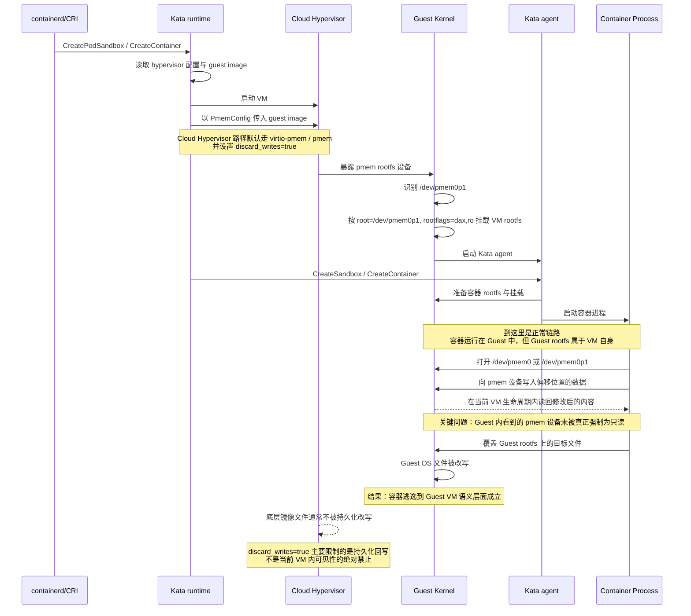
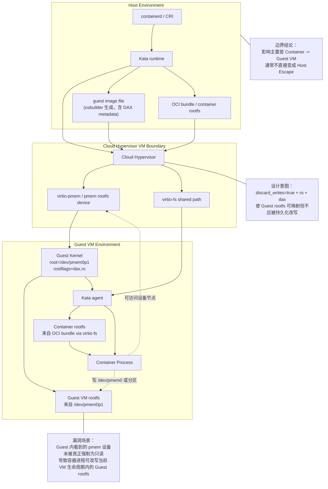

# GHSA-wwj6-vghv-5p64 漏洞场景流程与架构说明

本文基于 Kata Containers 仓库中的设计文档和实现代码，整理该漏洞涉及的技术、设计与代码路径，目标是帮助理解漏洞产生的场景，而不是复现利用。

配套通告中文整理见：

- [08-GHSA-wwj6-vghv-5p64-漏洞通告中文整理.md](./08-GHSA-wwj6-vghv-5p64-漏洞通告中文整理.md)

## 1. 先建立几个关键概念

### 1.1 Guest image 不是容器镜像

Kata 文档明确区分了两类镜像：

- `guest image`：VM 启动时使用的 Guest OS 镜像，用来承载 Kata agent 和整个 Guest 系统
- `container image`：业务容器自己的镜像，例如 BusyBox、Nginx 等

这一点在 [docs/design/architecture/guest-assets.md](/home/test/lyq/Micro-VM/kata-containers/docs/design/architecture/guest-assets.md#L20) 已说明。漏洞影响的是前者，也就是 VM 自己的根文件系统，而不是容器业务镜像本身。

### 1.2 Kata 里有两个“rootfs”

Kata 的架构文档把流程讲得很清楚：

- Hypervisor 把 `guest image` 映射进 VM，成为 VM 的根文件系统，也就是 Guest OS 的 `/`
- 容器自己的 OCI bundle 再通过 `virtio-fs` 挂进 Guest，成为容器的 `container rootfs`

对应描述见 [docs/design/architecture/README.md](/home/test/lyq/Micro-VM/kata-containers/docs/design/architecture/README.md#L150)。

这正是理解漏洞边界的关键：

- 攻击起点：容器环境
- 被改写对象：Guest VM 自己的根文件系统
- 直接后果：从容器逃逸到 Guest VM
- 不直接等于：逃逸到宿主机

### 1.3 DAX / NVDIMM / virtio-pmem 在这里分别扮演什么角色

Kata 的设计目标是让 Guest 高效使用 host 上的 guest image，而不是把整块 rootfs 完整复制进 VM 内存。

仓库文档中对应关系如下：

- DAX：允许 Guest 直接访问 host 提供的页，减少拷贝
- QEMU 路径：通过 NVDIMM 暴露 rootfs
- Cloud Hypervisor 路径：通过 PMEM / `virtio-pmem` 暴露 rootfs

见 [docs/design/architecture/README.md](/home/test/lyq/Micro-VM/kata-containers/docs/design/architecture/README.md#L429) 和 [docs/design/virtualization.md](/home/test/lyq/Micro-VM/kata-containers/docs/design/virtualization.md#L89)。

## 2. 漏洞相关的正常设计流程

### 2.1 镜像构建阶段：osbuilder 为 guest image 写入 DAX 元数据

Kata 的 `osbuilder` 在构建镜像时，不只是生成一个普通文件系统镜像，还会在镜像前部插入 DAX 所需的 metadata。

关键实现位于：

- [tools/osbuilder/image-builder/image_builder.sh](/home/test/lyq/Micro-VM/kata-containers/tools/osbuilder/image-builder/image_builder.sh#L43)
- [tools/osbuilder/image-builder/image_builder.sh](/home/test/lyq/Micro-VM/kata-containers/tools/osbuilder/image-builder/image_builder.sh#L540)

这里可以看到几个重要事实：

- 镜像前 2MB 被保留给 DAX header
- 注释明确写着这些 metadata 是给 NVDIMM driver 使用的
- 最终生成的镜像布局是 “MBR + DAX metadata + rootfs”

这说明 Kata 从镜像构建阶段开始，就把“guest image 将作为 DAX/pmem rootfs 使用”编码进了产物格式。

### 2.2 VM 启动阶段：runtime 把 guest image 作为 VM rootfs 交给 hypervisor

架构文档说明：

1. container manager 调用 Kata runtime
2. Kata runtime 启动 hypervisor
3. hypervisor 把 guest image 映射进 VM
4. guest kernel 把它作为 VM 根文件系统挂载

见 [docs/design/architecture/README.md](/home/test/lyq/Micro-VM/kata-containers/docs/design/architecture/README.md#L159)。

这一步不是把 rootfs 当普通文件传进去，而是当作一个可直接映射的设备暴露给 Guest。对漏洞来说，这一点非常重要，因为后续写 `/dev/pmem0` 写到的正是这条链路上的设备视图。

### 2.3 Guest 内启动阶段：内核而不是 agent 挂载 VM 根文件系统

Kata runtime 会向 Guest kernel 传入 `root=/dev/pmem0p1` 一类参数，表示 VM 启动后的根文件系统来自 pmem 设备分区。

Go runtime 中对应实现：

- [src/runtime/virtcontainers/hypervisor.go](/home/test/lyq/Micro-VM/kata-containers/src/runtime/virtcontainers/hypervisor.go#L112)
- [src/runtime/virtcontainers/hypervisor.go](/home/test/lyq/Micro-VM/kata-containers/src/runtime/virtcontainers/hypervisor.go#L129)

Rust runtime 中对应实现：

- [src/runtime-rs/crates/hypervisor/src/kernel_param.rs](/home/test/lyq/Micro-VM/kata-containers/src/runtime-rs/crates/hypervisor/src/kernel_param.rs#L74)

这些代码都体现出同一件事：

- 根设备是 `/dev/pmem0p1`
- root mount 带 `dax`
- 根文件系统按只读语义传参，例如 `ro`

因此，设计意图是清楚的：Guest rootfs 应该是通过 pmem + dax 挂载，并以只读方式使用。

## 3. Cloud Hypervisor 路径下，Kata 是怎样落到 `virtio-pmem` 的

### 3.1 默认配置就倾向于把 guest image 当 pmem rootfs

在 Rust runtime 的 Cloud Hypervisor 默认配置里：

- `image` 指向 guest image
- `vm_rootfs_driver = "virtio-pmem"`

见 [src/runtime-rs/config/configuration-cloud-hypervisor.toml.in](/home/test/lyq/Micro-VM/kata-containers/src/runtime-rs/config/configuration-cloud-hypervisor.toml.in#L12)。

对应 Makefile 默认值也写死为：

- [src/runtime-rs/Makefile](/home/test/lyq/Micro-VM/kata-containers/src/runtime-rs/Makefile#L279)

Go runtime 这边虽然没有 `vm_rootfs_driver` 这个字段名，但默认也没有禁用 image nvdimm/pmem 路径：

- [src/runtime/Makefile](/home/test/lyq/Micro-VM/kata-containers/src/runtime/Makefile#L293)

### 3.2 Go runtime：Cloud Hypervisor 启动时为 image 构造 `PmemConfig`

Go runtime 的关键路径在：

- [src/runtime/virtcontainers/clh.go](/home/test/lyq/Micro-VM/kata-containers/src/runtime/virtcontainers/clh.go#L610)

逻辑是：

- 如果 `DisableImageNvdimm` 为真，或者是 confidential guest，则退回到 `DiskConfig`
- 否则把 `guest image` 包装成 `PmemConfig`
- 并显式设置 `DiscardWrites = true`

也就是说，Cloud Hypervisor 路径下，Kata 的常规设计不是“只读磁盘镜像”，而是“pmem rootfs + 丢弃写入”。

### 3.3 Rust runtime：标准 image 同样转成 `PmemConfig`

Rust runtime 也延续了同一模式：

- 标准 image 走 `PmemConfig`
- initrd 走 `PayloadConfig`
- confidential guest image 才走 `DiskConfig`

见：

- [src/runtime-rs/crates/hypervisor/ch-config/src/convert.rs](/home/test/lyq/Micro-VM/kata-containers/src/runtime-rs/crates/hypervisor/ch-config/src/convert.rs#L119)
- [src/runtime-rs/crates/hypervisor/ch-config/src/convert.rs](/home/test/lyq/Micro-VM/kata-containers/src/runtime-rs/crates/hypervisor/ch-config/src/convert.rs#L483)

这里也把 `discard_writes` 固定成了 `true`。

## 4. Guest 侧如何看到这个设备

虽然 VM rootfs 的挂载是内核在早期启动时完成的，但 Kata agent 的代码仍然能帮助确认 Guest 对 pmem 设备的认知方式。

### 4.1 agent 把 NVDIMM 设备视为 `/dev/pmemX`

Go runtime 在向 agent 描述设备时，会把 NVDIMM 设备映射为 `/dev/pmem{N}`：

- [src/runtime/virtcontainers/kata_agent.go](/home/test/lyq/Micro-VM/kata-containers/src/runtime/virtcontainers/kata_agent.go#L1163)

### 4.2 Rust agent 会等待 `/dev/pmem*` 出现

Rust agent 中有专门的 pmem 设备等待逻辑：

- [src/agent/src/device/nvdimm_device_handler.rs](/home/test/lyq/Micro-VM/kata-containers/src/agent/src/device/nvdimm_device_handler.rs#L39)
- [src/agent/src/storage/block_handler.rs](/home/test/lyq/Micro-VM/kata-containers/src/agent/src/storage/block_handler.rs#L160)

这说明从 Kata 代码视角看，pmem/NVDIMM 设备是 Guest 内一等公民设备类型，不是偶然副产物。

## 5. 为什么这个设计会形成漏洞场景

### 5.1 设计意图

Kata 的意图其实是合理的：

- 用 DAX / pmem 提升 guest image 启动和访问效率
- 让 Guest rootfs 看起来是只读的
- 即使 Guest 写了，也通过 `discard_writes=true` 不把修改持久化回底层镜像文件

从 Kata runtime 代码看，这个只读意图体现在两层：

- kernel command line 传入 `ro` 和 `dax`
- Cloud Hypervisor 的 pmem 配置设置 `discard_writes=true`

### 5.2 实际漏洞点不在“是否持久化”，而在“Guest 里是不是还能写”

这次漏洞暴露的是下面这个偏差：

1. Kata 认为 `discard_writes=true` 足以表达“这个 guest image 对 Guest 来说应视为只读”
2. 但 Linux `virtio-pmem` / pmem 这条链路里，Guest 内看到的块设备并没有真正被强制成只读
3. 于是 Guest 内进程仍能对 `/dev/pmem0` 或其分区进行写入
4. 写入结果虽然不会持久化到底层镜像文件，但在当前 VM 生命周期内是可见、可执行的

因此，这不是“宿主机镜像文件被永久篡改”的问题，而是“Guest 当前运行实例中的 VM rootfs 可被容器内进程改写”的问题。

### 5.3 为什么会表现成“容器逃逸到 Guest VM”

容器本身运行在 Guest 里面，但它与 Guest OS 不是同一个隔离层次：

- 容器 rootfs 通常来自 OCI bundle / `virtio-fs`
- Guest rootfs 是整个 VM 的系统盘

一旦容器内进程能改写 Guest rootfs 上的系统文件，例如 Guest 内的二进制、库文件、systemd 相关程序，它影响的就不再只是容器目录，而是 Guest OS 自身。

这就是“从容器环境逃逸到 Guest VM 环境”的本质。

架构文档也正好说明了这两个环境是分层存在的：

- [docs/design/architecture/README.md](/home/test/lyq/Micro-VM/kata-containers/docs/design/architecture/README.md#L163)

### 5.4 为什么通常不会直接影响宿主机

从 Kata 这侧的设计和通告描述看，边界大致如下：

- 写入目标是 Guest 看到的 pmem 设备视图
- `discard_writes=true` 让写入不会持久化到底层 image 文件
- 修改会停留在当前 VM 的可见内存映射 / 生命周期内

所以直接结果是：

- 当前 Kata VM 内的 Guest OS 可被篡改
- 底层 host image 文件通常不会被永久写坏
- 这不等于拿到宿主机权限

## 6. 这个场景里，哪些技术是主线，哪些是旁线

### 6.1 主线技术

以下技术直接组成了漏洞场景：

- `guest image`
- `DAX`
- `pmem` / `virtio-pmem`
- Cloud Hypervisor
- kernel root 参数中的 `/dev/pmem0p1`
- Guest VM rootfs 与 container rootfs 的分层

### 6.2 容易混淆但不是主漏洞点的技术

- `virtio-fs`
  - 它主要负责把 OCI bundle / 容器文件系统带进 Guest
  - 它不是这次“Guest rootfs 被写”的核心载体
- agent 的普通存储挂载逻辑
  - rootfs 的首次挂载由 Guest kernel 在启动早期完成
  - agent 更多是在后续处理热插拔设备和容器存储

## 7. 用一句话串起完整流程

可以把该漏洞的场景压缩成下面这条链路：

1. `osbuilder` 生成带 DAX metadata 的 guest image
2. Kata runtime 启动 Cloud Hypervisor
3. runtime 把 guest image 作为 `virtio-pmem` / pmem rootfs 交给 VM
4. Guest kernel 以 `/dev/pmem0p1`、`dax`、`ro` 的方式挂载它作为 VM 根文件系统
5. Kata 预期通过 `discard_writes=true` 实现“可映射但不可持久化写”
6. 实际上 Guest 内仍能对 pmem 设备执行写入
7. 容器内进程因此可以改写 Guest OS 文件，形成“容器逃逸到 Guest VM”的效果

## 7.1 时序图

下面这张图把“正常启动链路”和“漏洞触发链路”放在了一起：

## 7.2 分层架构图

下面这张图强调的是“层次关系”和“数据/控制边界”，有助于理解为什么该漏洞的结果通常停留在 Guest VM 边界内：

## 8. 对理解漏洞最重要的结论

### 8.1 漏洞不是凭空出现，而是高性能 rootfs 设计的副作用

Kata 之所以会落到这个问题，本质上是因为它为了性能和启动效率，选择了：

- 用 DAX 直接映射 guest image
- 用 pmem 设备把 guest image 暴露给 Guest

这条设计路径本身没有问题，但它要求“只读语义”在 hypervisor、guest kernel、pmem 驱动和 Kata 配置之间完全一致。一旦其中某一层没有真正 enforce read-only，就会出现当前这种偏差。

### 8.2 漏洞边界与 Kata 的分层架构严格对应

因为 Kata 把“容器环境”和“Guest VM 环境”分成了两个层次，所以这次漏洞的边界也很清楚：

- 它跨越了容器边界
- 但通常没有跨越 VM 到 host 的边界

这也是为什么通告强调的是“container escape to guest micro VM”，而不是“host escape”。

## 9. 本文涉及的核心代码与文档入口

- [docs/design/architecture/README.md](/home/test/lyq/Micro-VM/kata-containers/docs/design/architecture/README.md)
- [docs/design/architecture/guest-assets.md](/home/test/lyq/Micro-VM/kata-containers/docs/design/architecture/guest-assets.md)
- [docs/design/virtualization.md](/home/test/lyq/Micro-VM/kata-containers/docs/design/virtualization.md)
- [tools/osbuilder/image-builder/image_builder.sh](/home/test/lyq/Micro-VM/kata-containers/tools/osbuilder/image-builder/image_builder.sh)
- [src/runtime/virtcontainers/hypervisor.go](/home/test/lyq/Micro-VM/kata-containers/src/runtime/virtcontainers/hypervisor.go)
- [src/runtime/virtcontainers/clh.go](/home/test/lyq/Micro-VM/kata-containers/src/runtime/virtcontainers/clh.go)
- [src/runtime-rs/config/configuration-cloud-hypervisor.toml.in](/home/test/lyq/Micro-VM/kata-containers/src/runtime-rs/config/configuration-cloud-hypervisor.toml.in)
- [src/runtime-rs/crates/hypervisor/ch-config/src/convert.rs](/home/test/lyq/Micro-VM/kata-containers/src/runtime-rs/crates/hypervisor/ch-config/src/convert.rs)
- [src/runtime-rs/crates/hypervisor/src/kernel_param.rs](/home/test/lyq/Micro-VM/kata-containers/src/runtime-rs/crates/hypervisor/src/kernel_param.rs)
- [src/runtime/virtcontainers/kata_agent.go](/home/test/lyq/Micro-VM/kata-containers/src/runtime/virtcontainers/kata_agent.go)
- [src/agent/src/device/nvdimm_device_handler.rs](/home/test/lyq/Micro-VM/kata-containers/src/agent/src/device/nvdimm_device_handler.rs)
- [src/agent/src/storage/block_handler.rs](/home/test/lyq/Micro-VM/kata-containers/src/agent/src/storage/block_handler.rs)
