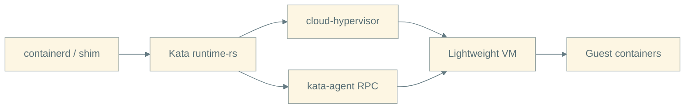
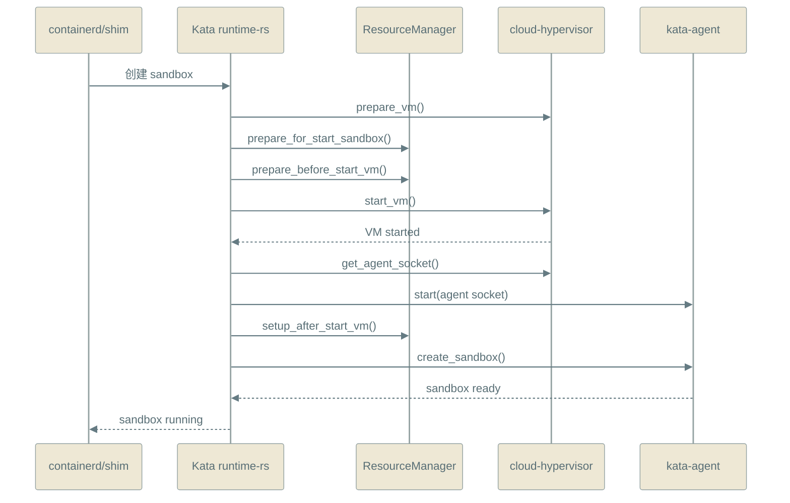
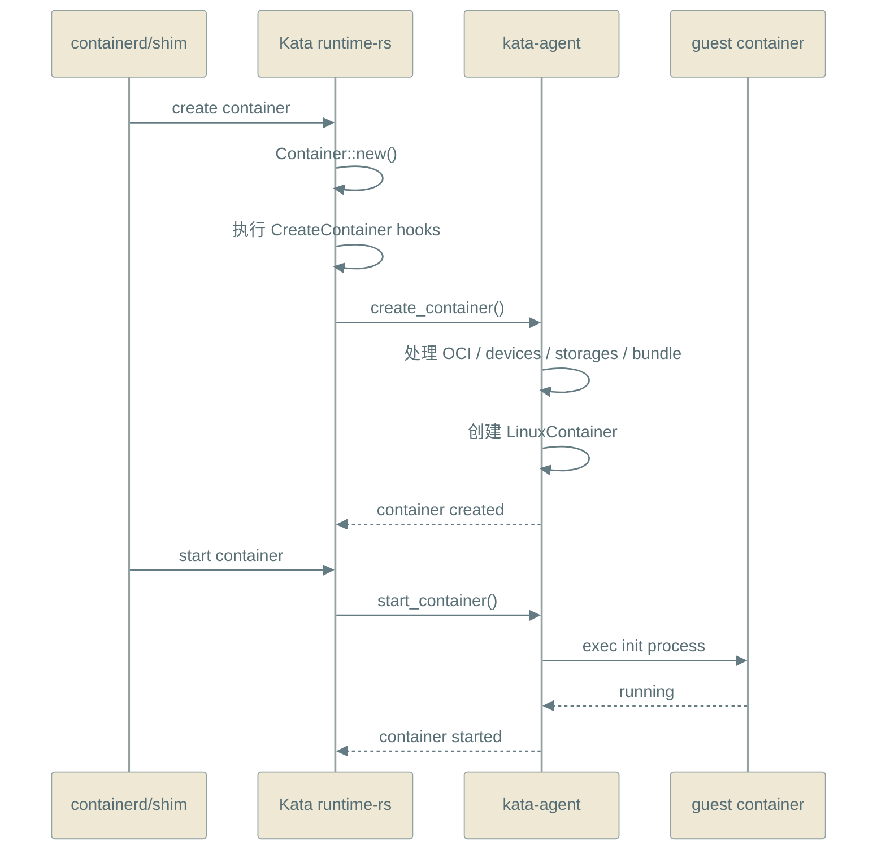
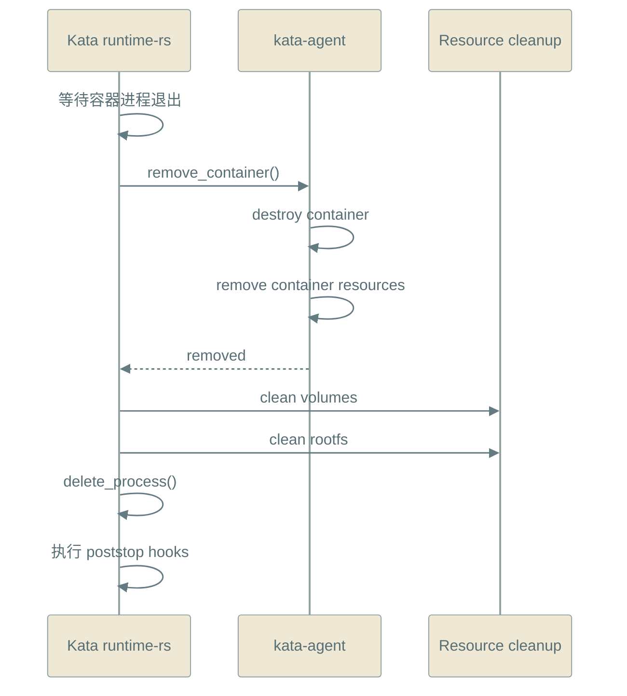
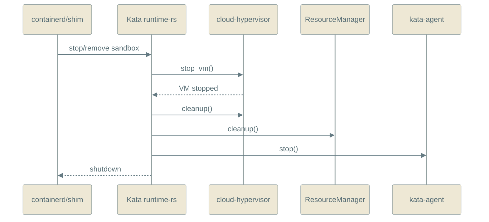

# Kata 沙箱与容器生命周期分析报告（以 Cloud Hypervisor 为例）

日期：2026-03-28

## 1. 报告目标

本文参考 [04-Kata-Containers-架构分析报告.md](/home/test/lyq/Micro-VM/kata-containers/04-Kata-Containers-架构分析报告.md)，从生命周期角度分析：

1. Kata 如何创建沙箱
2. Kata 如何创建容器
3. Kata 如何删除容器
4. Kata 如何删除沙箱

分析对象以 `runtime-rs + cloud-hypervisor + kata-agent` 为主，因为这条链路最能体现：

- 宿主机侧 runtime 负责 VM 生命周期
- guest 内 kata-agent 负责容器生命周期

## 2. 一句话理解

在 Kata 中：

- `沙箱（sandbox）` 本质上是一台轻量 VM
- `容器（container）` 是运行在这台 VM 内的进程集合

因此生命周期天然分成两层：

1. **沙箱生命周期**：创建/启动/停止/清理 VM
2. **容器生命周期**：在 VM 内创建/启动/销毁容器

对于 `cloud-hypervisor`：

- 它参与的是沙箱层
- 容器本身的创建和删除由 guest 内的 `kata-agent` 完成

## 3. 总体架构关系

## 4. 创建沙箱

### 4.1 关键入口

沙箱启动核心在：

- [src/runtime-rs/crates/runtimes/virt_container/src/sandbox.rs](/home/test/lyq/Micro-VM/kata-containers/src/runtime-rs/crates/runtimes/virt_container/src/sandbox.rs)
- [src/runtime-rs/crates/runtimes/virt_container/src/lib.rs](/home/test/lyq/Micro-VM/kata-containers/src/runtime-rs/crates/runtimes/virt_container/src/lib.rs)
- [src/runtime-rs/crates/hypervisor/src/ch/mod.rs](/home/test/lyq/Micro-VM/kata-containers/src/runtime-rs/crates/hypervisor/src/ch/mod.rs)

### 4.2 过程说明

1. runtime 创建 `VirtSandbox`
   - 绑定 `hypervisor`
   - 绑定 `agent`
   - 绑定 `resource_manager`
   - 保存 `sandbox_config`

2. 调用 `Sandbox::start()`
   - 检查当前状态必须是 `Init`

3. 调用 `hypervisor.prepare_vm(...)`
   - 对 `cloud-hypervisor`，这是宿主机侧 VM 准备阶段
   - 包括 VM 目录、网络命名空间、运行参数、控制 socket 等准备

4. runtime 生成启动前资源
   - `prepare_for_start_sandbox()`
   - 生成 vsock/hvsock、网络、sharefs、VM rootfs、保护设备等配置
   - 然后 `resource_manager.prepare_before_start_vm(...)`

5. 调用 `hypervisor.start_vm(...)`
   - 真正拉起 `cloud-hypervisor`
   - guest kernel 和 guest userspace 开始启动

6. 连接 guest agent
   - runtime 通过 `hypervisor.get_agent_socket()` 获取 agent 地址
   - 然后调用 `agent.start(address)`

7. 启动后资源补充
   - `resource_manager.setup_after_start_vm()`

8. 向 guest 发送 `CreateSandboxRequest`
   - 由 `kata-agent` 在 VM 内建立 sandbox 级环境
   - 包括 hostname、dns、sandbox 级 storages、guest hook path、kernel modules

9. runtime 将沙箱状态置为 `Running`

### 4.3 时序图

## 5. 创建容器

### 5.1 关键入口

容器管理核心在：

- [src/runtime-rs/crates/runtimes/virt_container/src/container_manager/manager.rs](/home/test/lyq/Micro-VM/kata-containers/src/runtime-rs/crates/runtimes/virt_container/src/container_manager/manager.rs)
- [src/runtime-rs/crates/runtimes/virt_container/src/container_manager/container_inner.rs](/home/test/lyq/Micro-VM/kata-containers/src/runtime-rs/crates/runtimes/virt_container/src/container_manager/container_inner.rs)
- [src/agent/src/rpc.rs](/home/test/lyq/Micro-VM/kata-containers/src/agent/src/rpc.rs)

### 5.2 过程说明

容器创建分成两个阶段：

1. `create_container`
2. `start_container`

#### 阶段一：create_container

1. runtime 创建 `Container` 对象
2. 执行 OCI `CreateContainer` hooks
3. 调用 `container.create(spec)`
4. runtime 向 guest agent 发 `create_container`
5. agent 在 VM 内完成：
   - 校验 OCI spec
   - 补充设备信息
   - 处理 storages
   - 设置 bundle
   - 更新 namespace
   - 创建 LinuxContainer 对象
   - 准备 init process

此时容器对象已建立，但容器 init 进程还没有真正开始执行。

#### 阶段二：start_container

1. runtime 调用 `start_container`
2. `container_inner.start_container()` 向 agent 发 `start_container`
3. agent 调用容器对象的 `exec()`
4. 容器 init 进程在 guest 内真正运行

### 5.3 时序图

## 6. 删除容器

### 6.1 过程说明

容器删除同样分成 guest 内和宿主机两部分。

1. runtime 等待容器 init 进程退出或主动停止
2. 调用 `agent.remove_container(...)`
3. agent 在 guest 内：
   - `destroy()` 容器对象
   - 移除 container resources
   - 清理 mount / cgroup / watcher 等资源
4. runtime 继续清理宿主机侧资源
   - 停止 exit watcher
   - 清理 volumes
   - 清理 rootfs
5. `ContainerManager::delete_process()` 把容器从 runtime 内部表中移除
6. 执行 OCI `poststop` hooks

### 6.2 时序图

## 7. 删除沙箱

### 7.1 过程说明

沙箱删除比容器删除更“粗粒度”，因为它对应整个 VM。

1. runtime 调用 `Sandbox::stop()`
2. `hypervisor.stop_vm()` 停止 VM
3. 沙箱状态切为 `Stopped`
4. runtime 调用 `Sandbox::cleanup()`
5. `hypervisor.cleanup()` 清理 VMM 相关目录和资源
6. `resource_manager.cleanup()` 清理宿主机侧设备、网络、sharefs 等资源
7. 停掉 monitor
8. 停掉 agent
9. 向 shim 发送 shutdown 消息

### 7.2 时序图

## 8. 从生命周期角度看 Cloud Hypervisor 的职责

如果只看 `cloud-hypervisor` 在整个生命周期中的职责，可以概括为：

### 在创建沙箱时

- 准备 VM
- 启动 VM
- 提供 agent 通信通道

### 在删除沙箱时

- 停止 VM
- 清理 VMM 资源

### 它不直接负责

- guest 内容器 rootfs 准备
- guest 内 cgroup / namespace 创建
- guest 内容器进程启动与销毁

这些动作都在 `kata-agent` 内完成。

所以从系统边界看：

- `cloud-hypervisor` 管的是 **VM 生命周期**
- `kata-agent` 管的是 **容器生命周期**

## 9. 汇报用结论

可以把这一部分概括成下面这句话：

> 在 Kata 中，沙箱就是一台由 runtime 和 cloud-hypervisor 管理的轻量 VM；容器则由 guest 内的 kata-agent 创建和销毁。因此，创建/删除沙箱本质上是 VM 生命周期管理，而创建/删除容器本质上是 guest 内容器生命周期管理。
