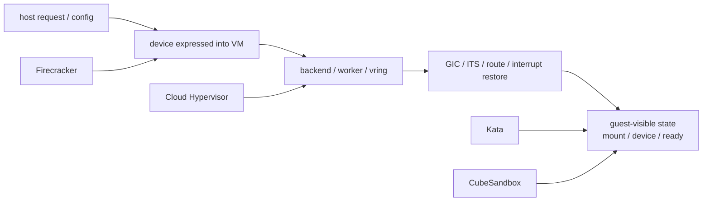

# ARM64 非网络风险图

本文把当前四个重点项目在 **非网络** 主线上的 ARM64 风险点收成一张图。

这里的“非网络”指：

1. 存储 / rootfs / share-fs
2. I/O 虚拟化 / virtio 数据路径
3. 中断虚拟化 / controller restore

本文不重新解释每条链的基础结构。

它只回答一个问题：

**当问题只在 ARM64 暴露，最该先怀疑哪一层。**

源码基线：当前工作树。

关联专题：

- [存储、rootfs 与共享文件系统跨项目专题分析](./storage-rootfs-sharefs-cross-project.md)
- [Virtio 传输与设备数据路径跨项目专题分析](./virtio-data-path-cross-project.md)
- [中断与事件通知跨项目专题分析](./interrupt-event-notification-cross-project.md)
- [CPU、中断控制器与机器描述跨项目专题分析](./cpu-interrupt-machine-cross-project.md)
- [Cloud Hypervisor 与 CubeSandbox：Restore 后 Guest 不可用验证清单](./ch-cubesandbox-restore-guest-unavailability-checklist.md)

## 1. 核心结论

在当前四个项目里，ARM64 与 x86_64 的非网络差异，不主要体现在 API 表层。

更常见的分叉点是：

1. 设备如何被 guest 发现
2. 中断控制器 / GIC / ITS 是否恢复完整
3. guest agent 是否真的把设备、storage、mount、ready 收敛完

换句话说：

- Firecracker 的 ARM64 风险更偏 **root 表达之后的 guest 设备发现**
- Cloud Hypervisor 的 ARM64 风险更偏 **transport/backend 之后的 GIC / controller restore**
- Kata 的 ARM64 风险更偏 **request 已正确表达之后的 guest storage landing**
- CubeSandbox 的 ARM64 风险更偏 **平台控制面成功之后的 backend 重绑 + GIC/ITS + guest-visible 闭环**

## 2. 总体风险图

这张图不是调用链。

它是在说：

**四个项目最容易出 ARM64 特有问题的层次，并不相同。**

## 3. 风险矩阵

| 项目 | 存储线最敏感层 | I/O 线最敏感层 | 中断线最敏感层 | 一句话判断 |
|---|---|---|---|---|
| Firecracker | root expression 之后的 guest 设备发现 | MMIO/PCI transport 之后的 guest 可见性 | GIC/route 之后的 guest 响应 | 更像“设备表达没问题，但 guest 侧没真正成立语义” |
| Cloud Hypervisor | backend socket / device tree / guest 设备发现 | transport/notifier/backend 重建 | `saved_vcpu_states -> set_gicr_typers -> restore_vgic` | 更像“VMM 恢复成功，但 controller/transport 细节没闭合” |
| Kata Containers | `CreateContainerRequest.storages` 之后的 guest storage landing | host request 成功后，guest agent 的可见性收敛 | 不自己实现 irqfd，更常被 guest agent 等待伪装成 IRQ 问题 | 更像“问题已经越过 runtime，停在 guest agent” |
| CubeSandbox | `StorageInfo -> VmSetFs -> cube-agent` 收敛 | 平台控制面成功后的 worker/backend 重绑 | `create_vgic -> init_pmu -> set_gicr_typers -> restore GICv3 ITS snapshot` | 更像“平台层、GIC/ITS、guest-visible 三者之间的闭环问题” |

## 4. Firecracker：风险落点偏后段

Firecracker 的 block / pmem root 表达在源码里很直接：

- `root=/dev/vda`
- `root=PARTUUID=...`
- `root=/dev/pmem{i}`

这些表达本身不按架构分叉。

所以 ARM64 风险通常不是“root 字段怎么写”，而是：

1. guest 是否真的发现了对应设备
2. 发现了设备之后，rootfs 是否真的可用
3. restore 后 backing file 语义是否仍然一致

对 Firecracker 而言，ARM64 问题更像：

`device was expressed`
but
`guest-visible root semantics did not complete`

## 5. Cloud Hypervisor：风险落点偏中段

Cloud Hypervisor 的 ARM64 风险更多集中在：

1. `set_vring_call` / `set_vring_kick` / `set_config_call`
2. `VirtioPciDevice` transport state
3. `restore_vgic`
4. GIC/ITS 或 IOAPIC 的恢复顺序

特别是在 ARM64 restore 下，代码已经明确表明：

`saved_vcpu_states -> set_gicr_typers -> restore_vgic`

这条顺序必须闭合。

所以 CH 的 ARM64 非网络问题，常常不像：

`request not expressed`

而更像：

`transport/backend/controller was almost restored, but not completely`

## 6. Kata：风险落点偏 guest agent

Kata 当前最清楚的边界是：

`CreateContainerRequest.storages`

只证明了 host -> guest 的 request propagation。

真正的 guest-visible rootfs / volume 语义，还要继续经过：

- `add_storages()`
- `mount_storage()`
- `mount_from()`

因此 ARM64 下，Kata 的非网络问题最容易被误判。

很多看起来像：

- I/O 问题
- IRQ 问题
- device 没进 VM

的现象，其实已经越过了 runtime/plugin，停在 guest agent 的设备等待、mount、最终可用性收敛。

## 7. CubeSandbox：风险落点最“厚”

CubeSandbox 的 ARM64 风险不是单点问题，而是三层叠加：

1. 平台控制面
2. GIC / ITS / backend restore
3. guest-visible ready / mount / device wait

它的 restore 还要求：

`create_vgic -> init_pmu -> set_gicr_typers -> restore GICv3 ITS snapshot`

这条链成立。

如果这条链没闭合，症状很容易表面上像：

- guest 设备没起来
- mount 没完成
- ready 没等到

但真正断点其实更早。

所以 CubeSandbox 的 ARM64 非网络问题，最不适合只看单条日志。

必须看：

1. control-plane 请求
2. worker/backend 重绑
3. GIC/ITS restore
4. guest-visible convergence

## 8. 最小判断顺序

当问题只在 ARM64 暴露时，建议先按下面顺序问：

1. 这个项目的问题更可能落在设备表达、transport/backend、controller restore，还是 guest-visible convergence？
2. 当前这次证据有没有覆盖到这一层？
3. 如果没有，是继续搜日志，还是已经应该去换一层找？

按当前四项目，最实用的最小路径是：

| 项目 | 先问什么 |
|---|---|
| Firecracker | guest 是否真的看到 root block / pmem，`/` 是否真的可用 |
| Cloud Hypervisor | transport/notifier 是否重建，GIC/route 是否闭合 |
| Kata | guest `add_storages()` / `mount_from()` 是否真的执行 |
| CubeSandbox | 平台请求、worker/backend、GIC/ITS、guest-visible 是否同一 attempt 闭环 |

## 9. 结论

当 non-network 问题只在 ARM64 暴露时，最不该做的就是：

用同一套直觉同时解释四个项目。

更准确的做法是：

先判断这个项目的 ARM64 风险主要落在哪一层，再看证据有没有覆盖到那一层。

当前四项目可以压成一句话：

- Firecracker 偏 guest 设备发现
- Cloud Hypervisor 偏 transport/controller restore
- Kata 偏 guest agent storage landing
- CubeSandbox 偏平台闭环 + GIC/ITS + guest-visible convergence
