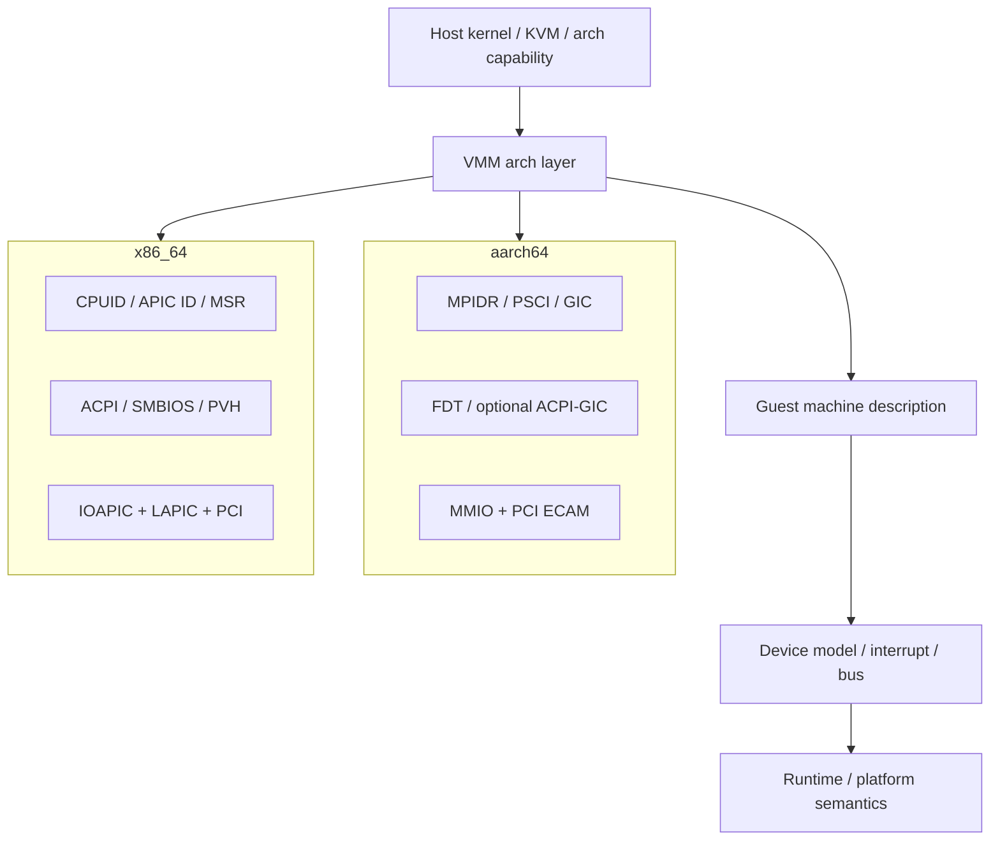
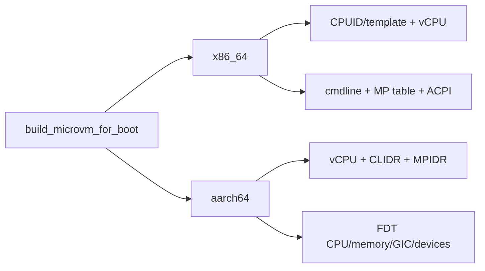
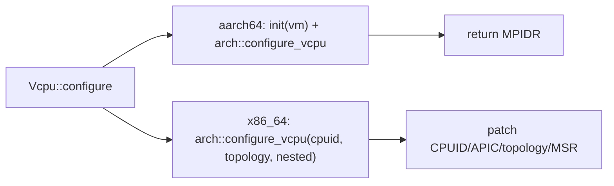
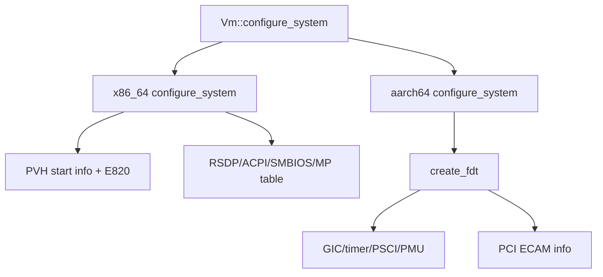
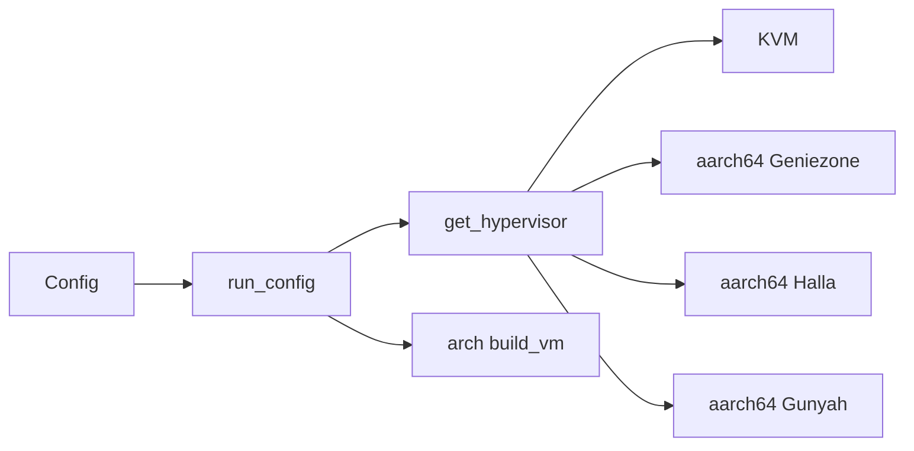
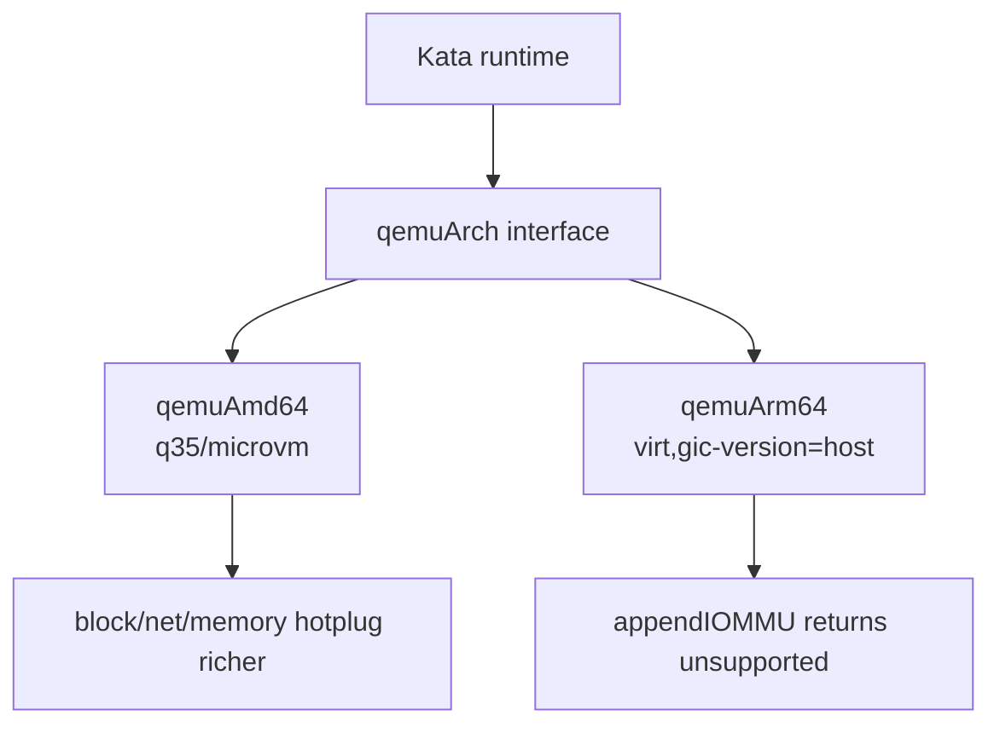
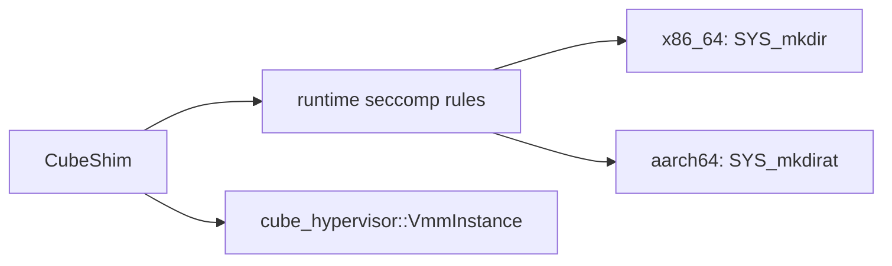
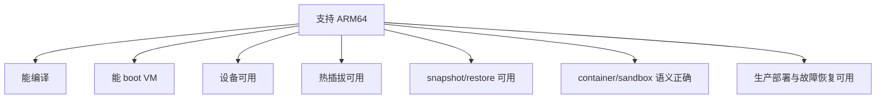

# ARM64 与 x86_64 跨项目架构差异专题分析

本文从当前工作树源码出发，对 Firecracker、Cloud Hypervisor、Kata Containers、CubeSandbox 在 `arm64/aarch64` 与 `x86_64` 下的差异做横向分析。

关联总表：[ARM64 网络验证与观测总表](./arm64-network-validation-observation-matrix.md)。

关联签名表：[ARM64 网络失败签名总表](./arm64-network-failure-signature-matrix.md)。

crosvm 相关内容保留为历史参考，但当前已暂停继续分析，不作为后续路线的推进对象。

重点不是回答“能不能跑”，而是解释差异来自哪里：CPU 初始化、中断控制器、机器描述、设备枚举、热插拔、snapshot/restore、安全过滤和 runtime/platform 语义。

## 1. 总体分层

四个项目的架构差异有两种来源。

第一类是 VMM 直接面对 CPU 与平台设备，因此源码里存在大量 `#[cfg(target_arch = "...")]` 分支。Firecracker、Cloud Hypervisor、CubeHypervisor 属于这一类。

第二类是 runtime 或平台自身尽量架构中立，但依赖的 hypervisor、guest kernel、firmware、agent image、host 内核能力是架构相关的。Kata Containers 和 CubeSandbox 的平台层属于这一类。

## 2. 横向结论矩阵

| 比较轴 | Firecracker | Cloud Hypervisor | Kata Containers | CubeSandbox |
|---|---|---|---|---|
| CPU 身份 | x86_64 CPUID/template；aarch64 MPIDR/CLIDR/FDT | x86_64 CPUID/topology/nested；aarch64 MPIDR/KVM ARM init | runtime 抽象中立；QEMU 插件显式区分 amd64/arm64 | CubeHypervisor fork 中保留 arch 分支 |
| 中断控制器 | x86_64 IRQCHIP/PIT/IOAPIC；aarch64 GIC | x86_64 IOAPIC；aarch64 GICv3/ITS | 取决于底层 VMM/QEMU machine | fork 的 Cloud Hypervisor 路径：x86 IOAPIC、ARM GIC |
| 机器描述 | x86_64 boot params/MP table/ACPI；aarch64 FDT | x86_64 PVH/ACPI/SMBIOS；aarch64 ACPI + FDT | QEMU `q35/microvm` vs `virt,gic-version=host` | VMM 层 FDT/ACPI，平台层用配置隐藏差异 |
| 设备枚举 | x86_64 cmdline/ACPI；ARM FDT MMIO + optional PCI | PCI 为主，ARM 通过 ACPI/FDT 描述 GIC/PCI/virtio | hypervisor plugin 把差异收敛成设备 API | CubeShim/Cubelet 把差异收敛成 sandbox 配置 |
| 热插拔 | 非通用 hotplug，主要更新已有设备 | CPU/memory/device 均受 arch 分支影响 | QEMU amd64 暴露更多 hotplug 能力 | VM 热插拔沿用 CubeHypervisor 能力，平台需验证 ARM 镜像 |
| snapshot/restore | VM/vCPU arch state、DeviceManager、guest memory | GIC/IOAPIC、CPU state、memory manager 都必须参与 | runtime state + hypervisor state + agent state | VM memory + CubeCoW + metadata + network-agent |
| CoCo/安全 | 无 Cloud Hypervisor 同级 TDX/SEV 主线 | x86_64 TDX/SEV-SNP 线更突出；ARM 有 PMU/GIC/FDT 约束 | Kata CoCo 暂不展开 | 当前平台能力还要看 CubeHypervisor fork 与部署脚本 |
| seccomp/系统调用 | API/VMM/vCPU 线程 seccomp 按 arch/filter 分离 | VMM seccomp 有 arch 分支 | 主要由 VMM 进程和 guest image 决定 | CubeShim 直接对 x86_64/arm64 选择不同 mkdir syscall |

## 3. Firecracker：极简 VMM 的架构分叉

Firecracker 的 API、`VmResources`、builder 和 virtio worker 大体共享。架构差异集中在 `arch/*`、KVM irqchip/GIC、boot params、ACPI/FDT 和 snapshot arch state。

### 3.1 启动期：CPUID/ACPI vs MPIDR/FDT

x86_64 的 `configure_system_for_boot()` 先写 cmdline 和 MP table，再按 PVH 或 Linux boot protocol 写启动参数，最后生成 ACPI tables：[firecracker/src/vmm/src/arch/x86_64/mod.rs](../firecracker/src/vmm/src/arch/x86_64/mod.rs#L175)。

aarch64 的 `configure_system_for_boot()` 先配置 vCPU，再覆盖 CLIDR/cache 视图，读取 MPIDR，最后写 FDT：[firecracker/src/vmm/src/arch/aarch64/mod.rs](../firecracker/src/vmm/src/arch/aarch64/mod.rs#L93)。

结论：x86_64 guest 通过 CPUID、APIC、boot params 和 ACPI 看到平台；aarch64 guest 通过 MPIDR、PSCI、GIC 和 FDT 看到平台。

Firecracker 的 ARM64 网络边界也已经继续展开为 [Firecracker ARM64 网络能力边界矩阵](../firecracker/analysis/arm64-network-capability-matrix.md)。

### 3.2 中断与设备发现

Firecracker x86_64 使用 KVM irqchip、PIT 和 IOAPIC 语义，并通过 cmdline、ACPI DSDT 与可选 PCI segment 暴露设备。

ARM64 路径使用 GIC，并在 FDT 中写 CPU、memory、chosen、GIC、timer、clock、PSCI、MMIO devices、VMGenID、VMClock 和可选 PCI host bridge：[firecracker/src/vmm/src/arch/aarch64/fdt.rs](../firecracker/src/vmm/src/arch/aarch64/fdt.rs#L65)。

Firecracker 的 GED 不是通用热插拔中心。它只处理 VMGenID/VMClock 通知，因此机器描述更偏启动期边界，而不是 Cloud Hypervisor 式运行期 hotplug 总线。

### 3.3 snapshot 边界

Firecracker restore 必须把 `Vmm`、VM/vCPU arch state、DeviceManager 和 guest memory 对齐。架构差异会进入 vCPU 寄存器、中断控制器、设备发现表和恢复通知。

项目级专题：[Firecracker 机器描述：x86_64 ACPI 与 ARM64 FDT 链路](../firecracker/analysis/machine-description-acpi-fdt-chain.md)、[Firecracker ARM64 与 x86_64 架构差异链路](../firecracker/analysis/arch-arm64-x86-chain.md)。

## 4. Cloud Hypervisor：差异从 VMM 核心层出现

Cloud Hypervisor 的架构差异不是外围配置差异，而是贯穿 `CpuManager`、`Vm`、`DeviceManager`、`arch/` 和 `devices/`。

### 4.1 vCPU 配置：CPUID vs MPIDR

`Vcpu::configure()` 的签名本身就被 `target_arch` 切开。aarch64 参数包含 hypervisor VM，用于 ARM vCPU init；x86_64 参数包含 CPUID、Hyper-V、topology、nested：[cloud-hypervisor/vmm/src/cpu.rs](../cloud-hypervisor/vmm/src/cpu.rs#L541)。

x86_64 的 `arch::configure_vcpu()` 会写 CPUID leaf、APIC ID、topology、nested virtualization 位、TSC 频率、MSR 和寄存器：[cloud-hypervisor/arch/src/x86_64/mod.rs](../cloud-hypervisor/arch/src/x86_64/mod.rs#L813)。

aarch64 的 `arch::configure_vcpu()` 返回 MPIDR。随后系统配置会把 `vcpu_mpidr` 写入 FDT CPU nodes：[cloud-hypervisor/arch/src/aarch64/mod.rs](../cloud-hypervisor/arch/src/aarch64/mod.rs#L68)。

结论：x86_64 guest 主要通过 CPUID/MSR/APIC 看到虚拟 CPU 拓扑；aarch64 guest 主要通过 MPIDR、PSCI、FDT CPU nodes 与 GIC 看到 CPU 拓扑。

Cloud Hypervisor 的 ARM64 网络边界也已经继续展开为 [Cloud Hypervisor ARM64 网络能力边界矩阵](../cloud-hypervisor/analysis/arm64-network-capability-matrix.md)。

Cloud Hypervisor 的 ARM64 网络失败信号与排查顺序也已经继续展开为 [Cloud Hypervisor ARM64 网络观测指南](../cloud-hypervisor/analysis/arm64-network-observation-guide.md)。

### 4.2 机器描述：PVH/ACPI vs FDT/GIC

x86_64 的 `configure_system()` 写 EBDA、SMBIOS、MP table，并调用 `configure_pvh()` 写 PVH start info、E820 memory map、RSDP、initramfs module：[cloud-hypervisor/arch/src/x86_64/mod.rs](../cloud-hypervisor/arch/src/x86_64/mod.rs#L950)。

aarch64 的 `configure_system()` 直接调用 `fdt::create_fdt()`，传入 cmdline、MPIDR、device info、initrd、PCI space、virtio-iommu BDF、GIC device、NUMA、PMU 支持：[cloud-hypervisor/arch/src/aarch64/mod.rs](../cloud-hypervisor/arch/src/aarch64/mod.rs#L125)。

aarch64 FDT 创建过程显式写 root `interrupt-parent`，再创建 CPU、memory、chosen、GIC、timer、PMU、clock、PSCI、devices、PCI nodes：[cloud-hypervisor/arch/src/aarch64/fdt.rs](../cloud-hypervisor/arch/src/aarch64/fdt.rs#L208)。

结论：同样是 Linux guest，x86_64 更像“PC 平台启动协议”；aarch64 更像“virt machine + device tree”。

### 4.3 中断控制器：IOAPIC vs GIC

x86_64 侧存在 `Ioapic` 结构，参与 legacy IRQ 和迁移状态：[cloud-hypervisor/devices/src/ioapic.rs](../cloud-hypervisor/devices/src/ioapic.rs#L129)。

aarch64 侧存在 `Gic`，封装 hypervisor 提供的 `Vgic`，并实现 `InterruptController`、`Snapshottable`、`Transportable`、`Migratable`：[cloud-hypervisor/devices/src/gic.rs](../cloud-hypervisor/devices/src/gic.rs#L34)。

`Gic::new()` 创建 MSI IRQ group，再通过 `vm.create_vgic()` 创建虚拟 GIC；snapshot 时读取 VGIC state，pause 时保存 GICv3 ITS tables：[cloud-hypervisor/devices/src/gic.rs](../cloud-hypervisor/devices/src/gic.rs#L42)。

结论：ARM64 snapshot/restore 的正确性不能只看 CPU 和内存，还必须包含 VGIC/ITS 状态。x86_64 则要关注 IOAPIC/LAPIC/MSI 路由和 ACPI 枚举。

## 5. 历史参考：crosvm（暂停继续扩展）

本节保留已有横向背景，帮助理解 VMM 生态差异。根据当前研究范围，crosvm 后续不继续展开，也不作为下一步任务对象。

crosvm 的 Linux 入口 `run_config(cfg)` 会先构造 VM components，再根据 hypervisor kind 分发到 KVM、Geniezone、Halla、Gunyah 等实现：[crosvm/src/crosvm/sys/linux.rs](../crosvm/src/crosvm/sys/linux.rs#L2103)。

`get_hypervisor()` 中 KVM 是通用主路径；Geniezone、Halla、Gunyah 是 aarch64 feature-gated 路径：[crosvm/src/crosvm/sys/linux.rs](../crosvm/src/crosvm/sys/linux.rs#L2062)。

### 5.1 VM 构造：aarch64 与 x86_64 是两个 arch crate

aarch64 的 `build_vm()` 处理 protected VM firmware、FDT 位置、payload/initrd 加载、PMU、GIC、PSCI、设备树等：[crosvm/aarch64/src/lib.rs](../crosvm/aarch64/src/lib.rs#L530)。

x86_64 的 `build_vm()` 设置 identity map、TSS、ACPI/MP table、I/O bus、MMIO bus、PCI root、CMOS、fw_cfg、legacy devices 等：[crosvm/x86_64/src/lib.rs](../crosvm/x86_64/src/lib.rs#L1044)。

aarch64 的 `create_fdt()` 写 root interrupt-parent、chosen、config、memory、CPU、GIC、timer、PMU、serial、PSCI、PCI、RTC、watchdog、cpufreq、overlay 等：[crosvm/aarch64/src/fdt.rs](../crosvm/aarch64/src/fdt.rs#L627)。

结论：crosvm 的 x86_64 路径偏 PC/PCI/ACPI；aarch64 路径偏 virt/FDT/GIC/PSCI，并且承载了 Android/pKVM/protected VM 相关能力。

### 5.2 设备与热插拔：x86_64 路径更完整

`run_config` 周围有大量 `#[cfg(target_arch = "x86_64")]`、`#[cfg(target_arch = "aarch64")]` 分支。x86_64 明确拥有更多 control loop、PCI hotplug、IOMMU 相关路径：[crosvm/src/crosvm/sys/linux.rs](../crosvm/src/crosvm/sys/linux.rs#L2500)。

`RunControlArgs` 在 x86_64 下携带 hotplug control tube/thread；aarch64 下携带 `vcpu_domain_paths`：[crosvm/src/crosvm/sys/linux.rs](../crosvm/src/crosvm/sys/linux.rs#L3722)。

crosvm 的 virtio-fs DAX 也显式限制在 x86_64：`use_dax = cfg!(target_arch = "x86_64") && fs.cfg().use_dax`：[crosvm/devices/src/virtio/fs/mod.rs](../crosvm/devices/src/virtio/fs/mod.rs#L159)。

结论：crosvm 在 ARM64 上不是“少一个 CPU 后端”这么简单。设备隔离、VFIO、IOMMU、hotplug、DAX、Android/pKVM 场景都会改变能力边界。

## 6. Kata Containers：runtime 抽象中立，QEMU/VMM 插件架构相关

Kata 的上层 sandbox/container 生命周期不应该按 CPU 架构拆开理解。containerd shim、virtcontainers、runtime-rs manager、agent RPC 的抽象目标是跨架构一致。

真正的架构差异集中在 hypervisor plugin、QEMU arch plugin、guest kernel/image、firmware 和 host KVM 能力。

### 6.1 QEMU arch plugin 差异最直接

Kata 的 `qemuArch` interface 定义了 machine、path、kernel params、capabilities、bridges、CPU/memory topology、image、IOMMU、PFlash、protection 等能力。

源码入口：[kata-containers/src/runtime/virtcontainers/qemu_arch_base.go](../kata-containers/src/runtime/virtcontainers/qemu_arch_base.go#L32)。

amd64 插件默认使用 `/usr/bin/qemu-system-x86_64`，machine options 是 `accel=kvm`：[kata-containers/src/runtime/virtcontainers/qemu_amd64.go](../kata-containers/src/runtime/virtcontainers/qemu_amd64.go#L46)。

arm64 插件默认使用 `/usr/bin/qemu-system-aarch64`，machine 是 `virt`，默认 options 是 `usb=off,accel=kvm,gic-version=host`：[kata-containers/src/runtime/virtcontainers/qemu_arm64.go](../kata-containers/src/runtime/virtcontainers/qemu_arm64.go#L27)。

### 6.2 能力差异：IOMMU、内存热插拔、普通能力边界

amd64 的 `capabilities()` 在 Q35 下设置 block/network hotplug，并设置 multiqueue、fs sharing：[kata-containers/src/runtime/virtcontainers/qemu_amd64.go](../kata-containers/src/runtime/virtcontainers/qemu_amd64.go#L165)。

amd64 的 `supportGuestMemoryHotplug()` 对非 microvm 且无 guest protection 时返回 true：[kata-containers/src/runtime/virtcontainers/qemu_amd64.go](../kata-containers/src/runtime/virtcontainers/qemu_amd64.go#L205)。

arm64 的 `appendIOMMU()` 直接返回 `Arm64 architecture does not support vIOMMU`：[kata-containers/src/runtime/virtcontainers/qemu_arm64.go](../kata-containers/src/runtime/virtcontainers/qemu_arm64.go#L117)。

结论：Kata 的“架构支持”应分层表达。shim/agent 协议大体中立；QEMU machine、IOMMU、hotplug、firmware、image 是架构差异的真实来源。

## 7. CubeSandbox：平台层中立，CubeHypervisor 和部署资产架构相关

CubeSandbox 的 API/Master/Cubelet 主要操作的是 sandbox、snapshot、template、network、storage 等平台概念。

它们尽量隐藏 CPU 架构差异。

真正的差异在 CubeShim 启动 VMM、CubeHypervisor fork、guest agent/syscall ABI、kernel/image、CubeCoW 和 network-agent 依赖的 host 能力。

### 7.1 CubeShim 直接存在 arch syscall 差异

`CubeHypervisor::launch_vmm()` 设置 runtime seccomp rules 时，x86_64 允许 `SYS_mkdir`，aarch64 允许 `SYS_mkdirat`。

源码入口：[CubeSandbox-sandbox-clone/CubeShim/shim/src/hypervisor/cube_hypervisor.rs](../CubeSandbox-sandbox-clone/CubeShim/shim/src/hypervisor/cube_hypervisor.rs#L75)。

snapshot restore 路径也有同样分支，说明这不是普通编译残留，而是 VMM 启动/恢复所需的实际 syscall 差异：[CubeSandbox-sandbox-clone/CubeShim/shim/src/snapshot/mod.rs](../CubeSandbox-sandbox-clone/CubeShim/shim/src/snapshot/mod.rs#L230)。

### 7.2 CubeHypervisor 继承 Cloud Hypervisor 式差异

CubeSandbox 内嵌 `hypervisor/` 目录保留了 Cloud Hypervisor 式架构分支。

`Vcpu::configure()` 在 aarch64 下先 init，再调用 `arch::configure_vcpu()` 获取 MPIDR；x86_64 下传入 guest memory、CPUID、Hyper-V 等。

源码入口：[CubeSandbox-sandbox-clone/hypervisor/vmm/src/cpu.rs](../CubeSandbox-sandbox-clone/hypervisor/vmm/src/cpu.rs#L344)。

x86_64 的 `configure_system()` 写 SMBIOS、MP table、PVH start info：[CubeSandbox-sandbox-clone/hypervisor/arch/src/x86_64/mod.rs](../CubeSandbox-sandbox-clone/hypervisor/arch/src/x86_64/mod.rs#L925)。

aarch64 的 `configure_system()` 生成并写入 FDT，参数包括 MPIDR、设备信息、PCI space、virtio-iommu BDF、GIC、NUMA、PMU：[CubeSandbox-sandbox-clone/hypervisor/arch/src/aarch64/mod.rs](../CubeSandbox-sandbox-clone/hypervisor/arch/src/aarch64/mod.rs#L141)。

CubeHypervisor 的 VM 配置过程中，aarch64 分支会创建 VGIC 并启用 interrupt controller：[CubeSandbox-sandbox-clone/hypervisor/vmm/src/vm.rs](../CubeSandbox-sandbox-clone/hypervisor/vmm/src/vm.rs#L1172)。

结论：CubeSandbox 平台层可以对外说“sandbox snapshot/clone/rollback”，但底层 VM restore 是否稳定，仍取决于架构相关 CPU/GIC/IOAPIC/FDT/ACPI 状态能否完整恢复。

## 8. 能力边界：不能只写“支持 ARM64”

| 能力层 | 最低验证点 | 为什么重要 |
|---|---|---|
| 编译 | arch cfg、feature、syscall、依赖库 | 只能证明代码能生成二进制 |
| VM boot | kernel/firmware/FDT/ACPI/GIC/IOAPIC | 证明 guest 能启动 |
| 设备 | block/net/fs/vsock/serial/rng/pmem/vhost | 证明基础 I/O 可用 |
| 热插拔 | CPU/memory/disk/net/fs | runtime/platform 常依赖动态设备 |
| snapshot | CPU state、memory、interrupt controller、device state | clone/rollback 的底层前提 |
| guest agent | agent ABI、ttrpc/vsock、mount/network 操作 | Kata/CubeSandbox 需要 guest 内协作 |
| 平台一致性 | metadata、network、storage、template、retry | CubeSandbox 类平台的最终语义 |

因此，ARM64 与 x86_64 的比较必须给出“在哪一层支持”。例如，Kata arm64 的 shim/agent RPC 支持不等于 QEMU arm64 vIOMMU 支持；CubeSandbox arm64 的 VMM 能启动不等于 snapshot/clone 能覆盖 CubeCoW、network-agent、guest agent 的所有状态。

## 9. 后续源码深挖路线

### 9.1 Firecracker

1. 跟踪 `build_microvm_for_boot -> configure_system_for_boot`，对比 x86_64 ACPI 与 ARM64 FDT 的 guest 发现路径。
2. 跟踪 x86_64 IRQCHIP/PIT/IOAPIC 与 ARM64 GIC 的创建、保存和恢复边界。
3. 把 VMGenID/VMClock 在 ACPI/FDT 中的暴露和 restore notify 串起来。

### 9.2 Cloud Hypervisor

1. 跟踪 `Vcpu::configure -> arch::{x86_64,aarch64}::configure_vcpu`，画出 CPU state 保存/恢复路径。
2. 跟踪 `Vm::configure_system -> arch::configure_system`，对比 PVH/ACPI 与 FDT/GIC。
3. 跟踪 `Gic` 与 `Ioapic` 的 `Snapshottable`，确认中断状态如何进入 migration snapshot。

### 9.3 Kata Containers

1. 对 `qemuAmd64` 与 `qemuArm64` 建 capability matrix。
2. 把 QEMU arch plugin 的差异映射到 Kata `types.Capabilities`。
3. 分别分析 Cloud Hypervisor、Firecracker、QEMU plugin 在 ARM64/x86_64 下的实际约束。

### 9.4 CubeSandbox

1. 对比 `CubeShim` 启动、snapshot restore、seccomp 规则中的 arch 分支。
2. 对比 `hypervisor/` fork 与 Cloud Hypervisor 上游的 aarch64/x86_64 差异。
3. 建立 ARM64 clone/rollback 验证清单：VM memory、CubeCoW rootfs、network-agent、cube-agent、端口策略。

## 10. 当前判断

Firecracker 是理解极简 Micro-VM 边界的基线，因为它把差异集中到启动期机器描述、CPU/IRQ 初始化和精简设备模型。

Cloud Hypervisor 和 CubeHypervisor 是理解可热插拔 VMM 的底座，因为它们直接处理 CPU、中断、机器描述和设备状态。

crosvm 当前只保留历史参考，不继续作为本轮深入路线的分析对象。

Kata Containers 的上层 runtime 是中立抽象，但能力边界必须回落到 QEMU/VMM plugin、guest image、firmware、agent 和 host KVM。

CubeSandbox 的产品语义最复杂。

它可以把 ARM64/x86_64 差异藏在平台后面，但 snapshot/clone/rollback 的可靠性最终仍由底层 VMM state、guest state、storage state、network state 的架构支持共同决定。

CubeSandbox 的 ARM64 网络检查表已经继续展开为 [ARM64 网络验证矩阵](../CubeSandbox-sandbox-clone/analysis/arm64-network-validation-matrix.md)。

Kata 的普通非机密计算网络边界也已经继续展开为 [Kata ARM64 网络能力边界矩阵](../kata-containers/analysis/arm64-network-capability-matrix.md)。

Kata 的 ARM64 网络失败信号与排查顺序也已经继续展开为 [Kata ARM64 网络观测指南](../kata-containers/analysis/arm64-network-observation-guide.md)。
