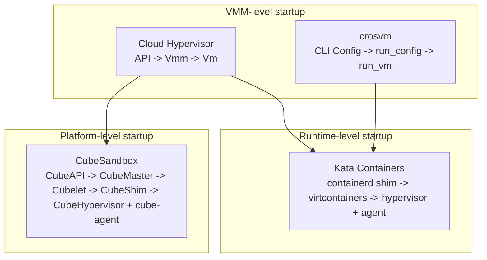
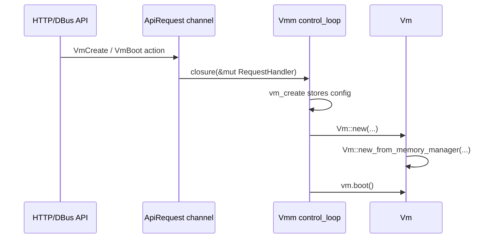
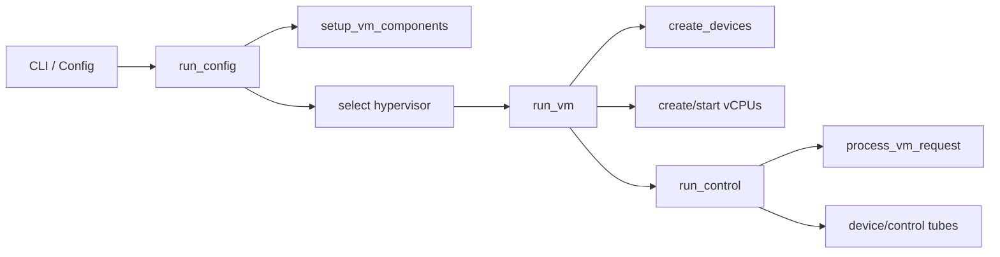
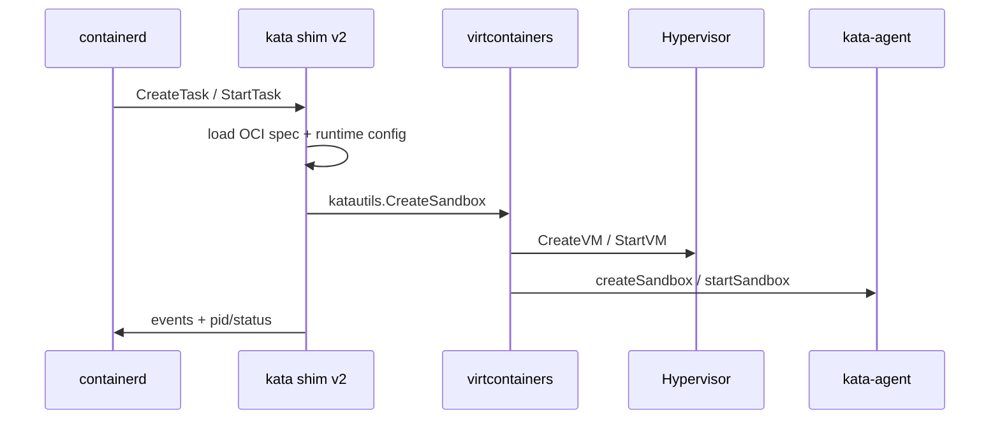
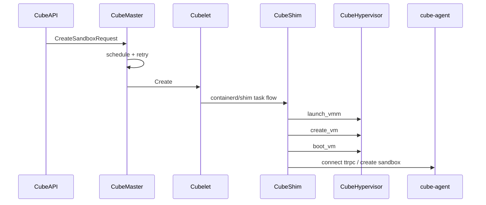

# 启动路径与控制面跨项目专题分析

本文沿着四个项目的深入路线，横向比较“一个 sandbox/VM 请求如何变成可运行 guest”的真实路径。

这里的启动不是同一层概念。Cloud Hypervisor 和 crosvm 是 VMM 启动；Kata Containers 是 containerd 请求映射到 VM sandbox；CubeSandbox 是平台 API 经过调度、节点工作流、shim 后再落到 VM。

源码基线：当前仓库工作树。

相关项目路线：

- [Cloud Hypervisor 深入路线](../cloud-hypervisor/analysis/deep-routes.md)
- [crosvm 深入路线](../crosvm/analysis/deep-routes.md)
- [Kata Containers 深入路线](../kata-containers/analysis/deep-routes.md)
- [CubeSandbox 深入路线](../CubeSandbox-sandbox-clone/analysis/deep-routes.md)

## 1. 总体分层

| 层级 | 对外入口 | VM 所有者 | 控制消息入口 | guest 内协作方 |
|---|---|---|---|---|
| Cloud Hypervisor | HTTP/DBus/API action | VMM 进程内 `Vmm/Vm` | `ApiRequest` closure 调 `RequestHandler` | 无固定 guest agent |
| crosvm | CLI `Config` / control socket | crosvm 主进程 + device worker | `Tube`/control loop | 无固定 guest agent |
| Kata Containers | containerd shim v2 | shim service 持有 `VCSandbox` | TaskService RPC / runtime manager | kata-agent |
| CubeSandbox | CubeAPI HTTP | 平台记录 + 节点 shim | CubeMaster/Cubelet gRPC + shim ttrpc | cube-agent |

结论：Cloud Hypervisor/crosvm 的启动边界是“启动一个 VM”；Kata 的边界是“启动一个 VM-backed container sandbox”；CubeSandbox 的边界是“启动一个可被平台克隆、回滚、联网、计量的 Agent sandbox”。

## 2. Cloud Hypervisor：API 请求到 `Vm::boot`

启动入口从 `start_vmm_thread()` 开始。它创建名为 `vmm` 的线程，构造 `Vmm::new(...)`，设置 signal handler，然后进入 `vmm.control_loop(...)`：[cloud-hypervisor/vmm/src/lib.rs](../cloud-hypervisor/vmm/src/lib.rs#L515)。

HTTP/DBus API 不直接操作 `Vm`，而是发送 `ApiRequest`。`ApiRequest` 是封装了 `FnOnce(&mut dyn RequestHandler)` 的 closure：[cloud-hypervisor/vmm/src/api/mod.rs](../cloud-hypervisor/vmm/src/api/mod.rs#L519)。

`VmBoot` 的 action 在 closure 中调用 `vmm.vm_boot()`，再把结果通过 response sender 返回：[cloud-hypervisor/vmm/src/api/mod.rs](../cloud-hypervisor/vmm/src/api/mod.rs#L902)。

`Vmm::vm_create()` 只保存 `VmConfig`，并预创建 console 设备；如果启用 Landlock，会在 config 上应用限制：[cloud-hypervisor/vmm/src/lib.rs](../cloud-hypervisor/vmm/src/lib.rs#L1782)。

`Vmm::vm_boot()` 在没有 `Vm` 对象时才调用 `Vm::new(...)`，然后调用 `vm.boot()`：[cloud-hypervisor/vmm/src/lib.rs](../cloud-hypervisor/vmm/src/lib.rs#L1805)。

`Vm::new_from_memory_manager()` 是 VM 聚合对象主构造路径。它校验 `VmConfig`，创建 NUMA 信息、IO/MMIO bus、`VmOpsHandler`，再创建 `CpuManager` 与 `DeviceManager`：[cloud-hypervisor/vmm/src/vm.rs](../cloud-hypervisor/vmm/src/vm.rs#L533)。

机制判断：

1. `vm_create` 不是完整 VM 构造，只是把配置放入 VMM 状态，并准备部分 console 资源。
2. 真正的 VM 对象构造发生在 `vm_boot` 的 `Vm::new(...)` 路径。
3. `Vm` 不是 KVM VM fd 的薄包装，而是 CPU、memory、device、hypervisor VM、状态机的聚合。
4. API 控制面通过单 VMM control loop 串行修改 VM 状态，避免多 API 线程直接并发操作 `Vm`。

ARM64/x86_64 差异：

- VMM/API 层基本相同。
- 架构差异主要下沉到 `CpuManager`、interrupt controller、device enumeration、FDT/ACPI、payload setup。
- `DeviceManager` 字段显示 x86_64 使用 IOAPIC，aarch64 使用 GIC：[cloud-hypervisor/vmm/src/device_manager.rs](../cloud-hypervisor/vmm/src/device_manager.rs#L964)。

## 3. crosvm：`run_config` 到 control loop

crosvm 的主启动路径是 Linux `run_config(cfg)`。它先调用 `setup_vm_components(&cfg)`，再根据 hypervisor kind 选择 KVM、Geniezone、Halla、Gunyah 等路径：[crosvm/src/crosvm/sys/linux.rs](../crosvm/src/crosvm/sys/linux.rs#L2103)。

`run_vm(...)` 接收 `Config`、`VmComponents`、arch memory layout、`VmArch`、irq chip 等对象，继续构造设备、vCPU、事件管线，并最终进入 `run_control(...)`：[crosvm/src/crosvm/sys/linux.rs](../crosvm/src/crosvm/sys/linux.rs#L2136)。

运行后的控制中心是 `run_control(...)`。它接收 `RunnableLinuxVm`、allocator、control server socket、control tubes、VM event tube、signal fd、vCPU id、IOMMU/hotplug 管线、worker process pid 集合等：[crosvm/src/crosvm/sys/linux.rs](../crosvm/src/crosvm/sys/linux.rs#L3709)。

`process_vm_request(...)` 是运行时 VM 请求处理入口。它接收 `ControlLoopState`、tube、`VmRequest`，并可向控制 loop 添加新的 device/control tube：[crosvm/src/crosvm/sys/linux.rs](../crosvm/src/crosvm/sys/linux.rs#L3239)。

设备创建路径与启动路径强耦合。`create_devices()` 接收 `Config`、arch、allocator、control tube 添加函数、VM event tube、IOMMU endpoint map、VFIO manager 等，返回 `(BusDeviceObj, Option<Minijail>)`：[crosvm/src/crosvm/sys/linux.rs](../crosvm/src/crosvm/sys/linux.rs#L905)。

机制判断：

1. crosvm 的启动是“一次性构造 Config 驱动的 VM”，控制面不是 HTTP API 中心化模型。
2. 运行中控制依靠 `Tube`、control socket、event loop、device worker 协议。
3. 设备是否进子进程由 `(BusDeviceObj, Option<Minijail>)` 体现，启动阶段必须同时建立设备隔离和控制通道。
4. snapshot/suspend/hotplug 等运行时动作都要穿过 control loop，而不是绕过主循环直接改设备。

ARM64/x86_64 差异：

- `run_config` 阶段已经按 hypervisor kind 分流；ARM64 可能进入 Geniezone/Halla/Gunyah 等 feature-gated 后端。
- x86_64 控制 loop 带有 PCI hotplug、IOAPIC/IOMMU 等 x86 特有管线。
- aarch64 路径强调 FDT、GIC、MMIO 设备与 vCPU domain 路径，`run_control` 参数里也有 `#[cfg(target_arch = "aarch64")] vcpu_domain_paths`。

## 4. Kata Containers：containerd 请求到 VM sandbox

Kata 的入口是 containerd shim v2，而不是 VMM API。`New()` 创建 shim service，保存 sandbox id、namespace、container map、event channel、exit channel，并启动 exit/event forwarder：[kata-containers/src/runtime/pkg/containerd-shim-v2/service.go](../kata-containers/src/runtime/pkg/containerd-shim-v2/service.go#L74)。

shim 的 `create(...)` 根据 OCI spec 判断 `PodSandbox`、`SingleContainer` 或 `PodContainer`。对于 sandbox 级请求，它加载 runtime config、处理 rootfs、cold plug devices，然后调用 `katautils.CreateSandbox(...)`：[kata-containers/src/runtime/pkg/containerd-shim-v2/create.go](../kata-containers/src/runtime/pkg/containerd-shim-v2/create.go#L76)。

virtcontainers 的 `Sandbox` 聚合 hypervisor、agent、store、filesystem sharer、network、container map 和状态：[kata-containers/src/runtime/virtcontainers/sandbox.go](../kata-containers/src/runtime/virtcontainers/sandbox.go#L225)。

`Hypervisor` 接口定义了 `CreateVM`、`StartVM`、`StopVM`、`PauseVM`、`SaveVM`、`ResumeVM`、`AddDevice`、hotplug、resize、console、state save/load 等能力：[kata-containers/src/runtime/virtcontainers/hypervisor.go](../kata-containers/src/runtime/virtcontainers/hypervisor.go#L1297)。

`agent` 接口定义了 `createSandbox`、`startSandbox`、`createContainer`、`startContainer`、network route/interface 更新、CPU/mem online、copy file、metrics、policy 等 guest 内操作：[kata-containers/src/runtime/virtcontainers/agent.go](../kata-containers/src/runtime/virtcontainers/agent.go#L41)。

Kata agent 的请求分发把 `grpcCreateSandboxRequest` 映射到 `AgentServiceClient.CreateSandbox(...)`，把 `grpcStartContainerRequest` 映射到 `StartContainer(...)`：[kata-containers/src/runtime/virtcontainers/kata_agent.go](../kata-containers/src/runtime/virtcontainers/kata_agent.go#L2300)。

机制判断：

1. Kata 的 create/start 是 container 生命周期，不等价于 VMM create/boot。
2. VM 启动由 hypervisor plugin 执行，但 sandbox 可用还依赖 guest 内 kata-agent 完成 sandbox/container 配置。
3. shim service 持有 sandbox 引用和 hypervisor pid，因此 containerd 看到的是 task/shim 语义，底层是 VM 语义。
4. Kata 的能力边界由三者交集决定：shim/runtime 状态机、hypervisor plugin 能力、guest agent 能力。

ARM64/x86_64 差异：

- shim 和 virtcontainers 抽象层尽量架构无关。
- 真正差异由 hypervisor plugin、guest kernel/image、agent 内设备发现路径决定。
- 代码里测试会在 ARM64 非虚拟化 CI 环境跳过真实虚拟化测试，说明 ARM64 能力验证更依赖真实硬件或支持嵌套虚拟化的 runner：[kata-containers/src/runtime/virtcontainers/sandbox_test.go](../kata-containers/src/runtime/virtcontainers/sandbox_test.go#L47)。

## 5. CubeSandbox：平台 create 到 CubeHypervisor boot

CubeSandbox 的启动链最长。外部 create 先进入 CubeAPI `SandboxService::create_sandbox()`，它构造 `CreateSandboxRequest`，设置 template/snapshot annotation、metadata、network type `tap`、CubeVS context，然后调用 CubeMaster：[CubeSandbox-sandbox-clone/CubeAPI/src/services/sandboxes.rs](../CubeSandbox-sandbox-clone/CubeAPI/src/services/sandboxes.rs#L116)。

CubeMaster 的 create handler 循环执行 schedule、调用 Cubelet、处理 retry，成功后写回 sandbox id、host ip、host id，并并行写 Redis proxy 和 sandbox spec：[CubeSandbox-sandbox-clone/CubeMaster/pkg/service/sandbox/sandbox_run.go](../CubeSandbox-sandbox-clone/CubeMaster/pkg/service/sandbox/sandbox_run.go#L179)。

Cubelet 的 sandbox controller clone 中 `Create/Start` 仍是占位实现，但 `Status/Wait` 会通过 shim manager 找到 shim，并经 ttrpc 调 TaskService：[CubeSandbox-sandbox-clone/Cubelet/plugins/cube/internals/sandbox/cube_sandbox_manager.go](../CubeSandbox-sandbox-clone/Cubelet/plugins/cube/internals/sandbox/cube_sandbox_manager.go#L118)。

真正 VM 相关代码集中在 CubeShim。`SandBox::new()` 创建 `CubeHypervisor`，并为 sandbox 设置 Cloud Hypervisor HTTP API 路径：[CubeSandbox-sandbox-clone/CubeShim/shim/src/sandbox/sb.rs](../CubeSandbox-sandbox-clone/CubeShim/shim/src/sandbox/sb.rs#L81)。

`CubeHypervisor::launch_vmm()` 创建 `cube_hypervisor::VmmInstance`，设置 event notifier，并按架构放宽运行时 seccomp 规则：x86_64 允许 `mkdir`，aarch64 允许 `mkdirat`：[CubeSandbox-sandbox-clone/CubeShim/shim/src/hypervisor/cube_hypervisor.rs](../CubeSandbox-sandbox-clone/CubeShim/shim/src/hypervisor/cube_hypervisor.rs#L75)。

`CubeHypervisor::create_vm()` 把 CubeShim config 转成 Cloud Hypervisor `VmConfig`，然后发送 `ApiRequest::VmCreate`：[CubeSandbox-sandbox-clone/CubeShim/shim/src/hypervisor/cube_hypervisor.rs](../CubeSandbox-sandbox-clone/CubeShim/shim/src/hypervisor/cube_hypervisor.rs#L113)。

`CubeHypervisor::boot_vm()` 发送 `ApiRequest::VmBoot`，并把自身状态置为 `Running`：[CubeSandbox-sandbox-clone/CubeShim/shim/src/hypervisor/cube_hypervisor.rs](../CubeSandbox-sandbox-clone/CubeShim/shim/src/hypervisor/cube_hypervisor.rs#L126)。

guest 内 cube-agent 的 `start_sandbox()` 创建 `Sandbox`，初始化 localhost、uevent watcher、signal handler，然后启动 ttrpc server，并通知 vsock server ready：[CubeSandbox-sandbox-clone/agent/src/main.rs](../CubeSandbox-sandbox-clone/agent/src/main.rs#L347)。

机制判断：

1. CubeSandbox 的平台 create 不只是 VM boot，还包括模板、网络策略、调度、CubeCoW 存储、shim、guest agent ready。
2. CubeShim 对 Cloud Hypervisor API 做了一层产品化封装，`launch_vmm/create_vm/boot_vm` 与 Cloud Hypervisor 的 VMM API 基本一一对应。
3. 当前 clone 的 Cubelet sandbox controller `Create/Start` 是占位，不能把它当作完整节点执行面；需要结合 Cubebox service/workflow 和 CubeShim 代码理解真实路径。
4. CubeSandbox 的 ready 边界至少包含 VMM ready、VM boot、agent ttrpc ready、网络/存储 ready。

ARM64/x86_64 差异：

- CubeShim 明确存在 x86_64/aarch64 seccomp 差异。
- 由于 CubeHypervisor 基于 Cloud Hypervisor fork，底层 ARM64 差异会继承 CH 的 GIC/FDT/MMIO/payload 路径。
- 平台层 API/Master 调度基本架构无关，但镜像、kernel、agent、CubeCoW、network-agent/eBPF 能力需要在 ARM64 节点实测确认。

## 6. 启动边界对照表

| 问题 | Cloud Hypervisor | crosvm | Kata Containers | CubeSandbox |
|---|---|---|---|---|
| create 是否等于 boot | 否，`vm_create` 存配置，`vm_boot` 构造/启动 VM | 基本由 `run_config` 一次性驱动 | 否，container create/start 还要映射到 agent 操作 | 否，平台 create 包含调度、存储、网络、VM、agent |
| 控制面中心 | VMM `control_loop` | `run_control` event loop | shim service/runtime manager | CubeAPI/CubeMaster/Cubelet/CubeShim |
| VM 对象聚合 | `Vm` 聚合 CPU/memory/device | `RunnableLinuxVm` + arch/device/control tubes | `Sandbox` 聚合 hypervisor/agent/network/store | `SandBox` 聚合 CubeHypervisor/agent/container map |
| 设备何时进入路径 | `Vm::new_from_memory_manager`/DeviceManager | `create_devices` | cold plug + hypervisor `AddDevice` + agent | Cubelet storage/network + CubeShim hotplug |
| ready 判据 | `vm.boot()` 成功 | `run_control` 正常运行 | VM 启动 + agent sandbox/container ready | VM boot + cube-agent ready + 平台状态写回 |
| 运行时控制 | API action | control socket/Tube | TaskService + agent RPC | API/Master/Cubelet/shim + agent RPC |

## 7. 关键理解

第一，Cloud Hypervisor 是最清晰的“API 驱动 VMM 状态机”样本。它把 API action 转成 closure，在 VMM control loop 内部执行，VM 对象由各 manager 组合而成。

第二，crosvm 是“配置启动 + 事件控制 loop”样本。它不强调长期 HTTP API，而强调启动时把设备、jail、tube、vCPU、arch backend 都接好，运行后由 control loop 接管。

第三，Kata 把 VM 启动藏在 containerd shim 语义之下。判断 Kata 能力边界时，不能只问某个 VMM 支不支持，还要问 hypervisor plugin 和 kata-agent 是否暴露对应 runtime 能力。

第四，CubeSandbox 是平台化封装最重的一层。它的 create 完成时间包括调度、存储、网络、VM、guest agent、平台 metadata 多个系统的状态收敛。

第五，在 ARM64 对比中，越靠近平台/API 层差异越小，越靠近 VMM/设备/中断/payload/内核镜像差异越大。真正需要实测的是：中断控制器、FDT/ACPI、virtio-mmio/PCI、vhost/vfio、agent 启动、eBPF/network-agent、snapshot restore。

## 8. 后续深挖路线

1. 对 Cloud Hypervisor 补 `Vm::boot -> CpuManager::activate_vcpus -> DeviceManager activate` 的函数级调用链。
2. 对 crosvm 补 `run_vm -> create_devices -> vCPU run -> run_control` 的完整时序图。
3. 对 Kata 补 `CreateTask -> katautils.CreateSandbox -> createSandbox/startVM -> agent.createSandbox` 的源码链路。
4. 对 CubeSandbox 补 `Cubelet workflow -> containerd shim -> CubeShim create_sandbox -> CubeHypervisor boot -> cube-agent ready` 的缺失边。
5. 单独建立 ARM64 启动差异矩阵，重点覆盖 FDT、GIC、virtio-mmio/PCI、kernel command line、guest agent ready。
