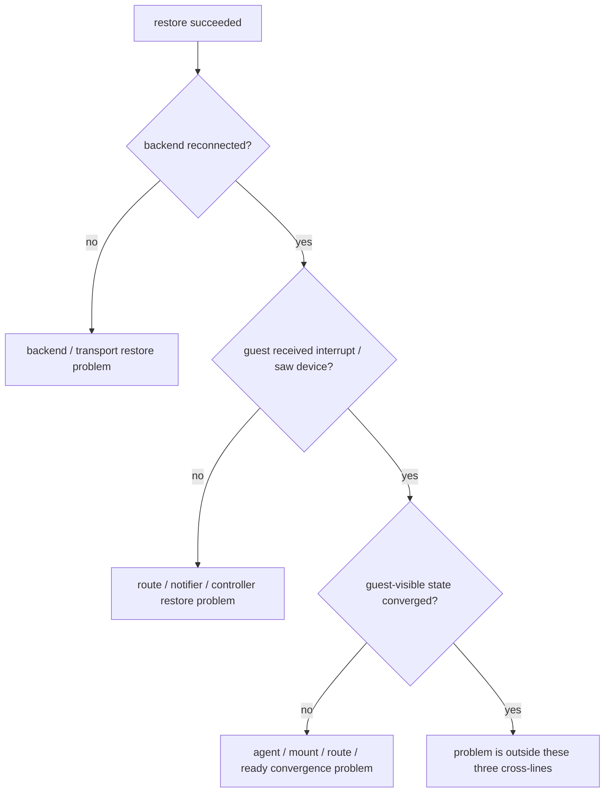

# Cloud Hypervisor 与 CubeSandbox：Restore 后 Guest 不可用验证清单

本文承接：

- [Cloud Hypervisor 与 CubeSandbox：Backend / Notifier / Restore 交叉线](./ch-cubesandbox-backend-notifier-restore-crossline.md)
- [Virtio 传输与设备数据路径跨项目专题分析](./virtio-data-path-cross-project.md)
- [中断与事件通知跨项目专题分析](./interrupt-event-notification-cross-project.md)
- [存储、rootfs 与共享文件系统跨项目专题分析](./storage-rootfs-sharefs-cross-project.md)

目标不是再解释架构，而是给出一份可以直接照着排查的清单：

当 `restore 成功`，但 `guest 设备/网络/rootfs/共享目录不可用` 时，Cloud Hypervisor 与 CubeSandbox 各该先查什么，后查什么。

源码基线：当前工作树。

## 1. 使用方式

先确认故障是不是同一类问题：

1. VMM restore 调用本身失败
2. VMM restore 调用成功，但 backend 没重连
3. backend 已重连，但 guest 没收到中断或没看到设备
4. guest 已看到设备，但 guest-visible state 没收敛完成

如果连第 1 类都没过，这份清单不适用。

这份清单只用于第 2-4 类：restore 成功，但 guest 不可用。

## 2. 总体判断树

对 Cloud Hypervisor，更常先落在 `C` 或 `E`。

对 CubeSandbox，更常落在 `E` 或 `G`，尤其是 `G`。

对 ARM64 来说，这棵树还要再补一层隐藏前提：

即便 backend、queue、notifier 看起来都正常，如果 GIC / ITS restore 顺序没有真正闭环，症状仍然会落成 “guest 看不到设备” 或 “guest 无中断”。

因此对 CH / CubeSandbox 的 ARM64 restore，不能只看外部 backend 与 guest 结果，中间还必须单独确认 interrupt-controller restore 这条线。

## 3. Cloud Hypervisor 清单

### 3.1 先确认 transport / backend 真的重建了

检查点：

1. `VirtioPciDevice::snapshot()` 是否覆盖了 transport state、PCI config、common config、MSI-X state
2. vhost-user / vDPA restore 是否重新建立 `call/kick/config` eventfd
3. 对应 backend socket / fd / protocol features 是否可重新使用

关键证据：

- [cloud-hypervisor/virtio-devices/src/transport/pci_device.rs](/home/lyq/Projects/Micro-VM/cloud-hypervisor/virtio-devices/src/transport/pci_device.rs:1305)
- [cloud-hypervisor/virtio-devices/src/vhost_user/vu_common_ctrl.rs](/home/lyq/Projects/Micro-VM/cloud-hypervisor/virtio-devices/src/vhost_user/vu_common_ctrl.rs:153)
- [cloud-hypervisor/virtio-devices/src/vdpa.rs](/home/lyq/Projects/Micro-VM/cloud-hypervisor/virtio-devices/src/vdpa.rs:282)

判定：

- 如果 `call/kick` 没有重新接上，先归为 backend/transport restore 问题
- 如果 `call/kick` 已重建，再继续看中断路由

### 3.2 再确认 route / controller restore 是否完整

检查点：

1. `InterruptSourceGroup` route 是否恢复
2. MSI-X vector / mask / PBA 是否一致
3. aarch64 GIC 或 x86_64 IOAPIC 是否已恢复各自 state

关键证据：

- [cloud-hypervisor/vmm/src/interrupt.rs](/home/lyq/Projects/Micro-VM/cloud-hypervisor/vmm/src/interrupt.rs:159)
- [cloud-hypervisor/devices/src/gic.rs](/home/lyq/Projects/Micro-VM/cloud-hypervisor/devices/src/gic.rs:158)
- [cloud-hypervisor/devices/src/ioapic.rs](/home/lyq/Projects/Micro-VM/cloud-hypervisor/devices/src/ioapic.rs:445)
- [cloud-hypervisor/vmm/src/device_manager.rs](/home/lyq/Projects/Micro-VM/cloud-hypervisor/vmm/src/device_manager.rs:1728)

判定：

- backend 正常但 guest 无中断，优先怀疑这里
- 不要先跳去 guest agent，因为 CH 没有固定 guest agent 收敛层

ARM64 下这里要再收紧成一个更具体的顺序：

1. `Gic::restore_vgic()` 本身先 `set_gicr_typers(saved_vcpu_states)`，再写回 vGIC state；
2. `DeviceManager::add_interrupt_controller()` 在 restore 场景下会先拿 `saved_vcpu_states`，再调用 `restore_vgic(...)`；
3. 因此如果 `saved_vcpu_states`、PMU 初始化、vGIC state 任何一步不完整，就可能出现“backend 正常但 guest 无中断”的假象。

也就是说，Cloud Hypervisor ARM64 下这一步不只是“GIC state restored?”，而是：

`saved_vcpu_states -> set_gicr_typers -> restore_vgic`

这条顺序是否真的成立。

### 3.3 最后才看 guest 侧设备可见性

检查点：

1. guest 是否真的重新看到 disk/fs/net/pmem
2. 如果是 `FsConfig.socket` 路径，backend 是否不只在线，而且真的把请求回送到 guest
3. 如果是 disk/pmem，guest 内 mount 或网络配置是否确实完成

判定：

- 到这一步还异常，才把问题从 VMM restore 层转移到 guest 配置层

## 4. CubeSandbox 清单

### 4.1 先确认平台控制面请求有没有真正传到 VMM

检查点：

1. `ApiRequest::VmRestore` / `VmResumeFromSnapshot` 是否成功返回
2. `VmSetFs` / `VmAddDevice` 是否真的进入 VMM control loop
3. `NotifyEvent` / ready 等待逻辑有没有误把旧状态当新状态

关键证据：

- [CubeSandbox-sandbox-clone/CubeShim/shim/src/hypervisor/cube_hypervisor.rs](/home/lyq/Projects/Micro-VM/CubeSandbox-sandbox-clone/CubeShim/shim/src/hypervisor/cube_hypervisor.rs:173)
- [CubeSandbox-sandbox-clone/CubeShim/shim/src/hypervisor/cube_hypervisor.rs](/home/lyq/Projects/Micro-VM/CubeSandbox-sandbox-clone/CubeShim/shim/src/hypervisor/cube_hypervisor.rs:185)
- [CubeSandbox-sandbox-clone/analysis/interrupt-event-notification-chain.md](/home/lyq/Projects/Micro-VM/CubeSandbox-sandbox-clone/analysis/interrupt-event-notification-chain.md:3)

判定：

- 如果请求根本没到 VMM，不要误判成 virtio/irqfd 问题

### 4.2 再确认当前节点后端资源有没有重绑成功

检查点：

1. net restore 是否重新拿到了当前节点的 TAP / tap fd
2. native virtio-fs restore 是否重新建立 server 并应用 `back_state`
3. fs update 是否真的把 `FsEvent` 推入 pending message 并唤醒 worker

关键证据：

- [CubeSandbox-sandbox-clone/hypervisor/virtio-devices/src/net.rs](/home/lyq/Projects/Micro-VM/CubeSandbox-sandbox-clone/hypervisor/virtio-devices/src/net.rs:694)
- [CubeSandbox-sandbox-clone/hypervisor/virtio-devices/src/fs.rs](/home/lyq/Projects/Micro-VM/CubeSandbox-sandbox-clone/hypervisor/virtio-devices/src/fs.rs:916)
- [CubeSandbox-sandbox-clone/hypervisor/vmm/src/device_manager.rs](/home/lyq/Projects/Micro-VM/CubeSandbox-sandbox-clone/hypervisor/vmm/src/device_manager.rs:1173)

判定：

- 如果后端资源没重绑成功，guest 不可见只是结果，不是根因

ARM64 下这里还要再补一条：

如果是 native virtio-fs restore，`back_state` 的反序列化属于 worker/backend 推进证据，而不只是“有个 fs 设备”。`deserialize_and_apply_data(...)` 失败时，症状很容易表面上像普通 mount 或 ready 故障。

### 4.3 再看 irqfd/notifier 正常后，guest-visible state 是否收敛

检查点：

1. guest agent 是否真的看到设备
2. block/pmem/pci 设备的 uevent 等待是否通过
3. 共享目录或 rootfs 是否真的 mount 成功
4. ready / notify 是否等到了真正可用状态

关键证据：

- [CubeSandbox-sandbox-clone/agent/src/device.rs](/home/lyq/Projects/Micro-VM/CubeSandbox-sandbox-clone/agent/src/device.rs:267)
- [CubeSandbox-sandbox-clone/agent/src/sandbox.rs](/home/lyq/Projects/Micro-VM/CubeSandbox-sandbox-clone/agent/src/sandbox.rs:37)
- [CubeSandbox-sandbox-clone/analysis/virtio-net-fs-restore-chain.md](/home/lyq/Projects/Micro-VM/CubeSandbox-sandbox-clone/analysis/virtio-net-fs-restore-chain.md:1)

判定：

- 对 CubeSandbox，很多“restore 成功但 guest 不可用”最后都应落到这一层
- 不要在还没确认 guest-visible state 收敛前，就提前下结论说是 irqfd/MSI-X 故障

但是在 ARM64 下，还要在这一层之前再补一次 controller restore 审核：

1. `restore_vgic_and_enable_interrupt()` 会先 `create_vgic(...)`
2. 再 `init_pmu(...)`
3. 再 `set_gicr_typers(&saved_vcpu_states)`
4. 最后要求存在 `GicV3Its snapshot`，并 `restore(...)`

如果缺少 `GicV3Its snapshot`，代码会直接返回错误。也就是说，对 CubeSandbox ARM64 restore，`GICv3 ITS snapshot` 不是优化项，而是硬前提。

因此当你看到：

- `VmRestore` 成功
- `VmSetFs` / `VmAddDevice` 也有推进
- 但 guest 仍旧完全不可见

不要只在 worker/agent 层打转，还要反查这条：

`create_vgic -> init_pmu -> set_gicr_typers -> restore GICv3 ITS snapshot`

## 5. 快速对照表

| 症状 | Cloud Hypervisor 优先怀疑 | CubeSandbox 优先怀疑 |
|---|---|---|
| backend 在线但 guest 没中断 | MSI-X / route / GIC/IOAPIC restore | notifier 正常但平台闭环未完成 |
| restore 成功但 guest 看不到 fs | backend socket / transport / device tree | `VmSetFs` -> worker -> agent mount 断层 |
| restore 成功但 net 不通 | vhost-user/vDPA call/kick / route | TAP/tap fd 重绑、worker 唤醒、agent/ready 收敛 |
| 设备已恢复但 guest rootfs 不可用 | guest mount 未完成 | 平台对象恢复成功但 guest-visible state 未收敛 |

对 ARM64，这张表再额外加一个共同问题域：

| 症状 | Cloud Hypervisor 优先怀疑 | CubeSandbox 优先怀疑 |
|---|---|---|
| backend 与 worker 看起来都正常，但 guest 仍无中断/设备不可见 | `saved_vcpu_states -> set_gicr_typers -> restore_vgic` 顺序未闭合 | `create_vgic -> init_pmu -> set_gicr_typers -> restore GICv3 ITS snapshot` 未闭合 |

## 6. 如何配合样本体系

如果后续要把这条清单变成样本，最自然的方向是各拆一份：

1. `Cloud Hypervisor backend/notifier/restore checklist seed`
2. `CubeSandbox guest-visible state after restore/update checklist seed`

它们不需要一开始就是真实案例。

先做成 `seed` 就足够承接后续 Claude Code CLI 的只读核验和真实日志回填。

## 7. ARM64 联合判错顺序

如果只针对 `Cloud Hypervisor + CubeSandbox` 的 ARM64 restore 做最小排查，推荐直接按下面顺序：

1. 控制面 restore 请求是否成功
2. backend / socket / tap / fd / `back_state` 是否真的重建
3. queue notify / kick / call / notifier 是否仍绑定同一 transport 语义
4. GIC / ITS restore 顺序是否闭环
5. guest 是否真正看到设备
6. guest-visible state 是否最终收敛

换句话说，三条横线在 ARM64 下可以收成一条判错链：

`storage/backend object`
-> `ioeventfd / kick / call / worker`
-> `GIC / ITS / interrupt restore`
-> `guest-visible mount / net / ready`

这条链上任何一段断掉，表面上都可能只是“restore 成功但 guest 不可用”。
