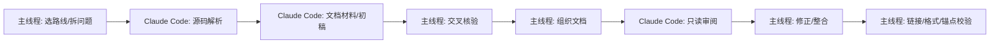

# Claude Code 协同研究工作流

本文定义后续深入研究的协作方式。主线程负责路线规划、任务拆解、交叉核验、文档组织和最终校验；Claude Code 主要负责源码阅读、文档材料、文档初稿和只读审阅。

## 1. 分工原则

主线程不再把所有源码细读都串行完成。每次选择一条深入路线后，先产出问题清单、证据需求、源码范围和预期文档结构。

Claude Code 承担三类任务。第一类是源码解析，回答限定范围内的调用链、状态机、架构差异和能力边界。第二类是文档材料或初稿，按主线程给出的结构整理证据。第三类是只读审阅，检查文档是否准确反映源码。

主线程只接收可验证结论。Claude Code 输出必须包含文件、行号、符号名和明确判断；没有源码锚点的结论只作为假设，不直接写入最终文档。

当前路线约束：Kata Containers 的 CoCo、confidential guest、TDX、SEV、SNP、CCA 等机密计算路径暂不安排深入分析。

## 2. 每轮执行步骤



每轮先从 [Micro-VM 项目深入路线总览](./four-project-deep-routes.md) 中选择一个明确主题。主题应能补强项目内部理解，或补齐跨项目比较中的证据缺口。

源码解析任务必须限定项目、目录、文件或符号。避免让 Claude Code 泛泛阅读整个仓库。

当前环境下，Claude Code CLI 适合做“极窄 prompt”的点状源码佐证，不适合直接承担长篇跨文件分析主任务。实践上，像 `reply with exactly OK` 这类极小 prompt 能稳定返回；而“请综合多文件给出完整分析”这类请求更容易长时间无输出或在超时窗口内不返回可用文本。

因此后续默认把 Claude Code 用作：

1. 单一项目
2. 单一主题
3. 1-4 条结论
4. 强制带文件路径 / 符号名

主线程仍负责主分析、交叉核验和正式文档收口。

文档材料任务可以要求 Claude Code 给出章节草稿、证据表和 Mermaid 草图。文档审阅任务必须要求 Claude Code 只读检查，不直接修改文件。

最终是否修改文件由主线程依据证据决定。主线程负责把材料整理成仓库内正式文档。

## 3. Claude Code 解析任务模板

```text
请在 <project-path> 中只读分析 <topic>。
范围限定：<directories/files/symbols>。
请输出：
1. 入口函数和关键结构；
2. 调用链或状态机；
3. ARM64 与 x86_64 差异；
4. 当前能力边界和明确不支持项；
5. 最关键源码行号。
不要修改文件。用中文回答。
```

这个模板用于源码解析。输出应直接服务于后续专题文档，而不是生成宽泛介绍。

如果 Claude Code CLI 在当前环境执行，建议把模板再收窄一层：

```text
只输出 3-4 条结论。
每条必须包含：
1. 文件路径
2. 函数/类型名
3. 这段代码证明了什么
不能确认的写 cannot confirm from code。
```

这比一次性索取长篇总结更稳定，也更适合作为主线程交叉核验的输入。

## 4. Claude Code 审阅任务模板

```text
请在 <project-path> 中审阅分析文档 <doc-path> 是否准确反映源码。
重点检查：<claims-list>。
不要修改文件。
输出发现的问题、源码证据和具体修正建议。
```

这个模板用于新文档落地后的交叉检查。审阅结论按严重程度处理：源码矛盾必须修正，措辞不严谨应收紧，缺少证据则补行号或删除结论。

## 5. Claude Code 文档材料模板

```text
请在 <project-path> 中基于只读源码分析，为 <topic> 生成文档材料。
范围限定：<directories/files/symbols>。
请按以下结构输出：
1. 结论摘要；
2. Mermaid 图草案；
3. 关键源码证据表；
4. ARM64 与 x86_64 差异；
5. 能力边界和未确认点。
不要修改文件。用中文回答。
```

这个模板用于让 Claude Code 产出文档材料或初稿。主线程必须复核证据后再写入正式文档。

## 6. 证据门槛

专题文档至少应包含四类证据：入口路径、关键数据结构、关键状态转换或调用顺序、能力边界。

涉及 ARM64/x86_64 差异时，必须分别指出源码中的架构门控、不同实现或缺失路径。不能用“可能支持”替代源码证据。

涉及 protected VM、CoCo、snapshot、migration、IOMMU 或 guest agent 时，应区分三种边界：配置入口、运行期实现、生命周期限制。

Kata Containers 当前不展开 CoCo/机密计算路径。若已有材料涉及该主题，只保留为背景，不作为后续任务队列。

## 7. 主线程校验项

每次文档更新后，主线程必须检查 Markdown 围栏是否成对、相对链接是否存在、是否有未完成标记或临时文本、段落是否过长。

关键源码锚点应通过 `rg` 或定点读取抽查。CodeGraph 如果未加载项目索引，不阻塞工作，但不能声称已用 CodeGraph 验证。

如果调用 Claude Code 审阅，主线程应在最终说明中标明是否采用其建议，以及哪些建议被写入文档。

## 8. 后续任务队列

优先继续补齐 Cloud Hypervisor 的 CoCo 细节：SEV-SNP IGVM/VMSA、page access proxy、isolated page import 与设备 DMA 边界。

随后转入 crosvm protected VM 的 ARM64 pKVM/Gunyah/Halla 差异审阅，重点检查 vhost-user、VFIO、snapshot 边界是否已有足够证据。

Kata Containers 暂时改走非机密计算路线。优先推进 runtime-rs ResourceManager、share-fs/rootfs、QEMU 启动参数、agent RPC、host capability check 和设备热插拔。

最后回到 CubeSandbox 的 PVM 与平台 snapshot/rollback，检查 x86-only PVM、KvmPvm、CubeCoW memory 和 network restore 之间的边界。
