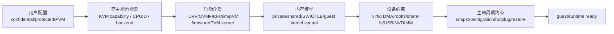

# CoCo / pVM / 受保护 VM 跨项目专题分析

本文只讨论能改变 VM 信任边界的机制：TDX、SEV-SNP、Arm CCA/RME、crosvm protected VM、CubeSandbox PVM。普通 jail、seccomp、Minijail、Landlock 属于进程隔离，不等同于 confidential guest。

核心问题不是“是否安全”，而是配置如何进入 hypervisor，guest 内存何时变成 host 不可直接访问，启动固件如何被度量或接管，设备 DMA 如何受限，以及迁移、热插拔、snapshot 会被收窄到哪里。

## 1. 概念模型

判断一个项目是否真正支持 CoCo/pVM，不能只看命令行参数。必须看到它同时改动启动、内存、设备和生命周期，否则很可能只是普通隔离或外部部署说明。

## 2. 横向结论矩阵

| 项目 | 机制入口 | 内存/启动变化 | 设备与生命周期边界 | ARM64 与 x86_64 差异 |
|---|---|---|---|---|
| Firecracker | 当前源码未形成 TDX/SEV-SNP/CCA/pVM 配置路径 | 仍以 KVM guest memory、jailer、seccomp、cgroup 为主 | 没有看到 CoCo 专属迁移、固件、private/shared memory 流程 | 两架构差异主要在 KVM/启动/设备描述，不在 confidential guest |
| Cloud Hypervisor | `tdx_enabled`、`sev_snp_enabled` 进入 hypervisor trait 与 KVM ioctl | TDX 初始化 VM、vCPU、内存区域；SEV-SNP 走 IGVM/隔离页 | TDX 禁止 live migration/snapshot，动态内存被关闭 | x86_64 路径成熟；ARM64 未见同级 CCA/RME 路径 |
| crosvm | `ProtectionType`、`--protected-vm`、pVM firmware | protected VM 使用 pVM firmware、保护内存、SWIOTLB | USB/RNG 等设备被禁用或收窄，后端需报告 `VmCap::Protected` | ARM64 protected VM 与 Gunyah/GenieZone/Halla 更突出；x86 有 pVM firmware 布局但保护路径更受限 |
| Kata Containers | `ConfidentialGuest` 与 runtime-rs `GuestProtection` | QEMU amd64 配 TDX/SEV/SNP；arm64 配 CCA/RME；CH TDX 要 firmware | split irqchip、禁 NVDIMM、禁内存/CPU热插拔，TDX 要 virtio-blk rootfs | x86_64 覆盖 TDX/SEV/SNP；arm64 只接受 CCA/RME |
| CubeSandbox | `CUBE_PVM_ENABLE=1`、PVM host kernel、`KvmPvm` | PVM host kernel 提供 KVM 能力，安装时换成 `vmlinux-pvm` | PVM 是部署能力，不是 TDX/SEV 式 guest confidential；模板与快照依赖正确 guest kernel | PVM 当前 x86_64-only；aarch64 只能走原生 `/dev/kvm` |

最重要的横向差异是层级。Cloud Hypervisor 是 VMM 原生 CoCo；crosvm 是多后端 protected VM 抽象；Kata 是 runtime 编排层；CubeSandbox 是平台部署能力；Firecracker 这份源码中没有同级 CoCo 路径。

## 3. Firecracker：强隔离但不是 CoCo 路径

Firecracker 的安全边界主要由 jailer、seccomp、cgroup、namespace、KVM 和精简设备模型组成。源码检索没有发现 TDX、SEV-SNP、CCA、protected VM 或 pVM 的配置入口和启动链路。

有少量 x86 MSR 常量包含 SEV/SNP 名称，例如 `firecracker/src/vmm/src/arch/x86_64/generated/msr_index.rs`。这些是架构常量，不构成 Firecracker 创建 confidential guest 的控制面。

这意味着 Firecracker 的“能力边界”要分清两层：它能提供强进程隔离和小攻击面，但这份源码没有把 guest memory 变成 TDX/SEV-SNP/CCA 那类 host 不可读内存的流程。

## 4. Cloud Hypervisor：VMM 原生 TDX/SEV-SNP

Cloud Hypervisor 把 CoCo 放进 VM 配置和 hypervisor trait。`vmm/src/lib.rs:220-227` 将 `tdx_enabled` 和 `sev_snp_enabled` 写入 `HypervisorVmConfig`。

`hypervisor/src/vm.rs:393-421` 定义 `sev_snp_init`、`tdx_init`、`tdx_finalize`、`tdx_init_memory_region`。这说明 CoCo 不是上层字符串参数，而是 VM 抽象的一部分。

KVM 后端实现了 TDX ioctl 路径。`hypervisor/src/kvm/mod.rs:986-1027` 组装 TDX VM 初始化结构，`1032-1040` finalize，`1043-1070` 初始化 TDX memory region。

TDX 还进入 vCPU 运行面。`hypervisor/src/cpu.rs:533-554` 定义 vCPU TDX 初始化和退出细节接口，`hypervisor/src/kvm/mod.rs:2008-2009` 把 `KVM_EXIT_TDX` 转成 VMM 的 `VmExit::Tdx`。

启动前还会修正 x86 CPUID。`arch/src/x86_64/mod.rs:631-636` 获取 TDX capabilities，`731-739` 在 TDX 下清掉 KVM clock、async PF、steal time 等不支持特性。

生命周期边界很直接。`vmm/src/lib.rs:1456-1460` 和 `1562-1566` 拒绝 TDX live migration；`vmm/src/vm.rs:3156-3160` 拒绝 TDX snapshot。

内存热插拔也被收窄。`vmm/src/memory_manager.rs:1598-1601` 在启用 TDX 时把 `dynamic` 设为 false，后续 ACPI hotplug 地址分配不会按动态内存路径进行。

SEV-SNP 侧还出现 IGVM。`vmm/src/igvm/mod.rs:6-25` 说明 IGVM 可封装 SEV-SNP 和 TDX 启动信息，但当前模块说明只支持 MSHV 上 legacy VM 与 SNP isolated VM。

结论：Cloud Hypervisor 的 CoCo 支持以 x86_64 为核心，并深度改变 VM 创建、vCPU、内存、CPUID、迁移与 snapshot。它不是“启用一个安全模式”，而是替换 VM 生命周期的一部分。

## 5. crosvm：protected VM 是跨后端抽象

crosvm 的关键抽象是 `ProtectionType`。`hypervisor/src/lib.rs:653-671` 明确区分 unprotected、protected、custom firmware、without firmware、unprotected-with-firmware。

命令行入口在 `src/crosvm/cmdline.rs:1670-1680`，包括 `--protected-vm`、自定义 firmware、无 firmware 模式。`3016-3049` 将互斥 flag 翻译为 `ProtectionType`。

protected VM 直接改变设备策略。`src/crosvm/cmdline.rs:3051-3054` 在非 unprotected 模式下关闭 USB，并说明 protected VM 不能信任 RNG device。

ARM64 上，protected VM 明显改变内存布局。`aarch64/src/lib.rs:480-486` 为 pVM firmware 分配专用内存，`489-494` 为 SWIOTLB 增加静态 DMA 区域。

启动路径也被接管。`aarch64/src/lib.rs:556-574` 会先加载 pVM firmware，因为它会告诉 hypervisor 当前是 pVM，从而影响能力检查和后续行为。

FDT 也服务于 protected VM。`aarch64/src/fdt.rs:678-695` 将 SWIOTLB 表达成 `restricted-dma-pool` reserved memory，供 guest 侧 DMA 路径使用。

后端能力必须闭环。GenieZone、Halla、Gunyah 路径在创建 VM 后检查 `VmCap::Protected`，源码在 `src/crosvm/sys/linux.rs:1818-1820`、`1877-1879`、`2041-2043`。

x86_64 有 pVM firmware 地址和 boot 集成。`x86_64/src/lib.rs:456-461` 定义 pVM firmware 内存，`1368-1384` 会加载或请求 hypervisor 加载 firmware。

但 x86_64 同时存在 `UnsupportedProtectionType` 错误，见 `x86_64/src/lib.rs:309-310`。因此应谨慎表述为：x86 有 pVM firmware 布局代码，但完整 protected VM 路径不像 ARM64 后端那样展开。

结论：crosvm 的 protected VM 更像 Android/ChromeOS 体系里的“受保护 VM 抽象”。它把 firmware、SWIOTLB、设备禁用和后端 capability 统一进 `ProtectionType`。

## 6. Kata Containers：runtime 选择并收窄能力

Kata 本身不是 CoCo hypervisor。它的关键职责是判断宿主能力和用户配置，把 QEMU 或 Cloud Hypervisor 配成 confidential guest，并同步调整容器 runtime 能力。

amd64 QEMU 路径里，`qemu_amd64.go:102-105` 在 IOMMU 或 ConfidentialGuest 下使用 split irqchip。`136-144` 启用 protection，并在 CoCo 下禁用 NVDIMM。

`qemu_amd64.go:221-268` 根据宿主可用能力选择 TDX、SEV 或 SNP，并写入 `confidential-guest-support=tdx/sev/snp`。如果 SNP 未显式请求，会回退为 SEV。

保护设备在 `qemu_amd64.go:271-335` 追加。TDX 使用 `TDXGuest`，SEV 使用 `SEVGuest`，SNP 使用 `SNPGuest`，并校验 SNP ID block 与 auth 的成对配置。

arm64 只接受 CCA/RME。`hypervisor_linux_arm64.go:25-39` 通过 `KVM_CHECK_EXTENSION` 查询 RME，`qemu_arm64.go:145-164` 只在 `ccaProtection` 下写入 `confidential-guest-support=rme0`。

arm64 保护设备在 `qemu_arm64.go:174-185` 追加 `CCAGuest`，并带上 measurement algorithm 与 initdata digest。`79-91` 要求 measurement algorithm 是 sha512 或 sha256。

runtime-rs 的 Cloud Hypervisor 分支更严格。`inner_hypervisor.rs:621-659` 要求用户请求和可用保护能力一致；当前 CH 保护只接受 TDX，并且 TDX 可用时必须使用。

TDX 会改变 runtime 能力。`inner_hypervisor.rs:841-849` 在 TDX 下不暴露 virtio-fs，只保留 block device、block hotplug 和 hybrid vsock。

配置转换也会收窄 rootfs 和热插拔。`ch-config/src/convert.rs:47-75` 要求 TDX rootfs 使用 virtio-blk 且不能用 initrd；`256-258` 禁 memory hotplug。

CPU 热插拔同样关闭。`ch-config/src/convert.rs:331-334` 在 TDX 下把 `max_vcpus` 限制为 boot vCPU 数。`428-433` 还要求 TDX 配置 firmware。

结论：Kata 的 CoCo 价值在“把 VM confidential 能力落到容器语义”。它必须让 rootfs、agent、设备、热插拔、share-fs 都符合保护 VM 的约束。

## 7. CubeSandbox：PVM 是部署和平台能力

CubeSandbox 的 PVM 与 TDX/SEV-SNP 不同。它不是要让 L0 host 无法读取 guest memory，而是让普通云服务器在没有原生 `/dev/kvm` 时，通过 PVM host kernel 获得可用 KVM 能力。

部署文档明确限制架构。`docs/guide/pvm-deploy.md:5-6` 写明 PVM 仅可用于 x86_64，当前没有移植到 aarch64 的计划。

同一文档 `20-23` 将 PVM 描述为基于页表的嵌套虚拟化框架，依赖共享内存和 shadow page table 处理特权级切换与内存虚拟化。

安装入口是 `CUBE_PVM_ENABLE=1`。`docs/guide/pvm-deploy.md:160-162` 说明该变量会把 PVM guest kernel 作为运行时内核；未设置时使用普通 `vmlinux`，PVM 不生效。

部署校验要求 `/dev/kvm` 和 `kvm_pvm`。`docs/guide/pvm-deploy.md:222-231` 检查运行时配置、KVM device 和 PVM KVM module。

一键安装脚本也强制一致性。`deploy/one-click/install.sh:239-241` 说明 PVM host 必须设置 `CUBE_PVM_ENABLE=1`，否则会使用普通 guest kernel 并导致模板创建失败。

VMM fork 侧可以识别 KvmPvm。`hypervisor/hypervisor/src/kvm/mod.rs:953-958` 检查 CPUID function `0x4000_0002` 的签名，并将 hypervisor type 改为 `KvmPvm`。

aarch64 路径不同。`docs/guide/bare-metal-deploy.md:16-18` 说 aarch64 仍需要宿主暴露 `/dev/kvm`；`39-41` 明确没有 PVM 支持。

结论：CubeSandbox 的 PVM 是平台可部署性的关键能力。它把 cloud VM、host kernel、guest kernel、VMM 类型识别、模板生命周期绑在一起，但不应和 TDX/SEV-SNP 混为一类。

## 8. ARM64 与 x86_64 的差异主线

x86_64 的 CoCo 技术栈更分散但更成熟。Cloud Hypervisor 有 TDX/SEV-SNP；Kata QEMU 支持 TDX/SEV/SNP；CubeSandbox PVM 也限定在 x86_64。

ARM64 的主线更偏 protected VM 和 CCA/RME。crosvm 在 ARM64 后端上有 pVM firmware、SWIOTLB、Gunyah/GenieZone/Halla capability 检查；Kata QEMU arm64 只接受 CCA/RME。

Firecracker 在两架构上都没有同级 CoCo 路径。它的 ARM64/x86_64 差异主要是启动描述、KVM 寄存器、IRQ、MMIO/PCI，而不是 protected memory 技术。

CubeSandbox 在 ARM64 上是“原生 KVM 部署”。它可以作为平台运行，但不能使用 PVM 绕过云厂商不暴露 nested virtualization 的限制。

## 9. 能力边界

启用 CoCo/pVM 往往会减少能力，而不是增加能力。Cloud Hypervisor TDX 禁止 snapshot/live migration，并关闭动态内存路径；Kata TDX 禁 initrd、禁 virtio-fs，并收窄 hotplug。

设备约束来自内存信任边界。crosvm protected VM 要 SWIOTLB 和 restricted DMA pool；Kata 要 split irqchip、禁 NVDIMM；CubeSandbox 要确保 PVM guest kernel 与 host module 配套。

固件是可信启动链的一部分。Cloud Hypervisor TDX/SEV-SNP、crosvm pVM firmware、Kata TDX firmware/td-shim、CubeSandbox `vmlinux-pvm` 都说明“保护模式”会改变第一条 guest 指令的来源。

因此横向比较时，不应问“哪个更安全”。更准确的问题是：它保护谁不被谁访问，依赖哪类硬件或内核，哪些设备必须让步，哪些生命周期操作被禁止。

## 10. 后续深挖路线

下一步建议先深挖 Cloud Hypervisor TDX，因为它的源码闭环最完整：`VmConfig`、hypervisor trait、KVM ioctl、CPUID、MemoryManager、snapshot/migration 限制都在同一项目内。

第二步对照 crosvm ARM64 protected VM，重点看 `ProtectionType` 如何驱动 pVM firmware、SWIOTLB、FDT reserved memory 和 Gunyah/GenieZone/Halla backend。

第三步看 Kata 如何把同类能力翻译成 container runtime 语义。重点不是 QEMU 参数本身，而是 rootfs、share-fs、agent、hotplug、capability 的联动收窄。

第四步看 CubeSandbox PVM。重点是部署约束、guest kernel 选择、`KvmPvm` 识别，以及 PVM 对模板创建、snapshot、rollback 性能和失败模式的影响。
