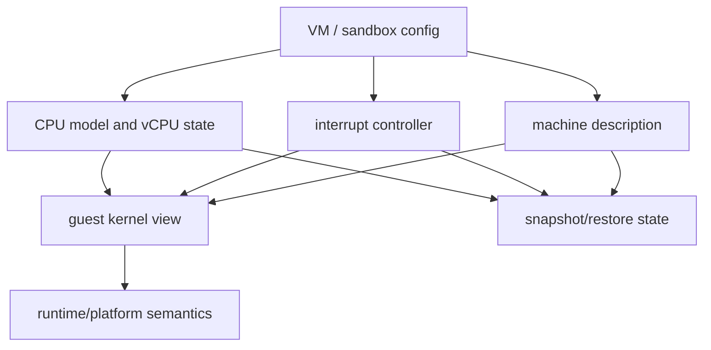
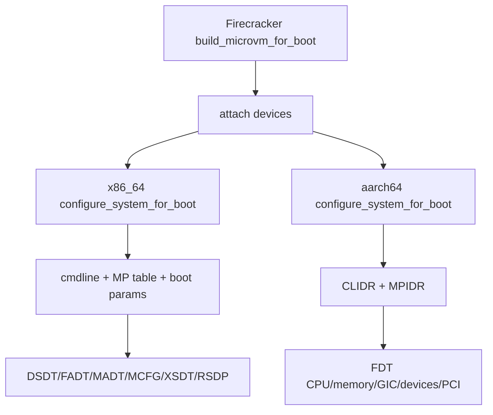
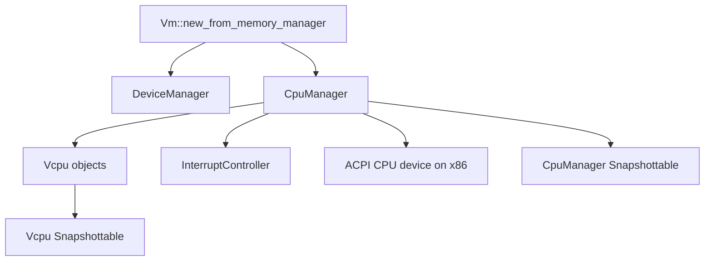
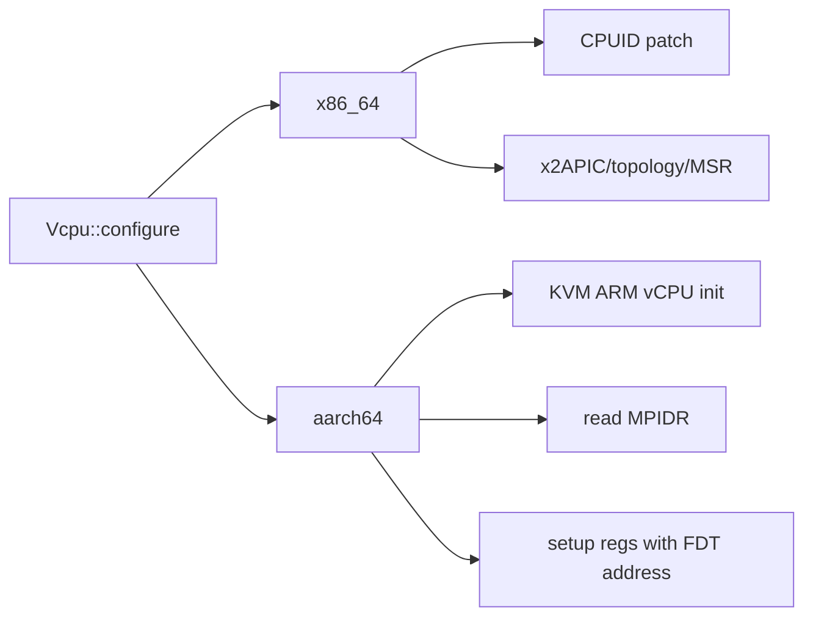
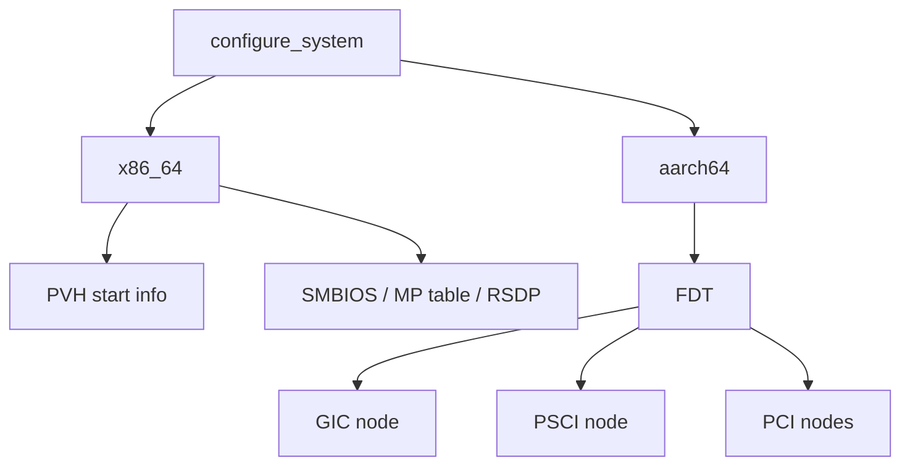
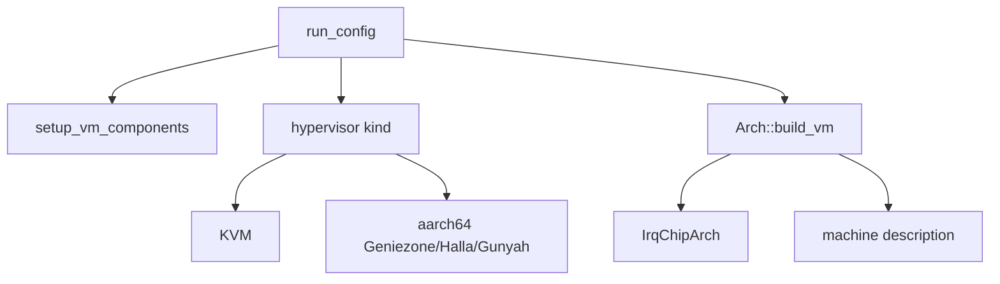
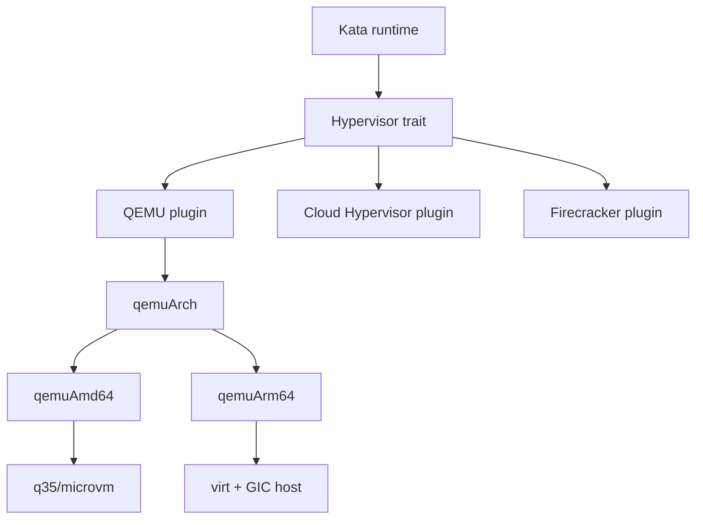
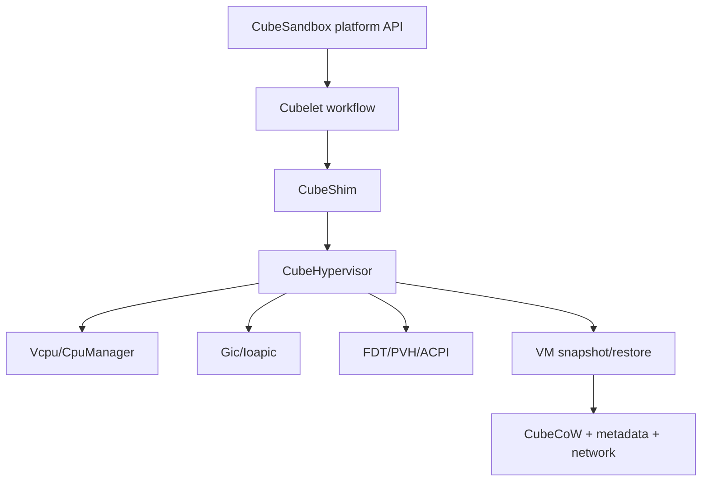
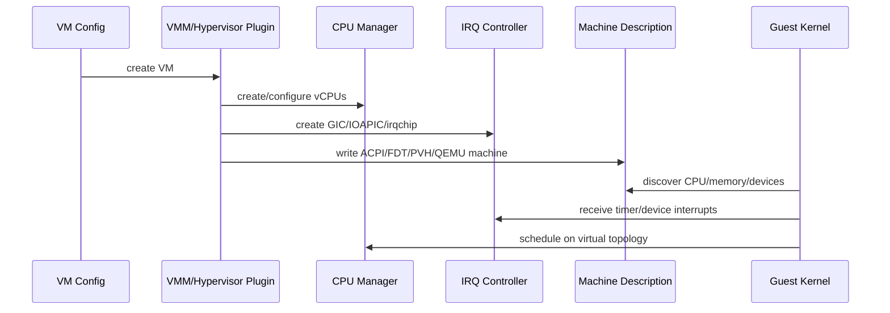
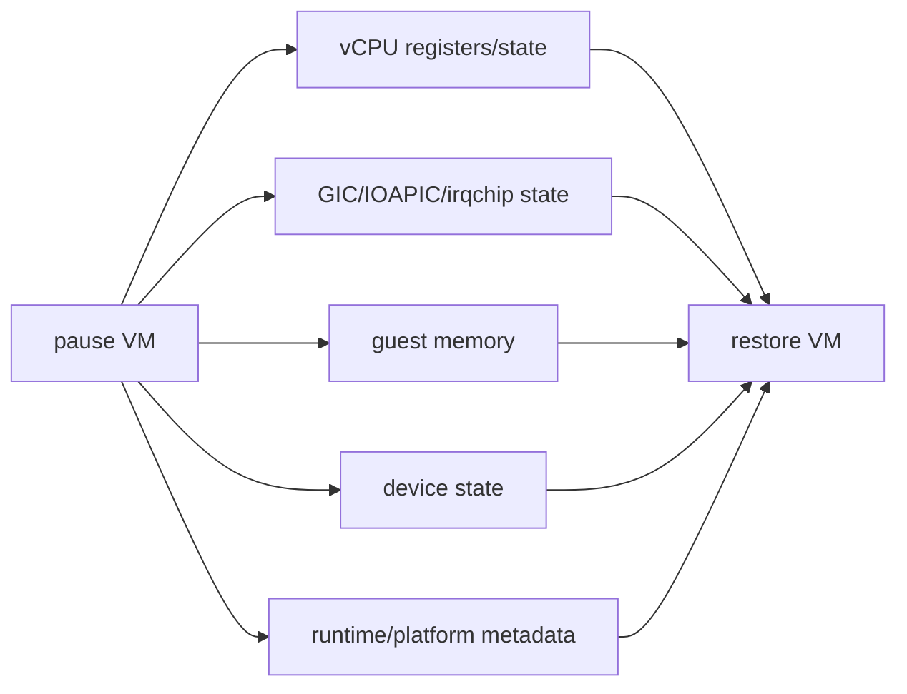

# CPU、中断控制器与机器描述跨项目专题分析

本文继续沿着深入路线，把 Firecracker、Cloud Hypervisor、Kata Containers、CubeSandbox 在 CPU 初始化、中断控制器、guest 机器描述和 snapshot/restore 状态边界上的实现放在一起比较。

crosvm 相关内容保留为历史参考，但当前已暂停继续分析，不作为后续路线的推进对象。

这条线是理解 ARM64 与 x86_64 差异的底层主线。设备、热插拔、snapshot、runtime 能力最终都会回到这里：guest 看到什么 CPU，IRQ 如何送达，内核如何发现设备，以及恢复时哪些架构状态必须一致。

## 1. 总体模型

CPU、中断和机器描述不是三个孤立模块。

CPU 初始化决定 guest 的 CPU 身份、拓扑、寄存器初值和热插拔能力。中断控制器决定设备事件、timer、IPI、MSI/MSI-X 如何进入 guest。机器描述决定 guest kernel 从 ACPI、FDT、PVH 或 QEMU machine 里发现 CPU、内存、PCI、virtio、timer、serial、PMU。

snapshot/restore 必须跨过这三层。只恢复内存而不恢复 vCPU 寄存器、GIC/IOAPIC 状态、设备发现表，会得到一个看似恢复成功但 guest 内核状态不一致的 VM。

## 2. 横向能力表

| 项目 | CPU 主入口 | 中断主入口 | 机器描述入口 | 恢复边界 |
|---|---|---|---|---|
| Firecracker | `configure_system_for_boot`、`Vcpu::configure` | x86_64 IRQCHIP/PIT/IOAPIC；ARM64 GIC | x86_64 boot params/MP table/ACPI；ARM64 FDT | `Vmm`、VM/vCPU arch state、DeviceManager、guest memory |
| Cloud Hypervisor | `Vcpu::configure`、`CpuManager` | `Gic`、`Ioapic`、`InterruptController` | x86_64 `configure_system` + ACPI；aarch64 ACPI + FDT | `CpuManager`、`Vcpu`、GIC/IOAPIC、MemoryManager、DeviceManager |
| Kata Containers | `Hypervisor` trait、QEMU `qemuArch` | 由底层 VMM/QEMU machine 提供 | QEMU machine / VMM plugin | runtime persist + hypervisor state + guest agent |
| CubeSandbox | CubeHypervisor fork 的 `Vcpu::configure` | fork 内 `Gic`、`Ioapic` | fork 内 x86 PVH/ACPI、ARM FDT | VM memory + CPU/IRQ/device + CubeCoW + platform metadata |

结论：Firecracker、Cloud Hypervisor 和 CubeHypervisor 是 VMM 级实现，能直接看到 CPU/IRQ/FDT/ACPI 状态。Kata 和 CubeSandbox 平台层则把底层差异包装成 runtime/platform 能力。

## 3. Firecracker：机器描述是启动期边界

Firecracker 的机器描述主要在 `build_microvm_for_boot()` 末尾生成。builder 先 attach virtio、legacy、VMGenID 和 VMClock，再调用架构相关 `configure_system_for_boot()`：[firecracker/src/vmm/src/builder.rs](../firecracker/src/vmm/src/builder.rs#L286)。

x86_64 路径先构造 CPUID/CPU template 并配置 vCPU，再写 cmdline、MP table、PVH 或 Linux boot params，最后创建 ACPI tables：[firecracker/src/vmm/src/arch/x86_64/mod.rs](../firecracker/src/vmm/src/arch/x86_64/mod.rs#L175)。

ARM64 路径先配置 vCPU，再覆盖 CLIDR/cache 视图，读取 MPIDR，随后创建并写入 FDT：[firecracker/src/vmm/src/arch/aarch64/mod.rs](../firecracker/src/vmm/src/arch/aarch64/mod.rs#L93)。

Firecracker 的 ACPI 表集合很小。`create_acpi_tables()` 生成 DSDT、FADT、MADT、MCFG、XSDT 和 RSDP。

DSDT 来源包括 MMIO virtio AML、VMGenID/VMClock/GED、可选 PCI segment 和 legacy PIO AML：[firecracker/src/vmm/src/acpi/mod.rs](../firecracker/src/vmm/src/acpi/mod.rs#L197)。

ARM64 的 `create_fdt()` 写 CPU、memory、chosen、GIC、timer、clock、PSCI、MMIO devices、VMGenID、VMClock 和可选 PCI host bridge：[firecracker/src/vmm/src/arch/aarch64/fdt.rs](../firecracker/src/vmm/src/arch/aarch64/fdt.rs#L65)。

机制结论：Firecracker 不把通用热插拔放进机器描述主路径。它的 GED 只处理 VMGenID/VMClock 通知，不是 CPU、memory、PCI 热插拔分发中心：[firecracker/src/vmm/src/device_manager/acpi.rs](../firecracker/src/vmm/src/device_manager/acpi.rs#L88)。

项目级专题：[Firecracker 机器描述：x86_64 ACPI 与 ARM64 FDT 链路](../firecracker/analysis/machine-description-acpi-fdt-chain.md)。

## 4. Cloud Hypervisor：CPU 与中断是 VM 状态的一部分

Cloud Hypervisor 的 `Vcpu` 保存 hypervisor vCPU、ID、保存状态；aarch64 额外保存 MPIDR，x86_64 额外保存 vendor：[cloud-hypervisor/vmm/src/cpu.rs](../cloud-hypervisor/vmm/src/cpu.rs#L492)。

`CpuManager` 保存 CPU 配置、interrupt controller、CPUID、hypervisor VM、vCPU 状态数组、vCPU 对象、pause/kill/kick 信号、ACPI 地址、NUMA/affinity、dynamic 等字段：[cloud-hypervisor/vmm/src/cpu.rs](../cloud-hypervisor/vmm/src/cpu.rs#L669)。

### 4.1 vCPU 配置分叉

`Vcpu::configure()` 在函数签名层面区分架构。aarch64 接收 hypervisor VM，执行 vCPU init，再调用 `arch::configure_vcpu()`；x86_64 接收 CPUID、Hyper-V、topology、nested 等信息：[cloud-hypervisor/vmm/src/cpu.rs](../cloud-hypervisor/vmm/src/cpu.rs#L541)。

x86_64 的 `arch::configure_vcpu()` 会 patch CPUID leaf、x2APIC ID、AMD/Intel nested 位、topology、TSC 频率、Hyper-V SynIC、MSR、FPU 和启动寄存器：[cloud-hypervisor/arch/src/x86_64/mod.rs](../cloud-hypervisor/arch/src/x86_64/mod.rs#L813)。

aarch64 的 `arch::configure_vcpu()` 设置启动寄存器时把 FDT 地址传给 guest，并读取 MPIDR 返回给上层：[cloud-hypervisor/arch/src/aarch64/mod.rs](../cloud-hypervisor/arch/src/aarch64/mod.rs#L68)。

机制结论：x86_64 的核心是把 CPU 能力“告诉”guest；aarch64 的核心是让 guest 通过 MPIDR/FDT/PSCI/GIC 发现拓扑。

### 4.2 机器描述分叉

x86_64 的 `configure_system()` 写 EBDA、SMBIOS、MP table，并调用 PVH 配置逻辑写 start info、memory map、RSDP 和 initramfs module：[cloud-hypervisor/arch/src/x86_64/mod.rs](../cloud-hypervisor/arch/src/x86_64/mod.rs#L950)。

aarch64 的 `configure_system()` 调用 FDT 生成，传入 cmdline、MPIDR、CPU topology、device info、initrd、PCI space、virtio-iommu BDF、GIC、NUMA、PMU：[cloud-hypervisor/arch/src/aarch64/mod.rs](../cloud-hypervisor/arch/src/aarch64/mod.rs#L125)。

aarch64 的 `create_fdt()` 写 root `interrupt-parent`，再创建 CPU、memory、chosen、GIC、timer、PMU、clock、PSCI、devices、PCI nodes：[cloud-hypervisor/arch/src/aarch64/fdt.rs](../cloud-hypervisor/arch/src/aarch64/fdt.rs#L208)。

机制结论：Cloud Hypervisor 对 x86_64 提供的是 PC/PVH/ACPI 语义；对 aarch64 提供的是 virt/FDT/GIC/PSCI 语义。

### 4.3 中断控制器也参与 snapshot

aarch64 的 `Gic` 封装 hypervisor VGIC，并实现 `InterruptController`、`Snapshottable`、`Pausable`、`Transportable`、`Migratable`：[cloud-hypervisor/devices/src/gic.rs](../cloud-hypervisor/devices/src/gic.rs#L34)。

`Gic::snapshot()` 读取 VGIC state；`Gic::pause()` 保存 GICv3 ITS tables 到 guest RAM：[cloud-hypervisor/devices/src/gic.rs](../cloud-hypervisor/devices/src/gic.rs#L153)。

x86_64 的 `Ioapic` 是独立结构，保存 IOAPIC state，并作为 legacy interrupt path 的关键组件：[cloud-hypervisor/devices/src/ioapic.rs](../cloud-hypervisor/devices/src/ioapic.rs#L129)。

机制结论：ARM64 restore 如果缺少 GIC/ITS 状态，MSI、timer、设备中断可能出现异常。x86_64 restore 则必须关注 IOAPIC/LAPIC/MSI 路由和 ACPI 发现的一致性。

Cloud Hypervisor 的机器描述专题已经进一步展开。它在 x86_64 上较早生成 ACPI，在 aarch64 上因 MADT GICC 依赖 MPIDR 而晚于 vCPU 配置生成 ACPI，并在 direct boot 路径写 FDT。

ACPI DSDT 由 DeviceManager、CpuManager 和 MemoryManager 的 AML 拼合，运行期通过 GED 分发 CPU、memory、PCI 和 power button 事件。FDT 负责 aarch64 direct boot 的 CPU、memory、GIC、timer、PMU、PSCI、devices 和 PCI nodes。

项目级专题：[Cloud Hypervisor ACPI / FDT 机器描述生成链路](../cloud-hypervisor/analysis/acpi-fdt-machine-description-chain.md)。

## 5. 历史参考：crosvm（暂停继续扩展）

本节保留已有横向背景，帮助理解 VMM 生态差异。根据当前研究范围，crosvm 后续不继续展开，也不作为下一步任务对象。

crosvm 的 Linux 主入口 `run_config()` 先 `setup_vm_components()`，再按 hypervisor kind 分发。aarch64 可走 Geniezone、Halla、Gunyah；KVM 是主路径：[crosvm/src/crosvm/sys/linux.rs](../crosvm/src/crosvm/sys/linux.rs#L2103)。

`IrqChip` trait 是中断控制器抽象，x86_64、aarch64、riscv64 有各自 trait 扩展：[crosvm/devices/src/irqchip/mod.rs](../crosvm/devices/src/irqchip/mod.rs#L117)。

### 5.1 aarch64 build_vm：FDT、GIC、protected VM

aarch64 的 `build_vm()` 处理 protected VM firmware、payload/FDT 位置、kernel/initrd 加载、PMU、GIC、PSCI、设备树写入等：[crosvm/aarch64/src/lib.rs](../crosvm/aarch64/src/lib.rs#L530)。

aarch64 的 `create_fdt()` 写 root `interrupt-parent`，创建 chosen、config、memory、reserved memory、CPU、GIC、timer、PMU、serial、PSCI、PCI、RTC、watchdog、KVM cpufreq 和 overlay：[crosvm/aarch64/src/fdt.rs](../crosvm/aarch64/src/fdt.rs#L627)。

`create_gic_node()` 是 aarch64 FDT 的核心入口，最终在 `create_fdt()` 中被调用：[crosvm/aarch64/src/fdt.rs](../crosvm/aarch64/src/fdt.rs#L148)。

机制结论：crosvm ARM64 路径与 Android/pKVM/protected VM 联系更紧密，不只是把 x86_64 的设备模型换成 ARM 指令集。

### 5.2 x86_64 build_vm：PC 平台、PCI hotplug 与 IOAPIC

x86_64 的 `build_vm()` 设置 identity map、TSS、ACPI/MP table、I/O bus、MMIO bus、PCI root、CMOS、fw_cfg 和 legacy devices：[crosvm/x86_64/src/lib.rs](../crosvm/x86_64/src/lib.rs#L1044)。

KVM x86_64 irqchip 创建路径中会调用 `vm.create_irq_chip()`，这表示 x86_64 interrupt controller 更接近 KVM in-kernel irqchip 模型：[crosvm/devices/src/irqchip/kvm/x86_64.rs](../crosvm/devices/src/irqchip/kvm/x86_64.rs#L102)。

crosvm 直接在运行路径中声明：`pci-hotplug is not implemented for non x86_64 architecture`，非 x86_64 使用 PCI hotplug 会被拒绝：[crosvm/src/crosvm/sys/linux.rs](../crosvm/src/crosvm/sys/linux.rs#L2164)。

`RunControlArgs` 在 x86_64 下包含 hotplug control tube；aarch64 下包含 `vcpu_domain_paths`：[crosvm/src/crosvm/sys/linux.rs](../crosvm/src/crosvm/sys/linux.rs#L3722)。

机制结论：crosvm 的 x86_64 路径在 PCI hotplug/control loop 上更完整。ARM64 不是不能做设备管理，而是需要沿着不同的 platform/FDT/irqchip 路线验证。

### 5.3 设备能力会被 CPU/IRQ 反向约束

virtio-fs 的 DAX 能力显式限制为 x86_64：`cfg!(target_arch = "x86_64") && fs.cfg().use_dax`：[crosvm/devices/src/virtio/fs/mod.rs](../crosvm/devices/src/virtio/fs/mod.rs#L159)。

这类代码说明架构差异会向上传递到设备能力。即使 virtio 协议本身跨架构，具体能力仍受 guest machine、IOMMU、memory map、interrupt delivery 和 host kernel 支持影响。

## 6. Kata Containers：把 CPU/IRQ 差异包装成 hypervisor capability

Kata 的 runtime 层不直接配置 GIC、IOAPIC、CPUID 或 FDT。它通过 `Hypervisor` trait 和 QEMU arch plugin 间接获得这些能力。

runtime-rs 的 `Hypervisor` trait 暴露 VM 生命周期、pause/save/resume、CPU/内存 resize、设备添加、线程 ID 和 capability 等能力。

源码入口：[kata-containers/src/runtime-rs/crates/hypervisor/src/lib.rs](../kata-containers/src/runtime-rs/crates/hypervisor/src/lib.rs#L99)。

`VcpuThreadIds` 只保存 vCPU 到线程 ID 的映射，说明 Kata 关心 vCPU 线程管理，但不直接处理 CPUID/MPIDR：[kata-containers/src/runtime-rs/crates/hypervisor/src/lib.rs](../kata-containers/src/runtime-rs/crates/hypervisor/src/lib.rs#L86)。

### 6.1 QEMU arch plugin 是 Kata 架构差异的主入口

`qemuArch` interface 规定 machine、qemu path、capabilities、CPU topology、memory topology、IOMMU、PFlash、protection device 等方法。

源码入口：[kata-containers/src/runtime/virtcontainers/qemu_arch_base.go](../kata-containers/src/runtime/virtcontainers/qemu_arch_base.go#L32)。

`qemuArchBase.capabilities()` 默认设置 block hotplug、multi-queue、network hotplug、fs sharing：[kata-containers/src/runtime/virtcontainers/qemu_arch_base.go](../kata-containers/src/runtime/virtcontainers/qemu_arch_base.go#L310)。

`qemuArchBase.cpuTopology()` 把 vCPU/maxvCPU 转成 QEMU SMP 参数：[kata-containers/src/runtime/virtcontainers/qemu_arch_base.go](../kata-containers/src/runtime/virtcontainers/qemu_arch_base.go#L327)。

机制结论：Kata 上层只处理“我要多少 CPU、是否能热插拔、是否能共享文件系统”。真正的 CPU/IRQ/机器描述由 QEMU/VMM plugin 转换成具体命令行和设备。

### 6.2 amd64 与 arm64 能力不是等价集合

amd64 的 `qemuAmd64.capabilities()` 在 Q35 下显式设置 block/network hotplug，并支持 multi-queue 和 fs sharing：[kata-containers/src/runtime/virtcontainers/qemu_amd64.go](../kata-containers/src/runtime/virtcontainers/qemu_amd64.go#L165)。

amd64 的 `supportGuestMemoryHotplug()` 在非 microvm 且无 guest protection 时返回 true：[kata-containers/src/runtime/virtcontainers/qemu_amd64.go](../kata-containers/src/runtime/virtcontainers/qemu_amd64.go#L205)。

arm64 默认 machine options 是 `usb=off,accel=kvm,gic-version=host`，机器模型是 ARM `virt`：[kata-containers/src/runtime/virtcontainers/qemu_arm64.go](../kata-containers/src/runtime/virtcontainers/qemu_arm64.go#L33)。

arm64 的 `appendIOMMU()` 直接返回不支持 vIOMMU：[kata-containers/src/runtime/virtcontainers/qemu_arm64.go](../kata-containers/src/runtime/virtcontainers/qemu_arm64.go#L117)。

Kata 的 capability bit 包括 block、block hotplug、multi-queue、fs sharing、hybrid-vsock、guest memory probe：[kata-containers/src/libs/kata-types/src/capabilities.rs](../kata-containers/src/libs/kata-types/src/capabilities.rs#L11)。

机制结论：Kata 的能力边界要看 capability，而不是看 runtime 是否有统一接口。统一接口代表“可以表达请求”，不代表底层架构都能满足。

## 7. CubeSandbox：平台语义依赖 CubeHypervisor 的架构状态

CubeSandbox 的 CubeAPI、CubeMaster、Cubelet 对外提供 sandbox、snapshot、clone、rollback、template、network 等平台语义。它们隐藏 CPU/IRQ 细节。

但 CubeShim 和内嵌 CubeHypervisor 仍要直接处理 VMM 架构状态。平台 snapshot 成功不等于底层 CPU/IRQ 状态自然正确。

### 7.1 CubeShim 启动 VMM 已有 arch 分支

`CubeHypervisor::launch_vmm()` 设置 seccomp rule 时，x86_64 允许 `SYS_mkdir`，aarch64 允许 `SYS_mkdirat`。

源码入口：[CubeSandbox-sandbox-clone/CubeShim/shim/src/hypervisor/cube_hypervisor.rs](../CubeSandbox-sandbox-clone/CubeShim/shim/src/hypervisor/cube_hypervisor.rs#L75)。

snapshot restore 的 `launch_vmm()` 也有同样分支：[CubeSandbox-sandbox-clone/CubeShim/shim/src/snapshot/mod.rs](../CubeSandbox-sandbox-clone/CubeShim/shim/src/snapshot/mod.rs#L230)。

这说明 CubeSandbox 的平台层即使保持统一 API，VMM 进程启动与恢复仍有架构相关 syscall 边界。

### 7.2 CubeHypervisor fork 保留 VMM 级 CPU/IRQ 差异

CubeHypervisor 的 `Vcpu` 保存 hypervisor vCPU、ID、saved state；aarch64 保存 MPIDR，x86_64 保存 TSC MSR：[CubeSandbox-sandbox-clone/hypervisor/vmm/src/cpu.rs](../CubeSandbox-sandbox-clone/hypervisor/vmm/src/cpu.rs#L298)。

`Vcpu::configure()` 在 aarch64 下 init 并读取 MPIDR；x86_64 下调用 x86 架构配置传入 CPUID/Hyper-V/guest memory：[CubeSandbox-sandbox-clone/hypervisor/vmm/src/cpu.rs](../CubeSandbox-sandbox-clone/hypervisor/vmm/src/cpu.rs#L344)。

x86_64 的 `configure_system()` 写 SMBIOS、MP table 和 PVH start info：[CubeSandbox-sandbox-clone/hypervisor/arch/src/x86_64/mod.rs](../CubeSandbox-sandbox-clone/hypervisor/arch/src/x86_64/mod.rs#L925)。

aarch64 的 `configure_system()` 生成 FDT，传入 MPIDR、设备信息、PCI space、virtio-iommu BDF、GIC、NUMA、PMU：[CubeSandbox-sandbox-clone/hypervisor/arch/src/aarch64/mod.rs](../CubeSandbox-sandbox-clone/hypervisor/arch/src/aarch64/mod.rs#L141)。

CubeHypervisor fork 中也有 `Gic` 和 `Ioapic`，说明它保留了 ARM64 与 x86_64 两套中断状态边界。

源码入口：[GIC](../CubeSandbox-sandbox-clone/hypervisor/devices/src/gic.rs#L34)、[IOAPIC](../CubeSandbox-sandbox-clone/hypervisor/devices/src/ioapic.rs#L128)。

机制结论：CubeSandbox 的 clone/rollback 是平台级能力，但底层 VM snapshot 至少要覆盖 CPU、memory、IRQ、device。ARM64 还必须验证 GIC/FDT/PMU/PSCI 与 guest agent 状态的一致性。

## 8. 关键流程图：从配置到 guest 可见平台

这个流程在四个项目中的位置不同。

Firecracker、Cloud Hypervisor 和 CubeHypervisor 在 VMM 内部直接执行这些动作。Kata 通过 hypervisor plugin/QEMU arch plugin 间接执行。CubeSandbox 平台层再把这些动作包成 sandbox 生命周期。

## 9. Snapshot/Restore 状态边界

| 层 | 漏恢复后的典型问题 |
|---|---|
| vCPU state | guest 从错误 PC、寄存器、CPU topology 或 APIC/MPIDR 状态继续执行 |
| IRQ state | timer、MSI、virtio queue kick、legacy IRQ 丢失或重复 |
| machine description | guest 内核已发现的设备与恢复后设备树/ACPI 不一致 |
| device state | virtqueue index、feature negotiation、backend fd、worker 状态不一致 |
| runtime/platform state | container metadata、agent socket、network、rootfs、snapshot 记录不一致 |

结论：VMM 级 snapshot 解决前四层。Kata 还要解决 runtime/agent 层。CubeSandbox 还要解决 CubeCoW、network-agent、CubeMaster/Cubelet metadata 和产品级 long operation 语义。

## 10. 下一步建议

1. Firecracker：做 `build_microvm_for_boot -> configure_system_for_boot -> ACPI/FDT` 的函数级调用链，并补上 IRQCHIP/GIC snapshot 边界。
2. Cloud Hypervisor：做 `Vm::new_from_memory_manager -> CpuManager::new -> create_boot_vcpus -> Vcpu::configure -> configure_system` 的函数级调用链。
3. Kata：做 `runtime request -> Hypervisor trait -> QEMU qemuArch -> capabilities` 的矩阵，明确哪些能力是架构相关。
4. CubeSandbox：做 `CubeAPI/Cubelet -> CubeShim -> CubeHypervisor -> VM snapshot` 的状态闭包图，判断 clone/rollback 需要哪些底层状态。

当前可以继续深挖 Firecracker 与 Cloud Hypervisor，因为它们直接暴露 VMM 级 CPU、IRQ、ACPI/FDT 和 snapshot 边界。
