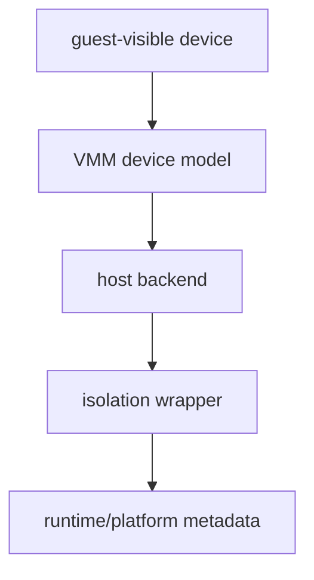
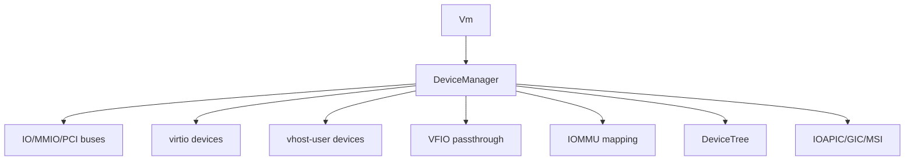
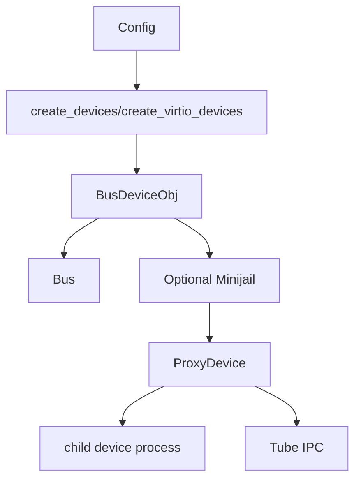
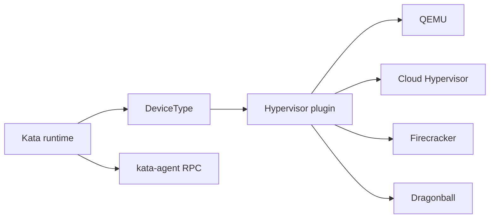
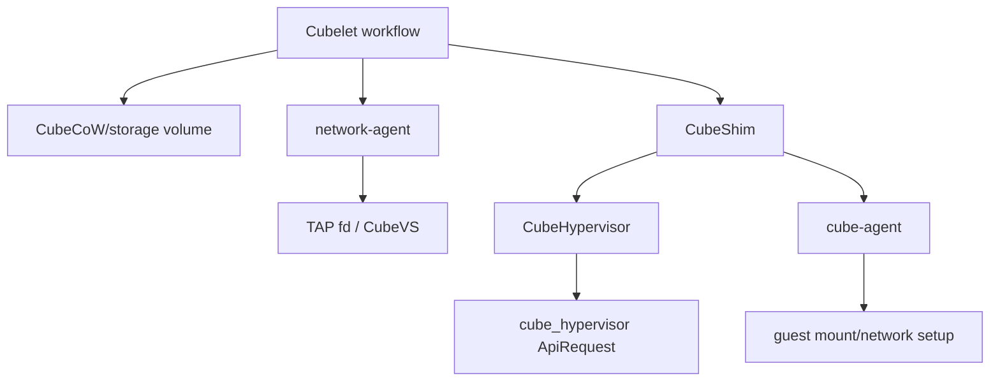

# 设备模型与隔离边界跨项目专题分析

本文沿四个项目文档中的深入路线，专门分析设备模型、设备隔离、hotplug 和 guest 可见设备状态。核心结论：四个项目都在“设备”上做抽象，但抽象层级不同。

源码基线：当前工作树。  
覆盖项目：Cloud Hypervisor、crosvm、Kata Containers、CubeSandbox。

## 1. 先定义设备模型边界

设备模型至少包含五层：

| 层级 | 含义 |
|---|---|
| guest-visible device | guest 内看到的 virtio/vfio/pci/mmio 设备 |
| VMM device model | VMM 内负责配置空间、queue、interrupt、DMA 的对象 |
| host backend | TAP、vhost-user backend、virtiofsd、VFIO group/device、disk image |
| isolation wrapper | seccomp、jail、子进程、Landlock、namespace、fd passing |
| orchestration metadata | runtime/platform 保存的 device id、PCI path、mount tag、network handle |

比较四个项目时，必须先确认讨论的是哪一层。Cloud Hypervisor 和 crosvm 主要讨论 VMM device model；Kata 讨论 runtime device abstraction；CubeSandbox 讨论平台编排后的设备、网络和存储组合。

## 2. Cloud Hypervisor：DeviceManager 与 device tree

Cloud Hypervisor 的设备模型以 `DeviceManager` 为中心。`Vm` 通过 `create_device_manager()` 创建并配置它：[cloud-hypervisor/vmm/src/vm.rs](../cloud-hypervisor/vmm/src/vm.rs#L782)。

`DeviceManager` 持有 address manager、console/serial、interrupt controller、config、memory manager、CPU manager、virtio devices、block devices、bus devices、PCI segments、interrupt managers、VFIO/IOMMU、device tree、eventfd、seccomp action 等：[cloud-hypervisor/vmm/src/device_manager.rs](../cloud-hypervisor/vmm/src/device_manager.rs#L964)。

### 2.1 DeviceTree 是 introspection/snapshot/restore 的骨架

`DeviceTree` 是一个 `HashMap<String, DeviceNode>`，支持 insert/remove/get/breadth-first traversal：[cloud-hypervisor/vmm/src/device_tree.rs](../cloud-hypervisor/vmm/src/device_tree.rs#L55)。

`DeviceManager` 暴露 `device_tree()`，`Vm` 再把它向外暴露：[cloud-hypervisor/vmm/src/device_manager.rs](../cloud-hypervisor/vmm/src/device_manager.rs#L5098)、[cloud-hypervisor/vmm/src/vm.rs](../cloud-hypervisor/vmm/src/vm.rs#L2906)。

`vm_info()` 会把 VM 的 device tree 放入响应：[cloud-hypervisor/vmm/src/lib.rs](../cloud-hypervisor/vmm/src/lib.rs#L2053)。这说明 device tree 不只是内部结构，也用于可观测性。

### 2.2 VFIO/IOMMU 边界

`add_vfio_device()` 会分配 PCI 资源，并根据是否有 vIOMMU 决定 VFIO ops 共享或独立创建。注释明确 legacy VFIO container/group 在 map/unmap 粒度上有限制：[cloud-hypervisor/vmm/src/device_manager.rs](../cloud-hypervisor/vmm/src/device_manager.rs#L3816)。

这说明 VFIO 不是“把 host device 塞给 guest”这么简单。它涉及 PCI BDF、DMA mapping、IOMMU、资源分配和 device tree 状态。

### 2.3 vhost-user 边界

`GenericVhostUser` 持有 `VirtioCommon`、`VhostUserCommon`、id、cache、seccomp action、guest memory、epoll thread、exit event、iommu 标志：[cloud-hypervisor/virtio-devices/src/vhost_user/generic_vhost_user.rs](../cloud-hypervisor/virtio-devices/src/vhost_user/generic_vhost_user.rs#L36)。

构造时会连接 vhost-user socket，协商 feature/protocol feature；restore 时会恢复 backend state：[cloud-hypervisor/virtio-devices/src/vhost_user/generic_vhost_user.rs](../cloud-hypervisor/virtio-devices/src/vhost_user/generic_vhost_user.rs#L54)。

这说明 vhost-user 的隔离边界在 VMM 进程之外，但 VMM 仍负责 virtio frontend、feature negotiation、queue state 和 device lifecycle。

### 2.4 Cloud Hypervisor hotplug

`Vm::remove_device()` 调 `DeviceManager::remove_device()`，再更新 `VmConfig`，最后通知 ACPI PCI devices changed：[cloud-hypervisor/vmm/src/vm.rs](../cloud-hypervisor/vmm/src/vm.rs#L2073)。

VMM 层 `vm_remove_device()` 如果 VM 已存在就从 VM 删除；否则只从 config 删除：[cloud-hypervisor/vmm/src/lib.rs](../cloud-hypervisor/vmm/src/lib.rs#L2240)。

结论：Cloud Hypervisor 的 device hotplug 是“设备模型 + config 持久化 + guest 通知”三件事同时完成。

## 3. crosvm：BusDevice、ProxyDevice、Minijail

crosvm 的设备模型以 `BusDevice` 和 process-per-device 隔离为核心。它支持更宽设备面，也因此需要更复杂的 IPC 和 jail 策略。

### 3.1 Bus 负责地址空间冲突管理

`Bus` 保存 `BTreeMap<BusRange, BusEntry>`。`insert()` 会拒绝 len 为 0 或与已有 range overlap 的设备：[crosvm/devices/src/bus.rs](../crosvm/devices/src/bus.rs#L392)。

这说明 crosvm 的设备模型首先是地址空间模型：IO/MMIO/PCI config 等设备必须被安全映射到不冲突的 bus range。

### 3.2 BusDeviceObj 用于类型回收

`BusDeviceObj` 提供 `as_pci_device()`、`as_platform_device()`、`into_pci_device()` 等方法，让 generic bus device 可以回到 PCI/platform device 类型：[crosvm/devices/src/bus.rs](../crosvm/devices/src/bus.rs#L285)。

这对 snapshot、hotplug、IOMMU setup 很重要，因为后续逻辑不能只把设备当作 opaque bus endpoint。

### 3.3 ProxyDevice 是隔离边界

`ChildProcIntf::new()` 会创建 Tube pair，把 child tube 加入 keep fd，fork 子进程，在子进程中调用 `device.on_sandboxed()` 和 `child_proc()`：[crosvm/devices/src/proxy.rs](../crosvm/devices/src/proxy.rs#L331)。

`ProxyDevice` 包装 `ChildProcIntf`，并实现 `BusDevice` 和 `Suspendable`：[crosvm/devices/src/proxy.rs](../crosvm/devices/src/proxy.rs#L414)。

这就是 crosvm 的核心隔离差异：设备可以脱离主 VMM 进程，在 Minijail 子进程中运行，主进程通过 Tube 执行 bus 操作和 snapshot/suspend 协议。

### 3.4 VFIO 设备创建

`create_vfio_device()` 创建 VFIO container，建立 memory/vm/irq Tube，并根据 PCI 或 platform VFIO 分支创建设备；PCI VFIO 可 hotplug，platform VFIO 不支持 hotplug：[crosvm/src/crosvm/sys/linux/device_helpers.rs](../crosvm/src/crosvm/sys/linux/device_helpers.rs#L1566)。

非 hotplug PCI VFIO 会配 `simple_jail(jail_config, "vfio_device")`；platform VFIO 会配 `simple_jail(jail_config, "vfio_platform_device")`：[crosvm/src/crosvm/sys/linux/device_helpers.rs](../crosvm/src/crosvm/sys/linux/device_helpers.rs#L1639)。

这说明 crosvm 在 VFIO 上同时处理 DMA/IOMMU、IRQ Tube、VM memory Tube 和进程隔离。

### 3.5 crosvm 的设备复杂度

`create_virtio_devices()` 中 GPU、Wayland、input、video 等设备会创建多条 Tube、resource bridges，并为设备配置 jail：[crosvm/src/crosvm/sys/linux.rs](../crosvm/src/crosvm/sys/linux.rs#L221)。

这与 Firecracker 这类极简 VMM 的设备集合完全不同。crosvm 的强项是宽设备面，代价是跨进程、跨 Tube、跨 jail 的协调复杂度。

## 4. Kata Containers：runtime 设备抽象

Kata 不直接实现一个 VMM device model。它把 container/runtime 需求抽象成 `DeviceType`，再交给选定 hypervisor plugin 处理。

### 4.1 Hypervisor 接口

Go runtime 的 Hypervisor interface 包含 `AddDevice()`、`HotplugAddDevice()`、`HotplugRemoveDevice()`，并覆盖 block、VFIO、network、memory、CPU 等设备生命周期：[kata-containers/src/runtime/virtcontainers/hypervisor.go](../kata-containers/src/runtime/virtcontainers/hypervisor.go#L1297)。

### 4.2 QEMU 的设备集合最宽

QEMU 的 `hotplugDevice()` 支持 BlockDev、CpuDev、VfioDev、MemoryDev、NetDev、VhostuserDev：[kata-containers/src/runtime/virtcontainers/qemu.go](../kata-containers/src/runtime/virtcontainers/qemu.go#L2062)。

`AddDevice()` 会把 Volume、Socket、VSock、Endpoint、BlockDrive、VhostUserDeviceAttrs、VFIODev append 到 QEMU config：[kata-containers/src/runtime/virtcontainers/qemu.go](../kata-containers/src/runtime/virtcontainers/qemu.go#L2343)。

Kata 在 QEMU 路径上把 runtime 设备需求转成 QEMU command line/QMP 设备配置。

### 4.3 Cloud Hypervisor plugin 的设备边界

Go 版 Cloud Hypervisor plugin 的 `AddDevice()` 支持 Endpoint、HybridVSock、Volume、VFIODev；hotplug 支持 BlockDev、VfioDev、NetDev：[kata-containers/src/runtime/virtcontainers/clh.go](../kata-containers/src/runtime/virtcontainers/clh.go#L1368)、[kata-containers/src/runtime/virtcontainers/clh.go](../kata-containers/src/runtime/virtcontainers/clh.go#L1085)。

runtime-rs 的 Cloud Hypervisor inner device 路径更明确：VM 未 running 时只把 ShareFs、Network、Vfio、Protection 放入 pending list；VM running 后分发到 share-fs、hvsock、block、vfio、network handler：[kata-containers/src/runtime-rs/crates/hypervisor/src/ch/inner_device.rs](../kata-containers/src/runtime-rs/crates/hypervisor/src/ch/inner_device.rs#L51)。

`handle_network_device()` 会打开 named tuntap，并通过 `cloud_hypervisor_vm_netdev_add_with_fds()` 把 TAP fd 传给 Cloud Hypervisor：[kata-containers/src/runtime-rs/crates/hypervisor/src/ch/inner_device.rs](../kata-containers/src/runtime-rs/crates/hypervisor/src/ch/inner_device.rs#L373)。

这说明 Kata 的设备隔离边界取决于下层 hypervisor plugin，而不是 Kata runtime 单独决定。

### 4.4 Firecracker plugin 的设备限制

Firecracker `AddDevice()` 注释说明只适合 VM start 前配置，设备包括 drive 和 network interface；它会在 notReady 时 queue pending devices：[kata-containers/src/runtime/virtcontainers/fc.go](../kata-containers/src/runtime/virtcontainers/fc.go#L1046)。

这与 QEMU/Cloud Hypervisor 的 hotplug 能力明显不同。Kata 的抽象接口是统一的，但每个 hypervisor 的能力不是统一的。

### 4.5 Agent RPC 负责 guest 内状态

agent ttrpc client 提供 `UpdateInterface()`、`UpdateRoutes()`、`ListInterfaces()`、`ListRoutes()` 等接口：[kata-containers/src/runtime/virtcontainers/pkg/agent/protocols/grpc/agent_ttrpc.pb.go](../kata-containers/src/runtime/virtcontainers/pkg/agent/protocols/grpc/agent_ttrpc.pb.go#L512)。

这说明网络设备不是 host 侧 hotplug 后就结束。guest 内 interface、route、mount、container namespace 仍需要 agent 协议完成。

## 5. CubeSandbox：平台级设备编排

CubeSandbox 的设备模型层级最高。它不只处理 VMM 设备，还处理 Cubelet workflow、CubeShim、CubeHypervisor、network-agent、CubeCoW、guest agent 之间的编排。

### 5.1 CubeShim 到 CubeHypervisor

`CubeHypervisor` 保存状态、config、VMM instance、event receiver 和 log：[CubeSandbox-sandbox-clone/CubeShim/shim/src/hypervisor/cube_hypervisor.rs](../CubeSandbox-sandbox-clone/CubeShim/shim/src/hypervisor/cube_hypervisor.rs#L43)。

`launch_vmm()` 设置 runtime seccomp rules，创建 `VmmInstance`：[CubeSandbox-sandbox-clone/CubeShim/shim/src/hypervisor/cube_hypervisor.rs](../CubeSandbox-sandbox-clone/CubeShim/shim/src/hypervisor/cube_hypervisor.rs#L75)。

`create_vm()`、`boot_vm()`、`snapshot_vm()`、`restore_vm()`、`set_fs()` 都通过 `ApiRequest` 发送给 VMM instance：[CubeSandbox-sandbox-clone/CubeShim/shim/src/hypervisor/cube_hypervisor.rs](../CubeSandbox-sandbox-clone/CubeShim/shim/src/hypervisor/cube_hypervisor.rs#L113)。

### 5.2 network-agent 是网络设备编排者

network-agent 的 gRPC client 提供 `EnsureNetwork`、`ReleaseNetwork`、`ReconcileNetwork`、`GetNetwork`、`ListNetworks` 等方法：[CubeSandbox-sandbox-clone/Cubelet/pkg/networkagentclient/pb/network_agent_grpc.pb.go](../CubeSandbox-sandbox-clone/Cubelet/pkg/networkagentclient/pb/network_agent_grpc.pb.go#L90)。

`GetNetworkResponse` 包含 interfaces、routes、ARP neighbors、port mappings、persist metadata：[CubeSandbox-sandbox-clone/Cubelet/pkg/networkagentclient/pb/network_agent.pb.go](../CubeSandbox-sandbox-clone/Cubelet/pkg/networkagentclient/pb/network_agent.pb.go#L600)。

TAP 数据结构保存 index、name、IP、是否使用、file、port mappings：[CubeSandbox-sandbox-clone/Cubelet/network/proto/network.go](../CubeSandbox-sandbox-clone/Cubelet/network/proto/network.go#L206)。

这说明 CubeSandbox 的“网卡设备”不是单纯 VMM netdev。它包括 TAP fd、CubeVS/eBPF、port mapping、持久化 metadata 和 guest route/interface。

### 5.3 guest agent 完成存储与网络

cube-agent 中的 storage handler 支持 virtio-mmio block、virtio-fs、virtio-blk、cube block storage 等路径：[CubeSandbox-sandbox-clone/agent/src/mount.rs](../CubeSandbox-sandbox-clone/agent/src/mount.rs#L467)。

virtio-blk 路径会根据 PCI path 找到 guest 内 block device，再进入 common storage handler：[CubeSandbox-sandbox-clone/agent/src/mount.rs](../CubeSandbox-sandbox-clone/agent/src/mount.rs#L488)。

cube block storage 还支持格式化、fsck、resize ext4：[CubeSandbox-sandbox-clone/agent/src/mount.rs](../CubeSandbox-sandbox-clone/agent/src/mount.rs#L515)。

guest 网络侧 `Network` 保存 DNS，`setup_guest_dns()` 会在 guest 内创建 resolv.conf 并 bind mount：[CubeSandbox-sandbox-clone/agent/src/network.rs](../CubeSandbox-sandbox-clone/agent/src/network.rs#L16)。

因此 CubeSandbox 的设备最终可用性取决于 guest agent，而不是 VMM hotplug 成功本身。

## 6. 横向矩阵

| 项目 | 设备抽象层级 | 主要结构 | 隔离方式 | hotplug 边界 | guest 内完成者 |
|---|---|---|---|---|---|
| Cloud Hypervisor | VMM | `DeviceManager`、`DeviceTree`、virtio/vhost-user/VFIO | seccomp、Landlock、vhost-user backend、VFIO/IOMMU | VMM config + device tree + guest notification | guest driver |
| crosvm | VMM | `BusDevice`、`BusDeviceObj`、`ProxyDevice` | Minijail、子进程、Tube、VFIO/IOMMU | control loop + bus + Tube + jail process | guest driver |
| Kata Containers | Runtime | `DeviceType`、Hypervisor plugin、agent RPC | 取决于 hypervisor；另有 guest agent 隔离 | runtime request -> plugin device API -> guest agent | kata-agent |
| CubeSandbox | Platform | Cubelet workflow、CubeShim、network-agent、CubeCoW、cube-agent | VMM seccomp、network-agent/CubeVS、guest agent、storage backend | API/workflow -> network/storage/VMM/guest 多层协调 | cube-agent |

## 7. ARM64 与 x86_64 差异

| 维度 | x86_64 | ARM64 |
|---|---|---|
| interrupt | IOAPIC/MSI/MSI-X/PIC | GIC/ITS/MSI 映射 |
| device enumeration | PCI/ACPI/legacy IO port | FDT/MMIO/平台设备/PCI 组合 |
| hotplug | ACPI/GED/PCI hotplug 成熟 | 受 FDT/ACPI/GIC 和 VMM 支持限制 |
| VFIO | PCI VFIO 主路径成熟 | platform VFIO/MMIO/GIC 相关差异更明显 |
| guest agent | 架构无关逻辑较多 | guest device path、kernel driver、artifact 必须匹配 |

项目影响：

1. Cloud Hypervisor：`DeviceManager` 中 interrupt controller 类型按架构切换；ARM64 设备常围绕 MMIO/GIC/FDT。
2. crosvm：VFIO platform device 与 PCI device 分支不同；ARM64 上 platform/MMIO 设备更重要。
3. Kata：同一 `DeviceType` 到不同 hypervisor plugin 后，设备能力矩阵会变化。
4. CubeSandbox：控制面跨架构，但 guest kernel、CubeHypervisor、TAP/CubeVS、cube-agent artifact 都要匹配 ARM64。

## 8. 设备隔离的关键差异

| 问题 | Cloud Hypervisor | crosvm | Kata | CubeSandbox |
|---|---|---|---|---|
| 单设备崩溃影响 | 多数设备在 VMM 进程内，vhost-user backend 例外 | ProxyDevice 可限制到子进程 | 取决于下层 VMM/plugin | 取决于 VMM、network-agent、guest agent |
| 后端权限 | VMM 持有 fd/连接 backend | 子进程 keep-fd + Minijail | runtime 准备 fd/config | Cubelet/network-agent/CubeShim 分配 fd/config |
| 设备状态可观测 | device tree | bus/control tubes/worker | runtime state + hypervisor state | platform metadata + VMM + network/storage |
| 网络隔离 | virtio/vhost-user net 语义 | TAP/vhost/slirp 等 | CNI/endpoint + hypervisor device + agent | network-agent + CubeVS/eBPF + TAP |
| 存储隔离 | block/pmem/vhost-user-fs | block/fs/9p/vhost-user | share-fs/block/pmem/image-rs | CubeCoW + guest mount/format/resize |

## 9. 推荐下一步深挖

1. Cloud Hypervisor：追踪 `DeviceManager::new -> add_*_device -> device_tree.insert -> hotplug notify`，产出设备创建时序图。
2. crosvm：追踪 `create_devices -> ProxyDevice::new -> child_proc -> BusDevice read/write`，产出 process-per-device 图。
3. Kata：按 QEMU/Cloud Hypervisor/Firecracker 三个 plugin 建立 `DeviceType` capability matrix。
4. CubeSandbox：追踪 `Cubelet Create -> network-agent EnsureNetwork -> CubeShim CreateSandbox -> cube-agent storage/network handler`。

## 10. 本专题结论

四个项目的设备模型差异可以概括为：

1. Cloud Hypervisor 用 `DeviceManager` 把设备纳入统一 VMM 管理和 device tree。
2. crosvm 用 `BusDevice` 抽象设备，并用 `ProxyDevice + Minijail` 承担强设备隔离。
3. Kata 把设备提升为 runtime `DeviceType`，真实能力由 hypervisor plugin 和 guest agent 共同决定。
4. CubeSandbox 把设备进一步产品化，网络、存储、VM device、guest mount 都由平台 workflow 编排。

后续分析设备能力时，不能只问“是否支持 virtio/vfio”。更关键的是：设备在哪个进程运行，谁持有 host fd，谁保存 metadata，谁通知 guest，失败时谁回滚。
