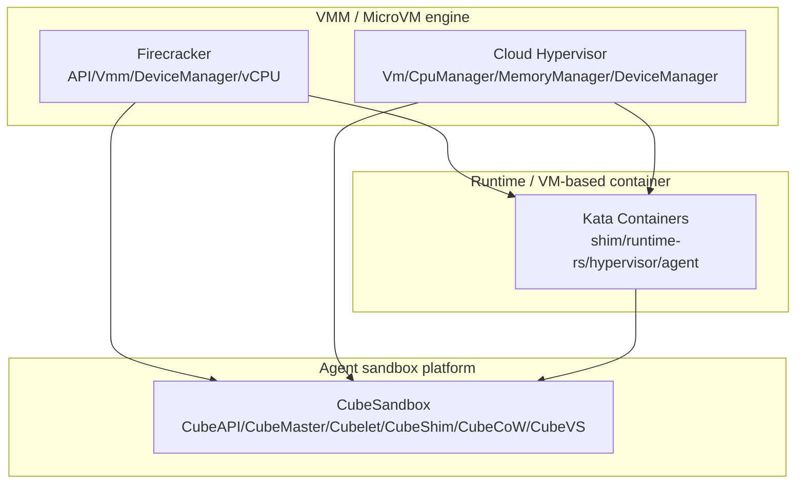
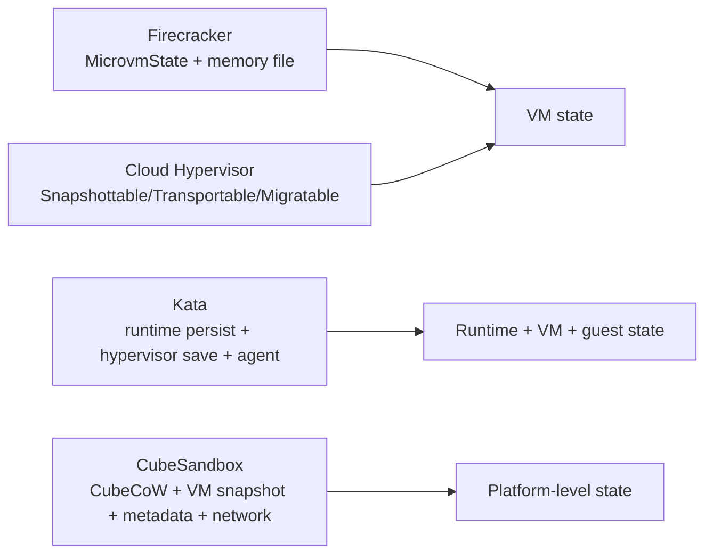
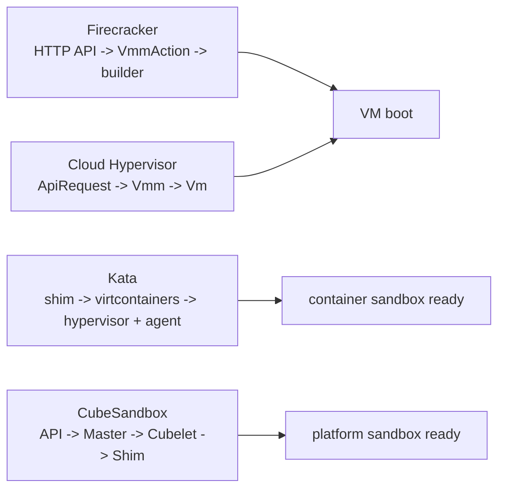
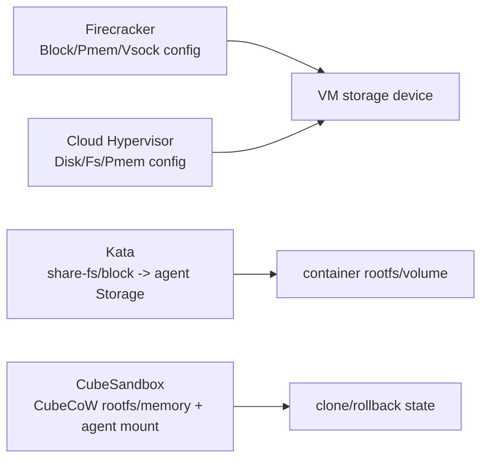
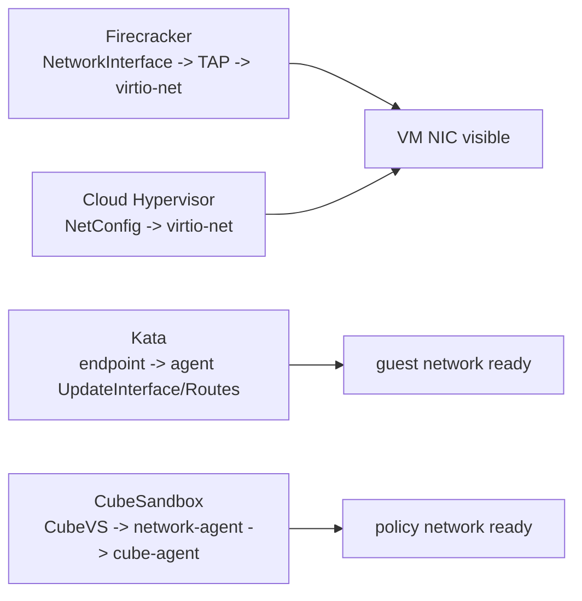

# Micro-VM 项目深入路线总览

本文把重点 Micro-VM 项目的路线展开文档横向对齐，帮助后续研究时避免“每个项目各看各的”。项目文档分别是：

- [Firecracker 深入路线](../firecracker/analysis/deep-routes.md)
- [Cloud Hypervisor 深入路线](../cloud-hypervisor/analysis/deep-routes.md)
- [Kata Containers 深入路线](../kata-containers/analysis/deep-routes.md)
- [CubeSandbox 深入路线](../CubeSandbox-sandbox-clone/analysis/deep-routes.md)

crosvm 相关文档保留为历史参考，但当前已暂停继续分析，不作为后续路线的推进对象。

专题分析：

- [Snapshot / Restore / Clone 跨项目专题分析](./snapshot-restore-cross-project.md)
- [设备模型与隔离边界跨项目专题分析](./device-model-isolation-cross-project.md)
- [启动路径与控制面跨项目专题分析](./boot-control-plane-cross-project.md)
- [存储、rootfs 与共享文件系统跨项目专题分析](./storage-rootfs-sharefs-cross-project.md)
- [网络与连接模型跨项目专题分析](./network-connectivity-cross-project.md)
- [ARM64 网络验证与观测总表](./arm64-network-validation-observation-matrix.md)
- [ARM64 网络失败签名总表](./arm64-network-failure-signature-matrix.md)
- [ARM64 网络测试与取证命令总表](./arm64-network-test-observation-command-matrix.md)
- [ARM64 网络样本成熟度矩阵](./arm64-network-evidence-maturity-matrix.md)
- [ARM64 网络下一批样本优先级](./arm64-network-next-sample-priority.md)
- [ARM64 网络样本采集 Runbook](./arm64-network-sample-collection-runbook.md)
- [ARM64 网络文档索引](./arm64-network-document-index.md)
- [四项目深入路线完成度矩阵](./four-project-route-coverage-matrix.md)
- [ARM64 与 x86_64 跨项目架构差异专题分析](./arm64-x86-cross-project-matrix.md)
- [CPU、中断控制器与机器描述跨项目专题分析](./cpu-interrupt-machine-cross-project.md)
- [运行期控制面与热插拔跨项目专题分析](./runtime-control-hotplug-cross-project.md)
- [Guest Agent 与 Runtime 语义跨项目专题分析](./guest-agent-runtime-cross-project.md)
- [安全隔离边界跨项目专题分析](./security-isolation-cross-project.md)
- [资源管理与 QoS 跨项目专题分析](./resource-qos-cross-project.md)
- [Virtio 传输与设备数据路径跨项目专题分析](./virtio-data-path-cross-project.md)
- [Guest Memory、DMA/IOMMU 与地址转换跨项目专题分析](./guest-memory-dma-iommu-cross-project.md)
- [Hypervisor/KVM/vCPU 执行边界跨项目专题分析](./hypervisor-kvm-vcpu-cross-project.md)
- [中断与事件通知跨项目专题分析](./interrupt-event-notification-cross-project.md)
- [ARM64 非网络风险图](./arm64-non-network-risk-map.md)
- [可观测性与故障诊断跨项目专题分析](./observability-diagnostics-cross-project.md)
- [Cloud Hypervisor 与 CubeSandbox：Backend / Notifier / Restore 交叉线](./ch-cubesandbox-backend-notifier-restore-crossline.md)
- [Cloud Hypervisor 与 CubeSandbox：Restore 后 Guest 不可用验证清单](./ch-cubesandbox-restore-guest-unavailability-checklist.md)
- [Firecracker 与 Kata：Rootfs / Backing / Guest-Visible Storage 交叉线](./fc-kata-storage-semantics-crossline.md)
- [非网络下一批真实样本目标图](./non-network-next-target-map.md)
- [非网络证据包记录模板](./non-network-evidence-bundle-template.md)
- [非网络样本采集 Runbook](./non-network-sample-collection-runbook.md)
- [非网络当前证据缺口总表](./non-network-evidence-gaps.md)
- [CoCo / pVM / 受保护 VM 跨项目专题分析（历史/暂缓参考）](./coco-pvm-protected-vm-cross-project.md)
- [Protected VM 与 snapshot/migration 跨项目专题分析（历史/暂缓参考）](./protected-vm-snapshot-migration-cross-project.md)
- [Claude Code 协同研究工作流](./claude-code-research-workflow.md)

综合学习层（建立在上述机制专题之上）：

- [轻量化虚拟机设计全景与学习路线](./vm-design-landscape-overview.md)
- [性能设计依据跨项目专题分析](./performance-design-basis-cross-project.md)
- [安全设计依据跨项目专题分析](./security-design-basis-cross-project.md)
- [分析框架改进意见](./analysis-improvement-recommendations.md)

## 1. 分层对齐

| 研究层级 | Firecracker | Cloud Hypervisor | Kata Containers | CubeSandbox |
|---|---|---|---|---|
| 对外入口 | HTTP API over Unix socket | VMM API/control thread | containerd shim v2 / CRI | E2B-compatible API/CubeAPI |
| VM 创建 | `StartMicroVm -> build_microvm_for_boot` | `Vm::new_from_memory_manager` | Hypervisor plugin `prepare_vm/start_vm` | CubeShim `start_vm/create_vm/boot_vm` |
| CPU | `Vcpu`、KVM_RUN、arch boot config | `CpuManager` | 由 hypervisor plugin 暴露 | CubeHypervisor 内部 VM |
| 内存 | guest memory、snapshot/UFFD、virtio-mem | `MemoryManager`、dirty log、migration | hypervisor memory config + agent online | CubeCoW volume + VM memory snapshot |
| 设备 | `DeviceManager`、MMIO/PCI transport | `DeviceManager`、device tree | hypervisor device abstraction、share-fs/rootfs | CubeShim hotplug、Cubelet storage/network |
| 控制循环 | API thread + VMM EventManager | VMM thread/API request | shim service + manager | CubeAPI/CubeMaster/Cubelet workflow |
| guest agent | 无固定 agent | 无固定 agent | kata-agent | cube-agent |
| 产品化能力 | 极简 MicroVM | 通用 cloud VM | VM-based pod/container runtime | AI Agent sandbox, clone/rollback/template |

## 2. 同类问题的源码入口

| 问题 | Firecracker | Cloud Hypervisor | Kata Containers | CubeSandbox |
|---|---|---|---|---|
| 一个 VM 怎么创建？ | `src/vmm/src/builder.rs`、`rpc_interface.rs` | `vmm/src/vm.rs`、`vmm/src/vmm.rs` | `src/runtime/pkg/containerd-shim-v2`、runtime-rs manager | `CubeAPI`、`CubeMaster`、`Cubelet/services/cubebox`、`CubeShim` |
| vCPU 如何配置？ | `vstate/vcpu.rs`、`arch/*` | `vmm/src/cpu.rs`、`arch/*` | hypervisor plugin | CubeHypervisor/cube_hypervisor |
| guest memory 如何保存？ | snapshot memory file、UFFD restore | `MemoryManager` snapshot/transport/dirty log | hypervisor `save_vm` + runtime persist | VM snapshot + CubeCoW memory volume/metadata |
| 设备如何隔离？ | 单进程设备 + seccomp/jailer | 进程内设备 + seccomp/Landlock | 取决于 hypervisor + agent | CubeShim + network-agent + CubeCoW + CubeVS |
| 运行中如何控制 VM？ | runtime API action + EventManager | API request 到 VMM thread | shim/runtime manager RPC | CubeAPI -> CubeMaster -> Cubelet -> CubeShim |
| snapshot/restore 边界？ | VMM/vCPU/device/memory state | VMM state + managers + migration traits | runtime state + hypervisor state + agent state | platform metadata + VM memory + CubeCoW + network |

## 3. Snapshot/Clone/Restore 的横向理解

本节已经展开为专题文档：[Snapshot / Restore / Clone 跨项目专题分析](./snapshot-restore-cross-project.md)。

| 项目 | snapshot 的真实语义 |
|---|---|
| Firecracker | VMM 级 microVM 状态，覆盖 KVM/VM/vCPU、DeviceManager、内存文件和可选 UFFD restore |
| Cloud Hypervisor | 管理器级别 snapshot，和 migration trait 强绑定；MemoryManager 先构造 range table，再 transport memory data |
| Kata Containers | 不只是 VMM snapshot，还要保存 runtime sandbox/container state，并让 guest agent 状态可恢复 |
| CubeSandbox | 平台级 snapshot/clone/rollback，组合 VM memory、CubeCoW rootfs/volume、CubeMaster/Cubelet metadata、network-agent 状态 |

结论：四者都谈 snapshot，但层级完全不同。Firecracker 和 Cloud Hypervisor 是 VMM 级；Kata 是 runtime 级；CubeSandbox 是产品平台级。

## 4. 启动路径与控制面横向理解

本节已经展开为专题文档：[启动路径与控制面跨项目专题分析](./boot-control-plane-cross-project.md)。

| 项目 | 启动边界 |
|---|---|
| Firecracker | pre-boot API 聚合配置，`StartMicroVm` 一次性构建 microVM，随后进入 runtime API |
| Cloud Hypervisor | `vm_create` 存配置，`vm_boot` 构造 `Vm` 并启动 |
| Kata Containers | containerd create/start 映射到 hypervisor VM 与 guest agent 操作 |
| CubeSandbox | 平台 create 覆盖调度、存储、网络、VM、agent、metadata |

结论：越靠近 VMM 层，启动语义越接近“VM 可运行”；越靠近 runtime/platform 层，启动语义越接近“业务 sandbox ready”。

## 5. ARM64 与 x86_64 比较轴

设备模型与隔离边界已展开为专题文档：[设备模型与隔离边界跨项目专题分析](./device-model-isolation-cross-project.md)。

存储、rootfs 与共享文件系统已展开为专题文档：[存储、rootfs 与共享文件系统跨项目专题分析](./storage-rootfs-sharefs-cross-project.md)。

网络与连接模型已展开为专题文档：[网络与连接模型跨项目专题分析](./network-connectivity-cross-project.md)。

ARM64 与 x86_64 差异已展开为专题文档：[ARM64 与 x86_64 跨项目架构差异专题分析](./arm64-x86-cross-project-matrix.md)。

CPU、中断控制器与机器描述已展开为专题文档：[CPU、中断控制器与机器描述跨项目专题分析](./cpu-interrupt-machine-cross-project.md)。

运行期控制面与热插拔已展开为专题文档：[运行期控制面与热插拔跨项目专题分析](./runtime-control-hotplug-cross-project.md)。

Guest Agent 与 Runtime 语义已展开为专题文档：[Guest Agent 与 Runtime 语义跨项目专题分析](./guest-agent-runtime-cross-project.md)。

安全隔离边界已展开为专题文档：[安全隔离边界跨项目专题分析](./security-isolation-cross-project.md)。

资源管理与 QoS 已展开为专题文档：[资源管理与 QoS 跨项目专题分析](./resource-qos-cross-project.md)。

Virtio 传输与设备数据路径已展开为专题文档：[Virtio 传输与设备数据路径跨项目专题分析](./virtio-data-path-cross-project.md)。

Guest Memory、DMA/IOMMU 与地址转换已展开为专题文档：[Guest Memory、DMA/IOMMU 与地址转换跨项目专题分析](./guest-memory-dma-iommu-cross-project.md)。

Hypervisor/KVM/vCPU 执行边界已展开为专题文档：[Hypervisor/KVM/vCPU 执行边界跨项目专题分析](./hypervisor-kvm-vcpu-cross-project.md)。

中断与事件通知已展开为专题文档：[中断与事件通知跨项目专题分析](./interrupt-event-notification-cross-project.md)。

如果当前重点是 `Cloud Hypervisor + CubeSandbox` 在 ARM64 下的 restore 判错，而不是继续铺网络框架，建议直接把下面两份一起读：

1. [Cloud Hypervisor 与 CubeSandbox：Backend / Notifier / Restore 交叉线](./ch-cubesandbox-backend-notifier-restore-crossline.md)
2. [Cloud Hypervisor 与 CubeSandbox：Restore 后 Guest 不可用验证清单](./ch-cubesandbox-restore-guest-unavailability-checklist.md)

前者负责解释 backend / notifier / worker / guest-visible 的分层差异，后者已经把 ARM64 下 `storage/backend object -> ioeventfd/kick/call/worker -> GIC/ITS restore -> guest-visible mount/net/ready` 的联合判错顺序压成了可执行清单。

可观测性与故障诊断已展开为专题文档：[可观测性与故障诊断跨项目专题分析](./observability-diagnostics-cross-project.md)。

CoCo / pVM / 受保护 VM 专题保留为历史/暂缓参考：[CoCo / pVM / 受保护 VM 跨项目专题分析](./coco-pvm-protected-vm-cross-project.md)。

Protected VM 与 snapshot/migration 专题保留为历史/暂缓参考：[Protected VM 与 snapshot/migration 跨项目专题分析](./protected-vm-snapshot-migration-cross-project.md)。

| 比较轴 | Firecracker | Cloud Hypervisor | Kata Containers | CubeSandbox |
|---|---|---|---|---|
| CPU 身份 | x86 CPUID/template vs ARM MPIDR/CLIDR | x86 CPUID/topology vs ARM MPIDR | 由 hypervisor plugin 决定 | 由 CubeHypervisor/cube_hypervisor 决定 |
| 中断控制器 | x86 IRQCHIP/PIT/IOAPIC vs ARM GIC | x86 IOAPIC/MSI vs ARM GIC | hypervisor plugin + guest kernel | ARM64 GIC/FDT 路径需验证 |
| 设备枚举 | x86 cmdline/ACPI vs ARM FDT/MMIO | ACPI/PCI vs FDT/MMIO/ACPI-GIC | 配置模板 + hypervisor | CubeShim config + guest image + CubeVS |
| firmware/boot | Linux boot/PVH vs ARM direct boot/FDT | x86 setup header/ACPI vs ARM UEFI/FDT | kernel/image/hypervisor config | deploy/aarch64 kernel/image/agent |
| 安全 | jailer/seccomp/cgroup/netns | seccomp/Landlock/CoCo feature | hypervisor/plugin/agent policy | PVM 当前 x86-only |
| 网络 | TAP + virtio-net + MMDS detour | virtio-net/vhost-user 等 | CNI/TC/vhost/agent | network-agent/CubeVS/eBPF，ARM64 需 kernel 验证 |

## 6. 存储/rootfs/share-fs 横向理解

| 项目 | 存储语义 |
|---|---|
| Firecracker | 把 block/pmem/vsock 配置变成精简 virtio 设备，rootfs 语义通过 cmdline 或 pmem root 暴露 |
| Cloud Hypervisor | 把 disk/fs/pmem 建模成 VMM virtio/vhost-user 设备 |
| Kata Containers | 把 OCI rootfs/volume 翻译成 VM 内 agent `Storage` 和 mount |
| CubeSandbox | 把 rootfs/memory/volume 变成可 clone/rollback 的 CubeCoW 平台状态 |

结论：VMM 层只保证 guest 看见设备；runtime/platform 层还必须保证 rootfs、volume、guest mount、metadata 和 snapshot 一致。

## 7. 网络与连接模型横向理解

| 项目 | 网络语义 |
|---|---|
| Firecracker | 把 TAP、rate limiter、MMDS detour 建模成单 VM virtio-net |
| Cloud Hypervisor | 把 tap/vhost-user/vDPA 建模成 VM 网络设备 |
| Kata Containers | 把 host endpoint 注入 VM，并由 kata-agent 配置 guest 网络 |
| CubeSandbox | 把出网策略、端口、路由、network-agent metadata 纳入 sandbox ready |

结论：网络 ready 至少有三层：host 侧网络资源、VM 侧网卡设备、guest 内接口/路由。CubeSandbox 还多了平台策略收敛。

## 8. 推荐后续研究顺序

1. 先完成 Firecracker 的 API、builder、vCPU、设备、snapshot 与 ARM64/x86_64 管线，把极简 MicroVM 能力边界作为基线。
2. 再完成 Cloud Hypervisor 的 VM create/boot/snapshot/热插拔管线，因为它是理解 CubeHypervisor 和 Kata Cloud Hypervisor plugin 的底层参照。
3. 然后研究 Kata 的 shim/runtime-rs/hypervisor/agent 四段式，把 VMM 能力上升到 container runtime 语义。
4. 最后研究 CubeSandbox 的 CubeAPI/CubeMaster/Cubelet/CubeShim/CubeCoW/network-agent，把 runtime 语义上升到 AI Agent sandbox 产品语义。

## 9. 当前阶段产物

本轮已经产出每个项目的路线展开文档，并完成基础结构校验：

| 文档 | 内容 |
|---|---|
| [Claude Code research workflow](./claude-code-research-workflow.md) | 后续任务规划、Claude Code 源码解析、文档审阅、证据门槛和校验流程 |
| [Firecracker deep-routes](../firecracker/analysis/deep-routes.md) | API 控制面、VMM 构建、vCPU/KVM、设备模型、snapshot、隔离和 ARM64/x86_64 |
| [Firecracker API start boot chain](../firecracker/analysis/api-start-boot-chain.md) | HTTP API、VmmAction、PrebootApiController、VmResources、builder、arch boot config 和 KVM_RUN |
| [Firecracker build microvm boot chain](../firecracker/analysis/build-microvm-boot-chain.md) | build_microvm_for_boot、KVM/VM/vCPU、guest memory、DeviceManager、kernel/initrd、设备 attach、arch boot config、seccomp 和 resume_vm |
| [Firecracker VmResources config boundary chain](../firecracker/analysis/vmresources-config-boundary-chain.md) | VmResources 配置聚合、pre-boot/runtime 分界、StartMicroVm 一次性构建、有限 runtime update 和 ARM64/x86_64 边界 |
| [Firecracker API event loop thread chain](../firecracker/analysis/api-event-loop-thread-chain.md) | API thread、mpsc/eventfd、preboot controller、runtime EventManager、VMM/device subscriber 和 vCPU channel/signal 协作 |
| [Firecracker DeviceManager virtio transport chain](../firecracker/analysis/device-manager-virtio-transport-chain.md) | DeviceManager、virtio-mmio、virtio-pci、ioeventfd、irqfd/MSI-X、block/net activation 和 ARM64/x86_64 设备暴露差异 |
| [Firecracker snapshot restore chain](../firecracker/analysis/snapshot-restore-chain.md) | CreateSnapshot/LoadSnapshot、MicrovmState、full/diff memory、UFFD restore、DeviceManager persist 和 ARM64/x86_64 状态差异 |
| [Firecracker isolation seccomp jailer chain](../firecracker/analysis/isolation-seccomp-jailer-chain.md) | jailer chroot/pivot_root、cgroup/resource limit/netns、线程级 seccomp、API/VMM/vCPU filter 和 ARM64/x86_64 隔离差异 |
| [Firecracker vCPU KVM_RUN chain](../firecracker/analysis/vcpu-kvm-run-chain.md) | vCPU 线程、Paused/Running 状态机、KVM_RUN、immediate_exit/signal kick、MMIO/PIO exit 和 ARM64/x86_64 差异 |
| [Cloud Hypervisor ACPI FDT machine description chain](../cloud-hypervisor/analysis/acpi-fdt-machine-description-chain.md) | ACPI DSDT/FADT/MADT/MCFG/SRAT/SLIT/VIOT/IORT、ARM64 FDT、GED hotplug、x86/ARM64 boot 描述差异 |
| [Cloud Hypervisor VM create / boot chain](../cloud-hypervisor/analysis/vm-create-boot-chain.md) | `vm_create`/`vm_boot` 生命周期边界、`Vm::new` 对象图、Memory/CPU/Device manager 拼装、payload loader、`Vm::boot` 和 ARM64/x86_64 启动分叉 |
| [Firecracker virtio device work chain](../firecracker/analysis/virtio-device-work-chain.md) | virtio notify/ioeventfd、Queue avail/used ring、block/net/vsock 队列处理、rate limiter、后端 I/O 和 ARM64/x86_64 transport 差异 |
| [Firecracker virtio block data path chain](../firecracker/analysis/virtio-block-data-path-chain.md) | drive API、root cmdline、virtio-block queue request、sync/io_uring backing file I/O、rate limiter、runtime path update、snapshot state 和 ARM64/x86_64 边界 |
| [Firecracker virtio net data path chain](../firecracker/analysis/virtio-net-data-path-chain.md) | network API、TAP fd、TX/RX virtqueue、guest memory iovec、rate limiter、MMDS 分流、runtime PATCH、snapshot state 和 ARM64/x86_64 边界 |
| [Firecracker arm64 network capability matrix](../firecracker/analysis/arm64-network-capability-matrix.md) | TAP/backend、共享 queue/MMDS 逻辑、FDT/GIC 设备发现和 restore 的 ARM64 附加状态边界 |
| [Firecracker arm64 network observation guide](../firecracker/analysis/arm64-network-observation-guide.md) | `TapOpen`、MMDS/queue、FDT/GIC 设备发现和 restore 层的 ARM64 网络排查顺序 |
| [Firecracker arm64 network failure prototypes](../firecracker/analysis/arm64-network-failure-prototypes.md) | `TapOpen`、`VnetHeaderMissing`、`undo_pop()`、MMDS 分流和 restore 异常等 ARM64 网络失败原型 |
| [Firecracker device capability boundary chain](../firecracker/analysis/device-capability-boundary-chain.md) | vsock、balloon、pmem、entropy/rng、virtio-mem 的运行期更新、snapshot 保存项、外部依赖和 ARM64/x86_64 边界 |
| [Firecracker runtime device update chain](../firecracker/analysis/runtime-device-update-chain.md) | runtime controller、block/net/pmem/balloon/virtio-mem/MMDS 更新边界、virtio config interrupt 和 ARM64/x86_64 差异 |
| [Firecracker MMDS metadata network chain](../firecracker/analysis/mmds-metadata-network-chain.md) | API /mmds、VmResources、MmdsConfig、virtio-net detour、MmdsNetworkStack、token/V1/V2 和 ARM64/x86_64 边界 |
| [Firecracker DeviceManager ID transport chain](../firecracker/analysis/device-manager-id-transport-chain.md) | DeviceManager 设备 id/type 索引、MMIO/PCI transport 包装、运行期 with_virtio_device 查找和 ARM64/x86_64 差异 |
| [Firecracker balloon virtio-mem guest chain](../firecracker/analysis/balloon-virtio-mem-guest-chain.md) | balloon target/hinting、virtio-mem requested size、guest virtqueue 协作、KVM slot 更新和 ARM64/x86_64 差异 |
| [Firecracker memory device snapshot chain](../firecracker/analysis/memory-device-snapshot-chain.md) | balloon/virtio-mem snapshot state、plugged bitmap、virtqueue/transport 恢复、MMIO/PCI restore 和 ARM64/x86_64 差异 |
| [Firecracker UFFD memory restore chain](../firecracker/analysis/uffd-memory-restore-chain.md) | File/UFFD memory backend、UFFD mapping handshake、restore_memory_regions、queue restore 边界和 ARM64/x86_64 差异 |
| [Firecracker arch ARM64 x86 chain](../firecracker/analysis/arch-arm64-x86-chain.md) | KVM capability、启动配置、CPUID/MPIDR、PIO/MMIO、FDT/ACPI、设备暴露和 snapshot state |
| [Firecracker machine description ACPI FDT chain](../firecracker/analysis/machine-description-acpi-fdt-chain.md) | x86_64 boot params、MP table、ACPI DSDT/FADT/MADT/MCFG/RSDP、ARM64 MPIDR/CLIDR/FDT、VMGenID/VMClock 和 DeviceManager 描述数据源 |
| [Firecracker interrupt event notification chain](../firecracker/analysis/interrupt-event-notification-chain.md) | queue notify、KVM ioeventfd、virtio worker、MMIO IrqTrigger、PCI MSI-X、irqfd/GSI route、GIC/IOAPIC 和 snapshot restore 边界 |
| [Cloud Hypervisor deep-routes](../cloud-hypervisor/analysis/deep-routes.md) | VM 构造、CPU、Memory、Device、ARM64、x86_64 |
| [Cloud Hypervisor API VMM thread control chain](../cloud-hypervisor/analysis/api-vmm-thread-control-chain.md) | main.rs、ApiAction/ApiRequest、EventFd、VMM thread control loop、vm_create/vm_boot/vm_restore 边界 |
| [Cloud Hypervisor CPU boot chain](../cloud-hypervisor/analysis/cpu-boot-chain.md) | VM create 到 vCPU 配置、系统描述和 vCPU thread 启动的函数级链路 |
| [Cloud Hypervisor CPU runtime hotplug migration chain](../cloud-hypervisor/analysis/cpu-runtime-hotplug-migration-chain.md) | CpuManager resize、vCPU hotplug、guest eject、pause/resume、snapshot/restore 和 ARM64/x86_64 差异 |
| [Cloud Hypervisor DeviceManager chain](../cloud-hypervisor/analysis/device-manager-chain.md) | 设备创建、中断控制器、virtio-pci、ACPI/FDT、热插拔和迁移聚合的函数级链路 |
| [Cloud Hypervisor DeviceTree hotplug restore chain](../cloud-hypervisor/analysis/device-tree-hotplug-restore-chain.md) | DeviceTree 拓扑、virtio-pci parent/child、热插拔 add/remove/eject、snapshot 聚合、restore 资源复用和 ARM64/x86_64 差异 |
| [Cloud Hypervisor I/O device data path chain](../cloud-hypervisor/analysis/io-device-data-path-chain.md) | block/net/fs/vhost-user/vDPA 配置、MetaVirtioDevice、virtio-pci activation、worker/backend、ioeventfd、中断和 ARM64/x86_64 差异 |
| [Cloud Hypervisor arm64 network capability matrix](../cloud-hypervisor/analysis/arm64-network-capability-matrix.md) | `NetConfig`/`vm_add_net` 共享入口、ARM64 FDT/GICv3/ITS、IOMMU segment 校验和 guest 可见性边界 |
| [Cloud Hypervisor arm64 network observation guide](../cloud-hypervisor/analysis/arm64-network-observation-guide.md) | ARM64 网络问题在 `vm_add_net`、tap/backend、FDT/GIC、`virtio-device activated` 与 restore 层的失败信号与排查顺序 |
| [Cloud Hypervisor arm64 network failure prototypes](../cloud-hypervisor/analysis/arm64-network-failure-prototypes.md) | `Error when adding new network device`、`InvalidIommuHotplug`、tap/backend 失败、guest 枚举未完成和 restore 异常等 ARM64 网络失败原型 |
| [Cloud Hypervisor arm64 network test scenarios](../cloud-hypervisor/analysis/arm64-network-test-scenarios.md) | 多网卡、PCI MSI、virtio-net ctrl queue / MTU、运行期 net hotplug 等 ARM64 网络测试包装场景与断言 |
| [Cloud Hypervisor arm64 network sample seed](../cloud-hypervisor/analysis/arm64-network-sample-seed.md) | 把多网卡、MSI、ctrl queue / MTU、hotplug 场景转成第一批 ARM64 网络样本可直接复用的骨架 |
| [Cloud Hypervisor device creation matrix chain](../cloud-hypervisor/analysis/device-creation-matrix-chain.md) | 普通 virtio、vhost-user、virtio-fs、vDPA、VFIO/vfio-user 的创建入口、transport 包装、热插拔、device tree restore 和 ARM64/x86_64 边界 |
| [Cloud Hypervisor interrupt event notification chain](../cloud-hypervisor/analysis/interrupt-event-notification-chain.md) | queue notify、KVM ioeventfd、InterruptManager/InterruptSourceGroup、MSI-X、vhost-user/vDPA/VFIO notifier、GIC/IOAPIC 和 snapshot restore 边界 |
| [Cloud Hypervisor VFIO vfio-user IOMMU migration chain](../cloud-hypervisor/analysis/vfio-vfio-user-iommu-migration-chain.md) | VFIO PCI、vfio-user、virtio-iommu 外部映射、snapshot 保存项、dirty-log 默认空实现、vhost-user/vDPA 对照和 ARM64/x86_64 中断描述差异 |
| [Cloud Hypervisor MemoryManager chain](../cloud-hypervisor/analysis/memory-manager-chain.md) | guest RAM、memory slot、热插拔、snapshot transport、UFFD restore 和 dirty log 的函数级链路 |
| [Cloud Hypervisor Memory Address Hotplug Topology chain](../cloud-hypervisor/analysis/memory-address-hotplug-topology-chain.md) | memory zones、RAM/device area、userspace mapping、guest_ram_mappings、ACPI hotplug、virtio-mem、zone resize、restore topology 和 ARM64/x86_64 边界 |
| [Cloud Hypervisor migration memory transport chain](../cloud-hypervisor/analysis/migration-memory-transport-chain.md) | MemoryRangeTable、memory-ranges transport、copy/on-demand restore、UFFD handler、dirty log 聚合和 ARM64/x86_64 边界 |
| [Cloud Hypervisor runtime control hotplug chain](../cloud-hypervisor/analysis/runtime-control-hotplug-chain.md) | DBus/HTTP action、Vmm pre-boot/running 分流、Vm resize、DeviceManager hotplug、pause/resume 和 ARM64/x86_64 差异 |
| [Cloud Hypervisor arch ARM64 x86 chain](../cloud-hypervisor/analysis/arch-arm64-x86-chain.md) | VM boot、vCPU、CPUID/MPIDR、IOAPIC/GIC、FDT/ACPI、legacy device、UEFI 和 CoCo feature 边界 |
| [Cloud Hypervisor CoCo TDX SEV-SNP chain](../cloud-hypervisor/analysis/coco-tdx-sev-snp-chain.md) | PlatformConfig tdx/sev_snp、KVM protected VM、TDVF/HOB、IGVM/VMSA、SEV-SNP isolated page import、TDX snapshot/live migration/coredump 限制 |
| [Cloud Hypervisor TDX lifecycle limit chain](../cloud-hypervisor/analysis/tdx-lifecycle-limit-chain.md) | PlatformConfig.tdx、firmware/CPU hotplug 校验、强制 IOMMU、CPU/Memory dynamic=false、snapshot/live migration/coredump 拒绝和 ARM64 边界 |
| [Cloud Hypervisor TDX TDVF HOB chain](../cloud-hypervisor/analysis/tdx-tdvf-hob-chain.md) | TDVF metadata、TdvfSectionType、BFV/CFV/Payload/PayloadParam/TempMem、TD HOB memory/MMIO/ACPI/payload、TDX vCPU init 和 measurement |
| [Cloud Hypervisor TDX vCPU exit VMCALL chain](../cloud-hypervisor/analysis/tdx-vcpu-exit-vmcall-chain.md) | KVM_EXIT_TDX、VmExit::Tdx、KvmTdxExitVmcall、GetQuote/SetupEventNotifyInterrupt 识别、InvalidOperand 回写和 ARM64 边界 |
| [Cloud Hypervisor SEV-SNP IGVM VMSA chain](../cloud-hypervisor/analysis/sev-snp-igvm-vmsa-chain.md) | MSHV SNP VM、IGVM PageData/ParameterArea/VMSA、isolated page import、complete import、SEV control register、page access proxy 和 ARM64 边界 |
| [Kata deep-routes](../kata-containers/analysis/deep-routes.md) | shim v2、runtime-rs、Hypervisor plugin、agent RPC、share-fs、arch |
| [Kata shim sandbox lifecycle chain](../kata-containers/analysis/shim-sandbox-lifecycle-chain.md) | containerd shim v2 Create/Start 到 katautils、virtcontainers、hypervisor startVM 和 kata-agent RPC 的函数级链路 |
| [Kata shim exit event recovery chain](../kata-containers/analysis/shim-exit-event-recovery-chain.md) | shim v2 Wait/Delete/Shutdown、exitCh、TaskExit event、watchSandbox/OOM、Cleanup 和 virtcontainers persist/recover 边界 |
| [CubeSandbox network data plane interrupt wakeup chain](../CubeSandbox-sandbox-clone/analysis/network-data-plane-interrupt-wakeup-chain.md) | `network-agent` 注册 CubeVS/TAP、`CreateSandboxRequest` 下发网络参数、`from_cube/from_world/from_envoy`、virtio-net `process_tx/process_rx`、used queue interrupt、ARM64/x86_64 网络热路径差异 |
| [CubeSandbox arm64 network validation matrix](../CubeSandbox-sandbox-clone/analysis/arm64-network-validation-matrix.md) | ARM64 guest kernel 前置条件、CubeVS `bpf_arm64` loader、TC attach、FDT/GICv3 ITS、guest `eth0` 配置、`gic-v3-its` restore 和首包唤醒检查表 |
| [CubeSandbox arm64 network observation guide](../CubeSandbox-sandbox-clone/analysis/arm64-network-observation-guide.md) | `network-agent newTap`、`register cubevs tap`、`VsockServerReady`、`virtio-device activated`、guest `wait a pci`/`config net` 和 restore 首包唤醒的观测与取证顺序 |
| [CubeSandbox arm64 network evidence template](../CubeSandbox-sandbox-clone/analysis/arm64-network-evidence-template.md) | `/readyz`、`quickcheck`、`cube-diag`、`network-agent`/CubeVS/VMM/guest agent/restore 五段式实测记录模板与结论口径 |
| [CubeSandbox arm64 network evidence sample](../CubeSandbox-sandbox-clone/analysis/arm64-network-evidence-sample.md) | 基于仓库现成 ARM64 one-click E2E 产物的样本记录，明确平台级已证实项与底层仍缺失的网络/中断证据 |
| [CubeSandbox arm64 log collection gap](../CubeSandbox-sandbox-clone/analysis/arm64-log-collection-gap.md) | 当前 ARM64 样本缺失 `network-agent`/CubeShim/CubeVmm 原始日志的事实、`collect-logs.sh` 已有采集能力，以及补齐中间层证据的最小路径 |
| [CubeSandbox arm64 log source map](../CubeSandbox-sandbox-clone/analysis/arm64-log-source-map.md) | one-click runtime 日志目录、`/data/log/*` 结构化日志、systemd wrapper、`collect-logs.sh` 模块采集与关键网络信号的目录映射 |
| [CubeSandbox arm64 network failure prototypes](../CubeSandbox-sandbox-clone/analysis/arm64-network-failure-prototypes.md) | `can't load mvmtap`、`Filter.Replace failed`、`Failed to wait pci`、`Missing GicV3Its snapshot`、`tap fd unavailable` 等 ARM64 网络失败原型 |
| [CubeSandbox tap fd unavailable case study](../CubeSandbox-sandbox-clone/analysis/tap-fd-unavailable-case-study.md) | 基于 ARM64 基准报告和源码链路，对 `network-agent -> restoreTap -> Cubelet fd pool -> hypervisor fast path` 的具体故障案例分析 |
| [Kata storage/device agent chain](../kata-containers/analysis/storage-device-agent-chain.md) | rootfs、share-fs、block volume、VFIO/CDI 到 kata-agent CreateContainerRequest 的函数级链路 |
| [Kata guest agent CreateContainer chain](../kata-containers/analysis/guest-agent-create-container-chain.md) | guest kata-agent 处理 CreateContainerRequest、add_devices、add_storages、setup_bundle 和 rustjail start 的函数级链路 |
| [Kata agent RPC boundary chain](../kata-containers/analysis/agent-rpc-boundary-chain.md) | Go kataAgent wrapper、sendReq、generated ttrpc client、guest server 注册、policy 检查、do_* handler 和 CreateContainerRequest 字段边界 |
| [Kata agent container lifecycle chain](../kata-containers/analysis/agent-container-lifecycle-chain.md) | shim v2 create/start/exec/kill/wait/delete/update、kataAgent、guest agent、rustjail、TaskExit 和 host/guest pid 边界 |
| [Kata runtime-rs Manager request chain](../kata-containers/analysis/runtime-rs-manager-request-chain.md) | runtime-rs SandboxRequest/TaskRequest、service 转换、RuntimeHandlerManager、VirtSandbox、VirtContainerManager、TaskExit 和 host/guest pid 边界 |
| [Kata runtime-rs Hypervisor Plugin lifecycle chain](../kata-containers/analysis/hypervisor-plugin-lifecycle-chain.md) | Hypervisor trait、VirtSandbox start、ResourceManager、Dragonball/Firecracker/Cloud Hypervisor capability 和 ARM64/x86_64 边界 |
| [Kata runtime control agent hotplug chain](../kata-containers/analysis/runtime-control-agent-hotplug-chain.md) | shim v2 Pause/Resume/Update/Stats、kataAgent RPC、guest agent handler、device/network hotplug 和 runtime-rs resize |
| [Kata arch ARM64 x86 chain](../kata-containers/analysis/arch-arm64-x86-chain.md) | QEMU amd64/arm64 machine、runtime-rs plugin gate、kata-ctl host checks、agent PCI/MMIO device path、share-fs/block/hotplug；Kata CoCo 暂不展开 |
| [Kata QEMU launch params chain](../kata-containers/analysis/qemu-launch-params-chain.md) | Go runtime QEMU `HypervisorConfig`、`CreateVM()`、`AddDevice()`、`StartVM()`、govmm Config、普通设备映射和 ARM64/x86_64 非机密计算差异 |
| [Kata runtime-rs ResourceManager resource device chain](../kata-containers/analysis/runtime-rs-resource-device-agent-chain.md) | runtime-rs `ResourceConfig`、`DeviceManager`、`Hypervisor.add_device`、rootfs/volume/device 到 agent request 的转换 |
| [Kata share-fs rootfs volume agent chain](../kata-containers/analysis/sharefs-rootfs-volume-agent-chain.md) | 非机密计算路径下 share-fs、rootfs、volume、ResourceManager、Hypervisor device、Agent Storage 和 guest mount 的端到端链路 |
| [Kata network endpoint agent chain](../kata-containers/analysis/network-endpoint-agent-chain.md) | NetworkConfig、Linux netns 扫描、Endpoint attach/hotplug、agent UpdateInterface/UpdateRoutes、runtime-rs network setup 和 ARM64/x86_64 网络边界 |
| [Kata arm64 network capability matrix](../kata-containers/analysis/arm64-network-capability-matrix.md) | 普通非机密计算路径下 QEMU `virt` machine、vIOMMU 拒绝、network hotplug capability、guest PCI 路径发现和 QEMU/CH/Dragonball 后端差异 |
| [Kata arm64 network observation guide](../kata-containers/analysis/arm64-network-observation-guide.md) | ARM64 网络问题在 machine/IOMMU、endpoint discovery、guest agent PCI 路径与 runtime-rs backend 上的失败信号与排查顺序 |
| [Kata arm64 network failure prototypes](../kata-containers/analysis/arm64-network-failure-prototypes.md) | `unrecognised machinetype`、`does not support vIOMMU`、`interface not available`、`QMP not initialized` 等 ARM64 网络失败原型与归类方式 |
| [Kata snapshot restore persist chain](../kata-containers/analysis/snapshot-restore-persist-chain.md) | 非机密计算路径下 Go/runtime-rs persist、containerd Checkpoint 边界、hypervisor SaveVM、guest agent 状态和 ARM64/x86_64 差异 |
| [Kata configuration hypervisor capability chain](../kata-containers/analysis/configuration-hypervisor-capability-chain.md) | 非机密计算路径下 configuration 模板、Go/runtime-rs 配置栈、plugin 注册、capability matrix、shared-fs 决策链和 ARM64/x86_64 边界 |
| [Kata ARM64 feature test coverage chain](../kata-containers/analysis/arm64-feature-test-coverage-chain.md) | 非机密计算路径下 hotplug、virtio-fs、vsock、block、network 的实现入口、aarch64 测试过滤和 ARM64/x86_64 覆盖边界 |
| [Kata interrupt event notification chain](../kata-containers/analysis/interrupt-event-notification-chain.md) | QEMU kernel_irqchip/IOMMU、runtime-rs Hypervisor trait、CH/FC/Dragonball plugin 委托、agent RPC guest-visible state 和 ARM64/x86_64 能力边界 |
| [CubeSandbox deep-routes](../CubeSandbox-sandbox-clone/analysis/deep-routes.md) | CubeAPI、CubeMaster、Cubelet、CubeShim、CubeHypervisor、CubeCoW、network-agent、ARM64 |
| [CubeSandbox API Master Cubelet create chain](../CubeSandbox-sandbox-clone/analysis/api-master-cubelet-create-chain.md) | CubeAPI POST /sandboxes 到 CubeMaster 调度、Cubelet workflow、containerd NewTask 和 CubeShim 边界的函数级链路 |
| [CubeSandbox CubeAPI long operation contract chain](../CubeSandbox-sandbox-clone/analysis/cubeapi-long-operation-contract-chain.md) | CubeAPI 30s/240s 路由预算、snapshot create/delete/rollback 同步 READY 终态、AgentHub operation 包装和 ARM64/x86_64 API 层边界 |
| [CubeSandbox CubeMaster snapshot job contract chain](../CubeSandbox-sandbox-clone/analysis/cubemaster-snapshot-job-contract-chain.md) | TemplateImageJob 幂等 request_id、claim pending、Cubelet Commit/Rollback/Cleanup、READY/FAILED 同步终态、reconciler 与 local catalog 权威边界 |
| [CubeSandbox CubeMaster scheduler task chain](../CubeSandbox-sandbox-clone/analysis/cubemaster-scheduler-task-chain.md) | CubeMaster SelectorCtx、localcache/nodemeta、prefilter/filter/score/backoff、create 内联重试、后台 task retry 和 ARM64/x86_64 控制面边界 |
| [CubeSandbox CubeShim sandbox hypervisor chain](../CubeSandbox-sandbox-clone/analysis/cubeshim-sandbox-hypervisor-chain.md) | containerd shim v2 TaskService 到 SandBox、CubeHypervisor ApiRequest、agent CreateSandbox/CreateContainer 的函数级链路 |
| [CubeSandbox CubeHypervisor API request chain](../CubeSandbox-sandbox-clone/analysis/cubehypervisor-api-request-chain.md) | CubeShim 嵌入式 VmmInstance、VMM_SERVICE、mpsc+eventfd、VMM epoll request 分发、VM create/boot/restore/snapshot 和 NotifyEvent 异步通道 |
| [CubeSandbox interrupt event notification chain](../CubeSandbox-sandbox-clone/analysis/interrupt-event-notification-chain.md) | API eventfd、NotifyEvent、SysCtrl ready、virtio PCI ioeventfd/MSI-X/irqfd、TAP fd passing 和 ARM64/x86_64 差异边界 |
| [CubeSandbox virtio interrupt injection trace](../CubeSandbox-sandbox-clone/analysis/virtio-interrupt-injection-trace.md) | VirtioPciDevice、MSI-X table/control、InterruptManager、GSI routing、KVM irqfd、IOAPIC/GIC 和 ARM64/x86_64 分叉 |
| [CubeSandbox CubeShim container agent lifecycle chain](../CubeSandbox-sandbox-clone/analysis/cubeshim-container-agent-lifecycle-chain.md) | TaskService create/start/exec/kill/delete/update/wait、guest agent RPC、rustjail、TaskExit 和 host/guest pid 边界 |
| [CubeSandbox Cubelet workflow create chain](../CubeSandbox-sandbox-clone/analysis/cubelet-workflow-create-chain.md) | Cubelet workflow create flow、storage/network/netfile/cgroup/cubebox action、失败补偿和 ARM64 差异落点 |
| [CubeSandbox Cubebox action containerd chain](../CubeSandbox-sandbox-clone/analysis/cubebox-action-containerd-chain.md) | cubebox action、OCI annotations、containerd NewContainer/NewTask 和 CubeShim endpoint |
| [CubeSandbox Network-Agent EnsureNetwork chain](../CubeSandbox-sandbox-clone/analysis/network-agent-ensure-network-chain.md) | Cubelet network action、network-agent TAP/CubeVS/port mapping/state 和 CubeShim NetworkInfo |
| [CubeSandbox CubeVS eBPF data plane chain](../CubeSandbox-sandbox-clone/analysis/cubevs-ebpf-data-plane-chain.md) | CubeVS Go API、pinned maps、TC programs、TAP/port mapping/SNAT/policy 和 ARM64 落点 |
| [CubeSandbox TAP FD NetworkInfo chain](../CubeSandbox-sandbox-clone/analysis/tap-fd-networkinfo-chain.md) | network-agent TAP fd、Cubelet fd pool、cube.net annotation、CubeShim NetConfig 和 guest 网络配置 |
| [CubeSandbox guest agent network config chain](../CubeSandbox-sandbox-clone/analysis/guest-agent-network-config-chain.md) | cube-agent CreateSandboxRequest、rtnetlink interface/route/ARP 和 DNS bind mount |
| [CubeSandbox snapshot restore network chain](../CubeSandbox-sandbox-clone/analysis/snapshot-restore-network-chain.md) | app snapshot restore、rollback update_ext、RestoreConfig.net、TAP 后端替换和 agent RESTORE 分支 |
| [CubeSandbox snapshot create commit chain](../CubeSandbox-sandbox-clone/analysis/snapshot-create-commit-chain.md) | AppSnapshot、CommitSandbox、CubeCoW rootfs/memory、catalog、VMM full/incremental/soft-dirty snapshot |
| [CubeSandbox runtime control VMM update chain](../CubeSandbox-sandbox-clone/analysis/runtime-control-vmm-update-chain.md) | CubeAPI pause/resume、CubeMaster Update/Exec、Cubelet Task Pause/Resume/Update、CubeShim update_ext、VmSetFs/hotplug 和 ARM64/x86_64 差异 |
| [CubeSandbox snapshot catalog restore binding chain](../CubeSandbox-sandbox-clone/analysis/snapshot-catalog-restore-binding-chain.md) | logical snapshot id、Master thin replica、Cubelet catalog、rootfs/memory 注入和 rollback binding |
| [CubeSandbox snapshot replica reconciler chain](../CubeSandbox-sandbox-clone/analysis/snapshot-replica-reconciler-chain.md) | TemplateReplica ready 状态、Cubelet catalog presence、locality cache、runtime refs 和 storage metrics |
| [CubeSandbox CubeMaster cache consistency boundary chain](../CubeSandbox-sandbox-clone/analysis/cubemaster-cache-consistency-boundary-chain.md) | node/metric/template/snapshot cache 的调度输入边界、sandbox proxy/list cache 运行时路由、instancecache 状态镜像和 ARM64/x86_64 元数据表达 |
| [CubeSandbox CubeCoW storage engine chain](../CubeSandbox-sandbox-clone/analysis/cubecow-storage-engine-chain.md) | Cubelet storage backend、Go cgo SDK、Rust FFI、Engine trait、ReflinkEngine、FICLONE layout、启动扫描恢复和 ARM64/x86_64 边界 |
| [CubeSandbox VMM snapshot restore state chain](../CubeSandbox-sandbox-clone/analysis/vmm-snapshot-restore-state-chain.md) | CubeShim RestoreConfig、VMM vm_restore、MemoryManager fast/slow restore、DeviceManager/CpuManager restore 和 ARM64/x86_64 架构状态差异 |
| [CubeSandbox VMM device restore chain](../CubeSandbox-sandbox-clone/analysis/vmm-device-restore-chain.md) | DeviceManager create_devices、virtio 设备构造、PCI/device tree 恢复、restore_devices 顺序和 ARM64/x86_64 设备拓扑差异 |
| [CubeSandbox virtio net fs restore chain](../CubeSandbox-sandbox-clone/analysis/virtio-net-fs-restore-chain.md) | VirtioPciDevice queue/MSI-X/common config、virtio-net tap 后端重绑、native virtio-fs backend state、vhost-user vring 重建和 ARM64/x86_64 共享设备层 |
| [CubeSandbox rollback runtime update chain](../CubeSandbox-sandbox-clone/analysis/rollback-runtime-update-chain.md) | Master rollback job、Cubelet RollbackSandbox、Shim update_ext、SandBox rollback_vm、VmSetFs 运行时更新和 runtime snapshot binding |
| [CubeSandbox sandbox ready lifecycle chain](../CubeSandbox-sandbox-clone/analysis/sandbox-ready-lifecycle-chain.md) | Cubelet workflow、network-agent、containerd task、CubeShim start_vm/connect_agent、guest CreateSandbox 和 ARM64/x86_64 ready 通知差异 |
| [CubeSandbox arch ARM64 x86 chain](../CubeSandbox-sandbox-clone/analysis/arch-arm64-x86-chain.md) | README/PVM 支持边界、CubeShim cmdline/seccomp、VMM CPUID/MPIDR/FDT/GIC、设备/中断、snapshot/restore 和 CubeVS eBPF 差异 |
| [Runtime control and hotplug cross-project](./runtime-control-hotplug-cross-project.md) | Firecracker、Cloud Hypervisor、Kata、CubeSandbox 的运行期控制面、热插拔、pause/resume、agent 与 ARM64/x86_64 差异 |
| [Guest agent and runtime cross-project](./guest-agent-runtime-cross-project.md) | Firecracker/Cloud Hypervisor 的 no-fixed-agent 边界，以及 Kata/CubeSandbox 的 guest agent、ttrpc/vsock、sandbox/container ready 语义 |
| [Security isolation cross-project](./security-isolation-cross-project.md) | Firecracker jailer/seccomp、Cloud Hypervisor seccomp/Landlock、Kata agent policy 和 CubeSandbox CubeVS/network-agent 隔离边界 |
| [Resource QoS cross-project](./resource-qos-cross-project.md) | Firecracker machine config/rate limiter/balloon/virtio-mem、Cloud Hypervisor resize、Kata agent resources/online、CubeSandbox API限流/调度/Quota/QoS |
| [Virtio data path cross-project](./virtio-data-path-cross-project.md) | Firecracker queue/eventfd/interrupt、Cloud Hypervisor virtio-pci/vhost-user/vDPA、Kata hypervisor 委托、CubeSandbox VMM+平台设备更新 |
| [Guest memory DMA/IOMMU cross-project](./guest-memory-dma-iommu-cross-project.md) | Firecracker KVM slot/dirty/UFFD、Cloud Hypervisor MemoryManager/AccessPlatform/vhost-user/vDPA dirty log、Kata memory topology/agent online、CubeSandbox CubeHypervisor/CubeCoW/agent |
| [Hypervisor KVM vCPU cross-project](./hypervisor-kvm-vcpu-cross-project.md) | Firecracker 直接 KVM/vCPU 状态机、Cloud Hypervisor hypervisor trait/CpuManager、Kata runtime plugin、CubeSandbox Cloud Hypervisor 派生与 KvmPvm |
| [Interrupt event notification cross-project](./interrupt-event-notification-cross-project.md) | Firecracker irqfd/MSI-X/GIC、Cloud Hypervisor InterruptManager/ioeventfd/vhost-user、Kata hypervisor 委托、CubeSandbox API eventfd/NotifyEvent/virtio interrupt/irqfd trace |
| [Observability diagnostics cross-project](./observability-diagnostics-cross-project.md) | Firecracker logger/metrics、Cloud Hypervisor event_monitor、Kata shim events/agent metrics、CubeSandbox /data/log/resource metrics/diagnostic bundle |
| [CoCo pVM protected VM cross-project](./coco-pvm-protected-vm-cross-project.md) | 历史/暂缓参考：Firecracker 无同级 CoCo 路径、Cloud Hypervisor TDX/SEV-SNP、CubeSandbox x86_64 PVM/KvmPvm；Kata CoCo 暂不继续展开 |
| [Protected VM snapshot migration cross-project](./protected-vm-snapshot-migration-cross-project.md) | 历史/暂缓参考：Firecracker snapshot 但无同级 CoCo、Cloud Hypervisor TDX 拒绝 snapshot/migration、CubeSandbox PVM 平台语义；Kata 机密计算暂缓 |

## 10. 历史参考：crosvm（暂停继续扩展）

以下文档保留为已完成历史资料，帮助做生态背景对照。根据当前范围，crosvm 不进入下一阶段任务队列。

| 文档 | 内容 |
|---|---|
| [crosvm deep-routes](../crosvm/analysis/deep-routes.md) | run_config、create_devices、control loop、virtio、snapshot、arch |
| [crosvm boot-control chain](../crosvm/analysis/boot-control-chain.md) | run_config、hypervisor 分发、run_vm、Arch::build_vm、RunnableLinuxVm 和 run_control 的函数级链路 |
| [crosvm device isolation chain](../crosvm/analysis/device-isolation-chain.md) | create_devices、BusDevice、ProxyDevice、Minijail、device worker 和 snapshot/suspend 的函数级链路 |
| [crosvm create_devices matrix chain](../crosvm/analysis/create-devices-matrix-chain.md) | create_devices、create_virtio_devices、VirtioDeviceStub、VirtioPciDevice、Minijail/ProxyDevice 和 ARM64/x86_64 设备落点 |
| [crosvm snapshot-suspend chain](../crosvm/analysis/snapshot-suspend-chain.md) | VmRequest、VcpuSuspendGuard、DeviceSleepGuard、do_snapshot/do_restore 和 SnapshotWriter 的函数级链路 |
| [crosvm virtio queue worker chain](../crosvm/analysis/virtio-queue-worker-chain.md) | VirtioPciDevice、QueueConfig、split/packed queue、block/net worker、interrupt 和 ARM64/x86_64 边界 |
| [crosvm runtime control tube chain](../crosvm/analysis/runtime-control-tube-chain.md) | control socket、AnyControlTube、run_control、VmRequest、BalloonTube、hotplug 和架构差异 |
| [crosvm arch ARM64 x86 chain](../crosvm/analysis/arch-arm64-x86-chain.md) | LinuxArch、AArch64/X8664arch、FDT/ACPI、GIC/APIC、PCI/MMIO、vCPU 初始化、hotplug 和 snapshot 架构边界 |

下一阶段应从“路线展开”进入“单路线深挖”，每次选一个项目的一条路线，产出函数级调用链、时序图和能力边界表。
