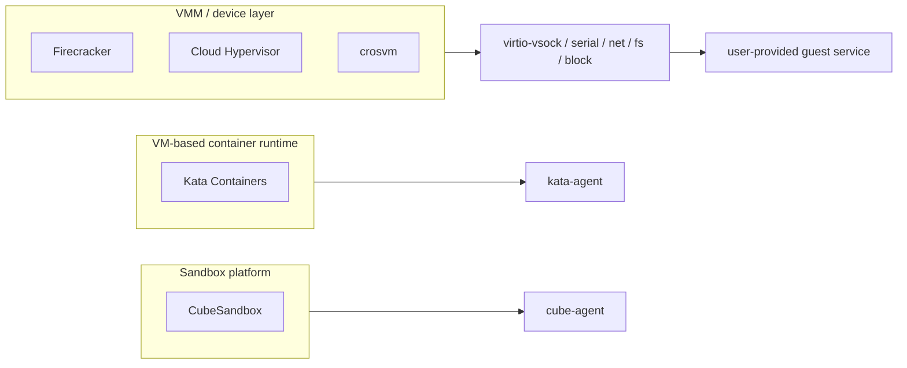
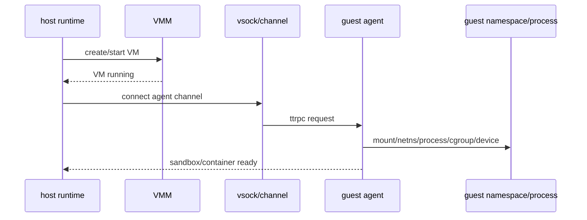

# Guest Agent 与 Runtime 语义跨项目专题分析

本文比较 Firecracker、Cloud Hypervisor、crosvm、Kata Containers 和 CubeSandbox 的 guest agent 边界。

核心问题：Micro-VM 项目是否“需要 agent”，不能只看有没有 vsock。vsock 只是通道；agent 是运行在 guest 内、理解容器或平台语义的长期服务。

## 1. 总结结论

Firecracker、Cloud Hypervisor 和 crosvm 本体不绑定固定 guest agent。它们提供 VM、设备、控制面和 host/guest 通信通道，但不规定 guest 内必须运行什么管理进程。

Kata Containers 和 CubeSandbox 强依赖 guest agent。它们把 container/sandbox 生命周期拆成 host runtime 编排和 guest agent 落地两段。

所以横向比较时，要把“VMM 提供的通道”与“runtime 定义的 guest 语义”分开。

## 2. 比较矩阵

| 项目 | 是否内建固定 agent | Host/guest 通信 | guest 内语义归属 | 关键边界 |
|---|---|---|---|---|
| Firecracker | 否 | virtio-vsock、MMDS、net、serial | 用户镜像自定义 | VMM 不管理容器生命周期 |
| Cloud Hypervisor | 否 | virtio-vsock、console、net、fs、pmem | 用户镜像或上层 runtime | VMM 只建 VM 与设备 |
| crosvm | 否 | Tube、virtio-vsock、console、virtio devices | ChromeOS/Android/上层系统 | 控制面在 host，guest 服务自定义 |
| Kata Containers | 是 | agent ttrpc over vsock/hvsock/remote socket | kata-agent | 容器 create/start/exec 在 guest 内执行 |
| CubeSandbox | 是 | CubeShim ttrpc/vsock，经 `cube.sock` CONNECT | cube-agent | sandbox 网络、storage、container 由 guest agent 收敛 |

## 3. Firecracker：提供通道，不定义 agent

Firecracker 的 API 里有 `SetVsockDevice`，但注释说明它只是设置 vsock 设备，且只能在 microVM boot 前调用：[rpc_interface.rs](../firecracker/src/vmm/src/rpc_interface.rs#L112)。

构建 VM 时，builder 会按配置 attach balloon、block、net、pmem，再 attach unixsock vsock：[builder.rs](../firecracker/src/vmm/src/builder.rs#L221)。

这说明 Firecracker 只把 virtio-vsock 作为设备暴露给 guest。它不规定 guest 内服务协议，也不提供固定 agent client。

Firecracker 的 MMDS 是 metadata 机制。运行期 controller 可以 `GetMMDS`、`PatchMMDS`、`PutMMDS`，但这些操作仍然只是维护 metadata datastore：[rpc_interface.rs](../firecracker/src/vmm/src/rpc_interface.rs#L711)。

vsock 的 snapshot 注释也暴露了边界。vsock 不支持连接随 snapshot 持久化，恢复后是 empty，只发送 `TRANSPORT_RESET_EVENT` 让 guest 处理：[device.rs](../firecracker/src/vmm/src/devices/virtio/vsock/device.rs#L383)。

因此 Firecracker 的 agent 语义属于用户镜像或上层平台。Firecracker 本身只保证通道和设备状态。

## 4. Cloud Hypervisor：现代 VM 管理器，不接管 guest 应用语义

Cloud Hypervisor 的 `DeviceManager` 会创建 block、net、rng、vhost-user、virtio-fs、pmem、vsock、virtio-mem、balloon、watchdog、vDPA 等设备：[device_manager.rs](../cloud-hypervisor/vmm/src/device_manager.rs#L2547)。

运行期也能添加 vsock。`vm_add_vsock()` 校验配置，如果 VM 已存在就调用 `vm.add_vsock()`，否则只更新 `VmConfig`：[lib.rs](../cloud-hypervisor/vmm/src/lib.rs#L2415)。

热插拔路径通过 `hotplug_virtio_pci_device()` 把 virtio device 加入设备列表和 PCI 设备树：[device_manager.rs](../cloud-hypervisor/vmm/src/device_manager.rs#L4935)。

这些能力让 Cloud Hypervisor 很适合作为 Kata 这类 runtime 的后端，但它本体仍不定义 guest container RPC。

换句话说，Cloud Hypervisor 能把 vsock、fs、net、pmem 等设备暴露给 guest。至于 guest 里是否运行 agent、agent 协议是什么，是上层 runtime 或镜像的职责。

## 5. crosvm：控制面强，但不是 container agent

crosvm README 列出大量 virtio 设备：net、block、gpu、snd、fs、9p、console、rng、balloon、vsock、TPM、pmem、video 等：[README.md](../crosvm/README.md#L46)。

架构文档说明 `VirtioDevice::activate()` 会启动 worker thread，设备 worker 接管 queue 和 interrupt 处理：[ARCHITECTURE.md](../crosvm/ARCHITECTURE.md#L149)。

crosvm 的 host 控制面围绕 `VmRequest`。请求包括 exit、power、sleep、suspend、swap、balloon、disk、USB、GPU、sound、VFIO、net hotplug 等：[vm_control/src/lib.rs](../crosvm/vm_control/src/lib.rs#L1572)。

Linux 主路径进入 `run_control()` 后，会拆分 control tubes，并在 wait loop 中监听 VM control socket、设备 tube、VM event、signal 等：[linux.rs](../crosvm/src/crosvm/sys/linux.rs#L3709)。

当 control socket 触发时，`run_control()` 把连接包装成 `TaggedControlTube::Vm`，再构造 `ControlLoopState` 分发请求：[linux.rs](../crosvm/src/crosvm/sys/linux.rs#L4400)。

这个模型很强，但它仍是 host VMM 控制面。它不定义“guest 内创建 OCI container”这类 agent 语义。

## 6. Kata Containers：agent 是容器生命周期执行者

Kata agent README 明确说，agent 是运行在 VM 内的长期进程。runtime 启动 hypervisor 创建 VM 后，agent 负责 VM 内 container 生命周期：[README.md](../kata-containers/src/agent/README.md#L5)。

Kata 的关键不是“有 vsock”，而是 host runtime 和 guest agent 之间有固定协议。agent 配置可通过 guest kernel command line 配置：[README.md](../kata-containers/src/agent/README.md#L117)。

guest 侧 `AgentService` 持有 `Sandbox`，这是 agent RPC handler 的核心状态：[rpc.rs](../kata-containers/src/agent/src/rpc.rs#L191)。

`create_container()` RPC 先做 policy 检查，再进入 `do_create_container()`；后者解析 OCI spec、storages、devices，并在 guest 内准备容器资源：[rpc.rs](../kata-containers/src/agent/src/rpc.rs#L864)，[rpc.rs](../kata-containers/src/agent/src/rpc.rs#L199)。

`create_sandbox()` RPC 设置 hostname、sandbox id、running 状态，加载 kernel module，建立共享 namespace，然后处理 sandbox storages：[rpc.rs](../kata-containers/src/agent/src/rpc.rs#L1383)。

`online_cpu_mem()` RPC 调 `sandbox.online_cpu_memory()`，说明 CPU/memory resize 也需要 guest agent 配合，让 guest 内资源上线：[rpc.rs](../kata-containers/src/agent/src/rpc.rs#L1497)。

因此 Kata 的 runtime 边界是三层：host runtime 准备资源，VMM 暴露设备，guest agent 把 OCI/container 语义落到 guest 内 namespace、mount、process、cgroup 和 device。

## 7. CubeSandbox：agent 承担 sandbox ready 的最后一段

CubeShim README 直接给出关系：containerd 通过 shim v2 API 到 CubeShim，CubeShim 通过 ttrpc 到 in-VM `cube-agent`，最后 workload 运行在 MicroVM 内：[README.md](../CubeSandbox-sandbox-clone/CubeShim/README.md#L7)。

CubeShim 角色说明也明确：它向下转发 `Create / Start / Exec / Kill / Delete` 到 VM 内 `cube-agent` over ttrpc/vsock：[README.md](../CubeSandbox-sandbox-clone/CubeShim/README.md#L20)。

创建 sandbox 时，CubeShim 先 `start_vm()`，再 `connect_agent()`。连接成功后，才构造 `CreateSandboxRequest`，包含 storages、DNS、interfaces、routes、ARPNeighbors 和 cube VIP：[sb.rs](../CubeSandbox-sandbox-clone/CubeShim/shim/src/sandbox/sb.rs#L436)。

CubeShim 连接 agent 的实现是连接 sandbox 目录下 `cube.sock`，再写入 `CONNECT 1024`，把 host Unix socket 转到 guest vsock 端口：[utils.rs](../CubeSandbox-sandbox-clone/CubeShim/shim/src/common/utils.rs#L361)。

CubeShim 根据 snapshot 情况设置 `StartMode::SNAPSHOT` 或 `StartMode::RESTORE`，因此 agent create sandbox 不只是普通初始化，也承载 snapshot/restore 语义：[sb.rs](../CubeSandbox-sandbox-clone/CubeShim/shim/src/sandbox/sb.rs#L482)。

container create 阶段，CubeShim 构造 `CreateContainerRequest`，携带 container id、exec id、storages、OCI spec 和 custom files，再调用 agent：[container/mod.rs](../CubeSandbox-sandbox-clone/CubeShim/shim/src/container/mod.rs#L373)。

guest agent 启动时创建 `Sandbox`。如果是 init mode，还会先处理 localhost 网络：[main.rs](../CubeSandbox-sandbox-clone/agent/src/main.rs#L347)。

agent 的 `create_sandbox()` 在 RESTORE 模式下只追加 virtiofs storage 并返回。普通模式会等待 PCI 网卡，调用 rtnetlink 更新 interface，后续处理 route、ARP、storage 和 DNS：[rpc.rs](../CubeSandbox-sandbox-clone/agent/src/rpc.rs#L1224)。

这解释了 CubeSandbox 的 ready 语义：VM boot 成功还不够，CubeShim 必须连上 cube-agent，并且 guest agent 必须完成 sandbox 网络和存储配置。

## 8. 两类边界最容易混淆

第一类混淆是“有 vsock”等于“有 agent”。Firecracker、Cloud Hypervisor、crosvm 都能提供 vsock 或类似通道，但 agent 协议不是 VMM 本体的一部分。

第二类混淆是“VMM ready”等于“sandbox ready”。Kata 和 CubeSandbox 中，VMM ready 只表示 VM 启动并可连接；sandbox ready 还要求 agent 完成 guest 内配置。

对 Kata 来说，这个误判往前还要再加一层：

`HotplugAddDevice succeeded` 也不等于 guest 已 ready。

Kata 的 host runtime 在 `AddDevice` / `HotplugAddDevice` 之后，经常还会继续发 `UpdateInterface`、`UpdateRoutes`、`addARPNeighbors`、`add_storages`、`onlineCPUMem` 这类 agent RPC。guest 侧再继续等待 PCI 设备出现、mount storage、online CPU/memory、更新 netlink 状态。也就是说，设备请求被 hypervisor 接受之后，guest-visible 收敛链还远没结束。

## 9. ARM64 与 x86_64 视角

对 Firecracker、Cloud Hypervisor 和 crosvm，架构差异主要影响机器描述、设备枚举、中断控制器和 transport。guest agent 不是它们的固定边界。

对 Kata 和 CubeSandbox，agent 源码大体按架构构建，但实际能力受 guest kernel、设备总线、PCI/MMIO 路径、vsock/hvsock、virtio-fs/block/net 和 runtime 配置影响。

ARM64 分析要特别避免只验证 VMM boot。对 Kata/CubeSandbox，必须验证 agent RPC、guest 网络、storage mount、CPU/memory online 和 container create/start。

对 Kata 的 ARM64 路线尤其如此。host 侧看到 `add_device()` 或 `HotplugAddDevice()` 成功，只能证明“请求表达成功”；如果 guest 侧还在等待 PCI/MMIO 设备出现、还没完成 `update_interface()` 或 `add_storages()`，那问题已经处在 agent / guest-visible 收敛层，而不是 Kata runtime 自己的中断或 I/O 实现层。

## 10. 结论

VMM 项目的交付物是“可运行、可控制、可暴露设备的 VM”。runtime/platform 项目的交付物是“guest 内语义可管理的 sandbox/container”。

Firecracker、Cloud Hypervisor、crosvm 是 agent 的基础设施提供者。Kata 和 CubeSandbox 是 agent 语义的定义者和使用者。

理解这个边界后，很多能力差异会变清楚：VMM snapshot 不等于 container snapshot，vsock restore 不等于 agent 连接恢复，VM boot 不等于 sandbox ready。
