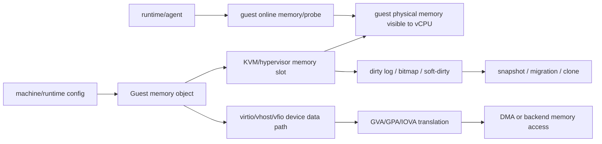

# Guest Memory、DMA/IOMMU 与地址转换跨项目专题分析

本文从源码出发，对比 Firecracker、Cloud Hypervisor、crosvm、Kata Containers 与 CubeSandbox 的 guest memory、DMA、IOMMU、dirty tracking 和 guest 内存热插拔语义。

这条路线要先分清三层：host 用户态内存映射、hypervisor memory slot、设备 DMA 可见地址。VMM 层通常只负责前两层，IOMMU 与 runtime 层会决定第三层如何被约束。

## 1. 总体模型

源码里的关键判断是：设备看到的是 guest physical address、guest virtual address、还是 I/O virtual address。Firecracker 基本绕过 vIOMMU；Cloud Hypervisor 与 CubeSandbox 有 AccessPlatform；crosvm 有 virtio-iommu。

## 2. 横向矩阵

| 项目 | guest memory owner | slot 注册 | 设备访问内存 | IOMMU/DMA 边界 | dirty/snapshot |
|---|---|---|---|---|---|
| Firecracker | `GuestMemoryMmap` 与 `GuestRegionMmap` | `Vm::register_dram_memory_regions` 调 KVM user memory region | virtio 设备直接用 `GuestMemoryMmap` slice/host pointer | 未见通用 vIOMMU 数据面 | KVM dirty bitmap + VMM bitmap，支持 full/diff/UFFD |
| Cloud Hypervisor | `MemoryManager` 与 `guest_ram_mappings` | `create_userspace_mapping` 创建 hypervisor memory slot | virtio-pci、vhost-user、vDPA 共享 guest memory/vring 地址 | `AccessPlatformMapping` 给 vIOMMU/SEV-SNP 翻译 | VM dirty log 与 VMM bitmap 做 OR |
| crosvm | `GuestMemory` 持有 regions/backing object | `KvmVm::new` 遍历 regions 调 `KVM_SET_USER_MEMORY_REGION` | virtio worker、vhost、VFIO mapper | `virtio-iommu` 管 IOVA 到 GPA/host mmap | snapshot/suspend 统一收敛 VM 与设备状态 |
| Kata Containers | hypervisor plugin 内部拥有 VM memory | 由 QEMU/CH/FC 等 plugin 完成 | runtime 只描述设备和资源 | QEMU arch 层决定 vIOMMU；arm64 QEMU 明确不支持 | runtime state + hypervisor save + agent state |
| CubeSandbox | CubeHypervisor `MemoryManager` + CubeCoW memory volume | 继承 CH 式 `create_userspace_mapping` | CubeHypervisor virtio/vhost，加平台 fd/volume 绑定 | 继承 `AccessPlatformMapping`，平台层无直接 DMA | VM dirty log/VMM bitmap + CubeCoW catalog |

## 3. Firecracker：直接、窄边界的 guest memory

**设计取向**：guest memory 注册与设备解耦，内置 virtio 设备**直接**用 host pointer 访问，不经通用 IOMMU 翻译层——路径短、可审计，但复杂 DMA 隔离不是内建能力。

### 3.1 内存注册（先于设备）

| 步骤 | 机制 | 符号 |
|---|---|---|
| 分配 | `allocate_guest_memory()` | `builder.rs` |
| 建对象 | 创建 KVM/Vm/vCPU | — |
| 注册 DRAM | `register_dram_memory_regions(guest_memory)` 遍历 region 注册 | `vstate/vm.rs` |
| slot 包装 | `set_user_memory_region()` 包 KVM ioctl；`register_memory_region()` 插入 guest memory 并按 slot 注册（或保护未插入 hotplug slot） | `vstate/vm.rs` |
| hotplug | `register_hotpluggable_memory_region()` 按 slot size 切分，记 plugged bitmap | `vstate/vm.rs` |

内存注册发生在 DeviceManager 创建**之前**。

### 3.2 设备数据面：直接 host pointer

block async I/O 是典型：`push_read()`/`push_write()` 经 `mem.get_slice(addr, count)` 取 guest memory slice，把 host pointer 直接传给 io_uring。源码只见到生成的 `VIRTIO_ID_IOMMU`、`VIRTIO_F_IOMMU_PLATFORM` 常量与 KVM IOMMU cap 枚举，**没有设备数据面的 vIOMMU 实现**。

### 3.3 snapshot：围绕 memory slot

| 模式 | 机制 | 符号 |
|---|---|---|
| full/diff | `snapshot_memory_to_file()` 支持 full 与 diff；diff 读 dirty bitmap 调 `dump_dirty` | — |
| restore | 用 `GuestMemoryState` 的 plugged bitmap 重建区域 | — |

**能力边界**：少设备、少地址翻译层、强约束——内存数据面易审计，但复杂 DMA 隔离非核心内建能力。

## 4. Cloud Hypervisor：MemoryManager 统筹 slot 与 DMA 翻译

**设计取向**：内存不散落在设备里，而由 `MemoryManager` 集中持有 slot、zones、dirty log 与 `guest_ram_mappings`；IOMMU/vhost/vDPA/virtio-mem/dirty log 都收束到 MemoryManager/DeviceManager 交界。

### 4.1 slot 注册

| 步骤 | 机制 | 符号 |
|---|---|---|
| 状态 | 持 `boot_guest_memory`/`guest_memory`/zones/dirty log/`guest_ram_mappings` | `MemoryManager` |
| 遍历 | `allocate_address_space()` 遍历 zone + virtio-mem region | — |
| 注册 | 每 region 调 `create_userspace_mapping()`，写 slot/GPA/size/zone id/virtio-mem 标记入 `GuestRamMapping` | — |
| 落地 | `create_userspace_mapping()` 分配 slot 并调 hypervisor `create_user_memory_region(slot, gpa, size, userspace_addr, readonly, log_dirty)` | — |

### 4.2 设备地址翻译

| 路径 | 翻译机制 | 符号 |
|---|---|---|
| virtio-pci（挂 vIOMMU） | `DeviceManager` 建 `AccessPlatformMapping`（注释明确为 virtio 提供地址翻译） | — |
| queue ready | common config 对 desc/avail/used 调 `access_platform.translate_gva()` 写回 queue | — |
| vhost-user | `update_mem_table(mem)` + `get_host_address_range()` 把 vring guest address 转 host address 发 backend | — |
| vDPA | `translate_gpa(access_platform, len)` 设 vring 地址 | — |

### 4.3 dirty log

`start_dirty_log()` 启动 VM dirty log 并 reset guest memory bitmap；`dirty_log()` 逐个 `GuestRamMapping` 取 hypervisor dirty log，再与 VMM bitmap 做 OR。

**能力边界**：内存模型完整——slot、virtio-mem、vhost-user、vDPA、IOMMU、dirty log 都在统一管理器结构里。

## 5. crosvm：显式 GuestMemory + virtio-iommu 设备

**设计取向**：`GuestMemory` 是基础容器，KVM slot、vhost mem table、virtio-iommu mapper 各自从它派生——偏"可组合设备平台"，DMA 语义更显式，组件复杂度更高。

### 5.1 内存容器与 slot

| 项 | 机制 | 符号 |
|---|---|---|
| 容器 | `vm_memory::GuestMemory`；`MemoryRegion` 记 guest base/host mapping/backing object/options（purpose/align/file backed） | — |
| 构造 | `GuestMemory::new_with_options()` 先建共享内存或文件映射，再生成 region 列表 | — |
| 暴露 | `regions()` 暴露 guest addr/size/host addr/backing object/offset/options | — |
| slot | `set_user_memory_region()` 包 `KVM_SET_USER_MEMORY_REGION`（注释：建 GPA→host user pages 映射） | — |
| 注册 | `KvmVm::new()` 建 VM 后遍历 `guest_mem.regions()` 每 region 一个 slot；运行期 `add/remove_memory_region()` 同 ioctl | — |

### 5.2 virtio-iommu 与 mapper

| 项 | 机制 | 符号 |
|---|---|---|
| map | `process_dma_map_request()` 校验 domain/range/flag 后把 IOVA/GPA/size/protection 放入 mapper，或对 dmabuf 调 `vfio_dma_map()` | — |
| 映射表 | `memory_mapper.rs` 的 `MappingInfo` 管 IOVA→GPA；`MemoryMapper` 服务 VFIO 与其他 IOMMU backend（映射存在时才能访问） | — |
| vhost | `set_mem_table()` 遍历 regions 把 GPA/size/userspace addr 写 kernel vhost memory table | — |

**能力边界**：抽象偏可组合设备平台；virtio-iommu + mapper 让 DMA 显式，但组件复杂度更高，适合多进程设备/Android/ChromeOS/PVM。

## 6. Kata Containers：runtime 持语义，不持 slot

**设计取向**：不实现底层 guest memory 数据面，而是编排它。runtime/agent 把"VM memory change"变成"容器 sandbox 可用"，能力边界由选用的 hypervisor 决定。

### 6.1 runtime/hypervisor 边界

| 层 | 机制 | 符号 |
|---|---|---|
| runtime-rs | `Hypervisor` trait 暴露 `resize_memory`/设备增删改，不暴露 KVM slot 细节 | — |
| QEMU arch | `qemuArch` 定义 `memoryTopology()`/`appendIOMMU()`/`supportGuestMemoryHotplug()`，把架构差异封到 hypervisor/arch 层 | — |

### 6.2 架构能力门控

| 架构 | 能力 | 符号 |
|---|---|---|
| amd64 | `supportGuestMemoryHotplug()` 对非 microvm 且非 guest protection 返回 true | — |
| arm64 | `appendIOMMU()` 直接返回错误 "Arm64 architecture does not support vIOMMU" | — |

### 6.3 guest agent 收尾

| RPC | 机制 | 符号 |
|---|---|---|
| online | `online_cpu_mem` → `sandbox.online_cpu_memory()`，非 cpu-only 时调 `online_memory()` | — |
| 探测 | `get_guest_details()` 读 memory block size 与 hotplug probe 支持；`mem_hotplug_by_probe()` 向 sysfs probe 地址写请求 | — |

**能力边界**：分析 Kata 时应持续追问"这个能力来自哪个 plugin"；runtime/agent 只编排，不实现数据面。

## 7. CubeSandbox：CH 内核 + 平台内存语义

**设计取向**：底层延续 Cloud Hypervisor 风格内存模型，平台层把 guest memory 变成可复制/可回滚/可调度的 sandbox 资产（与 CubeCoW rootfs/volume、catalog、rollback 绑定）。

### 7.1 slot 注册（CH 式）

| 步骤 | 机制 | 符号 |
|---|---|---|
| 状态 | `MemoryManager` 持 `guest_memory`/zones/dirty log/`soft_dirty_armed`/`guest_ram_mappings` | — |
| 遍历 | `allocate_address_space()` 遍历 zone + virtio-mem region 调 `create_userspace_mapping()`，记 slot/GPA/size/zone id/virtio-mem/file offset | — |
| 落地 | `vm.make_user_memory_region()` + `vm.create_user_memory_region()` | — |

### 7.2 设备地址翻译（继承 AccessPlatform）

| 项 | 机制 | 符号 |
|---|---|---|
| IOMMU mapping | `DeviceManager` 有 IOMMU mapping 时建 AccessPlatform，外部 DMA handler 挂 virtual IOMMU；否则直接 map DMA ranges | — |
| queue ready | virtio-pci common config 对 desc/avail/used 调 `access_platform.translate_gva()`（与 CH 同类边界） | — |

### 7.3 平台层 + dirty log

- **平台语义**：VM memory snapshot 与 CubeCoW rootfs/volume、catalog、`TemplateReplica`、rollback binding 组合成产品级 clone/rollback。
- **dirty log**：`start_dirty_log()` 启动 VM dirty log + reset bitmap；`dirty_log()` 把 VM dirty bitmap 与 VMM bitmap 做 OR；`soft_dirty_armed` 服务增量 snapshot 周期。

**能力边界**：底层像 Cloud Hypervisor，平台层把 guest memory 变成可复制/回滚/调度的 sandbox 资产——能力边界不只取决于 VMM，还取决于平台一致性。

## 8. ARM64 与 x86_64 差异

| 项目 | 差异 |
|---|---|
| Firecracker | slot 机制两架构相似；差异在启动与设备枚举（x86 PCI/ACPI/PIO，arm64 MMIO/FDT/GIC） |
| Cloud Hypervisor | MemoryManager 跨架构复用；差异在机器描述、IOMMU 平台能力、CoCo feature、设备呈现，非 `create_userspace_mapping()` 本身 |
| crosvm | `MemoryRegionPurpose` 有 aarch64 专用 `StaticSwiotlbRegion`；memory options 注释提到 arm64 KVM 对透明大页 block alignment 的需求 |
| Kata | amd64 支持非 microvm/非 protection 的 memory hotplug；arm64 `appendIOMMU()` 明确不支持 vIOMMU |
| CubeSandbox | 底层复用 CH 式模型；ARM64 是重点目标，需特别验证 arm64 kernel/GIC/FDT/eBPF/CubeVS/snapshot restore 组合 |

## 9. 能力边界

| 项目 | 适合场景 | 边界 |
|---|---|---|
| Firecracker | 受控设备集 + 直接 guest memory 访问 | 路径短/攻击面小/可审计；缺通用 vIOMMU/复杂 DMA 设备模型 |
| Cloud Hypervisor | 通用 cloud VM | slot/virtio-mem/vhost-user/vDPA/IOMMU/dirty log 统一管理 |
| crosvm | 多进程设备/隔离 worker/Android/ChromeOS/PVM | virtio-iommu + mapper 让 DMA 显式，组件复杂度更高 |
| Kata | container runtime 语义 | 不自研内存数据面，能力来自 plugin |
| CubeSandbox | 产品化状态管理 | VM memory 与 rootfs/网络/catalog/rollback 绑定，边界取决于平台一致性 |

## 10. 后续深挖建议

1. Firecracker：`GuestMemoryMmap → KVM memory slot → virtio block/net buffer → dirty bitmap → snapshot file` 函数级链路。
2. CH vs CubeSandbox：对比 `AccessPlatformMapping`，确认 vIOMMU/SEV-SNP/vDPA/vhost-user 四条路径分别在哪翻译地址。
3. crosvm：virtio-iommu 的 attach/map/unmap/fault 生命周期，与 VFIO、VVU proxy、device jail 的关系画成时序图。
4. Kata/CubeSandbox：guest agent online memory、host hypervisor resize、平台 metadata 更新之间的一致性边界。
