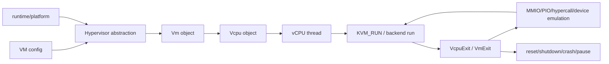

# Hypervisor/KVM/vCPU 执行边界跨项目专题分析

本文从源码出发，对比 Firecracker、Cloud Hypervisor、crosvm、Kata Containers 与 CubeSandbox 的 hypervisor 抽象、KVM 绑定、vCPU 创建、vCPU run loop 和 ARM64/x86_64 差异。

这条路线的核心问题是：项目是否直接面向 KVM，还是先抽象出 hypervisor trait；vCPU exit 是在 hypervisor 层处理，还是返回到 VMM/control loop 再分发。

## 1. 总体模型

Firecracker 把这个链路压缩到 KVM。Cloud Hypervisor 与 CubeSandbox 抽出 hypervisor crate。crosvm 的抽象更宽，支持多后端。Kata 站在 runtime 层，只调用 plugin 能力。

## 2. 横向矩阵

| 项目 | hypervisor 边界 | VM/vCPU 创建 | vCPU run loop | exit 处理 | ARM64/x86_64 关注点 |
|---|---|---|---|---|---|
| Firecracker | 直接 KVM，`KvmVcpu` 是 arch 封装 | `Vm::create_vcpus` 调 `Vcpu::new`，再 `KvmVcpu::new` | `Vcpu::run -> StateMachine -> run_emulation` | MMIO 通用，PIO 只在 x86 arch emulation | x86 配 CPUID/MSR/PIO；arm64 `vcpu_init`、MPIDR、PSCI |
| Cloud Hypervisor | `hypervisor::Hypervisor/Vm/Vcpu` trait | `CpuManager::create_vcpu` 调 `vm.create_vcpu` | vCPU 线程中循环调用 `vcpu.run()` | KVM backend 可直接调用 `VmOps` 处理 PIO/MMIO | x86 KVM/Mshv/TDX；arm64 KVM IPA、GIC、SVE |
| crosvm | `hypervisor::Vm/Vcpu` 覆盖多后端 | `runnable_vcpu` 可在线程内创建 vCPU | `run_vcpu -> vcpu_loop -> vcpu.run()` | run loop 调 `handle_io/handle_mmio/handle_hypercall` | x86 PIO/APIC；arm64 GIC/PSCI；还含 Gunyah/Geniezone 等 |
| Kata Containers | runtime-rs `Hypervisor` plugin | plugin 自己调用 FC/CH/QEMU/Dragonball | runtime 不进入 vCPU loop | runtime 只看到 start/stop/pause/save/resize | QEMU arch 封装 topology/IOMMU；arm64 有 vIOMMU 限制 |
| CubeSandbox | Cloud Hypervisor 派生抽象 | `CpuManager` 调 `hypervisor::Vm::create_vcpu` | vCPU 线程循环 `vcpu.run()` | KVM backend 通过 `VmOps` 处理 MMIO/PIO | 增加 `KvmPvm`，arm64 PMU fallback，平台 restore 依赖状态 |

## 3. Firecracker：直接围绕 KVM 的 vCPU 状态机

**设计取向**：VMM 直接拥有 KVM fd、VcpuFd、KVM_RUN exit 语义，vCPU 生命周期是显式 Paused/Running 状态机。换后端不是架构目标——边界最窄、最易审计。

### 3.1 创建与线程化

| 步骤 | 机制 | 符号 |
|---|---|---|
| 创建 vCPU | `Vm::create_vcpus()` 先 arch pre-create，建共享 exit eventfd，循环 `Vcpu::new(cpu_idx, self, exit_evt)` | — |
| arch 封装 | `Vcpu::new()` 直接 `KvmVcpu::new(index, vm)`；x86 调 `vm.fd().create_vcpu()`，arm64 也建 VcpuFd 并准备 `kvm_vcpu_init` | `KvmVcpu::new` |
| 线程化 | `Vcpu::start_threaded()` 移独立线程，复制 VcpuFd，装 kick signal handler，等 barrier，调 `self.run(filter)` | — |

### 3.2 run loop（状态机）

| 阶段 | 机制 | 符号 |
|---|---|---|
| 装过滤器 | `Vcpu::run()` 先给线程装 seccomp filter | — |
| 状态机 | 进 `StateMachine::run(self, Self::paused)`（显式 Paused/Running） | — |
| Running | 反复 `run_emulation()`：检查 `immediate_exit`，执行 `self.kvm_vcpu.fd.run()`，按 `VcpuExit` 分发 MMIO/SystemEvent/内部错误/arch-specific | — |
| x86 exit | `run_arch_emulation()` 处理 `VcpuExit::IoIn/IoOut`，访问 PIO bus | — |
| arm64 exit | `run_arch_emulation()` 对非预期 exit 直接报错（主路径是 MMIO） | — |

### 3.3 配置阶段（arch 分发）

| 架构 | 配置 | 符号 |
|---|---|---|
| x86_64 | `configure()` 设 CPUID/MSR/boot regs | — |
| arm64 | `init_vcpu()` 调 `vcpu_init`；启用 PMU_V3 但未初始化 PMU 时返回不支持 | — |

**能力边界**：vCPU 执行边界很窄，VMM 直接拥有 KVM 语义；代价是后端不可替换，复杂平台能力不在核心路径。

## 4. Cloud Hypervisor：hypervisor trait 隔离 KVM/Mshv

**设计取向**：边界在 `hypervisor` crate。VMM 层只关心 `VmExit` 语义，KVM/Mshv/CoCo 细节压在 backend，可统一管理 CPU hotplug/pause/migration。

### 4.1 后端无关状态

`hypervisor` crate 定义 `CpuState`/`VcpuInit`/`StandardRegisters` 等后端无关枚举，KVM 与 Mshv 状态都封在里面。VMM 层 `Vcpu` 只持 `Box<dyn hypervisor::Vcpu>`。

### 4.2 创建与配置

| 步骤 | 机制 | 符号 |
|---|---|---|
| 创建 | `Vcpu::new()` 经 `vm.create_vcpu(apic_id, vm_ops)` | — |
| id 计算 | `CpuManager::create_vcpu()` 算 x86 APIC id 或 arm64/riscv cpu id | — |
| restore | 从 snapshot 取 `CpuState`，调 `vcpu.vcpu.set_state(&state)` | — |
| 配置（arch 分发） | arm64 先 `init(vm)` 读 preferred target + 设 processor features + `vcpu_init`；x86 走 CPUID/Hyper-V/topology/nested | `Vcpu::configure()` |

### 4.3 run loop

| 阶段 | 机制 | 符号 |
|---|---|---|
| 线程 | `CpuManager::start_vcpu()` 建线程、设 affinity/core scheduling/seccomp/signal handler/barrier | — |
| 循环 | 处理 pause/kick/kill，再 `vcpu.run()` | — |
| pause 前 | 用 `immediate_exit` 再进一次 KVM_RUN（注释：让 pending PIO/MMIO 在 kernel 内完成，避免迁移时 guest state 不一致） | — |
| backend run | `KvmVcpu::run()` 调 `self.fd.run()`，KVM exits 转 `cpu::VmExit` | — |

### 4.4 KVM backend 细节

| 项 | 机制 | 符号 |
|---|---|---|
| 初始化 | `KvmHypervisor::new()` 打开 KVM、校验 API version | — |
| 建 VM | `create_vm()` 按架构与 TDX/IPA 能力创建 VM，返回 `Arc<dyn vm::Vm>` | — |
| 建 vCPU | `KvmVm::create_vcpu()` 调 `VmFd::create_vcpu()` 封成 `KvmVcpu` | — |
| exit 折叠 | 与 Firecracker 不同，KVM backend 可在 `KvmVcpu::run()` 内经 `VmOps` 直接处理 PIO/MMIO，折叠成 `VmExit::Ignore` | — |

**能力边界**：允许 KVM/Mshv/CoCo 差异被 backend 封装，VMM 统一管理 CPU hotplug/pause/migration。

## 5. crosvm：更宽的 hypervisor 平台抽象

**设计取向**：重点不是"一个 KVM VMM"，而是可替换 hypervisor 后端 + 设备/irq/run loop 平台。抽象层更厚，适合多后端与设备进程隔离。

### 5.1 宽 trait

| trait | 能力 | 符号 |
|---|---|---|
| `hypervisor::Vm` | guest memory/memory region/dirty log/设备创建/irqfd/ioeventfd（不只是 vCPU） | — |
| `hypervisor::Vcpu` | `run()`/`set_immediate_exit()`/`signal_handle()`/`handle_mmio()`/`handle_io()`/`handle_hypercall()`（exit 处理拆两阶段） | — |
| `VcpuExit` | Io/Mmio/Hypercall/Hlt/Shutdown/SystemEventReset/SystemEventCrash/BusLock/Sbi/RiscvCsr | — |

### 5.2 KVM backend

| 项 | 机制 | 符号 |
|---|---|---|
| 初始化 | `Kvm::new()` 打开 `/dev/kvm`、校验 `KVM_GET_API_VERSION`、读 `KVM_GET_VCPU_MMAP_SIZE` | — |
| 建 VM | `KvmVm::new()` 用 `KVM_CREATE_VM` | — |
| run | `KvmVcpu::run()` 直接 ioctl `KVM_RUN`，读 mmap `kvm_run`，先 arch-specific 处理 exit，再映射通用 `VcpuExit` | — |

### 5.3 Linux 路径 run loop

| 阶段 | 机制 | 符号 |
|---|---|---|
| vCPU 准备 | `runnable_vcpu()` 需要时在线程内 `vm.create_vcpu(vcpu_id)`，加入 irqchip，调 `Arch::configure_vcpu()` | — |
| 线程 | `run_vcpu()` 建 `crosvm_vcpu{cpu_id}` 线程，设调度/cgroup/barrier，调 `vcpu_loop()` | — |
| 循环 | `vcpu_loop()` 调 `irq_chip.wait_until_runnable()` 再 `vcpu.run()`；遇 Io/Mmio/Hypercall 调 `handle_io()`/`handle_mmio()`/`handle_hypercall()` 分发到 bus | — |

**能力边界**：抽象 VM/VCPU/IRQ/memory/device backend，适合多 hypervisor + 多进程设备模型，阅读成本更高。

## 6. Kata Containers：runtime plugin，不拥有 KVM run loop

**设计取向**：Kata 的"hypervisor"不是虚拟化后端源码层，而是容器 runtime 插件层。runtime 不进入 vCPU loop；要理解 vCPU loop 必须下钻到具体 plugin 的 VMM。

### 6.1 runtime-rs `Hypervisor` trait（runtime 语义）

定义 `prepare_vm`/`start_vm`/`stop_vm`/`wait_vm`/`pause_vm`/`save_vm`/`resume_vm`/`resize_vcpu`/`resize_memory`，以及 `add_device`/`remove_device`/`update_device`、agent socket、thread ids、pids、capabilities、guest memory block size。**这些是 runtime 语义，不是 KVM 语义。**

### 6.2 各 plugin 实现

| plugin | 实现 | 符号 |
|---|---|---|
| Firecracker | `impl Hypervisor for Firecracker` 拿 inner lock 调 `inner.prepare_vm/start_vm/pause_vm/resume_vm/save_vm/resize_memory`；runtime 不进入 VcpuFd | — |
| Cloud Hypervisor | `prepare_vm()` 设 sandbox 环境与 guest protection，`start_vm()` 启动 hypervisor server 再 `boot_vm()`，置 `VmRunning` | — |

### 6.3 Go virtcontainers 与 QEMU arch

| 项 | 机制 | 符号 |
|---|---|---|
| 后端枚举 | `HypervisorType` 含 firecracker/qemu/clh/stratovirt/dragonball/virtframework/remote/mock | — |
| QEMU arch | `cpuTopology()`/`memoryTopology()`/`appendIOMMU()`；arm64 `appendIOMMU()` 返回 "Arm64 architecture does not support vIOMMU" | — |

**能力边界**：抽象"容器 sandbox 所需的 VM 能力"，不是 KVM run loop；底层能力必须追到具体 hypervisor plugin。

## 7. CubeSandbox：Cloud Hypervisor 派生 + PVM/平台边界

**设计取向**：底层 VMM 基本是 Cloud Hypervisor 派生模型，平台目标让它更关注 PVM、snapshot/restore、rollback 与 sandbox 生命周期。

### 7.1 hypervisor trait

| trait | 能力 | 符号 |
|---|---|---|
| `Hypervisor` | 返回 hypervisor type、创建 Vm、取 CPUID、检查扩展、取 arm64 IPA limit | — |
| `Vm` | `create_vcpu(id, vm_ops)`/irqchip/irqfd/ioeventfd | — |
| `Vcpu` | 寄存器/state/`run()`/x86 `translate_gva()` | — |

### 7.2 创建与配置

| 步骤 | 机制 | 符号 |
|---|---|---|
| 创建 | `Vcpu` 持 `Arc<dyn hypervisor::Vcpu>`；`Vcpu::new()` 调 `vm.create_vcpu(id, vm_ops)` | — |
| 配置 | `configure()` 按 x86_64/arm64 分发 | — |
| arm64 PMU | 比 Firecracker 更宽松：先尝试带 `KVM_ARM_VCPU_PMU_V3` 的 `vcpu_init`，失败记 warn 后 fallback 不带 PMU | — |

### 7.3 run loop + PVM 识别

| 项 | 机制 | 符号 |
|---|---|---|
| 线程 | `CpuManager` 启线程、设 affinity、装 vCPU seccomp、注册 signal handler、等 barrier；循环处理 pause/kill，pause 前用 `immediate_exit` 完成 pending KVM_RUN | — |
| PVM 识别 | `KvmHypervisor::new()` 扫描 CPUID，发现特定 vendor 标记则 type 改 `KvmPvm` | — |
| run | `KvmVcpu::run()` 与 CH 类似：调 KVM run，PIO/MMIO 交 `VmOps`，返回 `VmExit::Ignore`/Reset/Shutdown/Hyperv/Tdx/Debug | — |

**能力边界**：底层像 Cloud Hypervisor，外层满足 sandbox clone/rollback/PVM/agent lifecycle 产品语义；平台 restore 还要恢复 vCPU state 与 GIC redistributor type。

## 8. ARM64 与 x86_64 对比

| 项目 | x86_64 | ARM64 |
|---|---|---|
| Firecracker | CPUID/MSR/PIO bus/i8042 reset | `vcpu_init`/MPIDR/PSCI/FDT/GIC/MMIO |
| Cloud Hypervisor | CPUID/topology/Hyper-V/TDX | preferred target/SVE/IPA/GIC（都走 `hypervisor::Vcpu`） |
| crosvm | PIO/APIC（`Arch::configure_vcpu()` + irqchip + KVM arch exit handler） | MMIO/GIC/PSCI |
| Kata | plugin 与 QEMU arch 层差异 | Go QEMU arm64 明确限制 vIOMMU；runtime-rs 不关心 vCPU exit |
| CubeSandbox | `KvmPvm` + TDX/PVM 识别 | PMU fallback；平台 restore 恢复 vCPU state + GIC redistributor type |

## 9. 能力边界

| 项目 | 边界 | 代价/取舍 |
|---|---|---|
| Firecracker | 直接 KVM、少 abstraction、少 exit 种类、易审计 | 后端不可替换，复杂平台能力不在核心路径 |
| Cloud Hypervisor | hypervisor trait，KVM/Mshv/CoCo 差异由 backend 封装 | 统一管理 CPU hotplug/pause/migration |
| crosvm | 系统虚拟化平台，抽象 VM/VCPU/IRQ/memory/device backend | 适合多 hypervisor + 多进程设备，阅读成本高 |
| Kata | runtime，抽象"容器 sandbox 所需的 VM 能力" | 底层能力必须追到具体 plugin |
| CubeSandbox | 平台化 Micro-VM，底层像 CH | 外层满足 clone/rollback/PVM/agent lifecycle 产品语义 |

## 10. 后续深挖建议

1. Firecracker：`VcpuEvent → StateMachine → KVM_RUN → VcpuExit → MMIO/PIO → pause/save` 时序图。
2. CH vs CubeSandbox：对比 `CpuManager::start_vcpu()`，确认 pause 前 `immediate_exit` 对 migration/snapshot 的必要性。
3. crosvm：`VcpuExit` 扩展点，追踪一个 MMIO exit 从 KVM backend 到 `mmio_bus.write()` 的完整调用链。
4. Kata：把 `Hypervisor` trait 与底层 Firecracker/Cloud Hypervisor plugin 做两层图，避免把 runtime hypervisor 误解为 KVM backend。
