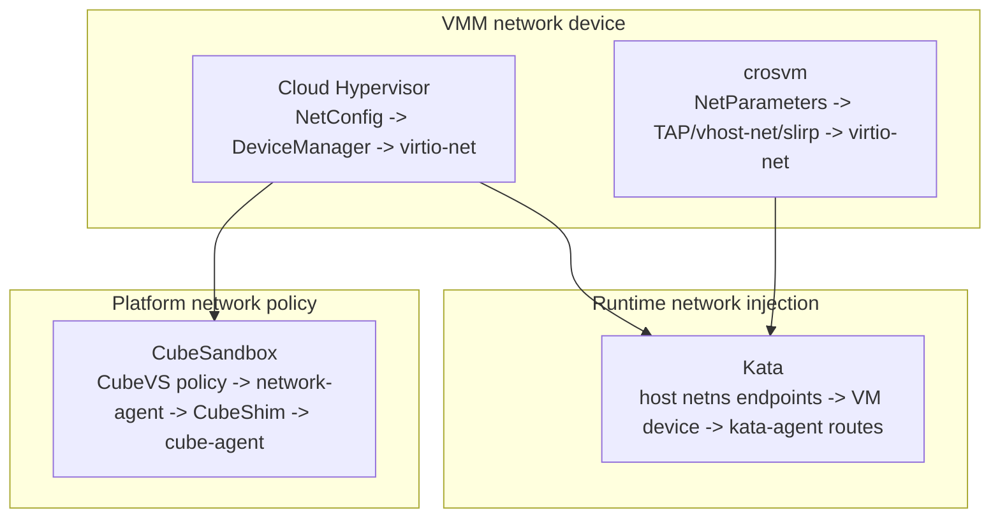
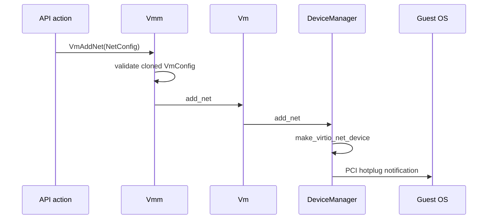
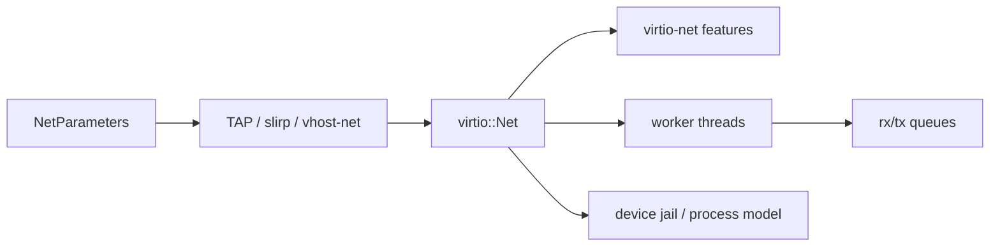
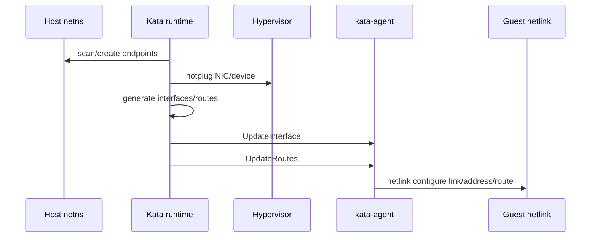
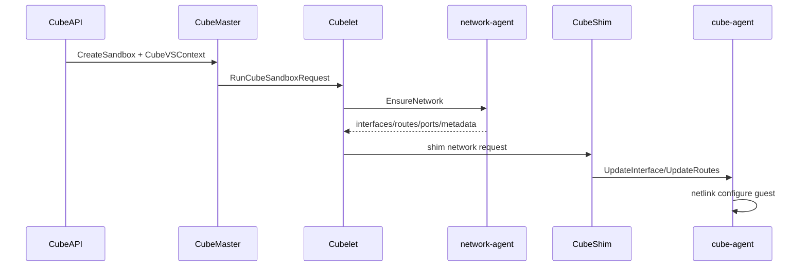

# 网络与连接模型跨项目专题分析

本文横向比较四个项目中“网络如何从 host 进入 guest，并变成 guest 内可用接口、路由和策略”的真实路径。

源码基线：当前仓库工作树。

关联总表：[ARM64 网络验证与观测总表](./arm64-network-validation-observation-matrix.md)。

关联签名表：[ARM64 网络失败签名总表](./arm64-network-failure-signature-matrix.md)。

关联命令表：[ARM64 网络测试与取证命令总表](./arm64-network-test-observation-command-matrix.md)。

关联成熟度表：[ARM64 网络样本成熟度矩阵](./arm64-network-evidence-maturity-matrix.md)。

关联优先级表：[ARM64 网络下一批样本优先级](./arm64-network-next-sample-priority.md)。

关联采集手册：[ARM64 网络样本采集 Runbook](./arm64-network-sample-collection-runbook.md)。

关联索引：[ARM64 网络文档索引](./arm64-network-document-index.md)。

相关项目路线：

- [Cloud Hypervisor 深入路线](../cloud-hypervisor/analysis/deep-routes.md)
- [crosvm 深入路线](../crosvm/analysis/deep-routes.md)
- [Kata Containers 深入路线](../kata-containers/analysis/deep-routes.md)
- [CubeSandbox 深入路线](../CubeSandbox-sandbox-clone/analysis/deep-routes.md)

## 1. 总体分层

| 层级 | 核心问题 | ready 边界 |
|---|---|---|
| VMM 层 | VM 是否看见 virtio-net/vhost/vDPA 设备 | PCI/MMIO 设备可见，队列可用 |
| Runtime 层 | guest 内接口、地址、路由是否配置完成 | agent `UpdateInterface/UpdateRoutes` 成功 |
| Platform 层 | sandbox 是否满足访问策略、端口映射、出网控制 | network-agent 与 guest agent 状态都收敛 |

结论：VMM 层只解决“网卡设备”；Kata/CubeSandbox 还要解决“guest 内网络配置”和“平台网络策略”。

Firecracker 的 ARM64 网络边界也已经继续展开为 [Firecracker ARM64 网络能力边界矩阵](../firecracker/analysis/arm64-network-capability-matrix.md)。

## 2. Cloud Hypervisor：`NetConfig` 到 virtio-net hotplug

Cloud Hypervisor 的网络配置由 `NetConfig` 表达。字段包括 tap、ip/mask、mac、host_mac、mtu、iommu、队列、vhost-user、vhost socket/mode、FD、rate limiter、PCI segment 和 offload 开关：[cloud-hypervisor/vmm/src/vm_config.rs](../cloud-hypervisor/vmm/src/vm_config.rs#L336)。

运行中新增网络设备从 `Vmm::vm_add_net()` 进入。它先克隆并验证 `VmConfig`，如果 VM 已存在则调用 `vm.add_net()`，否则只更新 config：[cloud-hypervisor/vmm/src/lib.rs](../cloud-hypervisor/vmm/src/lib.rs#L2365)。

`Vm::add_net()` 进入 `DeviceManager::add_net()`，成功后把配置写回 VM config，并通过 ACPI 通知 PCI device changed：[cloud-hypervisor/vmm/src/vm.rs](../cloud-hypervisor/vmm/src/vm.rs#L2191)。

`DeviceManager::add_net()` 校验 identifier 和 IOMMU segment，再调用 `make_virtio_net_device()`，最后统一走 `hotplug_virtio_pci_device()`：[cloud-hypervisor/vmm/src/device_manager.rs](../cloud-hypervisor/vmm/src/device_manager.rs#L5019)。

`hotplug_virtio_pci_device()` 会把 virtio device 放入 `virtio_devices` 列表，再添加 PCI 设备并更新 PCI bitmap：[cloud-hypervisor/vmm/src/device_manager.rs](../cloud-hypervisor/vmm/src/device_manager.rs#L4935)。

DBus API 特别处理了 FD：如果请求体里带 `fds`，会忽略，因为有效 FD 需要通过 SCM_RIGHTS 等独立通道传递：[cloud-hypervisor/vmm/src/api/dbus/mod.rs](../cloud-hypervisor/vmm/src/api/dbus/mod.rs#L157)。

机制判断：

1. Cloud Hypervisor 的网络能力边界是 VM 设备模型，不负责 CNI、路由策略或 guest 内 IP 配置。
2. `NetConfig` 同时支持 tap、vhost-user 和 FD 传递，说明 host 侧 datapath 可外置。
3. hotplug 只保证 guest 看到新 PCI 设备；guest 内是否命名、配置 IP、路由，需要外部系统或 guest 自身处理。
4. snapshot/restore 需要保留 net device state，但 host tap/vhost backend 的外部状态仍需额外协调。

Cloud Hypervisor 的 ARM64 网络边界也已经继续展开为 [Cloud Hypervisor ARM64 网络能力边界矩阵](../cloud-hypervisor/analysis/arm64-network-capability-matrix.md)。

对应的排查顺序已经继续展开为 [Cloud Hypervisor ARM64 网络观测指南](../cloud-hypervisor/analysis/arm64-network-observation-guide.md)。

ARM64/x86_64 差异：

- `NetConfig` 表层基本架构无关。
- 差异集中在 PCI/MMIO 枚举、ACPI/FDT、GIC/MSI、virtio transport 和 guest kernel driver。
- ARM64 上不能只看 VMM config 成功，还要确认 guest 是否能发现并初始化 virtio-net。

## 3. crosvm：TAP/vhost-net/slirp 与 virtio-net 设备

crosvm 的网络参数由 `NetParameters` 表达，包含 mode、vq_pairs、vhost_net、packed_queue、PCI address、mrg_rxbuf 等字段：[crosvm/devices/src/virtio/net.rs](../crosvm/devices/src/virtio/net.rs#L203)。

virtio-net 设备结构 `Net<T>` 持有 guest MAC、队列大小、worker threads、TAP 列表、feature、MTU、PCI address 等：[crosvm/devices/src/virtio/net.rs](../crosvm/devices/src/virtio/net.rs#L465)。

`Net::new()` 会把 TAP 拆成多队列 TAP，校验并配置 TAP，然后开启 checksum、TSO、UFO、control queue、multi-queue、packed queue、MAC、MRG_RXBUF 等 virtio feature：[crosvm/devices/src/virtio/net.rs](../crosvm/devices/src/virtio/net.rs#L490)。

Linux TAP 创建会打开 `/dev/net/tun`，设置 `IFF_TAP | IFF_NO_PI`，按需开启 `IFF_VNET_HDR` 和 `IFF_MULTI_QUEUE`：[crosvm/net_util/src/sys/linux/tap.rs](../crosvm/net_util/src/sys/linux/tap.rs#L78)。

多队列时，`Tap::into_mq_taps()` 会在同一接口上创建多个 TAP fd，并逐个 enable：[crosvm/net_util/src/sys/linux/tap.rs](../crosvm/net_util/src/sys/linux/tap.rs#L184)。

Linux `create_virtio_devices()` 是设备创建总入口，网络设备和其他 virtio 设备一样在 VM 创建阶段加入，并通过 control tube/worker process 管理：[crosvm/src/crosvm/sys/linux.rs](../crosvm/src/crosvm/sys/linux.rs#L221)。

机制判断：

1. crosvm 网络模型比 Cloud Hypervisor 更强调本地 device worker、TAP 操作和 jail/proxy 结构。
2. `Net::new()` 明确配置 offload、multi-queue、packed queue，网络性能能力直接体现在 virtio feature 协商。
3. crosvm 自身可以创建 TAP，也可以走 vhost-net/vhost-user/slirp 等不同 datapath。
4. control loop 负责运行时请求协调，但 guest 内 IP/route 仍不是 VMM 层职责。

ARM64/x86_64 差异：

- TAP/vhost-net 基本是 Linux host 能力，和 CPU 架构弱相关。
- guest 侧差异集中在 virtio transport、FDT/ACPI、MSI/GIC、PCI/virtio-mmio。
- protected VM 或 Android 场景可能限制 vhost、TAP、host fd 传递，需要按 backend 验证。

## 4. Kata Containers：endpoint 到 guest agent 网络配置

Kata 的网络路径跨 host netns、hypervisor device 和 guest agent。

`LinuxNetwork.AddEndpoints()` 会在 netns 中扫描或创建 endpoint，再把 endpoint 放入 sandbox network 状态：[kata-containers/src/runtime/virtcontainers/network_linux.go](../kata-containers/src/runtime/virtcontainers/network_linux.go#L610)。

`addSingleEndpoint()` 可创建 tap、vhost-user、tuntap、macvlan、macvtap、ipvlan、vfio 等 endpoint。CodeGraph 路径显示 `addAllEndpoints -> scanEndpointsInNs -> addSingleEndpoint` 是自动扫描路径。

`Sandbox.configureGuestNetwork()` 从 endpoints 生成 interface 和 route 结构。

它随后逐个调用 `agent.updateInterface()`，最后调用 `agent.updateRoutes()`：[kata-containers/src/runtime/virtcontainers/sandbox.go](../kata-containers/src/runtime/virtcontainers/sandbox.go#L381)。

运行中新增 NIC 走 `Sandbox.AddInterface()`。

它先把请求转成 `NetworkInfo`，调用 `network.AddEndpoints(..., hotplug=true)`，再把 PCI path 写入 `inf.DevicePath`，最后调用 agent update：[kata-containers/src/runtime/virtcontainers/sandbox.go](../kata-containers/src/runtime/virtcontainers/sandbox.go#L1206)。

agent ttrpc client 的 `UpdateInterface()` 和 `UpdateRoutes()` 都是 `grpc.AgentService` 方法。

源码依据：[kata-containers/src/runtime/virtcontainers/pkg/agent/protocols/grpc/agent_ttrpc.pb.go](../kata-containers/src/runtime/virtcontainers/pkg/agent/protocols/grpc/agent_ttrpc.pb.go#L512)。

Kata agent 接口本身也把 `updateInterface`、`updateRoutes`、`listInterfaces`、`listRoutes` 定义为 agent 能力：[kata-containers/src/runtime/virtcontainers/agent.go](../kata-containers/src/runtime/virtcontainers/agent.go#L154)。

机制判断：

1. Kata 的网络 ready 边界不是“NIC 已 hotplug”，而是 guest agent 已应用 interface 和 route。
2. host netns endpoint 类型决定 datapath，agent RPC 决定 guest 内可用性。
3. 热插拔失败需要 rollback endpoint，否则 host 侧网络资源可能泄漏。
4. rate limiter、TC filter、vhost-user、VFIO 等能力由 endpoint 类型和 hypervisor plugin 共同决定。

ARM64/x86_64 差异：

- Linux netns/netlink/TC 大体架构无关。
- 差异主要来自 hypervisor 是否支持对应 NIC hotplug、PCI path、VFIO、vhost-user、virtio-mmio/PCI。
- guest agent 的 netlink 行为也要验证，尤其是接口命名、MAC 匹配、路由替换。

## 5. CubeSandbox：CubeVS 策略、network-agent 与 cube-agent

CubeSandbox 把网络进一步平台化。

CubeAPI `create_sandbox()` 把请求转成 `CreateSandboxRequest`。

默认 `network_type` 为 `tap`，并把 `allow_internet_access` 与 `network` 字段转成 `cubevs_context`：[CubeSandbox-sandbox-clone/CubeAPI/src/services/sandboxes.rs](../CubeSandbox-sandbox-clone/CubeAPI/src/services/sandboxes.rs#L116)。

`RunCubeSandboxRequest` 中包含 `NetworkType` 和 `CubevsContext`。

`CubeVSContext` 包含 `allow_internet_access`、`allow_out`、`deny_out`，用于表达出网策略：[CubeSandbox-sandbox-clone/CubeMaster/api/services/cubebox/v1/cubebox.pb.go](../CubeSandbox-sandbox-clone/CubeMaster/api/services/cubebox/v1/cubebox.pb.go#L2662)。

Cubelet TAP plugin `Create()` 会读取网络 annotation，构造 CubeVS context，解析 DNS，并调用 `networkAgentClient.EnsureNetwork()`。

失败时会用 detached context 调 `ReleaseNetwork()` 回滚：[CubeSandbox-sandbox-clone/Cubelet/network/plugin_tap.go](../CubeSandbox-sandbox-clone/Cubelet/network/plugin_tap.go#L429)。

`networkagentclient.Client` 抽象提供 `EnsureNetwork`、`ReleaseNetwork`、`ReconcileNetwork`、`GetNetwork`、`ListNetworks`、`Health`。

源码依据：[CubeSandbox-sandbox-clone/Cubelet/pkg/networkagentclient/client.go](../CubeSandbox-sandbox-clone/Cubelet/pkg/networkagentclient/client.go#L21)。

gRPC client 会把 Cubelet 内部的 interface、route、ARP、port mapping、CubeVSContext 转成 network-agent proto。

随后再把响应映射回来：[CubeSandbox-sandbox-clone/Cubelet/pkg/networkagentclient/grpc_client.go](../CubeSandbox-sandbox-clone/Cubelet/pkg/networkagentclient/grpc_client.go#L58)。

network-agent gRPC server 把 proto 请求映射为 service 请求。

`EnsureNetwork` 返回 network handle、interfaces、routes、ARP、port mappings 和 persist metadata：[CubeSandbox-sandbox-clone/network-agent/internal/grpcserver/server.go](../CubeSandbox-sandbox-clone/network-agent/internal/grpcserver/server.go#L90)。

network-agent service 类型显示 `EnsureNetworkRequest`/`Response` 都包含 interfaces、routes、ARP neighbors、port mappings、CubeVSContext、persist metadata。

源码依据：[CubeSandbox-sandbox-clone/network-agent/internal/service/types.go](../CubeSandbox-sandbox-clone/network-agent/internal/service/types.go#L7)。

guest 内 cube-agent 通过 ttrpc 暴露 `UpdateInterface` 和 `UpdateRoutes`：[CubeSandbox-sandbox-clone/CubeShim/protoc/src/agent_ttrpc.rs](../CubeSandbox-sandbox-clone/CubeShim/protoc/src/agent_ttrpc.rs#L112)。

cube-agent 的 netlink `update_interface()` 会按 MAC 查找 link，清理旧地址，添加新 IP，更新 MTU/name/ARP/up；`update_routes()` 会删除旧路由再添加新路由：[CubeSandbox-sandbox-clone/agent/src/netlink.rs](../CubeSandbox-sandbox-clone/agent/src/netlink.rs#L90)。

这条平台级热路径已经继续展开为 [CubeSandbox 网络数据面与中断唤醒链路](../CubeSandbox-sandbox-clone/analysis/network-data-plane-interrupt-wakeup-chain.md)。

机制判断：

1. CubeSandbox 的网络 ready 边界最重：network-agent host 侧资源、CubeVS 策略、shim 网络请求、guest netlink 都要成功。
2. CubeVSContext 让网络从“连通性”上升为“策略化出网控制”。
3. `persist_metadata` 说明网络状态需要跨恢复/重建保存，不只是临时 TAP。
4. network-agent 同时暴露 gRPC 和 HTTP/unix endpoint，Cubelet client 带 reconnect 逻辑。

ARM64/x86_64 差异：

- API、CubeVSContext、network-agent proto 基本架构无关。
- ARM64 风险集中在 TAP/vhost/eBPF/TC、guest virtio-net、agent netlink、Cloud Hypervisor ARM64 设备枚举。
- 如果 CubeVS 依赖 eBPF 或特定内核能力，需要按 ARM64 节点内核版本和 config 实测。

## 6. 能力边界对照

| 问题 | Cloud Hypervisor | crosvm | Kata Containers | CubeSandbox |
|---|---|---|---|---|
| host 侧 datapath | tap/vhost-user/vDPA/FD | tap/vhost-net/vhost-user/slirp | CNI/netns endpoint + hypervisor device | network-agent + TAP/CubeVS |
| guest 侧配置 | 不内置 agent 配置 | 不内置 agent 配置 | kata-agent `UpdateInterface/UpdateRoutes` | cube-agent `UpdateInterface/UpdateRoutes` |
| 热插拔 | `vm_add_net` + PCI notification | control loop + device hotplug | `AddInterface` + endpoint rollback | Cubelet/network-agent + CubeShim/agent |
| 策略能力 | rate limiter/offload/IOMMU | offload/mq/jail/vhost/TC 相关 | endpoint model + TC/rate limiter | CubeVS allow/deny/port/persist metadata |
| snapshot/restore | 设备 state + backend 状态外部协调 | device state + TAP/vhost 状态协调 | runtime/network/agent state 一致 | network-agent metadata + CubeVS + guest routes |
| ARM64 风险 | FDT/ACPI/PCI/MMIO/GIC | virtio-mmio/PCI/protected VM | hotplug path/VFIO/vhost/agent | eBPF/TC/virtio-net/agent/netlink |

## 7. 关键理解

第一，VMM 的网络能力不能等同于 sandbox 的网络能力。VMM 只负责设备，Kata/CubeSandbox 还要让 guest 内接口和路由真实生效。

第二，Cloud Hypervisor 和 crosvm 的网络重点不同。Cloud Hypervisor 偏 API 配置和外部 backend；crosvm 更强调 TAP、device worker、jail 和 feature 协商。

第三，Kata 的网络边界在 agent。host endpoint 和 VM device 建好后，仍必须通过 `UpdateInterface/UpdateRoutes` 把 guest 网络状态改对。

第四，CubeSandbox 的网络边界在平台一致性。CubeVS 策略、network-agent 的 persist metadata、guest agent 的 netlink 更新必须一起收敛。

第五，ARM64 差异要从“guest 能不能看见设备”和“guest agent 能不能配置网络”两个方向实测，不能只看 API 或 host 侧网络创建成功。

Kata 的 ARM64 网络边界也已经继续展开为 [Kata ARM64 网络能力边界矩阵](../kata-containers/analysis/arm64-network-capability-matrix.md)。

对应的排查顺序已经继续展开为 [Kata ARM64 网络观测指南](../kata-containers/analysis/arm64-network-observation-guide.md)。

## 8. 后续深挖路线

1. 对 Cloud Hypervisor 展开 `make_virtio_net_device` 的 tap/vhost-user/vDPA 分支。
2. 对 crosvm 展开 `create_virtio_devices` 中 net/vhost-net/slirp 的完整路径和 jail 策略。
3. 对 Kata 展开 endpoint 类型矩阵：tap、tuntap、macvtap、ipvlan、vhost-user、vfio。
4. CubeSandbox 的 `Cubelet/network-agent/CubeShim/cube-agent` 与 `CubeVS/TAP/virtio-net` 两条链路都已展开，ARM64 检查表也已落成。
5. CubeSandbox 的 ARM64 路径可直接参考 [ARM64 网络验证矩阵](../CubeSandbox-sandbox-clone/analysis/arm64-network-validation-matrix.md)、[ARM64 网络观测与取证指南](../CubeSandbox-sandbox-clone/analysis/arm64-network-observation-guide.md)、[ARM64 网络实测取证模板](../CubeSandbox-sandbox-clone/analysis/arm64-network-evidence-template.md)、[ARM64 网络实测样本记录](../CubeSandbox-sandbox-clone/analysis/arm64-network-evidence-sample.md)、[ARM64 日志采集缺口与补齐路径](../CubeSandbox-sandbox-clone/analysis/arm64-log-collection-gap.md) 和 [ARM64 日志源映射](../CubeSandbox-sandbox-clone/analysis/arm64-log-source-map.md)。
