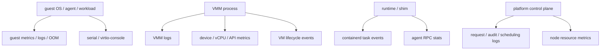

# 可观测性与故障诊断跨项目专题分析

本文比较五个项目如何暴露日志、指标、事件、guest console、runtime event 和诊断材料。它回答一个实际问题：Micro-VM 出问题时，证据从哪里来，能证明到哪一层。

关联签名表：[ARM64 网络失败签名总表](./arm64-network-failure-signature-matrix.md)。

关联命令表：[ARM64 网络测试与取证命令总表](./arm64-network-test-observation-command-matrix.md)。

关联成熟度表：[ARM64 网络样本成熟度矩阵](./arm64-network-evidence-maturity-matrix.md)。

关联优先级表：[ARM64 网络下一批样本优先级](./arm64-network-next-sample-priority.md)。

关联采集手册：[ARM64 网络样本采集 Runbook](./arm64-network-sample-collection-runbook.md)。

关联索引：[ARM64 网络文档索引](./arm64-network-document-index.md)。

可观测性不是单一 API。VMM 项目更关注进程日志、设备指标、VM 生命周期事件和 console；runtime/platform 项目还要关联 container、sandbox、agent、调度和节点资源。

## 1. 分层模型

证据链越靠近 VMM，越能解释 KVM、设备、vCPU 和队列问题。越靠近 runtime/platform，越能解释“sandbox 为什么没有 ready”“调度为什么失败”“guest 内 container 状态是否一致”。

## 2. 横向对照

| 项目 | 日志入口 | 指标入口 | 事件入口 | guest 可见性 | 诊断边界 |
|---|---|---|---|---|---|
| Firecracker | `/logger` 或 `--log-path`，单 Logger | `/metrics` 或 `--metrics-path`，JSON flush | API action `FlushMetrics`，panic/周期 flush | 生产构建不暴露 serial console | VMM 内部、设备和 API 指标强；runtime 语义无 |
| Cloud Hypervisor | `log` crate + CLI stderr/stdout | performance-metrics 工具、迁移内部 metrics | `event_monitor` JSON event 文件和 DBus 广播 | serial/console/debug-console 配置 | VM 生命周期事件强；业务 sandbox 语义无 |
| crosvm | log level、syslog tag、no_syslog | 独立 metrics process + product handler | WaitContext/EventToken 和 metric events | serial/virtio-console/debugcon 输出可路由 | 设备进程、jail、Tube 和 VM loop 可诊断 |
| Kata Containers | shim logrus、runtime logs、agent slog | agent Prometheus 文本、sandbox/runtime metrics | containerd task events、OOM events | agent RPC 暴露 guest/agent metrics | container runtime 语义强；底层 VMM 取决于 plugin |
| CubeSandbox | `/data/log/<Module>/`、CubeAPI NDJSON | Cubelet heartbeat、CubeMaster Redis fan-out、agent/CubeCoW metrics | Cubelet containerd event monitor、API structured logs | cube-agent metrics、sandbox logs API | 平台级证据最全，但需跨模块关联 |

## 3. Firecracker

Firecracker 把日志和指标作为 microVM 外部资源，而不是 guest 配置的一部分。`docs/metrics.md:3-8` 明确说 metrics 可由 `/metrics` 或 CLI 配置，且不会随 snapshot 恢复。

`docs/logger.md:3-6` 说明 logger 只能配置一次，可通过 `/logger` 或命令行设置。这个限制减少运行期变化，但也意味着调试级别需要在启动前或 preboot 阶段决定。

源码里 `logger/mod.rs:21-28` 暴露 `LOGGER`、`LoggerConfig`、`METRICS` 和 metric traits。`logger/mod.rs:118-155` 还给 error/warn/info 加了 rate limit，避免 guest 可触发路径刷爆日志。

metrics 系统是全局静态对象。`logger/metrics.rs:84-156` 定义 `METRICS`，通过 `init` 安装 writer，通过 `write` 序列化 JSON 并写入一行。

Firecracker 的设计文档给出生产边界：日志按行 flush，metrics 在启动、每 60 秒和 panic 时输出；生产构建不暴露 serial console，避免 host 看到 guest 数据。

指标粒度覆盖 API、block、net、uart、vcpu、vmm、seccomp、signals 等。`docs/metrics.md:81-125` 列出 key，并指向各设备 metrics 定义。

结论：Firecracker 的可观测性偏 VMM 内部和设备计数器。它非常适合定位“设备/队列/API 是否失败”，但不回答 container、pod、sandbox policy 或 guest agent 层问题。

## 4. Cloud Hypervisor

Cloud Hypervisor 的核心不是统一 metrics endpoint，而是事件流。`event_monitor/src/lib.rs:19-31` 定义 JSON event，包含 timestamp、source、event 和 properties。

`set_monitor` 只能在主线程、创建其他线程前调用，并把文件设为 nonblocking。`event_monitor/src/lib.rs:71-90` 体现了它的初始化时序约束。

`event!` 宏会同时打普通日志并把 JSON event 发到 monitor channel。`event_monitor/src/lib.rs:107-150` 是事件生成的关键实现。

事件覆盖范围很广。`vmm/src/lib.rs` 里有 VM booting、booted、shutdown、migration-started、migration-finished 等事件；virtio 设备也在 activated/reset 时发 event。

主程序会根据 CLI 参数安装 event monitor，并把 monitor 交给 `start_event_monitor_thread`。DBus 路径还持有 `event_monitor_rx`，说明事件可被外部订阅。

Cloud Hypervisor 的 API 也提供 `VmInfo`。`vmm/src/api/mod.rs:216` 定义响应体，`/vm.info` handler 在 `http_endpoint.rs:551-562` 分发到 VMM。

console/serial 是显式配置项。`vm_config.rs:541-581` 定义 console 和 debug console config，`config.rs:2085` 以后负责解析 off、pty、tty、file、socket 等模式。

结论：Cloud Hypervisor 的诊断面适合跟踪 VM 生命周期、迁移、设备激活和控制面状态。它不尝试解释 guest 内 container 语义，需要上层 runtime 补齐。

## 5. crosvm

crosvm 的日志入口在 CLI。`cmdline.rs:107-115` 提供 `log_level`、`syslog_tag` 和 `no_syslog`。这符合 crosvm 多进程、多设备 worker 的部署形态。

guest console 和调试输出非常灵活。`cmdline.rs:1787-1828` 支持 stdout、syslog、sink、file、unix、unix-stream、virtio-console、debugcon、console、earlycon 和 stdin。

`devices/src/sys/linux/serial_device.rs:58-69` 抽象 serial-like device 的输入、输出、sync 和 options。`WriteSocket` 会按行聚合后写 Unix datagram，适合把 guest serial 导入日志系统。

metrics crate 的注释说明设计：独立 metrics 进程通过 Tube 接收请求，产品分支可以替换 handler 上传指标，见 `metrics/src/lib.rs:5-12`。

`MetricsController` 维护 agent tubes，并在所有 tubes 关闭时退出。`metrics/src/controller.rs:14-66` 是 metrics process 的主循环框架。

crosvm 还提供本地统计工具。`local_stats.rs:72-90` 有轻量 min/max/avg/count/sum；`408-486` 提供 IO bytes 和 latency 的作用域采集。

事件侧依赖 `EventToken` 和 WaitContext，指标事件则通过 `MetricEventType` 记录。例如 vCPU shutdown error 会记录 descriptor，virtio wakeup 也有 metric event。

结论：crosvm 的诊断面与其架构一致：不是一个单体 VMM 日志，而是 CLI/syslog、Tube metrics、device worker、jail、serial routing 和事件 token 的组合。

## 6. Kata Containers

Kata 的可观测性从 shim 开始。`containerd-shim-v2/service.go:73-110` 初始化 logrus、设置 sandbox/pid 字段，创建 events channel，并启动 exit processor 和 event forwarder。

event forwarder 有两种模式。非 containerd 场景写日志，containerd 场景调用 publisher 发布事件，见 `event_forwarder.go:40-87`。

Kata shim 会把 TaskCreate、TaskStart、TaskOOM、TaskExit、TaskPaused、TaskResumed 等映射到 containerd topic。`service.go:321-342` 是 topic 映射。

guest 内指标由 kata-agent 提供。`agent/src/metrics.rs:15-76` 定义 `kata_agent` 和 `kata_guest` namespace 下的 Prometheus gauge/counter。

`get_metrics` 会先注册指标，再更新 agent 进程指标和 guest OS 指标，最后用 Prometheus TextEncoder 返回字符串，见 `agent/src/metrics.rs:78-105`。

guest OS 指标来自 procfs，包括 load、diskstats、vmstat、kernel stats、net dev 和 meminfo，见 `agent/src/metrics.rs:189-269`。

runtime 还可以聚合底层 hypervisor 指标。Go 版本里 `sandbox_metrics.go` 提供 runtime metrics，`fc_metrics.go` 把 Firecracker JSON 指标注册为 Prometheus gauge。

结论：Kata 的可观测性重点不是 VMM 内核态细节，而是 container lifecycle、agent RPC、guest OS 资源和底层 hypervisor plugin 的组合视图。

## 7. CubeSandbox

CubeSandbox 的文档明确区分三类日志：runtime logs、startup logs 和 in-container logs。`docs/guide/service-management.md:204-226` 给出 `/data/log/<Module>/` 的主入口。

同一文档还强调 runtime 业务日志不在 journalctl。`service-management.md:41-43` 和 `214-216` 指出请求、调度、stat、audit、VMM lifecycle 都写到 `/data/log/`。

CubeAPI 使用 tracing 和自定义结构化日志。`CubeAPI/src/main.rs:172-227` 初始化 stdout tracing，再创建 `FileLogger`、`FilteredLogger` 和 `MultiLogger`。

`FileLogger` 写 NDJSON，并按 UTC 日期滚动文件。`CubeAPI/src/logging/file.rs:5-13` 说明非阻塞队列模型，`74-114` 负责序列化和写入。

CubeAPI 的模型层还定义 sandbox logs API。`models/mod.rs:305-366` 包含 raw log、structured log entry、v1/v2 response 和 cursor/limit query。

Cubelet 监听 containerd 事件。`services/cubebox/events.go:75-85` 订阅 task exit、OOM、pause/resume 和 image 事件，`122-180` 用 backoff 队列处理失败重试。

Cubelet 的 metrics 不是简单计数器。`services/cubebox/metric.go:23-97` 注册 CLS/OSS collectors，输出 MVM 数量、死实例、CPU/内存占用、网卡队列等。

CubeMaster 负责接收 node resource metrics。`nodemeta/service.go:238-250` 说明 metrics 经 Redis fan-out，不写 MySQL；`426-432` 说明 freshness 不等于 heartbeat freshness。

guest 内可观测性继承 Kata agent 形态。`agent/src/metrics.rs:24-90` 定义 agent/guest Prometheus 指标，`CubeShim/protoc/protos/agent.proto:57-59` 暴露 `GetMetrics` RPC。

CubeCoW 也有存储指标。`cubecow/src/pkg/metrics/mod.rs:19-35` 定义 volume、snapshot、total bytes、used bytes，并用 DashMap/AtomicU64 做并发采集。

部署文档提供诊断包入口。`service-management.md:278-288` 的 `collect-logs.sh` 会收集 `/data/log` 尾部、cube-proxy 日志、dmesg、进程、端口、mount、cgroup 和 cpuinfo。

结论：CubeSandbox 的可观测性是平台级的。定位失败时不能只看 VMM log，还要串起 CubeAPI、CubeMaster、Cubelet、CubeShim、network-agent、agent 和 CubeCoW。

## 8. ARM64 与 x86_64 差异

Firecracker 在生产构建不暴露 serial console，这个边界对 ARM64/x86_64 都成立。但 guest console 名称不同，常见 x86_64 是 `ttyS0`，ARM64 更常见 `ttyAMA0`。

Cloud Hypervisor 的 console/serial 配置是跨架构抽象。差异来自机器描述：x86_64 侧 ACPI/PCI/debugcon 更常见，ARM64 侧 FDT/GIC/virtio-console 更关键。

crosvm 的 serial 参数支持 earlycon，但源码校验只允许 `SerialHardware::Serial` 使用 earlycon。ARM64 bring-up 时 early console 往往比 x86_64 更重要。

Kata 和 CubeSandbox 的 guest metrics 来自 procfs，架构差异较小。真正差异在底层 hypervisor 和 guest image：ARM64 的 console、agent、kernel cmdline、eBPF 和 VMM log 需单独确认。

CubeSandbox 文档把 VMM lifecycle log 放在 `/data/log/CubeVmm/vmm.log`。对 ARM64 bring-up，这个文件与 guest serial、CubeShim log、network-agent log 需要一起看。

## 9. 能力边界

Firecracker 能证明 microVM 进程、API、设备和 vCPU 层的行为，但不能证明容器生命周期。它适合回答“VMM 做了什么”，不适合回答“业务 sandbox 为什么不可用”。

Cloud Hypervisor 能证明 VM lifecycle 和设备事件，尤其适合 boot、migration、resize、snapshot、device activation 诊断。它没有 guest agent 视角。

crosvm 能证明多进程设备和控制 loop 的问题。它的优势是 serial routing、syslog 和 metrics Tube；代价是证据分散在多个进程与 worker。

Kata 能证明 containerd 事件、agent RPC 和 guest OS 指标。底层 VMM 指标要看 plugin 是否接入，例如 Firecracker 指标有转换代码，某些 plugin 只给 warning 或未实现。

CubeSandbox 能证明平台请求、调度、资源心跳、VMM 生命周期、网络、存储和 guest agent。它的难点是关联 ID、时间戳和多模块日志，而不是缺少日志。

## 10. 下一步深入路线

建议下一步先做 Firecracker 诊断链：`/logger`、`/metrics`、PeriodicMetrics、FlushMetrics、panic flush、device metrics 和生产 serial 边界。

然后展开 CubeSandbox 诊断链：`CubeAPI structured log -> CubeMaster request/resource metric -> Cubelet event monitor -> CubeShim/VMM log -> cube-agent GetMetrics`。

最后补 crosvm：`CLI log/syslog -> serial output routing -> metrics Tube -> EventToken/WaitContext -> device worker error`。这条链能解释 crosvm 为什么诊断点多而分散。
