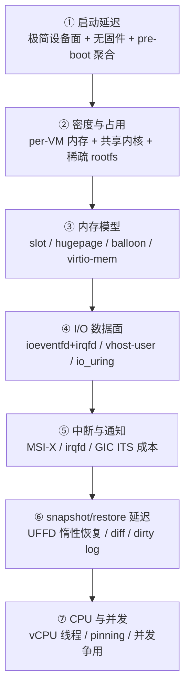
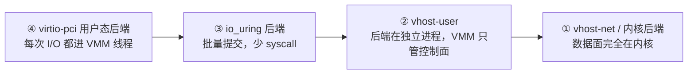

# 性能设计依据跨项目专题分析

本文回答一个问题：**轻量化虚拟机的性能，到底从哪些设计决策里来？**

它是综合层，不是机制层。机制（ioeventfd 怎么注册、dirty log 怎么聚合、UFFD 怎么握手）已经在各自链路文档里讲清楚；本文的作用是把这些机制**重新按性能杠杆组织**，说明每个杠杆为什么影响性能、五个项目怎么取舍、实测数字落在哪，最后提炼成可复用的设计原则。

配套阅读：

- 机制基础：[Virtio 传输与设备数据路径](./virtio-data-path-cross-project.md)、[中断与事件通知](./interrupt-event-notification-cross-project.md)、[Guest Memory/DMA/IOMMU](./guest-memory-dma-iommu-cross-project.md)、[Hypervisor/KVM/vCPU](./hypervisor-kvm-vcpu-cross-project.md)、[Snapshot/Restore/Clone](./snapshot-restore-cross-project.md)、[资源管理与 QoS](./resource-qos-cross-project.md)。
- 完整面貌：[轻量化虚拟机设计全景与学习路线](./vm-design-landscape-overview.md)。
- 实测数据来源：`sandbox-bench/` 与 `CubeSandbox/.trellis/`。

源码基线：当前工作树。带行号的结论引用链路文档已验证的锚点；标注“工程判断”的为推理，非源码事实。

## 1. 性能杠杆总览

先给一张地图。轻量化 VM 的性能不是单点优化，而是七个杠杆的叠加，每个杠杆都有一个“机制选择”和一个“代价”。

| 杠杆 | 一句话机制 | 主要受益项目 | 代价 |
|---|---|---|---|
| ① 启动延迟 | 删掉一切非必要部件 | Firecracker | 设备能力窄 |
| ② 密度与占用 | 每实例只占必要内存 | Firecracker、CubeSandbox | 共享后端带来争用 |
| ③ 内存模型 | 把内存暴露成可调形态 | Cloud Hypervisor、Firecracker | 状态机复杂 |
| ④ I/O 数据面 | 让数据路径绕开 VMM 线程 | crosvm（vhost）、Cloud Hypervisor | 后端进程协调 |
| ⑤ 中断与通知 | 用 fd 通知替代注入异常 | 全部 | GIC/ITS 在 ARM64 上更重 |
| ⑥ snapshot/restore 延迟 | 只存必要状态 + 惰性恢复 | Firecracker、CubeSandbox | 一致性更难 |
| ⑦ CPU 与并发 | vCPU 线程 + 调度策略 | 全部 | 并发下长尾 |

下面逐个展开。

## 2. 启动延迟：极简即速度

### 机制

Firecracker 的启动路径是“性能靠删除”的范本。它没有 BIOS、没有 ACPI 表生成开销的复杂设备枚举、没有显卡/USB/磁盘控制器等legacy 设备。pre-boot API 把所有配置聚合成一次 `StartMicroVm`，然后 `build_microvm_for_boot` 一次性拼出 KVM VM + vCPU + guest memory + 极简设备集：

- 入口聚合：[Firecracker API start boot chain](../firecracker/analysis/api-start-boot-chain.md)。
- 一次性构建：[Firecracker build microvm boot chain](../firecracker/analysis/build-microvm-boot-chain.md)，`build_microvm_for_boot` 见 `firecracker/src/vmm/src/builder.rs`。
- ARM64 走 direct boot + FDT，不走 UEFI；设备极少见 [Firecracker arch chain](../firecracker/analysis/arch-arm64-x86-chain.md)。

对比之下，Cloud Hypervisor 要生成完整 ACPI 表（DSDT/FADT/MADT/MCFG/SRAT/SLIT/VIOT/IORT）以支持热插拔与通用 guest OS，见 [Cloud Hypervisor ACPI FDT chain](../cloud-hypervisor/analysis/acpi-fdt-machine-description-chain.md)。这是“启动快”与“生命周期全”之间的根本取舍。

### 为什么影响性能

启动延迟由三部分构成：VMM 进程初始化、KVM VM/vCPU 创建、guest 内核启动到 ready。前两部分里，**设备数量和 ACPI/固件开销是最大的可压缩项**。Firecracker 把设备面压到 virtio block/net/vsock/rng/balloon/pmem 这几个，guest 内核要枚举的设备极少，启动到 init 的路径短。

### 量化锚点

实测（[high-density-firecracker-notes](../sandbox-bench/docs/high-density-firecracker-notes.md)，384 CPU 主机）：

- 500 实例创建约 `6s`，1000 实例创建约 `15s`，1000 实例占用约 `133GiB` 内存。
- 100 实例控制组全部完成 workload，`errors=0`。

换算下来，单实例创建的摊销成本在**十几毫秒量级**。这是“极简设备面 + 单进程 + 无固件”的直接结果。

### 设计依据

> **启动延迟的下限，由“你必须支持的设备与固件数量”决定。** 要做到亚秒级冷启动，第一策略不是优化，而是删除：删 legacy 设备、删固件、删运行期可变配置，把 pre-boot 做成一次性聚合。

## 3. 密度与占用：每个实例占多少

### 机制

密度 = 单机可并行运行的实例数，由每实例内存占用和 host 资源争用决定。几个关键设计：

- **单进程单 VM**：Firecracker 一个进程管一个 microVM（[firecracker-startup-modes](../sandbox-bench/docs/firecracker-startup-modes.zh.md)）。进程隔离强，但每实例有固定进程开销。
- **共享内核**：多实例共用同一内核镜像（只读），guest 内存才是每实例独立开销。
- **稀疏 rootfs**：rootfs 副本用 sparse-preserving 拷贝，见 high-density 笔记的 config，避免每实例复制完整镜像。
- **CubeCoW**：CubeSandbox 用 copy-on-write 引擎（FICLONE/reflink）让 rootfs 和内存可 clone，见 [CubeSandbox CubeCoW chain](../CubeSandbox-sandbox-clone/analysis/cubecow-storage-engine-chain.md)。这是把“共享内核”思想推广到“共享整个 rootfs + 内存基线”。

### 为什么影响性能

密度的瓶颈通常不是 CPU，而是**内存**和**并发创建/销毁的协调成本**。1000 实例占 133GiB，意味着每实例约 130MiB 量级（含 VMM 自身），这对 256MiB guest 配置是合理的。一旦密度上去，下一个瓶颈是创建/restore 的并发协调——见第 8 节。

### 量化锚点

- 1000 Firecracker 实例：约 `133GiB / 753GiB`，见 high-density 笔记。
- 该实验也暴露了密度上限的判错问题：1000 实例下“进程存活”不等于“guest ready”，adapter 只校验了进程存活，没等 guest 级 ready。这是密度优化的典型陷阱。

### 设计依据

> **密度的第一变量是每实例内存占用，第二变量是并发协调成本。** 共享内核、稀疏/CoW rootfs 把第一变量压下去；但密度越高，“单点存活”越不等于“整体 ready”，必须显式做 guest-level readiness 与分批启动。

## 4. 内存模型：把内存暴露成可调形态

### 机制

guest 内存在 KVM 里表现为一组 memory slot，VMM 把后端（anonymous/memfd/file-backed mapping）映射进去。围绕这块内存，四个项目有不同杠杆：

- **Firecracker**：guest memory 作为可 snapshot 的内存文件，restore 时可选 UFFD 惰性恢复。balloon 与 virtio-mem 提供运行期内存回收/热插。见 [Firecracker memory device snapshot chain](../firecracker/analysis/memory-device-snapshot-chain.md)、[Firecracker UFFD restore chain](../firecracker/analysis/uffd-memory-restore-chain.md)。
- **Cloud Hypervisor**：`MemoryManager` 是内存的单一权威，管 slot、热插拔、snapshot transport、dirty log 聚合。`MemoryRangeTable` + memory-ranges transport 支持迁移，dirty log 用于增量迁移。见 [Cloud Hypervisor MemoryManager chain](../cloud-hypervisor/analysis/memory-manager-chain.md)、[migration memory transport chain](../cloud-hypervisor/analysis/migration-memory-transport-chain.md)。
- **CubeSandbox**：VM memory snapshot + CubeCoW memory volume，把内存也变成可 clone/rollback 的平台状态，见 [CubeSandbox VMM snapshot restore state chain](../CubeSandbox-sandbox-clone/analysis/vmm-snapshot-restore-state-chain.md)。

### 性能杠杆

内存模型里的性能杠杆有四个：

1. **hugepage / 大页**：减少 TLB miss。Firecracker 的 `MachineConfig` 显式校验 huge page 配置（`vmm_config/machine_config.rs`）。
2. **balloon / free-page hinting**：让 guest 主动归还空闲页，提升密度。Firecracker balloon 与 virtio-mem 见 [Firecracker balloon virtio-mem chain](../firecracker/analysis/balloon-virtio-mem-guest-chain.md)。
3. **virtio-mem**：比传统 balloon 更可控的内存热插，按 plugged bitmap 增减。Cloud Hypervisor 的 zone resize 走 `virtio_mem_resize`（`vmm/src/memory_manager.rs`）。
4. **dirty log**：迁移与 diff snapshot 的基础，但开启有开销。Cloud Hypervisor 的 dirty log 聚合在迁移链路里，VFIO/vfio-user 默认是空实现（见 [VFIO chain](../cloud-hypervisor/analysis/vfio-vfio-user-iommu-migration-chain.md)）——这意味着直通设备的脏页追踪是性能与正确性的难点。

### 设计依据

> **内存是密度与迁移的共同基础。** balloon/virtio-mem 用“可归还”换“高密度”；dirty log 用“可追踪”换“可迁移”。两者都有运行期开销，开不开、何时开，取决于工作负载是吞吐敏感还是迁移敏感。直通设备（VFIO）的 dirty log 缺失，是当前内存模型最大的正确性/性能张力点。

## 5. I/O 数据面：让数据路径绕开 VMM 线程

这是性能工程里最关键的一节。I/O 数据面的核心问题：guest 发起一次 I/O，要经过多少次 host 用户态/内核态切换、多少次 VMM 线程参与。

### 机制：四级数据面

按“VMM 线程参与程度”从高到低，有四级：

- **ioeventfd / irqfd 旁路**（所有项目共有）：guest 写一个 MMIO/PIO 地址触发 vm-exit，KVM 不把它做成异常注入，而是关联到 eventfd，VMM 在 epoll 里收到通知。这把“每次通知一次 syscall”压成了“批量 epoll”。机制见 [中断与事件通知](./interrupt-event-notification-cross-project.md) 与各项目 `interrupt-event-notification-chain.md`。Firecracker 的 ioeventfd 注册见 `firecracker/src/vmm/src/devices/virtio/transport/`。
- **Firecracker virtio 用户态后端 + io_uring**：block 设备后端用 io_uring 批量提交，减少 syscall。见 [Firecracker virtio block data path chain](../firecracker/analysis/virtio-block-data-path-chain.md)、`firecracker/src/vmm/src/io_uring/`。net 设备有 TX/RX 队列 + rate limiter + MMDS 分流，见 [Firecracker virtio net data path chain](../firecracker/analysis/virtio-net-data-path-chain.md)。
- **Cloud Hypervisor vhost-user**：把 fs/net 等后端放到独立进程（如 virtiofsd），VMM 只持有 frontend 与控制面，数据面在后端进程直接操作 guest 内存。见 [Cloud Hypervisor I/O device data path chain](../cloud-hypervisor/analysis/io-device-data-path-chain.md)、vhost-user 模块 `cloud-hypervisor/virtio-devices/src/vhost_user.rs`。每个 queue 一个 `spawn_virtio_thread()` 线程（`virtio-devices/src/thread_helper.rs:17`）。
- **crosvm vhost-net / process-per-device**：crosvm 可把设备 fork 进独立 Minijail 进程，vhost-net 让数据面进内核。见 [crosvm virtio queue worker chain](../crosvm/analysis/virtio-queue-worker-chain.md)。

### 为什么这是最关键的杠杆

I/O 路径上的每一次 VMM 线程参与、每一次 syscall，在高 IOPS 下都会被放大成 CPU 瓶颈。性能优化的主线就是**把数据面从 VMM 线程里移出去**：ioeventfd 移走“通知”，io_uring 移走“提交”，vhost-user/vhost-net 移走“整个后端”。留下来的 VMM 线程只做控制面（配置、热插拔、snapshot）。

### 限速的代价

性能杠杆的反面是 QoS。Firecracker 的 block/net 设备持有设备本地 `RateLimiter`（`firecracker/src/vmm/src/rate_limiter/mod.rs:298`），queue event 在 limiter 阻塞时停止处理，limiter event 到来后恢复。这意味着**限速本身在数据热路径上**，见 [资源管理与 QoS](./resource-qos-cross-project.md) 第 3 节。限速越精细，热路径开销越大。

### 设计依据

> **I/O 性能 = 数据面离开 VMM 线程的程度。** 设计顺序应该是：先 ioeventfd/irqfd 旁路通知，再 io_uring 批量提交，再 vhost-user/内核后端卸载整个数据面。限速必须做，但要清楚它落在热路径上，粒度与频率是吞吐与公平的权衡。

## 6. 中断与通知：fd 通知 vs 异常注入

### 机制

virtio 的完成通知（used buffer 写入后的 kick）是最高频的 host→guest 信号。两种实现：

- **异常注入**：KVM 把它做成一次中断注入，开销大。
- **irqfd**：把 GSI 关联到 eventfd，VMM 或后端写 eventfd，KVM 直接注入，VMM 线程不参与。Firecracker/Cloud Hypervisor 都走这条路。见各项目 `interrupt-event-notification-chain.md`。

PCI 设备用 MSI-X，MSI-X table 的每一项可关联到一个 irqfd。Cloud Hypervisor 的 `InterruptManager` / `InterruptSourceGroup` 抽象见 [Cloud Hypervisor interrupt chain](../cloud-hypervisor/analysis/interrupt-event-notification-chain.md)。

### ARM64 的额外成本

x86 上是 IOAPIC/LAPIC；ARM64 上是 GIC v3 + ITS。ITS 用 device table / collection table 把设备 ID 映射到中断，restore 时要重建这些表，这是 ARM64 restore 路径多出来的状态与成本（也是 ARM64 网络线特别厚的原因之一）。见 [CubeSandbox virtio interrupt injection trace](../CubeSandbox-sandbox-clone/analysis/virtio-interrupt-injection-trace.md)、[ARM64/x86 差异](./arm64-x86-cross-project-matrix.md)。

### 设计依据

> **通知机制是 host↔guest 的最高频路径，必须用 fd 旁路，不能用异常注入。** 在 ARM64 上，GIC/ITS 的初始化与 restore 是额外的性能与正确性负担，设计时要把它当成一等公民，而不是 x86 路径的附属。

## 7. snapshot/restore 延迟：只存必要状态 + 惰性恢复

### 机制

snapshot 要保存 vCPU、中断控制器、设备、内存四类状态。restore 的延迟主要来自内存（最大的一块）。三个杠杆：

- **UFFD 惰性恢复**：内存不预先拷贝，而是建立 userfaultfd mapping，guest 第一次访问某页时触发缺页，由 handler 按需填充。Firecracker 的 UFFD restore 见 `firecracker/src/vmm/src/builder.rs:323`、`lib.rs:318-320`（`uffd: Option<Uffd>`），完整握手见 [Firecracker UFFD restore chain](../firecracker/analysis/uffd-memory-restore-chain.md)。
- **diff / 增量 snapshot**：基于 dirty log 只存变化页，减少 snapshot 体积。Firecracker 支持 full/diff memory，见 [Firecracker snapshot restore chain](../firecracker/analysis/snapshot-restore-chain.md)。
- **设备 snapshot 的对称性**：设备通过 `Suspendable` 参与快照，restore 顺序必须与保存对称，否则状态错乱。crosvm 的 `ProxyDevice::snapshot()` 要跨进程协调，见 [crosvm snapshot-suspend chain](../crosvm/analysis/snapshot-suspend-chain.md)。

### 为什么影响性能

restore 是“冷启动到 ready”的替代路径，目标是比冷启动更快地把 VM 恢复到运行态。UFFD 的本质是**用“按需缺页”换“不预先拷贝整块内存”**——对大部分页只访问一小部分的 workload，restore 几乎瞬时；对全内存访问的 workload，缺页风暴反而更慢。

### 量化锚点

CubeSandbox 在 ARM64 上的 create-only 并发调优（[restore-bottleneck-current-summary](../CubeSandbox/.trellis/tasks/05-06-arm64-ci-release/research/tap-fd-timeout-10s-20260602/restore-bottleneck-current-summary-zh.md)）给出了并发 restore 的真实长尾：

- c50（50 并发）p99 约 `536–546ms`；c100（100 并发）p99 约 `2.2–2.7s`。
- 瓶颈从 network-agent/CubeVS 迁移到 CubeShim `RestoreVm`（并发 VMM snapshot restore）。
- 网络热路径优化后：`populateInnerMap` 约 `0.01ms`，`registerCubeVSTap` p99 约 `0.1ms`。

这说明：**单点 restore 可以很快，但并发 restore 的长尾来自争用，不是单点慢**。

### 设计依据

> **restore 延迟的下限是内存拷贝；UFFD 把它变成“按需”。但并发 restore 的真正瓶颈是资源争用（内存带宽、KVM 锁、fd 池），不是单 VM 的算法。** 设计 restore 时，单点优化与并发限流必须分开做：先压单点（网络热路径、缺页 handler），再控并发（分批、限流、ready 检测）。

## 8. CPU 与并发：vCPU 线程、pinning、争用长尾

### 机制

每个 vCPU 是 host 上的一个线程，循环跑 `KVM_RUN`。性能杠杆：

- **vCPU 线程模型**：Firecracker 的 vCPU 线程状态机（Paused/Running）、immediate_exit/signal kick，见 [Firecracker vCPU KVM_RUN chain](../firecracker/analysis/vcpu-kvm-run-chain.md)。
- **CPU pinning / affinity**：crosvm 有显式的 vCPU affinity、capacity、core scheduling、cpufreq domain，把 vCPU 绑到 host CPU 并配合 cgroup v2 threaded 结构，见 [资源管理与 QoS](./resource-qos-cross-project.md) 第 5 节、`crosvm/src/crosvm/sys/linux.rs:1269/1498/3897`。这是 ChromeOS/Android 场景对延迟确定性要求高的体现。
- **调度确定性**：core scheduling 防止跨安全域的侧信道，但有调度开销。

### host↔guest 切换的地板成本

性能调优最终都会撞到“一次 host↔guest 切换到底花多少 ns”。`sandbox-bench` 在 openEuler arm64 内核上做了专门的 tracepoint 插桩测量（[context-switch-cost-experiment](../sandbox-bench/docs/context-switch-cost-experiment.zh.md)）：

| 指标 | min | p50 | p90 | p99 |
|---|---:|---:|---:|---:|
| `arch_switch_ns`（架构切换段） | 130 | 340 | 390 | 440 |
| `total_ns`（完整 context_switch） | 340 | 1200 | 1310 | 1470 |

含义：在这台 arm64 机器上，一次内核 `context_switch()` 的 p50 约 `1.2µs`，`finish` 段有长尾（max 达 256µs，来自中断扰动）。**这是 vCPU 线程被调度时的地板成本**——任何需要 vCPU 让出 CPU 的设计（过度订阅、频繁 kick），都要乘以这个成本。

> 注：这是裸 `context_switch()` 口径，不含 KVM world switch（VM entry/exit）本身。KVM world switch 是另一层成本，本工作树未单独插桩测量，属工程判断而非实测。

### 设计依据

> **CPU 性能 = 让 vCPU 线程尽量不被迫让出。** 过度订阅、频繁 signal kick、共享核上的争用，都会把 `~1µs` 的切换成本放大成可观察的延迟。延迟敏感场景要 pinning + 独占核；吞吐场景可以过度订阅但要监控长尾。

## 9. 七条设计原则（提炼）

把上面七个杠杆收成可复用的设计原则：

1. **极简即性能**：启动延迟与占用的下限由“必须支持的部件数”决定。先删，再优化。（Firecracker 范式）
2. **数据面离开 VMM 线程**：I/O 性能的层级是 ioeventfd → io_uring → vhost-user/内核后端。控制面留下，数据面移走。（全部项目共有的主线）
3. **通知用 fd，不用异常**：irqfd/eventfd 是最高频路径的旁路，不可省。（全部项目）
4. **内存是密度与迁移的共同基础**：balloon/virtio-mem 换密度，dirty log 换可迁移，两者都有开销；VFIO dirty log 缺失是最大张力。（Cloud Hypervisor/Firecracker）
5. **snapshot/restore 的瓶颈在并发，不在单点**：UFFD 压单点，分批/限流压并发，两者分开做。（CubeSandbox/Firecracker）
6. **ARM64 的 GIC/ITS 与 eBPF 是一等公民**：它们不是 x86 路径的附属，restore 与网络策略都要单独验证。（ARM64 网络线）
7. **CPU 性能 = vCPU 不被频繁切出**：切换成本约 `1µs` 量级（arm64 实测 p50），过度订阅与频繁 kick 是延迟杀手。（CPU/调度线）

## 10. 一张性能决策表

面对一个新 VM 设计需求，按下表对照选型：

| 需求优先级 | 首选范式 | 关键杠杆 | 主要代价 |
|---|---|---|---|
| 亚秒级冷启动 + 高密度 | Firecracker 极简 | 删除设备面、单进程、无固件 | 设备能力窄 |
| 热插拔 + 在线迁移 | Cloud Hypervisor 模块化 | manager 抽象、dirty log、virtio-mem | 启动与占用更高 |
| 强设备隔离 + 复杂设备面 | crosvm process-per-device | Minijail、vhost、Tube | IPC 协调复杂 |
| 容器生态兼容 | Kata VM-as-container | shim + agent + 双层资源 | 边界跨 host/guest |
| 产品级 clone/rollback | CubeSandbox 平台化 | CubeCoW、并发限流、ready 检测 | 平台状态一致性 |

## 11. 已知边界与诚实声明

1. **量化数字**全部来自 `sandbox-bench/` 与 `.trellis/` 的实测，机器与口径在原文注明，不能外推。KVM world switch 成本本工作树未单独测量，属工程判断。
2. **机制细节**引用各链路文档已验证的锚点，未全部重新抽查。若与源码矛盾，以源码为准。
3. **crosvm** 的 vhost/pinning 细节来自已有（暂停的）链路文档，未做新的函数级验证。
4. 本文不展开 CoCo/机密计算路径的性能代价（加密内存、attestation、restricted 迁移），那是一条独立的性能权衡线，见 [CoCo/pVM 专题](./coco-pvm-protected-vm-cross-project.md)（历史/暂缓）。
5. 性能与安全的张力（如 seccomp/jail 的开销、CoCo 的加密内存代价）在 [安全设计依据](./security-design-basis-cross-project.md) 里专门讨论，本文不重复。
