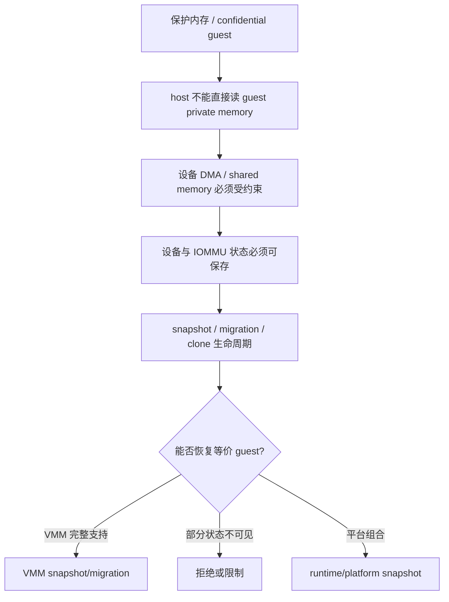

# Protected VM 与 snapshot/migration 跨项目专题分析

本文承接 [CoCo / pVM / 受保护 VM 跨项目专题分析](./coco-pvm-protected-vm-cross-project.md)、[Snapshot / Restore / Clone 跨项目专题分析](./snapshot-restore-cross-project.md) 和 [Guest Memory、DMA/IOMMU 与地址转换跨项目专题分析](./guest-memory-dma-iommu-cross-project.md)。

核心问题：开启 CoCo、pVM、protected VM 或 PVM 后，snapshot、restore、migration、clone 为什么经常被禁止、降级或上移到平台层。

## 1. 交叉模型

保护型 VM 改变的是信任边界。VMM 不再能假设所有 guest memory、DMA mapping、设备内部状态和 backend 状态都可直接读写。

因此生命周期能力必须重新证明。能创建 protected VM，不代表能 snapshot；能保存 memory，不代表能恢复 IOMMU、VFIO、vhost-user 或 guest agent 状态。

## 2. 横向结论矩阵

| 项目 | 保护机制 | snapshot/migration 结论 | 关键源码证据 |
|---|---|---|---|
| Firecracker | 当前源码未形成 TDX/SEV-SNP/CCA/pVM 控制面 | snapshot 成熟，但不是 confidential guest snapshot | snapshot API 在 `firecracker/src/firecracker/src/api_server/request/snapshot.rs:55-118`；CoCo 搜索只见架构常量 |
| Cloud Hypervisor | x86_64 TDX/SEV-SNP | TDX 直接拒绝 snapshot/live migration，动态内存被收窄 | `vmm/src/vm.rs:3156-3161`、`vmm/src/lib.rs:1456-1460`、`1556-1566`、`memory_manager.rs:1598-1604` |
| crosvm | `ProtectionType`、pVM firmware、SWIOTLB、virtio-iommu/pvIOMMU | protected VM 可创建，但 IOMMU/VFIO/vhost-user 会收窄 snapshot | `ProtectionType` 在 `hypervisor/src/lib.rs:653-690`；virtio-pci IOMMU 拒绝在 `virtio_pci_device.rs:1281-1284` |
| Kata Containers | runtime 编排 QEMU/CH TDX/SEV/SNP/CCA | SaveVM 是 hypervisor 抽象；CoCo 下 rootfs、热插拔、share-fs 被收窄 | QEMU `SaveVM()` 在 `qemu.go:2417-2440`；CH TDX capability 收窄在 runtime-rs `inner_hypervisor.rs:840-852` |
| CubeSandbox | x86_64 PVM 部署能力，不是 TDX/SEV guest private memory | snapshot/clone 是平台级组合；PVM 影响部署和 KVM 类型，不等价 CoCo migration | PVM x86-only 在 `pvm-deploy.md:5-6`；`CUBE_PVM_ENABLE` 在 `160-162`；`KvmPvm` 识别在 `kvm/mod.rs:953-958` |

结论：保护型 VM 与 snapshot/migration 的关系不是统一“支持”或“不支持”。它取决于保护机制是否让 VMM 仍能保存完整可恢复状态。

## 3. Firecracker：snapshot 有，CoCo 交叉面没有

Firecracker 的 snapshot API 很明确。`parse_put_snapshot_create()` 把请求转成 `VmmAction::CreateSnapshot`，见 `firecracker/src/firecracker/src/api_server/request/snapshot.rs:55-59`。

load snapshot 会校验 memory backend，并设置 `track_dirty_pages`、network/vsock override、clock 等参数，见 `snapshot.rs:62-118`。

snapshot 格式自身也完整。`vmm/src/snapshot/mod.rs:5-32` 说明 header、version、state 和 CRC 布局；`125-184` 定义 `Snapshot<Data>` 的创建和加载校验。

但当前源码没有形成 TDX、SEV-SNP、CCA 或 pVM 的配置入口。搜索到的 SEV/SNP 名称位于生成的 MSR 常量中，不能构成 confidential guest 生命周期支持。

所以 Firecracker 的交叉结论是：它有 VMM snapshot/full-diff/UFFD restore 能力，但不是 protected memory snapshot/migration 的实现样本。

## 4. Cloud Hypervisor：TDX 让生命周期直接变窄

Cloud Hypervisor 的普通 VM snapshot 走 `Vmm::vm_snapshot()`。它调用 `vm.snapshot()`，再 `vm.send()` 到 destination，见 `cloud-hypervisor/vmm/src/lib.rs:1889-1898`。

但 `Vm::snapshot()` 在 TDX 打开时直接返回错误。源码在 `vmm/src/vm.rs:3156-3161` 写明 `Snapshot not possible with TDX VM`。

live migration 的发送端也拒绝 TDX。`vmm/src/lib.rs:1456-1460` 在生成 common CPUID 前检查 TDX，并返回 `Live Migration is not supported when TDX is enabled`。

接收端同样拒绝。`vmm/src/lib.rs:1556-1566` 在 CPUID compatibility check 前检查源 VM 配置，如果 TDX enabled 就返回 migration receive error。

内存热插拔也被收窄。`vmm/src/memory_manager.rs:1598-1604` 在 TDX feature 下把 `dynamic` 设为 `!tdx_enabled`，后续 ACPI hotplug 地址分配不进入动态路径。

这是一种清晰、保守的 VMM 策略：如果 private memory、measurement、TD state 和设备状态不能被完整证明可迁移，就在生命周期入口拒绝。

## 5. crosvm：protected VM 与 IOMMU/VFIO 使 snapshot 分裂

crosvm 的 `ProtectionType` 明确表达 host 是否不能直接访问 VM memory。`isolates_memory()` 在 protected/custom/without-firmware 下返回 true，见 `hypervisor/src/lib.rs:653-679`。

但 crosvm snapshot 是 bus device 协议，不是 protected VM 专用协议。设备必须实现 `Suspendable`，virtio device 还必须实现 `virtio_snapshot()`。

最硬的限制在 virtio-pci。`VirtioPciDevice::snapshot()` 如果发现 `self.iommu.is_some()`，直接返回 `Cannot snapshot if iommu is present.`，见 `devices/src/virtio/virtio_pci_device.rs:1281-1284`。

virtio-iommu 本身保存 endpoints、mapper、translate tubes 和 control tube，见 `devices/src/virtio/iommu.rs:700-714`。但它实现 `VirtioDevice` 时没有覆写 snapshot/restore，见 `774-820`。

vhost-user 只在 `DEVICE_STATE` feature 存在时支持保存。frontend 在 `vhost_user_frontend/mod.rs:603-609` 拒绝缺少该 feature 的 snapshot，restore 也在 `643-649` 做同样检查。

所以 crosvm 的结论不是“protected VM 不能 snapshot”，而是：protected VM 中常见的 IOMMU/VFIO/vhost-user 路径会逐项缩小可恢复状态集合。

## 6. Kata Containers：CoCo 约束被翻译成 runtime 能力

Kata Go QEMU 路径的 `SaveVM()` 通过 QMP migration 把设备状态写到 `DevicesStatePath`，见 `src/runtime/virtcontainers/qemu.go:2417-2440`。

这说明 Kata 的 save 是 hypervisor plugin 能力，不是 runtime 自己保存 vCPU/memory/device。不同 plugin 的语义不同。

Cloud Hypervisor Go plugin 的 `PauseVM()`、`SaveVM()`、`ResumeVM()` 当前只记录日志并返回 nil，见 `virtcontainers/clh.go:1288-1301`。

Firecracker Go plugin 也类似，`PauseVM()`、`SaveVM()`、`ResumeVM()` 都返回 nil，见 `virtcontainers/fc.go:900-909`。

runtime-rs Cloud Hypervisor 路径更明确地处理 TDX。它要求 CH build 包含 TDX feature，见 `inner_hypervisor.rs:113-119`。

如果用户请求 confidential guest 但没有保护能力，会报错；如果 CH 发现 TDX 可用但用户未请求，也会报错，见 `inner_hypervisor.rs:632-660`。

TDX 下 runtime capability 被收窄。`inner_hypervisor.rs:840-852` 只暴露 block device、block hotplug 和 hybrid vsock；注释说明 TDX 不允许 virtio-fs。

配置转换也限制 rootfs 和 hotplug。`ch-config/src/convert.rs:47-75` 要求 TDX rootfs 使用 block device 且不能用 initrd。

内存热插拔在 TDX 下关闭，见 `convert.rs:252-260`。CPU hotplug 也被关闭，`331-335` 把 max vCPU 限制为 boot vCPU。

Kata 的结论是：CoCo 能力会从 hypervisor 向上压缩 runtime 能力，影响 rootfs、share-fs、CPU/memory hotplug 和 save/restore 语义。

## 7. CubeSandbox：PVM 不是 confidential guest migration

CubeSandbox PVM 的目标是让普通云服务器在没有 `/dev/kvm` 时获得 KVM 能力。文档明确说 PVM x86_64 only，aarch64 不支持，见 `CubeSandbox-sandbox-clone/docs/guide/pvm-deploy.md:5-6`。

`CUBE_PVM_ENABLE=1` 会选择 `vmlinux-pvm` 作为运行时 guest kernel。未设置时使用普通 `vmlinux`，PVM 不生效，见 `pvm-deploy.md:160-162`。

部署校验要求检查 runtime 配置、`/dev/kvm` 和 `kvm_pvm` module，见 `pvm-deploy.md:222-231`。

VMM fork 会识别 `KvmPvm`。`hypervisor/hypervisor/src/kvm/mod.rs:953-958` 根据 CPUID function `0x4000_0002` 的签名切换 hypervisor type。

但这不是 TDX/SEV-SNP 式 guest private memory。CubeSandbox 的 snapshot/clone/rollback 仍是平台级组合：VMM state、CubeCoW rootfs/memory、catalog、network binding 和 runtime metadata。

因此 CubeSandbox PVM 的交叉结论是：PVM 影响部署、kernel 选择和 KVM 类型，不应被解释成 confidential guest snapshot/migration 支持。

## 8. ARM64 与 x86_64 差异

x86_64 是 CoCo 和 PVM 机制最密集的一侧。Cloud Hypervisor 有 TDX/SEV-SNP；Kata QEMU 有 TDX/SEV/SNP；CubeSandbox PVM 也限定 x86_64。

ARM64 的主线不同。Kata QEMU arm64 只接受 CCA/RME；`qemu_arm64.go:145-164` 在 confidential guest 下要求 protection 是 CCA，并写 `confidential-guest-support=rme0`。

crosvm ARM64 protected VM 更强调 pVM firmware、SWIOTLB、restricted DMA pool 和后端 capability。它不是 Cloud Hypervisor TDX 那种“直接禁止 snapshot”的单一模型。

Firecracker 两个架构都没有同级 CoCo 控制面。它的 snapshot 差异主要来自设备和架构状态，而不是 protected memory 生命周期。

横向看，x86_64 更容易遇到“VMM 原生拒绝 TDX snapshot/migration”；ARM64 更容易遇到“平台 protected VM、DMA/IOMMU 和设备状态是否可恢复”的证明问题。

## 9. 能力边界总结

第一，保护型 VM 通常减少生命周期能力。Cloud Hypervisor TDX 是最直接例子：snapshot 和 live migration 被拒绝，动态内存被关闭。

第二，IOMMU/VFIO 会把 snapshot 从“保存设备配置”升级为“保存地址翻译和外部设备状态”。crosvm 选择在 virtio-pci IOMMU 存在时拒绝 snapshot。

第三，runtime 层不能凭抽象接口承诺能力。Kata 的 `SaveVM()` 语义取决于 QEMU、Cloud Hypervisor、Firecracker 等 plugin 的真实实现。

第四，平台级 snapshot 可以绕开部分 VMM 限制，但会引入平台一致性要求。CubeSandbox 需要同步 VMM、CubeCoW、catalog、network 和 runtime metadata。

后续深挖应按“具体组合”展开，而不是按单词展开：Cloud Hypervisor TDX snapshot 拒绝、crosvm protected VM + virtio-iommu、Kata TDX rootfs/hotplug、CubeSandbox PVM + snapshot/rollback。
