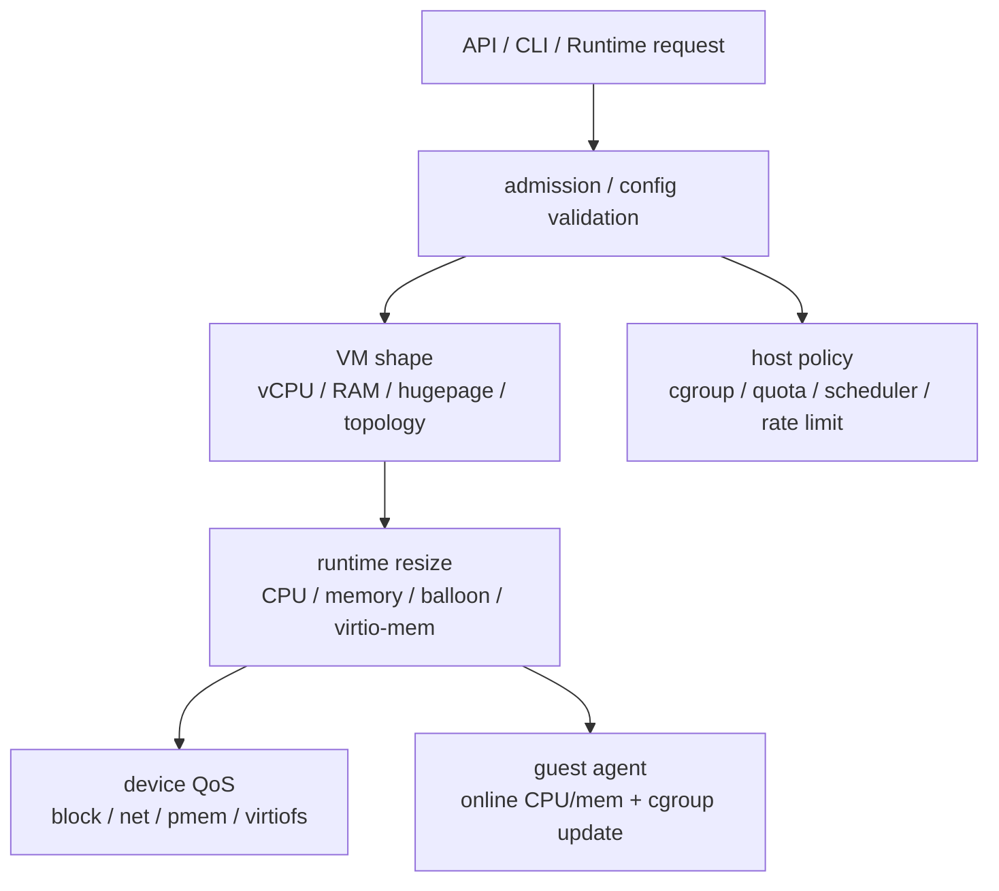

# 资源管理与 QoS 跨项目专题分析

本文从源码出发，比较 Firecracker、Cloud Hypervisor、crosvm、Kata Containers 和 CubeSandbox 的资源管理边界。

这里的资源管理不只包括 vCPU 和内存大小，也包括 balloon、virtio-mem、设备限速、宿主 cgroup、调度 quota、guest 内 cgroup 更新。

## 1. 分层模型

这条链路的关键问题是：资源限制发生在 VM 内还是 VM 外，发生在启动前还是运行中，以及是否需要 guest agent 协作。

Firecracker 和 Cloud Hypervisor 更接近 VMM 资源模型。Kata 和 CubeSandbox 把资源更新提升到 container/sandbox 语义。crosvm 位于两者之间，控制面强依赖 Tube 和宿主平台能力。

## 2. 总体矩阵

| 项目 | 资源入口 | 运行期改变 | QoS/限速 | guest 参与 | 主要边界 |
|---|---|---|---|---|---|
| Firecracker | `MachineConfig`、balloon、memory hotplug config | balloon、free-page hinting、block/net/pmem rate limiter、virtio-mem requested size | block/net/pmem device-local `RateLimiter` | 无固定 agent，balloon/virtio-mem 依赖 guest virtio driver | 启动后不能改通用 machine config |
| Cloud Hypervisor | VM config 的 CPUs/memory/balloon | `vm_resize -> Vm::resize`，CPU、memory、balloon 同一入口 | 更偏 VM resize，设备 QoS 不是核心轴 | hotplug 需要 guest OS 识别 ACPI/virtio-mem | 比 Firecracker 更像通用 VM 生命周期管理器 |
| crosvm | CLI/config、balloon、swap、cgroup、affinity | BalloonTube、swap、部分 hotplug/control request | vCPU throttle、cgroup、cpufreq domain | 无固定 agent，依赖 guest driver 和宿主控制 loop | 资源语义分散在控制 tube、device worker 和宿主平台 |
| Kata Containers | OCI/container resources、hypervisor config、agent RPC | `UpdateContainer`、`OnlineCPUMem`、mem hotplug probe | guest cgroup/resource update，host 侧由 runtime/hypervisor 承担 | kata-agent 必须参与 container resource 和 online 操作 | VM 拓扑与 guest cgroup 是双层资源语义 |
| CubeSandbox | API template resources、Master quota、Cubelet resource、Shim/agent update | Cubelet workflow、Task update、CubeShim update_container、agent online | API rate limit、scheduler quota、workflow concurrency、disk/net QoS、guest cgroup | cube-agent 参与 UpdateContainer 和 online CPU/mem | 产品级 sandbox 资源模型，覆盖调度、限流、VM、guest |

## 3. Firecracker：极窄的 VMM 资源边界

**设计取向**：资源边界刻意收窄。启动前用 `MachineConfig` 一次性定形，启动后只允许少量设备/内存运行期变更，不做通用 VM resize。

### 3.1 启动前：`MachineConfig` 定形

| 配置项 | 默认/约束 | 锚点 |
|---|---|---|
| 默认内存 | 128 MiB | `vmm_config/machine_config.rs:9` |
| 最大 vCPU | 32 | `vmm_config/machine_config.rs:15` |
| ARM64 SMT | 直接拒绝（`InvalidSmtValueOnAarch64`） | `vmm_config/machine_config.rs:234` |
| 内存 vs balloon | update 时拒绝小于 balloon target 的内存 | `resources.rs:264` |
| balloon target | 不能超过 guest memory | `resources.rs:331` |
| memory hotplug | `set_memory_hotplug_config`，先 validate 再保存 | （`resources.rs` 区） |

### 3.2 启动后：只开少量运行期变更

RPC allowlist 在 post-boot 阶段只放行 balloon、free page hinting、block/net/pmem 更新和 memory hotplug size；`UpdateMachineConfiguration` 在 post-boot reject 列表中（`rpc_interface.rs:744`、`:803`）。**结论：启动后不能改通用 machine config。**

### 3.3 QoS：设备本地限速

设备自己持 `RateLimiter`，限速逻辑在数据热路径上：

| 设备 | 限速触发 | 锚点 |
|---|---|---|
| block | queue event 在 limiter 阻塞时停止处理，limiter event 恢复 | `devices/virtio/block/virtio/device.rs:242`、`:356` |
| net RX/TX | RX/TX queue event 检查 limiter，limiter event handler 恢复 RX 或继续 TX | `devices/virtio/net/device.rs:236`、`:830`、`:873`、`:888` |

**能力边界**：资源边界很窄——允许少量运行期设备和内存请求变更，但不把自己做成完整的 VM resize manager。

## 4. Cloud Hypervisor：集中式 VM resize

**设计取向**：资源管理集中到一个入口。一个 `vm_resize` 同时改 CPU、内存、balloon，是通用 VM 生命周期管理器。

### 4.1 resize 分流

`vm_resize` 区分 VM 是否运行：运行前直接改 config，运行中进入 `Vm::resize`（`vmm/src/lib.rs:2120`）。

### 4.2 `Vm::resize` 内部分三层

| 层 | 机制 | 锚点 |
|---|---|---|
| vCPU | `CpuManager::resize`，变化时通知 ACPI CPU devices changed 并更新 `boot_vcpus` | `vm.rs:1892`、`:1900` |
| vCPU 约束 | 要求 dynamic 开启，desired ≥ 1；扩容 create/configure/activate，缩容 mark for removal | `cpu.rs:1594` |
| 内存 | `MemoryManager::resize`，拒绝 user-defined zones 的默认 resize；VirtioMem 要求 desired ≥ boot RAM，ACPI 路径新增 RAM region | `memory_manager.rs:2358` |
| balloon | `DeviceManager::resize_balloon` 后更新 config；完成后发 resized event | `vm.rs:1961`、`:1975` |

**能力边界**：明确承担 VM 形态变更职责，资源管理边界比 Firecracker 宽，但仍需 guest OS 能识别 CPU/memory hotplug。

## 5. crosvm：分散在 tube / 设备 / 宿主平台

**设计取向**：没有单一资源 API，资源语义分散在 config、control loop、BalloonTube、swap、cgroup 和平台特性里，是 ChromeOS/Android 风格。

### 5.1 启动期 balloon 初始化

设置 `init_memory` 时，total − initial 作为 balloon 初始大小，拒绝 initial > total（`src/crosvm/sys/linux.rs:700`）；balloon device 拿到 VM memory tube 用于动态 remap。

### 5.2 运行期控制通道

| 通道 | 能力 | 锚点 |
|---|---|---|
| BalloonTube | Adjust / Stats / WorkingSet / WorkingSetConfig，支持等待成功或排队 | `vm_control/src/balloon_tube.rs:22`、`:101` |
| 分流标记 | `VmRequest::BalloonCommand` 被标为应由 BalloonTube 处理（专用控制通道，非普通 VM request 分支） | `vm_control/src/lib.rs:2250` |
| swap | Enable 先 suspend vCPU 与设备，再迁 guest memory 到 staging memory 避免并发访问 | `vm_control/src/lib.rs:2041` |

### 5.3 宿主侧策略

vCPU affinity、capacity、core scheduling、cpufreq domain 都在主控路径里；cpufreq domain 要求 vcpu cgroup path，写 cgroup v2 threaded 结构（`src/crosvm/sys/linux.rs:1269`、`:1498`、`:3897`）。

**能力边界**：资源管理不是单一 API 模型，而是宿主策略 + tube 控制 + 设备协作的集合。

## 6. Kata Containers：host 改 VM 拓扑，guest 改容器 cgroup

**设计取向**：双层模型。host runtime/hypervisor 改 VM 拓扑，guest kata-agent 改容器 cgroup 或 online 新资源。

### 6.1 容器资源更新（双层）

| 阶段 | 动作 | 锚点 |
|---|---|---|
| host runtime | `updateContainer` 把 OCI resources 转 gRPC resources，发 `UpdateContainerRequest` | `runtime/virtcontainers/kata_agent.go:2051` |
| handler 映射 | 映射到 agent 的 `UpdateContainer` | `kata_agent.go:2347` |
| guest agent | 校验请求、找 container、protobuf resources 转 OCI resources、调 container `set` | `agent/src/rpc.rs:930` |

### 6.2 CPU/memory online（独立路径）

| 操作 | 机制 | 锚点 |
|---|---|---|
| online CPU/mem | agent `online_cpu_mem` → sandbox `online_cpu_memory` | `agent/src/rpc.rs:1497`、`agent/src/sandbox.rs:346` |
| mem hotplug probe | agent 收地址后写 guest probe 路径 | `agent/src/rpc.rs:1553` |

**能力边界**：资源更新不能只看 VMM。容器资源限制最终要在 guest 内生效，新增 CPU/memory 也要在 guest OS 中 online。

## 7. CubeSandbox：产品级 sandbox 资源闭环

**设计取向**：资源管理已经不是 VMM 配置，而是平台资源产品化——把 admission、quota、并发、设备限速、guest cgroup 串成一条 sandbox lifecycle。

### 7.1 控制面：限流 / 配额 / 调度

| 层 | 机制 | 锚点 |
|---|---|---|
| API 限流 | per-API-key token bucket；middleware 读 `X-API-Key`，匿名走 anonymous key，超限 429 | `CubeAPI/src/state.rs:13`、`:42`、`CubeAPI/src/middleware/rate_limit.rs:13` |
| 资源对象 | CPU millicores + memory 字符串；Node 上报 capacity/allocatable/instance type/快照 | `CubeAPI/src/cubemaster/mod.rs:1581`、`:1682`、`:1746` |
| 调度评分 | 读 request CPU/memory，按 `QuotaCpu − QuotaCpuUsage − request` 与内存剩余计分 | `CubeMaster/pkg/selector/score/realtimescore.go:47`、`:103` |

### 7.2 节点面：quota / 并发 / cgroup

| 机制 | 说明 | 锚点 |
|---|---|---|
| 创建资源汇总 | 汇总容器 CPU/内存写入 workflow `CreateContext`，处理 NUMA/PCI 注解 | `Cubelet/services/cubebox/resource.go:19` |
| host quota | CPU/memory/MVM limit/创建并发；状态上报写 quota CPU/mem/max MVM | `Cubelet/pkg/config/config.go:48`、`Cubelet/pkg/cubelet/node_status.go:521` |
| 创建并发 | 映射到 workflow limiter；`TryAcquire` 失败返回 concurrent failed | `Cubelet/services/server/operation.go:72`、`Cubelet/plugins/workflow/engine.go:318`、`:334` |
| 容器内存 | cgroup opt 注入 OCI spec，解析 `mem_limit`/`mem` 用 containerd OCI memory limit | `Cubelet/pkg/container/cgroup/cgroup.go:17` |
| 网络/virtiofs QoS | 网络 QoS 写入 shim interface `QosConfig`；virtiofs QoS 从 annotation 解码为 disk `RateLimiter` | `Cubelet/network/plugin_tap.go:507`、`Cubelet/plugins/workflow/request_param.go:15`、`Cubelet/plugins/cbri/cubeboxcbri/virtiofs.go:74` |

### 7.3 运行期更新（双层，类 Kata）

CubeShim `TaskService update` 解析 OCI resources 调 sandbox `update_container`（`CubeShim/shim/src/service/task_srv.rs:380`）；container 把 CPU shares/quota/period/cpuset 与 memory limit 转成 agent `UpdateContainerRequest`（`CubeShim/shim/src/container/mod.rs:745`）；cube-agent `update_container` 再转 OCI resources 调 container `set`，online CPU/mem 与 Kata 类似（`agent/src/rpc.rs:763`、`agent/src/sandbox.rs:257`）。

**能力边界**：平台资源产品化，覆盖 admission、quota、并发、设备限速、guest cgroup 的完整 sandbox 资源闭环。

## 8. ARM64 与 x86_64 差异

| 项目 | x86_64 | ARM64 |
|---|---|---|
| Firecracker | SMT 可配 | 直接拒绝 SMT（`InvalidSmtValueOnAarch64`） |
| Cloud Hypervisor | LAPIC/IOAPIC 通知 hotplug | GIC/GICR/ITS 的 ACPI 描述（`cpu.rs:1756`、`:1775`） |
| crosvm | 宿主平台集成偏 x86 | ARM64 Android/ChromeOS 更关注 vCPU affinity/cpufreq domain |
| Kata / CubeSandbox | agent resource update 跨架构复用 | 差异落在 guest kernel 是否支持 hotplug/virtio-mem/cpuset/设备枚举 |
| CubeSandbox | — | 额外验证 eBPF/CubeVS/network-agent/CubeHypervisor 的 ARM64 内核能力 |

## 9. 验证路线

| 项目 | 验证重点 |
|---|---|
| Firecracker | pre-boot machine config → post-boot reject → block/net limiter 改吞吐 → balloon/virtio-mem guest 可见状态 |
| Cloud Hypervisor | `vm_resize` 运行前/运行中分支；运行中分测 vCPU add/remove、ACPI memory、virtio-mem zone、balloon |
| crosvm | BalloonTube Adjust/Stats → swap enable 的 suspend 语义；宿主测 vCPU cgroup/cpufreq domain/affinity/capacity |
| Kata | 同时观察 runtime 请求、agent RPC、guest cgroup 文件、guest online 状态（runtime 成功 ≠ guest 内限制生效） |
| CubeSandbox | 分层打点 API limiter → Master score → Cubelet quota/workflow limiter → Task update → CubeShim request → cube-agent cgroup → 网络/virtiofs QoS |

## 10. 结论

资源管理的核心差异不是"是否支持 CPU/内存配置"，而是**资源语义停在哪一层**。

- Firecracker 停在极简 VMM 和设备级 QoS。
- Cloud Hypervisor 停在 VM 生命周期和 resize。
- crosvm 停在宿主平台控制和设备 tube。
- Kata 把资源语义推进到 VM 内 container。
- CubeSandbox 再把它推进到平台调度、quota、并发、网络、存储和 guest agent 的完整 sandbox 资源闭环。
