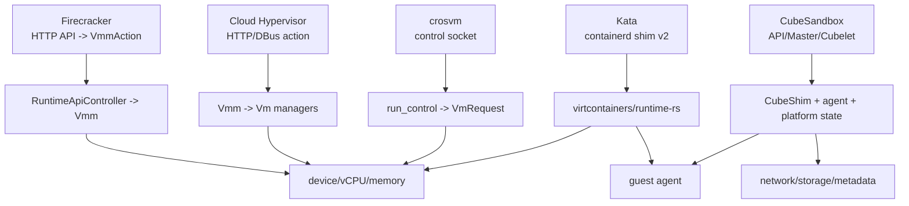
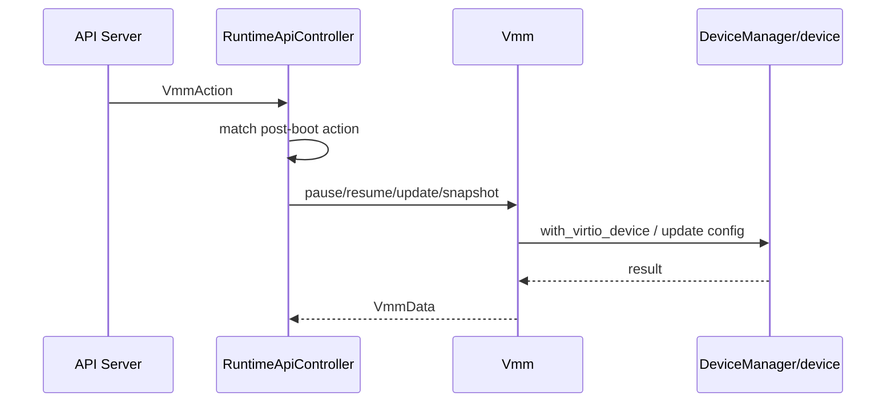

# 运行期控制面与热插拔跨项目专题分析

本文比较 Firecracker、Cloud Hypervisor、crosvm、Kata Containers 和 CubeSandbox 的运行期控制面。重点不是“如何启动 VM”，而是 VM 或 sandbox 已经运行后，控制命令如何进入系统，最终谁改变 vCPU、内存、设备、guest agent 或平台状态。

源码基线：当前仓库工作树。

相关文档：

- [启动路径与控制面跨项目专题分析](./boot-control-plane-cross-project.md)
- [设备模型与隔离边界跨项目专题分析](./device-model-isolation-cross-project.md)
- [网络与连接模型跨项目专题分析](./network-connectivity-cross-project.md)
- [Firecracker Runtime 设备更新链路](../firecracker/analysis/runtime-device-update-chain.md)
- [CubeSandbox Rollback / Runtime Update 链路](../CubeSandbox-sandbox-clone/analysis/rollback-runtime-update-chain.md)
- [CubeSandbox Sandbox Ready 生命周期链路](../CubeSandbox-sandbox-clone/analysis/sandbox-ready-lifecycle-chain.md)

## 1. 核心结论

运行期控制面可以按层级分成三类。VMM 型项目直接控制 VM 内核对象、vCPU 和设备模型；runtime 型项目把命令翻译成 hypervisor 与 guest agent 操作；平台型项目还要维护调度、网络、存储和 metadata 的一致性。

Firecracker 的运行期控制面最收敛。`RuntimeApiController` 只允许 post-boot 支持的 `VmmAction`，包括 pause/resume、snapshot、MMDS、balloon、block/net/pmem 等运行期更新：[firecracker/src/vmm/src/rpc_interface.rs](../firecracker/src/vmm/src/rpc_interface.rs#L673)。

Cloud Hypervisor 的控制面更像通用 VM API。DBus/HTTP action 会进入 `Vmm`，再调用 `Vm` 的 resize、pause、add/remove device 等方法：[cloud-hypervisor/vmm/src/api/dbus/mod.rs](../cloud-hypervisor/vmm/src/api/dbus/mod.rs#L92)。

crosvm 使用 control socket + Tube 模型。客户端发送 `VmRequest`，主 run loop 通过 `process_vm_control_event()` 收到请求，再调用 `process_vm_request()` 或转发到设备 tube：[crosvm/src/crosvm/sys/linux.rs](../crosvm/src/crosvm/sys/linux.rs#L3566)。

Kata 的运行期控制面是 runtime 语义。containerd shim 的 Pause/Stats/ResizePty/Update 会先处理 container 状态。

随后 shim 再调用 sandbox、agent 或 hypervisor：[kata-containers/src/runtime/pkg/containerd-shim-v2/service.go](../kata-containers/src/runtime/pkg/containerd-shim-v2/service.go#L708)。

CubeSandbox 的运行期控制面是平台语义。rollback/runtime update 不只是改 VMM 设备，还要更新 CubeMaster/Cubelet metadata、CubeShim 状态、CubeCoW 绑定和 guest agent 补齐。

## 2. 控制命令路径总图

这张图的关键差异在于命令是否必须跨过 guest agent。Cloud Hypervisor 和 crosvm 可以直接操作 VMM 内的设备模型；Kata 和 CubeSandbox 经常必须让 guest agent 修改容器、namespace、cgroup 或网络状态。

## 3. Firecracker：小而严格的 post-boot action

Firecracker 的 `RuntimeApiController::handle_request()` 明确列出运行后允许的操作。它匹配 `VmmAction`，把每个 action 转成 `Vmm` 内部方法或数据访问：[firecracker/src/vmm/src/rpc_interface.rs](../firecracker/src/vmm/src/rpc_interface.rs#L681)。

pause/resume 直接锁住 `Vmm` 并调用 `pause_vm()` 或 `resume_vm()`，同时记录 latency metric：[firecracker/src/vmm/src/rpc_interface.rs](../firecracker/src/vmm/src/rpc_interface.rs#L829)。

设备更新不是通用热插拔。Firecracker 更强调“已有设备的配置更新”，例如 block path、rate limiter、balloon、virtio-mem、MMDS 等。它不是 Cloud Hypervisor 那种通用 VM 设备添加面。

能力边界：Firecracker 运行期 API 稳定但窄。它适合固定 microVM 配置上的少量动态调参，不适合复杂 PCI 设备拓扑和多类型热插拔。

## 4. Cloud Hypervisor：通用 VM 的在线变更

Cloud Hypervisor DBus API 的 `vm_action()` 会复制 API sender 和 notifier，然后调用 action 的 `send()`。

具体 action 包括 add disk/fs/net、pause、remove device、resize、resume、shutdown 等：[cloud-hypervisor/vmm/src/api/dbus/mod.rs](../cloud-hypervisor/vmm/src/api/dbus/mod.rs#L132)。

`Vmm::vm_resize()` 如果 VM 已运行，会调用 `vm.resize()`；如果还没运行，则只更新 `VmConfig`。这个设计让同一个 API 同时支持 pre-boot config 修改和 runtime resize：[cloud-hypervisor/vmm/src/lib.rs](../cloud-hypervisor/vmm/src/lib.rs#L2120)。

`Vm::resize()` 会分别处理 vCPU、memory 和 balloon。vCPU resize 后可能发 `CPU_DEVICES_CHANGED`，memory resize 后可能更新 device manager 并发 `MEMORY_DEVICES_CHANGED`：[cloud-hypervisor/vmm/src/vm.rs](../cloud-hypervisor/vmm/src/vm.rs#L1892)。

设备热插拔也会同时更新运行中 VM 和持久配置。以 net 为例，`Vm::add_net()` 调 `DeviceManager::add_net()`，更新 `VmConfig`，再发 `PCI_DEVICES_CHANGED`：[cloud-hypervisor/vmm/src/vm.rs](../cloud-hypervisor/vmm/src/vm.rs#L2191)。

DeviceManager 负责真正的设备接入。add disk/fs/pmem 会构造 virtio device 并走 `hotplug_virtio_pci_device()`；VFIO passthrough 会更新 PCI bitmap：[cloud-hypervisor/vmm/src/device_manager.rs](../cloud-hypervisor/vmm/src/device_manager.rs#L4980)。

pause/resume 不是只停 vCPU。`Vm::pause()` 会先激活 pending virtio device，再 pause CpuManager、DeviceManager 和 hypervisor VM；x86_64 还保存 clock：[cloud-hypervisor/vmm/src/vm.rs](../cloud-hypervisor/vmm/src/vm.rs#L3068)。

ARM64 差异明确体现在 DeviceManager pause。AArch64 暂停时还要 pause interrupt controller，用于 flush GIC pending tables 和 ITS tables 到 guest RAM：[cloud-hypervisor/vmm/src/device_manager.rs](../cloud-hypervisor/vmm/src/device_manager.rs#L5487)。

能力边界：Cloud Hypervisor 的运行期控制面最像云主机。它覆盖 CPU/memory/balloon/disk/net/fs/VFIO 等在线变更，但也要求 guest 支持相应 ACPI、virtio-mem 或 PCI hotplug 协议。

## 5. crosvm：control socket、Tube 与设备专属控制

crosvm 的控制请求统一建模为 `VmRequest`。这个 enum 覆盖 Exit、Powerbtn、Suspend/Resume vCPU、balloon、disk、USB、GPU、VFIO hotplug、net hotplug、snapshot、listener、memory register 等：[crosvm/vm_control/src/lib.rs](../crosvm/vm_control/src/lib.rs#L1577)。

客户端侧通过 Unix seqpacket 连接 control socket，发送 `VmRequest`，等待 `VmResponse`：[crosvm/vm_control/src/sys/linux.rs](../crosvm/vm_control/src/sys/linux.rs#L37)。

run loop 中，`process_vm_control_event()` 从 `TaggedControlTube::Vm` 接收 `VmRequest`，调用 `process_vm_request()`，再把 `VmResponse` 回写给 tube：[crosvm/src/crosvm/sys/linux.rs](../crosvm/src/crosvm/sys/linux.rs#L3566)。

`process_vm_request()` 对 Exit 做特殊处理。VFIO hotplug 在 x86_64 下调用 `handle_hotplug_command()`，net hotplug 在启用 pci-hotplug feature 后调用 `handle_hotplug_net_command()`：[crosvm/src/crosvm/sys/linux.rs](../crosvm/src/crosvm/sys/linux.rs#L3239)。

不是所有控制都在主 VM 里执行。`AnyControlTube` 显式区分 Balloon、Disk、Fs、Gpu、IrqTube、PvClock、Snd、Vm、VmMemoryTube 和 VmMsync：[crosvm/vm_control/src/any_control_tube.rs](../crosvm/vm_control/src/any_control_tube.rs#L11)。

balloon 是典型例子。`BalloonTube` 把多客户端控制命令串行化，`Adjust` 可选择等待 guest 完成，Stats/WorkingSet 则等待设备 worker 回包：[crosvm/vm_control/src/balloon_tube.rs](../crosvm/vm_control/src/balloon_tube.rs#L24)。

能力边界：crosvm 的控制面是设备 worker 友好的。它适合把复杂设备放在独立进程或 worker 后，通过 Tube 做细粒度控制；但控制语义也因此更分散。

## 6. Kata Containers：runtime 状态机加 guest agent

Kata containerd shim 的 `Pause()` 会查找 container，设置 `PAUSING`，再调用 `s.sandbox.PauseContainer()`：[kata-containers/src/runtime/pkg/containerd-shim-v2/service.go](../kata-containers/src/runtime/pkg/containerd-shim-v2/service.go#L708)。

成功后，shim 会设置 `PAUSED` 并发送 TaskPaused 事件。

virtcontainers 的 container `pause()` 不直接操作 VMM。它先检查 sandbox running 和 container running。

随后流程调用 `c.sandbox.agent.pauseContainer()`，最后更新 container state：[kata-containers/src/runtime/virtcontainers/container.go](../kata-containers/src/runtime/virtcontainers/container.go#L1753)。

Stats 和 Update 也是 guest agent 语义。`stats()` 调 agent `statsContainer`。

`update()` 更新 runtime 内资源，再清理 guest 不追踪的 cpuset 字段，最后调用 agent `updateContainer`：[kata-containers/src/runtime/virtcontainers/container.go](../kata-containers/src/runtime/virtcontainers/container.go#L1695)。

Kata 同时保留 VM 级 hypervisor abstraction。

`Hypervisor` 接口暴露 PauseVM、ResumeVM、HotplugAddDevice、ResizeMemory、ResizeVCPUs 等能力：[kata-containers/src/runtime/virtcontainers/hypervisor.go](../kata-containers/src/runtime/virtcontainers/hypervisor.go#L1297)。

后端能力不是等价的。Cloud Hypervisor 后端 `ResizeVCPUs()` 会读取 VM info、校验 max vCPU 并发起 resize；Firecracker 后端的 `ResizeVCPUs()` 当前直接返回空结果：[kata-containers/src/runtime/virtcontainers/clh.go](../kata-containers/src/runtime/virtcontainers/clh.go#L1223)。

runtime-rs 也体现相同分层。container manager 的 pause/resume/stats/update 通过 agent 完成。

Dragonball 的 `resize_vcpu()` 则向 VMM 发送 `VmmAction::ResizeVcpu`：[kata-containers/src/runtime-rs/crates/hypervisor/src/dragonball/vmm_instance.rs](../kata-containers/src/runtime-rs/crates/hypervisor/src/dragonball/vmm_instance.rs#L321)。

能力边界：Kata 的“运行期控制”优先是 container runtime 控制。只有涉及 VM 资源时才落到 hypervisor；而且具体能力取决于 QEMU、Cloud Hypervisor、Firecracker、Dragonball 等后端实现。

## 7. CubeSandbox：平台级运行期变更

CubeSandbox 的运行期控制不是独立 VMM API，而是产品链路。rollback、runtime update、snapshot restore 会跨 CubeMaster、Cubelet、CubeShim、CubeHypervisor、CubeCoW、network-agent 和 guest agent。

与 Firecracker 或 Cloud Hypervisor 相比，CubeSandbox 更关心“平台状态一致”。一次 rollback 不只恢复 VM memory，还要重绑 rootfs/memory volume、刷新 network-agent state，并让 CubeShim/agent 进入新的运行态。

这类控制的风险也更高。VMM 设备状态、guest agent 状态、CubeCoW snapshot、CubeMaster metadata 和 network-agent 持久化必须共同收敛，否则外部看到的 sandbox 可能 ready，但内部资源引用已经错位。

因此 CubeSandbox 的运行期控制应按事务链路阅读，而不是按单个 VMM action 阅读。

已展开的专题包括 [Rollback / Runtime Update 链路](../CubeSandbox-sandbox-clone/analysis/rollback-runtime-update-chain.md) 和 [Sandbox Ready 生命周期链路](../CubeSandbox-sandbox-clone/analysis/sandbox-ready-lifecycle-chain.md)。

## 8. ARM64 与 x86_64 对照

| 项目 | x86_64 运行期特征 | ARM64 运行期特征 |
|---|---|---|
| Firecracker | MMIO/PCI、balloon、virtio-mem、block/net 更新；SendCtrlAltDel x86-only | 缺少 x86 legacy 操作；设备更新更依赖 MMIO/virtio 路径 |
| Cloud Hypervisor | pause 保存/恢复 VM clock；PCI/ACPI 热插拔成熟 | pause DeviceManager 时需要处理 GIC pending/ITS tables |
| crosvm | VFIO hotplug 显式在 x86_64 分支；PCI hotplug 路径更完整 | hotplug 命令在非 x86_64 可能只返回 OK 或受 feature 限制 |
| Kata | 后端能力取决于 QEMU/CLH/FC/Dragonball；x86 后端通常热插拔能力更全 | agent 语义相同，但 hypervisor backend 和 guest kernel 决定资源热插拔 |
| CubeSandbox | PVM 当前 x86-only，notify/control 可走 x86 特定路径 | ready notify 和 VMM/guest image/device tree 需要额外验证 |

ARM64 差异不只在启动。运行期 pause、interrupt controller 状态保存、PCI/ACPI 热插拔、virtio-mmio 设备发现和 guest kernel hotplug 支持，都会影响在线控制能力。

## 9. 能力边界矩阵

| 能力 | Firecracker | Cloud Hypervisor | crosvm | Kata Containers | CubeSandbox |
|---|---|---|---|---|---|
| pause/resume VM | 有，运行期 action | 有，Pausable VM | 有，VmRequest Suspend/Resume | 由 hypervisor 接口提供 | 由 CubeShim/VMM 链路提供 |
| pause/resume container | 不适用 | 不适用 | 不适用 | 有，agent pause/resume container | guest agent/containerd 组合 |
| vCPU resize | 以机型/实现为边界 | `CpuManager.resize` + hotplug notify | 以 VmRequest/平台能力为边界 | 后端相关，FC 后端为空实现 | 取决于 CubeHypervisor |
| memory resize | balloon/virtio-mem | ACPI memory 或 virtio-mem | balloon/swap/memory tube | hypervisor + agent/resource manager | VM snapshot/restore 和资源配置链路 |
| disk/net hotplug | 偏已有设备更新 | add/remove disk/net/fs/VFIO | VFIO/net hotplug + device tube | Hypervisor HotplugAdd/RemoveDevice | CubeShim hotplug + network-agent |
| stats | balloon/device stats | VM/device API | VmResponse/设备 tube | shim + agent stats | Cubelet/CubeShim/agent metrics |
| 平台一致性 | VMM 内部 | VM config + manager state | run loop + worker state | sandbox/container state | Master/Cubelet/CubeCoW/network metadata |

结论：不能只问“是否支持热插拔”。更准确的问题是：热插拔的对象是什么、由谁维护配置持久化、guest 如何感知、失败后谁回滚，以及 ARM64/x86_64 上使用的是同一种通知机制还是架构特定路径。

## 10. 推荐阅读顺序

1. 先读 Firecracker runtime action，建立“运行期 API 白名单”和“已有设备更新”的基本模型。
2. 再读 Cloud Hypervisor resize/hotplug，理解通用 VM 如何把 API、VmConfig、manager 和 guest notification 串起来。
3. 然后读 crosvm control socket 与 Tube，理解设备 worker 模型下控制面为什么分散。
4. 再读 Kata shim Pause/Update/Stats，理解 runtime 语义如何压到 guest agent 和 hypervisor 后端。
5. 最后读 CubeSandbox rollback/runtime update，理解平台级运行期变更为什么必须覆盖 metadata、network 和 storage。
