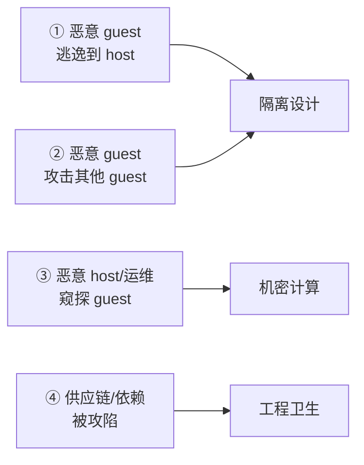
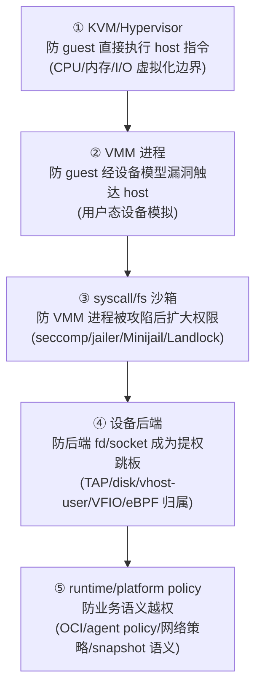

# 安全设计依据跨项目专题分析

本文回答一个问题：**设计一个轻量化虚拟机时，安全应该怎么推理、怎么取舍？**

它是综合层，不是机制层。机制（jailer 怎么 pivot_root、seccomp 怎么按线程生成、Landlock 怎么建 ruleset、agent policy 怎么 check）已经在机制文档里讲清楚：

- 机制基础：[安全隔离边界跨项目专题分析](./security-isolation-cross-project.md)（五个项目的隔离机制清单与源码锚点）。
- 项目级新补充：[Cloud Hypervisor 隔离机制 seccomp+Landlock 链路](../cloud-hypervisor/analysis/isolation-seccomp-landlock-chain.md)。
- 配套：[性能设计依据](./performance-design-basis-cross-project.md)（安全机制的运行期开销落在性能一侧）、[完整面貌](./vm-design-landscape-overview.md)。

本文在机制之上叠加四层：威胁模型、纵深防御的设计原理、攻击面收敛哲学、性能与安全的张力。目标是把“知道每个项目做了什么”升级成“知道为什么这么做、自己设计时该怎么决策”。

源码基线：当前工作树。带行号的结论引用机制文档已验证的锚点；标注“工程判断”的为推理。

## 1. 先建立威胁模型：你在防谁

安全设计的第一步不是选机制，而是明确威胁模型。轻量化 VM 至少要面对四类威胁主体，每个项目因为工作负载不同，优先级也不同。

| 威胁主体 | 含义 | 谁最在意 | 主防线 |
|---|---|---|---|
| ① 恶意 guest 逃逸 | guest 内代码利用 VMM/设备漏洞回到 host | Firecracker、crosvm、CubeSandbox | KVM 边界 + VMM 攻击面收敛 |
| ② guest 攻击 guest | 共享宿主上的租户互相攻击 | 多租户 serverless（Firecracker、CubeSandbox） | 每 VM 独立进程 + 独立 jail + 网络隔离 |
| ③ 恶意 host 窥探 guest | 云厂商/运维可读 guest 内存与计算 | 机密计算客户 | CoCo/TEE（TDX/SEV-SNP/CCA/pVM） |
| ④ 依赖被攻陷 | 第三方库/工具链植入后门 | 全部 | 依赖审计、reproducible build、最小依赖 |

机制结论（核心判断）：

1. **Firecracker/crosvm 的安全设计主要针对 ①②**（多租户 serverless/桌面场景的 guest 逃逸与租户隔离）。
2. **Cloud Hypervisor 的 CoCo 路径（TDX/SEV-SNP）主要针对 ③**（见 [CoCo/pVM 专题](./coco-pvm-protected-vm-cross-project.md)，历史/暂缓）。
3. **Kata/CubeSandbox 的 agent policy 针对 ① 的一个子集**：即使 guest 内进程被攻陷，agent 仍按 policy 拒绝越权操作。
4. **威胁 ④ 不靠运行期机制解决**，靠工程卫生，但“最小设备面/最小依赖”本身也降低 ④ 的暴露。

设计依据：

> **先定威胁模型，再选机制。** 没有统一的“最安全”VMM。serverless 多租户首选 Firecracker 范式（①②）；机密计算首选 CoCo（③）；容器生态兼容选 Kata（① 的子集 + 兼容性）。

## 2. 纵深防御：为什么是五层，不是一层

[安全隔离边界](./security-isolation-cross-project.md) 第 1 节给了五层模型：KVM/Hypervisor → VMM 进程 → syscall/fs 沙箱 → 设备后端 → runtime/platform policy。这里讲为什么是五层、每一层防什么。

纵深防御的设计原理：**每一层都假设上一层可能被突破**。

- ① KVM 是硬件辅助的强边界（VMX/SVM/EL2），但历史上有侧信道与微架构漏洞，所以不能只靠它。
- ② VMM 进程把设备模拟放在用户态，guest 触发 vm-exit 后由 VMM 处理；VMM bug（如设备模拟的越界写）是 ① 被绕过的常见路径，所以 ③ 必须存在。
- ③ syscall/fs 沙箱保证：即使 VMM 进程被攻陷，它也只能做 allowlist 内的 syscall、只能访问白名单路径。这是“把已经被攻陷的进程关进更小的笼子”。
- ④ 设备后端（TAP fd、disk fd、vhost-user socket、VFIO group、eBPF map）是 host 资源，其 fd 归属与生命周期决定被攻陷的 VMM 能否经后端触达更多 host 资源。
- ⑤ runtime/platform policy 是业务层：即使 guest 内进程被攻陷，agent 按 policy 拒绝越权的 create/exec/mount。

机制结论：

1. **每一层的强度独立可评估**。Firecracker 在 ②③ 强（极小设备面 + jailer + 线程 seccomp）；crosvm 在 ②③④ 强（process-per-device + Minijail）；Cloud Hypervisor 在 ③ 强（线程 seccomp + Landlock）但 ②③ 的进程级关押弱（无 external jailer）；Kata/CubeSandbox 在 ⑤ 强（agent policy + 平台策略）。
2. **没有项目五层都做到极致**。这是设计取舍，不是缺陷。

设计依据：

> **安全不是单点强度，而是最薄弱环节的抗压能力。** 设计时要问“如果这层被突破，下一层能不能挡住”，而不是“这层有多强”。Firecracker 的极简设备面本质上是把 ② 的暴露面缩到最小，让 ③ 的 seccomp allowlist 也最小——两层一起收窄。

## 3. 攻击面收敛哲学：三种范式

五个项目收敛攻击面的方式可以归为三种哲学。理解这三种哲学，比记住具体 syscall 更有用。

### 范式 A：极简设备面（Firecracker）

把设备数压到最少（block/net/vsock/rng/balloon/pmem），pre-boot 一次性聚合配置，runtime 几乎不可变。设备少 → 设备模拟代码少 → ② 的漏洞面小 → ③ 的 seccomp allowlist 也小。

证据：Firecracker 的 `UpdateMachineConfiguration` 在 post-boot reject 列表（`firecracker/src/vmm/src/rpc_interface.rs:744`），见 [资源管理与 QoS](./resource-qos-cross-project.md) 第 3 节。jailer 复制 binary 而非 hard link，避免多进程共享 text mapping（`firecracker/src/jailer/src/env.rs:468`）。

代价：设备能力窄，复杂 workload 跑不了。

### 范式 B：进程级设备隔离（crosvm）

不缩小设备面，而是把每个设备 fork 进独立进程，用 Minijail 做 namespace/seccomp/capability 限制。被 guest 攻陷的设备进程只能通过受限 Tube 请求全局操作。

证据：`create_devices()` 返回 `(BusDeviceObj, Option<Minijail>)`（`crosvm/src/crosvm/sys/linux.rs:905`），设备创建即携带 jail 决策；`ProxyDevice` 把内层设备放到子进程（`crosvm/devices/src/proxy.rs:414`），见 [crosvm device isolation chain](../crosvm/analysis/device-isolation-chain.md)。ARCHITECTURE 明确 control socket 是权限分离点（`crosvm/ARCHITECTURE.md:47`）。

代价：IPC 与跨进程状态协调复杂，snapshot/suspend/hotplug 都要跨进程（见 [crosvm snapshot-suspend chain](../crosvm/analysis/snapshot-suspend-chain.md)）。

### 范式 C：模块化 VMM + 线程级最小权限（Cloud Hypervisor）

设备面介于 Firecracker 与 crosvm 之间，但每个线程（VMM/vCPU/EventMonitor/SignalHandler/各 virtio 设备）有独立 seccomp allowlist，辅助线程额外施加 Landlock 文件访问白名单。

证据：见新补充的 [Cloud Hypervisor 隔离机制链路](../cloud-hypervisor/analysis/isolation-seccomp-landlock-chain.md)：seccomp filter 按 `Thread` 枚举分发（`vmm/src/seccomp_filters.rs:961-991`），Landlock ruleset 由 `VmConfig` 驱动（`vmm/src/vm_config.rs:25-28` 的 `ApplyLandlock` trait）。**Cloud Hypervisor 不做进程级 chroot/pivot_root/netns/cgroup 关押**——这是它与 Firecracker 范式 A 的根本差异，强隔离要部署侧外层补。

代价：没有进程级关押，依赖部署侧或 Landlock 收敛文件访问；Landlock 只覆盖辅助线程，主数据面线程靠 seccomp。

机制结论：

1. **三种范式不是优劣关系，而是“设备面大小 × 隔离粒度”的不同组合**。
2. 范式 A 用“少”换安全；范式 B 用“分”换安全；范式 C 用“线程级精细化”换安全且保留模块化。

设计依据：

> **攻击面收敛有三条正交轴线：减少设备数、分散到独立进程、按线程精细化权限。** 选哪条取决于工作负载：固定设备面选 A，复杂设备面选 B，要兼顾模块化与多架构选 C。

## 4. Kata / CubeSandbox：把安全提升到 runtime/platform 层

Kata 与 CubeSandbox 的安全不在 VMM 单点，而在 runtime/platform 层的 policy。

### Kata：双边界 + agent policy

Kata 的安全是“host 边界（shim/runtime/hypervisor）+ guest 边界（agent policy）”双层。guest agent 所有 RPC 进入实际操作前都 policy check：`create_container()` 先 `is_allowed(&req)` 再 `do_create_container()`（`kata-containers/src/agent/src/rpc.rs:864`），`is_allowed()` 序列化请求、拿全局 `AGENT_POLICY` 锁、按 endpoint 检查（`kata-containers/src/agent/src/policy.rs:31`），见 [安全隔离边界](./security-isolation-cross-project.md) 第 6 节。

机制结论：Kata 的关键安全点是“双边界”——host 上 workload 不直接 fork，guest 内 agent 按 policy 执行 OCI/container 操作。底层 VMM 选择又决定设备隔离能力。

### CubeSandbox：平台级隔离 + 网络策略 + snapshot 语义

CubeSandbox 把隔离提升到产品级：CubeShim runtime seccomp（`CubeShim/shim/src/hypervisor/cube_hypervisor.rs:75`，x86 放开 `mkdir`、aarch64 放开 `mkdirat`）、network-agent 网络策略、CubeVS/eBPF 数据面、cube-agent RESTORE 分支只追加 virtiofs storage。snapshot mode 本身也是隔离语义的一部分（见 [安全隔离边界](./security-isolation-cross-project.md) 第 7 节）。

机制结论：CubeSandbox 的安全不只是 VM 隔离，网络出入策略、TAP fd 生命周期、eBPF map、guest 网络配置、snapshot mode 都是隔离语义的一部分。

设计依据：

> **越靠近平台层，安全的语义越“业务化”。** VMM 层防“代码逃逸”；runtime 层防“容器越权”；platform 层防“租户越界、快照泄漏、网络绕过”。设计 platform 时，安全要和 snapshot/rollback/网络策略一起设计，不能事后补。

## 5. 性能与安全的张力

安全机制不是免费的。每个安全决策都有性能代价，这是 [性能设计依据](./performance-design-basis-cross-project.md) 的反面。

| 安全机制 | 性能代价 | 缓解 |
|---|---|---|
| seccomp filter | 每次 syscall 一次 BPF 遍历（µs 级） | allowlist 尽量小、静态；Firecracker 反序列化 100KB 上限防异常 filter（`vmm/src/seccomp.rs:8`） |
| jailer / Minijail | 启动时一次性（pivot_root/cgroup/netns），运行期几乎零 | 只在启动路径付出 |
| Landlock restrict_self | 一次性生效，运行期零 | 只覆盖辅助线程（Cloud Hypervisor） |
| 进程级隔离（crosvm） | 每次设备操作跨 Tube IPC | 用 vhost 把数据面移出进程 |
| CoCo/TEE（加密内存） | 每次内存访问加密/解密 + attestation | 只在威胁 ③ 场景启用 |
| agent policy check | 每个 RPC 一次 JSON 序列化 + 锁 + 检查 | policy 尽量静态、锁粒度可控 |

机制结论：

1. **运行期持续开销最大的是 seccomp（每次 syscall）与 CoCo（每次内存访问）**。jailer/Landlock 主要是启动期一次性成本。
2. **范式 B（进程级隔离）的性能代价在 IPC**，所以 crosvm 用 vhost 把热数据面移出进程，只留控制面走 Tube。这与 [性能设计依据](./performance-design-basis-cross-project.md) 第 5 节“数据面离开 VMM 线程”是同一个原理的安全侧应用。

设计依据：

> **安全机制的性能代价分两类：启动期一次性（jailer/Landlock）与运行期持续（seccomp/CoCo/IPC）。** 启动期代价几乎总能接受；运行期代价要靠“把受保护的路径移出热路径”来缓解——seccomp 靠小 allowlist，CoCo 靠只在敏感场景启用，进程隔离靠 vhost 卸载数据面。

## 6. ARM64 与 x86_64 的安全差异

安全框架多数跨架构共享，差异落在 syscall allowlist、设备 policy、guest kernel 能力、eBPF。

- Firecracker：ARM64 下 jailer 额外复制 cache topology 与 `midr_el1`（`firecracker/src/jailer/src/env.rs:552/617`），见 [安全隔离边界](./security-isolation-cross-project.md) 第 8 节。
- Cloud Hypervisor：vCPU 线程 seccomp allowlist 按架构分裂——x86 有 `open/readlink/unlink`，ARM64 用 `openat/readlinkat/unlinkat`（`vmm/src/seccomp_filters.rs:823-848`），见 [CH 隔离机制链路](../cloud-hypervisor/analysis/isolation-seccomp-landlock-chain.md) 第 6 节。
- crosvm：seccomp policy 按架构拆，ARM 设备有 PL030 等专用 policy。
- CubeSandbox：CubeShim seccomp `mkdir` vs `mkdirat`，CubeVS 需验证 arm64 eBPF（`CubeNet/cubevs/bpf_arm64.go:46`）。

机制结论：**架构差异的重点不是“换了一套安全模型”，而是同一套框架在 syscall allowlist、seccomp policy、eBPF load 上按架构改变**。设计时要把“ARM64 的 syscall 集与 x86 不同”当成 seccomp 设计的一等约束。

## 7. 安全设计决策框架

把上面六节收成一个可操作的决策框架。设计一个新 VM 时，按顺序回答：

1. **威胁模型**：主要防 ①②③④ 中的哪个？→ 决定主防线（隔离 vs CoCo vs policy）。
2. **设备面大小**：固定少量设备还是复杂设备面？→ 决定范式 A/B/C。
3. **隔离粒度**：进程级、线程级、还是 syscall 级？→ 决定 jailer/Minijail/seccomp/Landlock 的组合。
4. **运行期开销预算**：能接受每次 syscall 的 seccomp 开销吗？能接受 CoCo 的加密内存代价吗？→ 决定机制是否进热路径。
5. **纵深完整性**：每层被突破后下一层能否挡住？→ 决定层数与强度分配。
6. **架构一致性**：ARM64 与 x86_64 的 syscall/设备/eBPF 是否都对齐？→ 决定 allowlist 与 policy 的架构门控。

## 8. 七条安全设计原则（提炼）

1. **先威胁模型，后机制**：没有通用最安全，只有针对特定威胁的最优。
2. **纵深防御假设上一层会被突破**：每一层独立可评估，看最薄弱环节。
3. **攻击面收敛有三条正交轴**：减少设备数（A）、分散到进程（B）、线程级精细化（C）。
4. **运行期安全开销要移出热路径**：seccomp 靠小 allowlist，进程隔离靠 vhost 卸载，CoCo 靠场景化启用。
5. **越靠近平台层，安全越业务化**：snapshot/网络策略/agent policy 与隔离一起设计。
6. **架构差异落在 syscall allowlist 与 eBPF**：ARM64/x86_64 不是换模型，是换 allowlist。
7. **安全机制的可审计性本身就是安全**：Firecracker 的极短路径、线程级 seccomp 都是为了“可审计、可验证”，不可审计的隔离等于没有。

## 9. 已知边界与诚实声明

1. **CoCo/机密计算路径**（威胁 ③ 的主防线）在 Kata 暂缓，在 Cloud Hypervisor/CubeSandbox 保留为历史参考。本文不展开 TDX/SEV-SNP/CCA 的机制细节，见 [CoCo/pVM 专题](./coco-pvm-protected-vm-cross-project.md)。
2. **crosvm** 的 process-per-device 细节来自已有（暂停的）链路文档，未做新的函数级验证。
3. **性能代价的量化**（如 seccomp 每次 syscall 的确切 ns）本工作树未单独插桩测量，属工程判断；CoCo 的加密内存代价依赖硬件，未实测。
4. 本文不替代机制文档。所有“怎么做”回到 `security-isolation-cross-project.md` 与各项目隔离链路；本文只回答“为什么、怎么决策”。
