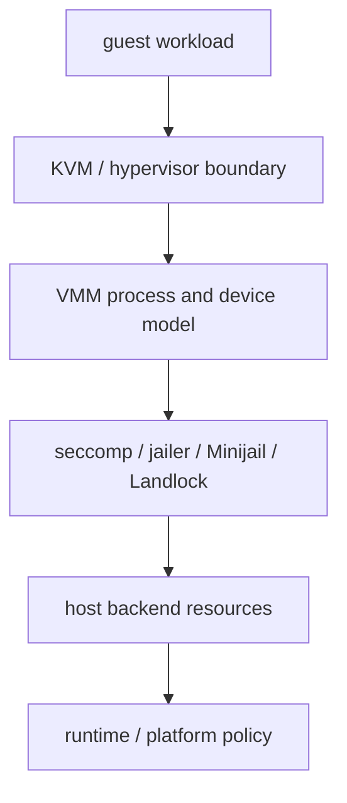
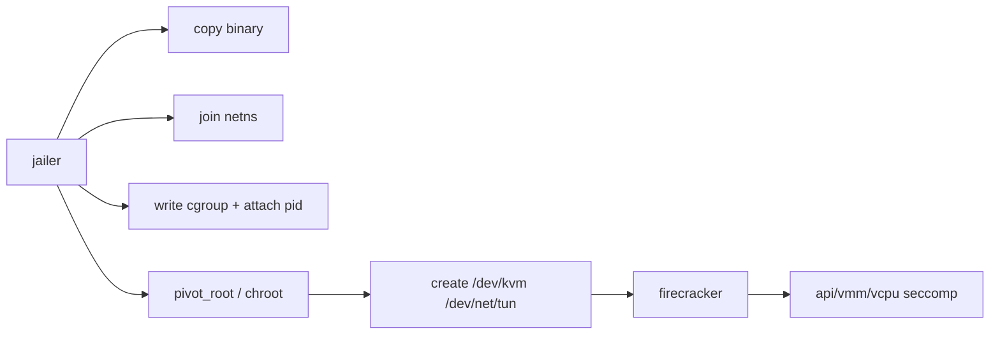
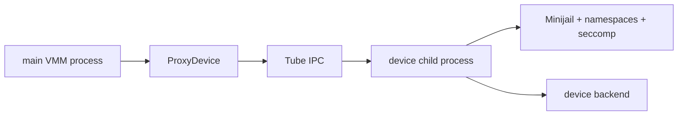

# 安全隔离边界跨项目专题分析

本文比较 Firecracker、Cloud Hypervisor、crosvm、Kata Containers 和 CubeSandbox 的安全隔离机制。

核心问题：Micro-VM 的安全边界不是单点。KVM 提供 guest/host 执行边界，VMM 提供设备模型边界，seccomp/jailer/minijail/Landlock 限制 host 侧攻击面，runtime/agent/platform 再约束业务语义。

> 本文是机制清单。安全**设计推理**（威胁模型、纵深防御原理、攻击面收敛三范式、性能-安全张力）见 [安全设计依据跨项目专题分析](./security-design-basis-cross-project.md)。

## 1. 分层模型

安全隔离至少有五层。

| 层级 | 作用 |
|---|---|
| KVM/Hypervisor | guest CPU、内存、I/O 虚拟化边界 |
| VMM process | 用户态设备模型、event loop、API 控制面 |
| syscall/filesystem sandbox | seccomp、jailer、Minijail、Landlock、namespace、cgroup |
| device backend | TAP、disk、vhost-user、VFIO、virtiofsd、eBPF |
| runtime/platform policy | OCI、agent policy、网络策略、metadata、snapshot/clone 语义 |

## 2. 总体矩阵

| 项目 | 主要隔离取向 | 关键实现 | 代价 |
|---|---|---|---|
| Firecracker | 小设备面 + 强进程限制 | jailer、thread seccomp、cgroup、netns、pivot_root | 设备能力刻意收窄 |
| Cloud Hypervisor | 模块化 VMM + 线程 seccomp + Landlock | VMM/virtio thread filters、Landlock rules | 多数设备仍在 VMM 进程内 |
| crosvm | 宽设备面 + process-per-device | Minijail、ProxyDevice、Tube、per-device seccomp | IPC 和状态协调复杂 |
| Kata Containers | VM 隔离 + guest agent policy | shim/runtime、hypervisor plugin、kata-agent policy | 安全边界跨 host 和 guest |
| CubeSandbox | 平台级隔离 + 网络策略 | CubeShim seccomp、CubeVS/eBPF、network-agent、cube-agent | 平台状态一致性更复杂 |

## 3. Firecracker：极小设备面 + 外层 jailer + 线程级 seccomp

**设计取向**：先把设备面收到最小，再用外层 jailer 关押进程、内层 seccomp 限制每个线程的 syscall。三层叠加，任一层被突破仍有下一层。

### 3.1 jailer：进程级关押

jailer 是独立进程，按固定顺序把 firecracker 关进受限环境：

| 步骤 | 机制 | 锚点 |
|---|---|---|
| 复制 binary | 复制而非 hard link，避免多进程共享 executable text mapping | `jailer/src/env.rs:468` |
| 加入 netns | 打开 netns 文件，`setns(CLONE_NEWNET)` | `jailer/src/env.rs:520` |
| ARM64 sysfs | 复制 cache topology 与 `midr_el1` | `jailer/src/env.rs:552`、`:617` |
| cgroup | 先写全部属性再 attach pid（cpuset 类需先设 `cpuset.mems`/`cpuset.cpus`） | `jailer/src/cgroup.rs:488` |
| 根文件系统 | `unshare(CLONE_NEWNS)` → slave propagation → bind mount → `pivot_root` → umount old root | `jailer/src/chroot.rs:17` |

`run()` 整体顺序：复制 binary → 加入 netns → rlimit → cgroup → 复制 ARM64 sysfs → pivot_root/chroot → 创建设备节点（`jailer/src/env.rs:644`）。

### 3.2 seccomp：线程级 syscall 限制

| 项 | 机制 | 锚点 |
|---|---|---|
| 分类 | 按线程类别，只接受 `vmm`/`api`/`vcpu` 三类 filter | `firecracker/src/firecracker/src/seccomp.rs:10` |
| 反序列化上限 | 100KB，防异常 filter 触发内存分配攻击 | `vmm/src/seccomp.rs:8` |
| 安装顺序 | 先 `PR_SET_NO_NEW_PRIVS`，再 `seccomp(SECCOMP_SET_MODE_FILTER, ...)` | `vmm/src/seccomp.rs:93` |

**能力边界**：安全来自"少 + 关 + 限"三层；代价是设备能力刻意收窄。

## 4. Cloud Hypervisor：线程级 seccomp + Landlock（无 external jailer）

**设计取向**：不用 Firecracker 那种外部 jailer，而是在 VMM 进程内按线程施加 seccomp，可选 Landlock 限制文件访问。多数设备仍在 VMM 进程内，强隔离靠线程级最小 syscall + 文件白名单。

> 项目级函数级链路见 [Cloud Hypervisor 隔离机制 seccomp+Landlock 链路](../cloud-hypervisor/analysis/isolation-seccomp-landlock-chain.md)。

### 4.1 Landlock：配置驱动的文件白名单

| 项 | 机制 | 锚点 |
|---|---|---|
| 触发 | `vm_create()` 对 `VmConfig` 应用 Landlock | `vmm/src/lib.rs:1777`、`:1782` |
| ABI | V3，默认创建覆盖所有文件访问的 ruleset，path rule 加允许项，最后 `restrict_self()` | `vmm/src/landlock.rs:36` |

### 4.2 seccomp：按线程类型施加

| 线程 | seccomp | Landlock | 锚点 |
|---|---|---|---|
| VMM thread | apply filter | 无 | `vmm/src/lib.rs:527` |
| event-monitor | apply filter | `restrict_self()`（若 `landlock_enable`） | `vmm/src/lib.rs:456` |
| signal-handler | apply filter | `restrict_self()`（若 `landlock_enable`） | `vmm/src/lib.rs:767` |
| virtio device | `spawn_virtio_thread()` 内 apply filter | 无 | `virtio-devices/src/thread_helper.rs:17` |

virtio seccomp rules 按设备类型（block/net/fs/vsock/mem/balloon/watchdog 等）生成，再追加 common syscall 集合（`virtio-devices/src/seccomp_filters.rs:273`）。

**能力边界**：更偏"线程级最小 syscall + 文件访问控制"；无 process-per-device，但设备后端可经 vhost-user 外置。

## 5. crosvm：process-per-device + Minijail

**设计取向**：宽设备面配合更强设备进程隔离。README 明确 process-per-device（`README.md:59`）；每个 sandbox 由 Minijail 创建，seccomp policy 在 `jail/seccomp/{arch}/{device}.policy`（`ARCHITECTURE.md:38`）。

### 5.1 设备创建即携带 jail 决策

`create_devices()` 返回 `(BusDeviceObj, Option<Minijail>)` 列表——设备创建阶段就决定是否 jail（`src/crosvm/sys/linux.rs:905`）。

### 5.2 ProxyDevice：主进程 facade + 子进程设备

| 阶段 | 机制 | 锚点 |
|---|---|---|
| 建 Tube | `ChildProcIntf::new()` 建 Tube pair，child tube 入 keep fd，`fork_process(jail, keep_rds, ...)` | `devices/src/proxy.rs:331` |
| 子进程入口 | 先 `device.on_sandboxed()`，再 `child_proc(child_tube, device)`；主进程保留 parent tube 与 child pid | `devices/src/proxy.rs:375` |
| facade | `ProxyDevice` 包 child interface 实现 bus device；activate 时发 `Command::Activate` 等子进程确认 | `devices/src/proxy.rs:414` |

### 5.3 权限分离

VM control sockets 用于设备访问全局 VM 状态——被 guest 攻陷的设备也只能经受限 socket 请求全局操作（`ARCHITECTURE.md:47`）。

**能力边界**：安全来自"主 VMM + 多个被 jail 的设备进程 + Tube 协议"；代价是 snapshot/suspend/hotplug 都要跨进程协调。

## 6. Kata Containers：VM 隔离 + guest agent policy（双边界）

**设计取向**：安全边界不是某一个 VMM，而是 host 边界（shim/runtime/hypervisor）+ guest 边界（agent policy）双层。

### 6.1 host 侧：runtime state + VMM 后端

| 项 | 机制 | 锚点 |
|---|---|---|
| shim create | 加载 OCI spec、runtime config、判 container type | `runtime/pkg/containerd-shim-v2/create.go:76` |
| sandbox 级 | `katautils.CreateSandbox()`，保存 sandbox 引用与 hypervisor pid | `create.go:180` |
| `Sandbox` 对象 | 持 devManager/hypervisor/agent/persist/filesystem/network/containers/state | `runtime/virtcontainers/sandbox.go:225` |

host 侧边界是 runtime state 与 VMM 后端的组合，不是固定 VMM 进程。

### 6.2 guest 侧：agent policy check

所有 RPC 进实际操作前都 policy check：

| RPC | check 后动作 | 锚点 |
|---|---|---|
| `create_container` | `is_allowed(&req)` → `do_create_container()` | `agent/src/rpc.rs:864` |
| `is_allowed` | 序列化 JSON → 拿全局 `AGENT_POLICY` 锁 → 按 endpoint + 内容检查 | `agent/src/policy.rs:31` |
| `create_sandbox` | check → 设 hostname/sandbox id/running → 加载内核模块 → 建 shared ns → 挂 storages | `agent/src/rpc.rs:1383` |
| `do_create_container` | 校验 container id、解析 OCI spec、`add_devices()` 修正 guest 内真实 device | `agent/src/rpc.rs:197` |

**能力边界**：双边界——host 上 workload 不直接 fork，guest 内 agent 按 policy 执行 OCI/container 操作；底层 VMM 选择又决定设备隔离能力。

## 7. CubeSandbox：平台级隔离 + 网络策略 + snapshot 语义

**设计取向**：隔离层级最高，把 API/Master/Cubelet/network-agent/CubeShim/CubeHypervisor/cube-agent/CubeVS-eBPF 串成产品闭环。安全不只是 VM 隔离，网络出入策略、TAP fd 生命周期、eBPF map、guest 网络配置、snapshot mode 都是隔离语义的一部分。

### 7.1 CubeShim：runtime seccomp

| 路径 | seccomp rules | 锚点 |
|---|---|---|
| VMM 启动 | x86_64 放开 `mkdir`，aarch64 放开 `mkdirat`，共享 `getsockopt`/`setsockopt`/`faccessat2` | `CubeShim/shim/src/hypervisor/cube_hypervisor.rs:75` |
| snapshot helper | 同风格 runtime seccomp（快照辅助路径不是无约束执行） | `CubeShim/shim/src/snapshot/mod.rs:230` |
| 控制边界 | `ApiRequest::VmCreate`/`VmBoot` 分开 containerd shim 语义与 VMM API | `CubeShim/shim/src/hypervisor/cube_hypervisor.rs:113` |

### 7.2 network-agent / CubeVS：网络策略数据面

| 项 | 机制 | 锚点 |
|---|---|---|
| 初始化 | 要求显式 `eth_name`，建 state store/IP/port allocator，读机器网卡，配 cubegw0，初始化 CubeVS | `network-agent/internal/service/local_service.go:60` |
| 幂等 | `EnsureNetwork()` 锁内查已有 sandbox state，存在则直接返回 | `local_service.go:153` |
| 注册 CubeVS TAP | sandbox id/ifindex/sandbox IP/allow-deny policy 转 `MVMOptions` | `local_service.go:700` |
| ARM64 eBPF | 复用 little-endian eBPF object（bpf2go wrapper 是 amd64-only，但 bytecode 可在 arm64 用） | `CubeNet/cubevs/bpf_arm64.go:46` |

### 7.3 guest agent：RESTORE 分支约束

CubeShim 创建 sandbox 时先启动 VM、连接 agent，再把 storages/DNS/interfaces/routes/ARP/VIP 放进 `CreateSandboxRequest`（`CubeShim/shim/src/sandbox/sb.rs:436`）；cube-agent `create_sandbox()` 先 `is_allowed!(req)`，RESTORE 模式只追加 virtiofs storage，普通模式等 PCI 网卡并用 rtnetlink 更新 guest interface（`agent/src/rpc.rs:1224`）。

**能力边界**：平台级隔离——网络出入策略、TAP fd 生命周期、eBPF map、guest 网络配置、snapshot mode 都是隔离语义的一部分。

## 8. ARM64 与 x86_64 差异

| 项目 | x86_64 | ARM64 |
|---|---|---|
| Firecracker | 无 ARM64 jailer cache/MIDR 复制 | jailer 复制 cache topology 与 `midr_el1` |
| Cloud Hypervisor | seccomp rules 含部分 x86 syscall 差异 | Landlock/seccomp 框架共享；syscall allowlist 用 `*at` 系列（见项目 chain） |
| crosvm | seccomp policy 需 x86_64 设备版本 | 需 ARM 设备版本（如 PL030） |
| Kata | agent policy 逻辑基本共享 | guest device path/kernel/VMM plugin 决定实际边界 |
| CubeSandbox | CubeShim seccomp 允许 `mkdir` | 允许 `mkdirat`；CubeVS 需验证 arm64 eBPF |

架构差异的重点不是"安全模型换了一套"——多数项目共享安全框架，但 syscall allowlist、设备 policy、guest 设备路径、内核能力与平台 artifact 会按架构改变。

## 9. 验证路线

| 步骤 | 验证对象 | 抓手 |
|---|---|---|
| 1 | syscall 限制是否生效 | FC api/vmm/vcpu filter；CH VMM/event/virtio thread filter；CubeSandbox CubeShim 与 snapshot helper rules |
| 2 | 文件系统与进程边界 | FC pivot_root/cgroup/netns；CH Landlock rules；crosvm Minijail 与 ProxyDevice child pid |
| 3 | 设备后端权限 | TAP/disk/vhost-user socket/VFIO/virtiofsd/CubeVS-eBPF map 的 fd 归属与生命周期 |
| 4 | guest agent policy | Kata 与 CubeSandbox 必须确认 agent policy、CreateSandbox、CreateContainer、网络与 storage 操作 |
| 5 | ARM64/x86_64 对照 | syscall allowlist、seccomp policy 文件、guest kernel capability、eBPF load、设备路径、agent artifact |

## 10. 结论

- Firecracker：极简设备面 + jailer + 线程级 seccomp。
- crosvm：宽设备面下的 process-per-device + Minijail。
- Cloud Hypervisor：模块化 VMM + 线程 seccomp + Landlock（介于两者之间）。
- Kata 与 CubeSandbox：安全边界提升到 runtime/platform 层——仍依赖 VMM 隔离，但最终安全语义取决于 guest agent policy、网络策略、storage 与平台 metadata。
