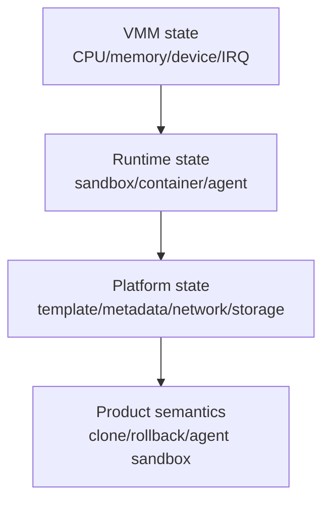
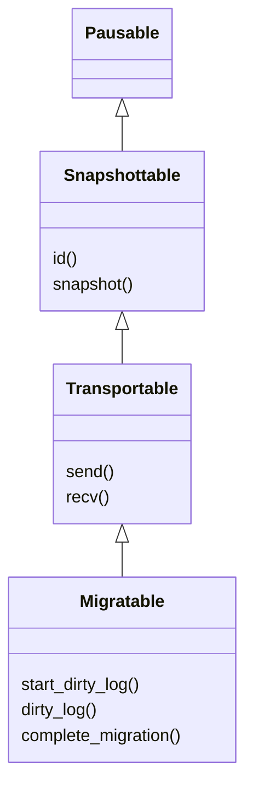
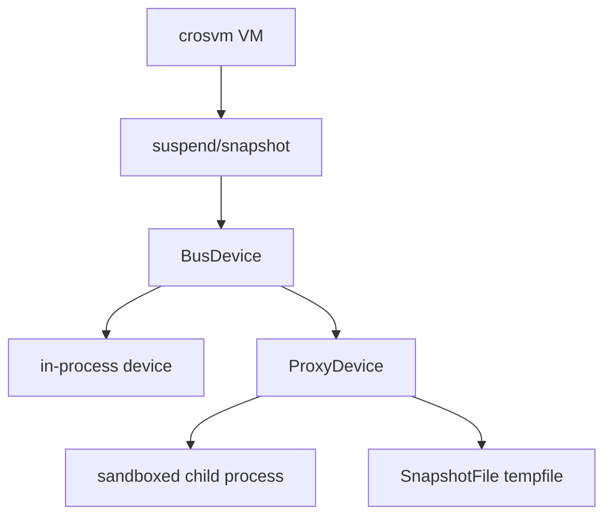
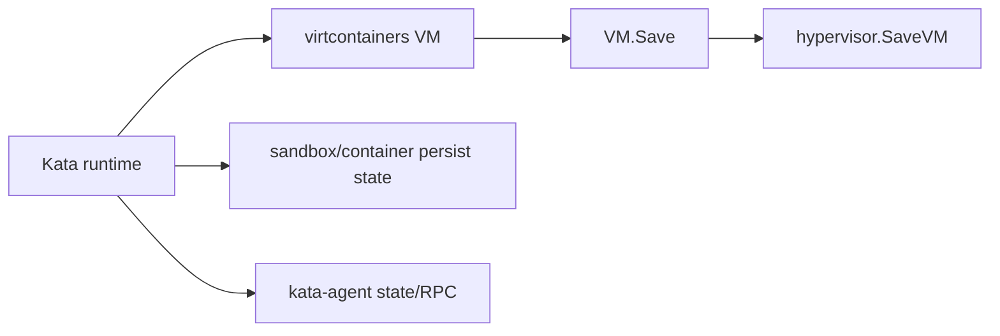
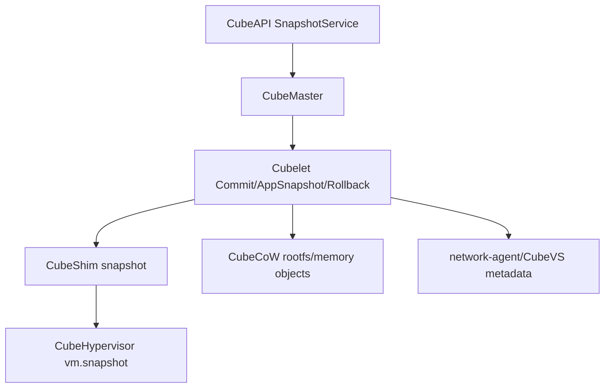

# Snapshot / Restore / Clone 跨项目专题分析

本文沿四个项目文档中的深入路线，专门分析 snapshot、restore、clone、migration 这组容易混淆的能力。核心结论：四个项目都使用类似词汇，但状态边界完全不同。

源码基线：当前工作树。  
覆盖项目：Cloud Hypervisor、crosvm、Kata Containers、CubeSandbox。

## 1. 术语先对齐

| 术语 | 本文含义 |
|---|---|
| snapshot | 保存某一层组件状态，可以是 VM、设备、内存、runtime、平台 metadata |
| restore | 用 snapshot 重建状态，可能发生在同一进程、同一 VM、新 VM 或新 sandbox |
| migration | 保存状态并通过 transport 发送到本地或远端目标，通常依赖 dirty log |
| clone | 从已有状态派生新实例，通常不是 VMM 原生语义，而是上层产品语义 |
| rollback | 原地回到某个历史状态，通常要恢复 VM、文件系统、metadata、网络 |

第一条判断原则：先问“保存的是哪一层状态”。VMM 级 snapshot、runtime 级 save、平台级 clone/rollback 不能混用。

## 2. Cloud Hypervisor：`Migratable` 体系

Cloud Hypervisor 的 snapshot/restore/migration 是 VMM 组件体系的一部分。它围绕 `Pausable`、`Snapshottable`、`Transportable`、`Migratable` 组织。

核心 trait：

- `Snapshottable` 继承 `Pausable`，提供组件 id 和 `snapshot()`：[cloud-hypervisor/vm-migration/src/lib.rs](../cloud-hypervisor/vm-migration/src/lib.rs#L211)。
- `Transportable` 继承 `Pausable + Snapshottable`，提供 `send()` 和 `recv()`：[cloud-hypervisor/vm-migration/src/lib.rs](../cloud-hypervisor/vm-migration/src/lib.rs#L224)。
- `Migratable` 继承 `Send + Pausable + Snapshottable + Transportable`，并补充 dirty log、migration start/complete：[cloud-hypervisor/vm-migration/src/lib.rs](../cloud-hypervisor/vm-migration/src/lib.rs#L255)。

### 2.1 VM 作为迁移对象

`Vm` 自身实现这些 trait。`Vm::start_dirty_log()` 会先启动 `MemoryManager` dirty log，再启动 `DeviceManager` dirty log：[cloud-hypervisor/vmm/src/vm.rs](../cloud-hypervisor/vmm/src/vm.rs#L3283)。

这说明 Cloud Hypervisor 把 VM 看成一个由 managers 组成的复合迁移对象，而不是只保存 KVM vCPU 或 guest RAM。

### 2.2 内存状态

`MemoryManager` 保存 boot guest memory、atomic guest memory、memory slots、hotplug slots、memory zones、dirty log、guest RAM mappings、userfaultfd handler 等：[cloud-hypervisor/vmm/src/memory_manager.rs](../cloud-hypervisor/vmm/src/memory_manager.rs#L199)。

`MemoryManager::snapshot()` 先生成 memory range table，并把它保存到 `snapshot_memory_ranges`，供 `Transportable::send()` 使用：[cloud-hypervisor/vmm/src/memory_manager.rs](../cloud-hypervisor/vmm/src/memory_manager.rs#L2983)。

关键点：snapshot 阶段不等于“所有内存已经复制完成”。它先形成哪些 range 要发送的计划，再由 transport 阶段传输数据。

### 2.3 CPU 与设备状态

`CpuManager` 实现 `Pausable`、`Snapshottable`、`Transportable`、`Migratable`：[cloud-hypervisor/vmm/src/cpu.rs](../cloud-hypervisor/vmm/src/cpu.rs#L2632)。它保存 vCPU 状态、pause/kill/kick 信号、vCPU 列表、topology/affinity 等。

`DeviceManager` 的 snapshot 状态包含 `device_tree` 和 `device_id_cnt`：[cloud-hypervisor/vmm/src/device_manager.rs](../cloud-hypervisor/vmm/src/device_manager.rs#L887)。`DeviceManager::pause()` 会遍历 device tree 中的 migratable device：[cloud-hypervisor/vmm/src/device_manager.rs](../cloud-hypervisor/vmm/src/device_manager.rs#L5487)。

设备层还能递归到具体设备。例如 vhost-user block/fs 都实现 `Pausable`、`Snapshottable`、`Transportable`、`Migratable`，dirty log 委托给 `vu_common`：[cloud-hypervisor/virtio-devices/src/vhost_user/blk.rs](../cloud-hypervisor/virtio-devices/src/vhost_user/blk.rs#L354)、[cloud-hypervisor/virtio-devices/src/vhost_user/fs.rs](../cloud-hypervisor/virtio-devices/src/vhost_user/fs.rs#L364)。

### 2.4 Cloud Hypervisor 边界

Cloud Hypervisor 保存的是 VMM 级状态：

| 状态 | 是否在 VMM snapshot 边界内 |
|---|---|
| CPU/vCPU | 是 |
| guest RAM ranges | 是 |
| virtio/vhost-user device state | 是，取决于设备实现 |
| device tree / device id | 是 |
| guest filesystem 业务一致性 | 不保证，需要 guest/上层配合 |
| container runtime metadata | 不属于 Cloud Hypervisor |
| 产品级 clone/rollback | 不属于 Cloud Hypervisor |

## 3. crosvm：`Suspendable` 与多进程设备

crosvm 的 snapshot/restore 关键在 `Suspendable`。设备不是被动结构体；很多设备可能在独立进程中运行，snapshot 要通过 IPC 协调。

核心 trait：

- `Suspendable` 要求设备实现 `snapshot()`、`restore()`、`sleep()`、`wake()`：[crosvm/devices/src/suspendable.rs](../crosvm/devices/src/suspendable.rs#L18)。
- `BusDevice` 继承 `Send + Suspendable`，所以 bus 上的设备天然被纳入 suspend/snapshot 协议：[crosvm/devices/src/bus.rs](../crosvm/devices/src/bus.rs#L87)。

### 3.1 ProxyDevice 的 snapshot 转发

`ProxyDevice` 把一个 `BusDevice` 放到 fork 出来的子进程里，并通过 Tube 与父进程通信：[crosvm/devices/src/proxy.rs](../crosvm/devices/src/proxy.rs#L414)。

snapshot 数据可能太大，不能直接通过 Tube 一次发送，所以 `SnapshotFile` 用临时文件承载序列化后的 `AnySnapshot`：[crosvm/devices/src/proxy.rs](../crosvm/devices/src/proxy.rs#L62)。

这使 crosvm snapshot 多了一层边界：不仅要保存设备状态，还要确保设备子进程响应 snapshot 命令，且临时文件/FD 传递正确。

### 3.2 复杂设备的部分状态

GPU 设备示例显示 snapshot 不是简单保存全部 host 状态。`VirtioGpuResource` 保存 guest 可见 metadata、backing iovecs、shmem offset、scanout data 等；restore 时重建资源对象：[crosvm/devices/src/virtio/gpu/virtio_gpu.rs](../crosvm/devices/src/virtio/gpu/virtio_gpu.rs#L99)。

注释说明 surface ID 不是 guest visible，restore 时会重新分配，只保存是否有 surface 和 parent scanout id：[crosvm/devices/src/virtio/gpu/virtio_gpu.rs](../crosvm/devices/src/virtio/gpu/virtio_gpu.rs#L200)。

这说明 crosvm snapshot 区分 guest-visible state 和 host-runtime ephemeral state。不是所有 host 对象都原样持久化。

### 3.3 crosvm 边界

| 状态 | 是否在 crosvm snapshot 边界内 |
|---|---|
| vCPU/guest memory/IRQ | 是，属于 VM snapshot 协议的一部分 |
| BusDevice 状态 | 是，取决于 `Suspendable` 实现 |
| 子进程设备状态 | 是，但要通过 ProxyDevice/Tube/临时文件协调 |
| host display surface id 等临时对象 | 通常不直接保存，restore 时重建 |
| container runtime metadata | 不属于 crosvm |
| 产品级 clone/rollback | 不属于 crosvm |

与 Cloud Hypervisor 相比，crosvm 的难点不是 trait 层次，而是多进程设备和 IPC 协调。

## 4. Kata Containers：runtime state + hypervisor state + agent state

Kata 的 save/restore 层级比 VMM 高。它不是 VMM，而是 VM-based container runtime。它可以调用下层 hypervisor 的 `SaveVM()`，但同时还要维护 sandbox/container/agent 语义。

### 4.1 Hypervisor 接口

Go runtime 的 `Hypervisor` interface 包含 `PauseVM()`、`SaveVM()`、`ResumeVM()`，也包含 device hotplug、resize、capabilities、persist to/from gRPC 等：[kata-containers/src/runtime/virtcontainers/hypervisor.go](../kata-containers/src/runtime/virtcontainers/hypervisor.go#L1297)。

`VM.Save()` 只是把保存动作委托给 hypervisor：[kata-containers/src/runtime/virtcontainers/vm.go](../kata-containers/src/runtime/virtcontainers/vm.go#L226)。

### 4.2 不同 hypervisor 的 SaveVM 能力不同

QEMU 的 `SaveVM()` 通过 QMP 设置 migrate arguments，把迁移输出写入 `DevicesStatePath`，并等待 migration completed：[kata-containers/src/runtime/virtcontainers/qemu.go](../kata-containers/src/runtime/virtcontainers/qemu.go#L2417)。

Firecracker、Cloud Hypervisor、Dragonball 等实现同一接口，但能力并不完全相同。源码中也能看到一些实现是空实现或 not implemented：

- `mockHypervisor.SaveVM()` 是测试空实现：[kata-containers/src/runtime/virtcontainers/mock_hypervisor.go](../kata-containers/src/runtime/virtcontainers/mock_hypervisor.go#L63)。
- `remoteHypervisor.SaveVM()` 返回 not implemented：[kata-containers/src/runtime/virtcontainers/remote.go](../kata-containers/src/runtime/virtcontainers/remote.go#L196)。
- `stratovirt.SaveVM()` 当前是空实现：[kata-containers/src/runtime/virtcontainers/stratovirt.go](../kata-containers/src/runtime/virtcontainers/stratovirt.go#L1114)。

所以 Kata 的 `SaveVM()` 是抽象能力，不等于每个 hypervisor plugin 都有同等级实现。

### 4.3 Agent 状态不是 VMM 自动保证

Kata agent interface 包括 `createSandbox`、`startSandbox`、`stopSandbox`、`exec`、container lifecycle、network/route/interface 操作等：[kata-containers/src/runtime/virtcontainers/agent.go](../kata-containers/src/runtime/virtcontainers/agent.go#L44)。

这说明 guest 内状态由 agent 协议维护。VMM 保存 CPU/memory/device，不自动理解 container/process/storage mount 的 runtime 语义。

### 4.4 Kata 边界

| 状态 | Kata save/restore 视角 |
|---|---|
| VM CPU/memory/device | 通过 hypervisor plugin |
| sandbox/container metadata | Kata runtime 自己维护 |
| guest agent connection/state | 需要 agent 协议和 reconnect/reuse 处理 |
| rootfs/share-fs | 由 runtime 配置、hypervisor device、guest mount 共同决定 |
| clone/rollback 产品语义 | Kata 本身不是这种产品 API |

Kata 的关键难点是三层一致性：host runtime state、hypervisor VM state、guest agent state。

## 5. CubeSandbox：平台级 snapshot / clone / rollback

CubeSandbox 是四者中层级最高的。它暴露的是 Agent sandbox 产品语义：snapshot、clone、rollback。底层组合了 VM snapshot、CubeCoW 存储快照、CubeMaster/Cubelet metadata 和 network-agent 状态。

### 5.1 CubeShim snapshot

CubeShim 的 `Snapshot` 结构保存 id、path、kernel、tap、resource、disk、pmem、sharefs/vsock ptr、snapshot type、memory volume url、container id 等：[CubeSandbox-sandbox-clone/CubeShim/shim/src/snapshot/mod.rs](../CubeSandbox-sandbox-clone/CubeShim/shim/src/snapshot/mod.rs#L76)。

普通 snapshot 路径是 `launch_vmm -> boot_vm -> wait_vm_ready -> create_snapshot -> store_metadata`：[CubeSandbox-sandbox-clone/CubeShim/shim/src/snapshot/mod.rs](../CubeSandbox-sandbox-clone/CubeShim/shim/src/snapshot/mod.rs#L111)。

app snapshot 路径是对运行中 VM 调 `/api/v1/vm.pause`、`/api/v1/vm.snapshot`、`/api/v1/vm.resume`：[CubeSandbox-sandbox-clone/CubeShim/shim/src/snapshot/mod.rs](../CubeSandbox-sandbox-clone/CubeShim/shim/src/snapshot/mod.rs#L119)。

`api_snapshot_vm()` 构造 `SnapshotConfig`，包含 destination url、snapshot type 和 `memory_vol_url`：[CubeSandbox-sandbox-clone/CubeShim/shim/src/snapshot/mod.rs](../CubeSandbox-sandbox-clone/CubeShim/shim/src/snapshot/mod.rs#L154)。

### 5.2 Cubelet AppSnapshot

Cubelet `AppSnapshot()` 的开头先校验 create request 和 app snapshot annotations，然后要求 storage backend 是 CubeCoW：[CubeSandbox-sandbox-clone/Cubelet/services/cubebox/appsnapshot.go](../CubeSandbox-sandbox-clone/Cubelet/services/cubebox/appsnapshot.go#L55)。

流程上，AppSnapshot 会创建临时 cubebox，获取 cubebox spec，生成 memory/rootfs Cow snapshot object，并在失败时清理：[CubeSandbox-sandbox-clone/Cubelet/services/cubebox/appsnapshot.go](../CubeSandbox-sandbox-clone/Cubelet/services/cubebox/appsnapshot.go#L114)。

这说明 CubeSandbox 的 app snapshot 明确依赖 CubeCoW，不只是调用 VMM snapshot。

### 5.3 CubeCoW 存储状态

CubeCoW 是基于 xfs-reflink/FICLONE 的 Rust storage engine，提供 O(1) snapshot/clone：[CubeSandbox-sandbox-clone/cubecow/README.md](../CubeSandbox-sandbox-clone/cubecow/README.md#L1)。

`Engine` trait 提供 volume、snapshot、activate/deactivate、reset、metrics 等能力：[CubeSandbox-sandbox-clone/cubecow/src/engine/mod.rs](../CubeSandbox-sandbox-clone/cubecow/src/engine/mod.rs#L35)。

Cubelet 会用 cubecow engine 刷新 storage info 中的 device path：[CubeSandbox-sandbox-clone/Cubelet/storage/cubecow_volume_manager.go](../CubeSandbox-sandbox-clone/Cubelet/storage/cubecow_volume_manager.go#L455)。

### 5.4 CubeSandbox 边界

| 状态 | CubeSandbox snapshot/rollback 视角 |
|---|---|
| VM CPU/memory/device | CubeHypervisor snapshot/restore |
| rootfs/volume | CubeCoW snapshot/clone |
| memory volume | 通过 `memory_vol_url` 参与 snapshot config |
| sandbox/template metadata | CubeAPI/CubeMaster/Cubelet |
| network/TAP/port/CubeVS | network-agent 状态和 reconcile |
| clone/rollback API | CubeSandbox 产品层语义 |

因此 CubeSandbox 的 clone/rollback 是平台编排结果，不是 VMM 的单一功能。

## 6. 横向矩阵

| 项目 | 抽象层级 | 核心接口 | 保存状态 | restore 难点 | clone/rollback 语义 |
|---|---|---|---|---|---|
| Cloud Hypervisor | VMM | `Snapshottable/Transportable/Migratable` | VM managers、memory ranges、CPU、device tree、device state | 设备/内存 dirty log 与 transport 一致性 | 无产品级 clone/rollback |
| crosvm | VMM | `Suspendable`、`ProxyDevice`、snapshot framework | vCPU/memory/IRQ、BusDevice、子进程设备状态 | 多进程设备、Tube、临时文件、host ephemeral state 重建 | 无产品级 clone/rollback |
| Kata Containers | Runtime | `Hypervisor.SaveVM()`、runtime persist、agent RPC | hypervisor VM state、sandbox/container state、agent 管理状态 | 三层一致性：runtime、VMM、guest agent | 不是核心产品 API |
| CubeSandbox | Platform | CubeAPI SnapshotService、Cubelet AppSnapshot、CubeShim snapshot、CubeCoW | VM memory/device、rootfs/volume、metadata、network | 多组件编排、失败清理、metadata/存储/网络一致性 | 核心产品能力 |

## 7. ARM64 与 x86_64 影响

snapshot/restore 在 ARM64 和 x86_64 上差异主要来自底层 VMM 状态不同：

| 维度 | x86_64 | ARM64 |
|---|---|---|
| CPU 身份 | CPUID/topology/APIC state | MPIDR/vCPU init/GIC state |
| 中断 | IOAPIC/MSI/PIC 等 | GIC/ITS/redistributor |
| guest 描述 | ACPI/PCI/legacy PC | FDT/UEFI/GIC/MMIO |
| memory/firmware | PC memory map、ACPI tables | UEFI flash、FDT、platform memory layout |
| CoCo | TDX/SEV-SNP 更常见 | ARM CCA/平台能力需单独验证 |

项目影响：

1. Cloud Hypervisor：ARM64 需要额外关注 GIC pause/snapshot、MPIDR、FDT/UEFI。
2. crosvm：ARM64 需要关注 FDT/GIC/MMIO/pvclock counter offset，多进程设备机制本身跨架构但设备集合不同。
3. Kata：取决于所选 hypervisor plugin 和 guest kernel/image，不能只看 Kata runtime 代码。
4. CubeSandbox：控制面基本跨架构，但 CubeHypervisor、guest kernel/image、cube-agent、CubeVS/eBPF 都要逐项验证。

## 8. 推荐下一步深挖

1. Cloud Hypervisor：追踪 `Vm::snapshot()`、`Vm::send()`、`MemoryManager::memory_range_table()`，产出函数级时序图。
2. crosvm：追踪 `run_control -> process_vm_request -> device worker -> ProxyDevice::snapshot`，产出多进程 snapshot 时序图。
3. Kata：以 QEMU `SaveVM()` 为样本，追踪 runtime save、QMP migration、agent reconnect 的边界。
4. CubeSandbox：追踪 `CubeAPI SnapshotService::create/rollback -> CubeMaster -> Cubelet AppSnapshot/CommitSandbox -> CubeShim snapshot -> CubeCoW`。

## 9. 本专题结论

同样叫 snapshot，四个项目的真实含义不同：

1. Cloud Hypervisor 是 VMM 组件迁移协议。
2. crosvm 是 VMM suspend/snapshot 协议，强调多进程设备协调。
3. Kata 是 runtime 级保存，必须协调 hypervisor 和 guest agent。
4. CubeSandbox 是平台级产品能力，必须同时恢复 VM、文件系统、metadata 和网络。

后续所有分析都应先标明“状态边界”，再讨论具体 API。否则很容易把 VMM snapshot 误解成产品级 clone/rollback。
