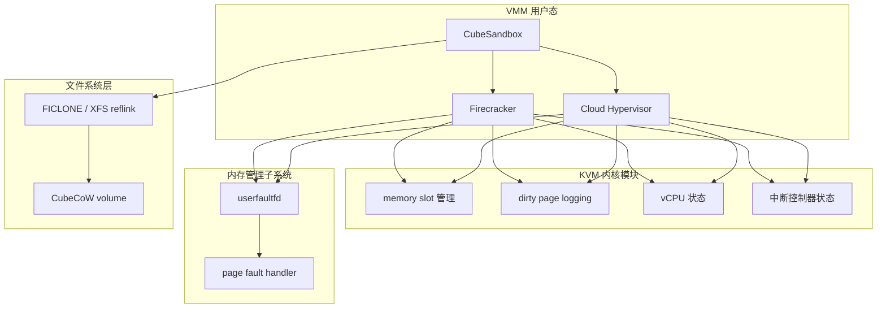
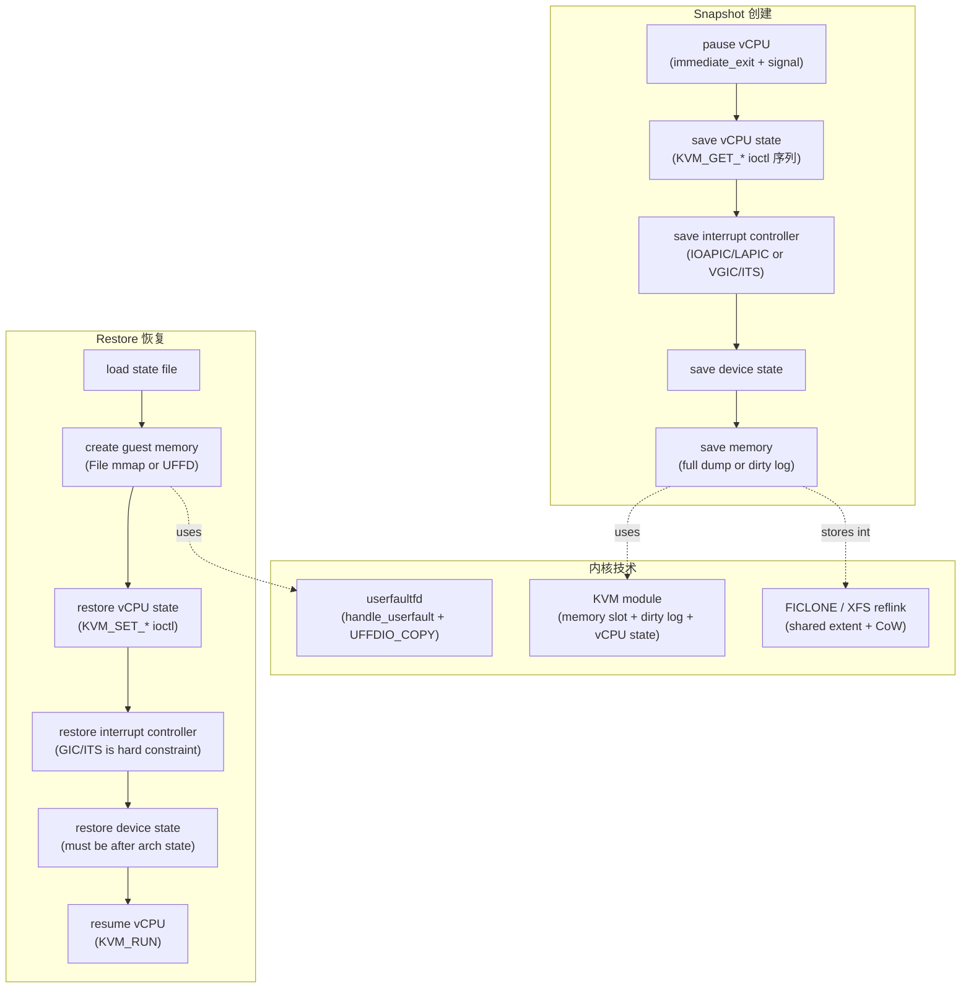

# Snapshot / Restore 底层内核技术深度解读

本文从 Linux 6.6.0 内核源码出发，深入解读 Micro-VM snapshot/restore 用到的全部底层内核机制。不是再次描述 VMM 侧架构——而是回答"内核里到底怎么实现的"。

源码基线：`kernel/`（Linux 6.6.0）+ Firecracker/Cloud Hypervisor/CubeSandbox VMM 源码。

> 相关：[Snapshot/Restore/Clone 横向专题](./snapshot-restore-cross-project.md)、[CubeCoW 存储引擎](../CubeSandbox-sandbox-clone/analysis/cubecow-storage-engine-chain.md)、[性能设计依据 §7](./performance-design-basis-cross-project.md)。

---

## 0. 导读：从 VMM ioctl 到内核实现

snapshot/restore 涉及 5 大内核技术栈。VMM 经 ioctl/syscall 调用这些内核接口；内核在 KVM 模块、内存管理子系统和文件系统三层实现。

| 技术栈 | VMM 接口 | 内核实现 | 作用 |
|---|---|---|---|
| **KVM memory slot** | `KVM_SET_USER_MEMORY_REGION` | `virt/kvm/kvm_main.c` | 注册 guest physical memory 映射 |
| **KVM dirty log** | `KVM_GET_DIRTY_LOG` / `KVM_CLEAR_DIRTY_LOG` | `virt/kvm/kvm_main.c` + `arch/*/kvm/mmu.c` | 跟踪 guest 写过的页 |
| **KVM vCPU state** | `KVM_GET_REGS` / `KVM_GET_SREGS` / `KVM_GET_MSRS` / `KVM_GET_ONE_REG` | `arch/*/kvm/` | 保存/恢复 CPU 寄存器 |
| **userfaultfd** | `userfaultfd()` + `UFFDIO_*` | `fs/userfaultfd.c` + `mm/userfaultfd.c` | 按需填页（lazy restore） |
| **FICLONE reflink** | `FS_IOC_FICLONE` | `fs/ioctl.c` + `fs/xfs/xfs_reflink.c` | 文件级 O(1) CoW（CubeCoW） |



---

## 1. KVM Memory Slot 管理：guest physical memory 的注册

### 1.1 kvm_memory_slot 结构

KVM 用 `kvm_memory_slot` 维护每段 guest physical memory 的映射关系：

```c
// include/linux/kvm_host.h:600
struct kvm_memory_slot {
    struct hlist_node id_node[2];       // 按 slot id 索引
    struct interval_tree_node hva_node[2]; // 按 host virtual address 索引
    struct rb_node gfn_node[2];          // 按 guest frame number 索引
    gfn_t base_gfn;                      // guest physical 起始页帧号
    unsigned long npages;                // 页数
    unsigned long *dirty_bitmap;         // 脏页位图（dirty log 核心）
    struct kvm_arch_memory_slot arch;    // 架构特定数据（x86 EPT / ARM64 Stage-2）
    unsigned long userspace_addr;        // host 用户态地址（mmap 出的）
    u32 flags;                           // KVM_MEM_LOG_DIRTY_PAGES / KVM_MEM_READONLY
    short id;                            // slot id
    u16 as_id;                           // address space id（x86 有 SMM/address space）
};
```

> **关键设计**：KVM 不直接管理 guest physical → host physical 的映射。它维护的是 **guest physical (base_gfn) → host userspace (userspace_addr)** 的映射。实际 guest physical → host physical 的翻译由 CPU 的 EPT（x86）或 Stage-2（ARM64）页表完成，KVM 负责填充这些页表。

### 1.2 KVM_SET_USER_MEMORY_REGION ioctl 处理

VMM 调 `KVM_SET_USER_MEMORY_REGION` 注册内存区域时，内核经 `kvm_vm_ioctl_set_memory_region` → `__kvm_set_memory_region`：

```c
// virt/kvm/kvm_main.c:2025  __kvm_set_memory_region 核心逻辑
// 1. 参数校验（页对齐、不溢出、slot 范围）
if ((mem->memory_size & (PAGE_SIZE - 1)) ||        // 必须页对齐
    (mem->guest_phys_addr & (PAGE_SIZE - 1)) ||
    (mem->userspace_addr & (PAGE_SIZE - 1)))
    return -EINVAL;

// 2. 判断操作类型
if (!mem->memory_size)
    return kvm_set_memslot(kvm, old, NULL, KVM_MR_DELETE);   // 删除
if (!old || !old->npages)
    return kvm_set_memslot(kvm, old, &new, KVM_MR_CREATE);   // 创建
// ... MOVE / FLAGS_ONLY 判断

// 3. 如果带 KVM_MEM_LOG_DIRTY_PAGES 标志
if (mem->flags & KVM_MEM_LOG_DIRTY_PAGES)
    kvm_alloc_dirty_bitmap(&new);   // 分配 dirty_bitmap
```

`kvm_set_memslot` 经 `kvm_swap_active_memslots` **原子切换** active/inactive memslots（RCU 机制）——其他 vCPU 在读旧 slots 时不会看到半完成的状态。

> **VMM 侧**：Firecracker `vm.register_dram_memory_regions(guest_memory)`（`vstate/vm.rs:212`）和 Cloud Hypervisor `create_userspace_mapping`（`memory_manager.rs:2191`）都调此 ioctl 注册 guest RAM。Cloud Hypervisor 在 `start_dirty_log` 时重新注册带 `KVM_MEM_LOG_DIRTY_PAGES` 的 slot。

---

## 2. KVM Dirty Page Logging：跟踪 guest 写过的页

### 2.1 dirty bitmap 的维护

当 slot 带 `KVM_MEM_LOG_DIRTY_PAGES` 标志时，KVM 在 guest 写某页时设置 dirty_bitmap 对应位。实现方式按架构不同：

- **x86**：EPT（Extended Page Table）的写保护——dirty log 开启时，KVM 把 guest 可写页的 EPT entry 设为只读。guest 写时触发 EPT violation → KVM 处理 → 设置 dirty bit → 恢复可写。
- **ARM64**：Stage-2 页表写保护（`stage2_wp_range`）。ARM64 还有 HDBSS（Hardware Dirty Buffer Status Set）硬件加速——dirty 状态缓冲在硬件 buffer 中，`kvm_arch_sync_dirty_log` 时 kick vCPU 刷出。

```c
// arch/arm64/kvm/arm.c:1982  ARM64 dirty log 同步
void kvm_arch_sync_dirty_log(struct kvm *kvm, struct kvm_memory_slot *memslot)
{
#ifdef CONFIG_ARM64_HDBSS
    // HDBSS：kick 所有 vCPU 强制 VM-Exit，刷新硬件 dirty buffer 到 dirty_bitmap
    struct kvm_vcpu *vcpu;
    unsigned long i;
    kvm_for_each_vcpu(i, vcpu, kvm)
        kvm_vcpu_kick(vcpu);
#endif
}
```

### 2.2 kvm_get_dirty_log：读取脏页快照

VMM 调 `KVM_GET_DIRTY_LOG` ioctl 时，内核把 dirty_bitmap copy 到用户态：

```c
// virt/kvm/kvm_main.c:2158
// 1. 先同步架构特定 dirty buffer（ARM64 kick vCPU 刷 HDBSS）
kvm_arch_sync_dirty_log(kvm, *memslot);

// 2. 检查是否有脏页
for (i = 0; !any && i < n/sizeof(long); ++i)
    any = (*memslot)->dirty_bitmap[i];

// 3. copy_to_user 到 VMM 提供的 buffer
if (copy_to_user(log->dirty_bitmap, (*memslot)->dirty_bitmap, n))
    return -EFAULT;
```

### 2.3 kvm_get_dirty_log_protect：读取 + 重启用写保护

`KVM_CAP_MANUAL_DIRTY_LOG_PROTECT2` 引入了更精细的控制——允许 VMM 分开"读 dirty bitmap"和"清除 dirty bitmap + 重启用写保护"：

```c
// virt/kvm/kvm_main.c:2192  kvm_get_dirty_log_protect 注释
// 关键顺序（避免丢失脏页）：
// 1. 快照 dirty bit 并清零（xchg 原子操作）
// 2. 写保护对应页（重新设 EPT/Stage-2 只读）
// 3. 复制快照到用户态
// 4. 调用者刷 TLB
// 在步骤 2-4 之间，guest 可能用残留 TLB entry 继续写——
// 这不是问题，因为该页在步骤 1 的快照中已被标脏。
```

> **为什么这很重要？** Firecracker 的 diff snapshot 和 Cloud Hypervisor 的 live migration 都依赖 dirty log。没有 manual dirty log protect，`KVM_GET_DIRTY_LOG` 在读 bitmap 时**会原子清零 + 重启用写保护**——这在 migration 多轮迭代中会多跟踪一些不必要的脏页。有了 manual protect，VMM 可以精确控制"什么时候清零"和"什么时候重启用写保护"，减少 migration 末轮的脏页量。

### 2.4 VMM 如何使用 dirty log

- **Firecracker diff snapshot**：`get_dirty_bitmap()` → `dump_dirty()`——只把脏页合并进目标 memory 文件（`vstate/vm.rs:377`）。
- **Cloud Hypervisor migration**：`dirty_log()` 合并 hypervisor bitmap + VMM atomic bitmap → `MemoryRangeTable::from_dirty_bitmap` → 多轮发送 → 最后一轮在 pause 后发送。

> **dirty log 的正确性关键**：hypervisor dirty bitmap 只跟踪 guest CPU 经 EPT/Stage-2 的写入。VMM 自身经 host userspace mapping 修改 guest memory（如 virtio 设备模拟 DMA）**不会**被 dirty log 跟踪。因此 Cloud Hypervisor 的 `dirty_log()` 必须合并 `vm_dirty_bitmap | vmm_dirty_bitmap`——VMM 用 `GuestMemoryMmap` 的 atomic bitmap 追踪自己的写入。

---

## 3. KVM vCPU 状态保存/恢复

### 3.1 x86_64：批量 ioctl + 严格顺序

Firecracker 的 `save_state()` 注释明确解释了 ioctl 顺序的原因（`arch/x86_64/vcpu.rs:555`）：

```rust
// Ordering requirements:
// KVM_GET_MP_STATE calls kvm_apic_accept_events(), which might modify
// vCPU/LAPIC state. As such, it must be done before most everything else.
// KVM_GET_LAPIC may change state of LAPIC before returning it.
// GET_VCPU_EVENTS should probably be last to save.
```

保存顺序（11 个 ioctl）：

| 顺序 | ioctl | 保存什么 | 内核 handler | 顺序原因 |
|---|---|---|---|---|
| 1 | `KVM_GET_MP_STATE` | 处理器运行状态（Running/Halted/...） | `kvm_arch_vcpu_ioctl_get_mp_state` → `kvm_apic_accept_events()` | **必须先**——会修改 LAPIC 状态 |
| 2 | `KVM_GET_REGS` | 通用寄存器（RAX-R15/RIP/RFLAGS） | `__get_regs` | 在 MP_STATE 后 |
| 3 | `KVM_GET_SREGS` | 段寄存器 + 控制寄存器（CR0-4/EFER） | `get_sregs` | |
| 4 | `KVM_GET_XSAVE2` | 扩展 FPU/SSE/AVX 状态 | `kvm_vcpu_ioctl_x86_get_xsave` | |
| 5 | `KVM_GET_XCRS` | XCR0 配置 | | |
| 6 | `KVM_GET_DEBUGREGS` | 调试寄存器（DR0-7） | | |
| 7 | `KVM_GET_LAPIC` | local APIC 完整状态 | `kvm_vcpu_ioctl_get_lapic` | 会修改 LAPIC → MP_STATE 必须先 |
| 8 | TSC frequency | `tsc_khz` | | 跨机器 restore 时用于 TSC scaling |
| 9 | `KVM_GET_CPUID2` | CPUID 叶片 | | |
| 10 | `KVM_GET_MSRS` | Model Specific Registers | | |
| 11 | `KVM_GET_VCPU_EVENTS` | 待处理事件（NMI/SMI/异常/中断） | | **必须最后**——受前序 ioctl 的状态修改影响 |

> **restore 是保存的逆过程**，但有额外约束：`KVM_SET_VCPU_EVENTS` 只在所有其他状态恢复后才调用，确保中断不会被过早注入到半恢复的 vCPU。

### 3.2 ARM64：OneReg 机制

ARM64 不提供 x86 那样的批量 `GET_REGS`/`GET_SREGS`。它用 **OneReg** 机制——每个寄存器单独读/写：

```c
// arch/arm64/kvm/guest.c:826
int kvm_arm_get_reg(struct kvm_vcpu *vcpu, const struct kvm_one_reg *reg)
{
    switch (reg->id & KVM_REG_ARM_COPROC_MASK) {
    case KVM_REG_ARM_CORE:    return get_core_reg(vcpu, reg);    // R0-R30/SP/PC/PSTATE
    case KVM_REG_ARM_FW:      return kvm_arm_get_fw_reg(vcpu, reg); // PSCI/paravirt
    case KVM_REG_ARM64_SVE:   return get_sve_reg(vcpu, reg);    // SVE 向量寄存器
    // ... timer / PMU
    }
}
```

Firecracker ARM64 `save_state`（`arch/aarch64/vcpu.rs:233`）：

```rust
pub fn save_state(&self) -> Result<VcpuState, KvmVcpuError> {
    let mut state = VcpuState {
        mp_state: self.get_mpstate()?,
        ..Default::default()
    };
    self.get_all_registers(&mut state.regs)?;  // 经 KVM_GET_REG_LIST + KVM_GET_ONE_REG 遍历所有寄存器
    state.mpidr = self.get_mpidr()?;            // 处理器亲和性（ARM 特有）
    state.kvi = self.kvi;                       // KVM ARM vcpu init 信息
    state.pvtime_ipa = self.pvtime_ipa;         // paravirtualized time IPA
    Ok(state)
}
```

> **ARM64 特有状态**：MPIDR（Multiprocessor Affinity Register）标识 vCPU 物理位置——restore 时 GIC redistributor 地址依赖它。PVTime IPA（paravirtualized time）用于 guest steal time 统计。这些在 x86 上不存在。

---

## 4. KVM 中断控制器状态

### 4.1 x86：IOAPIC + LAPIC + PIC

x86 的中断控制器是三个独立设备模型，各有独立的 state 结构：

- **IOAPIC**：`kvm_ioapic_state`——含 24 个 redirection table entry（每个含 vector/destination/delivery mode/trigger mode/mask）。
- **LAPIC**：`kvm_lapic_state`——完整 APIC 寄存器映射（32 字节 × 256 = 8KB，包含 IRR/ISR/TMR/IDT/LVT 等）。
- **PIC**（i8259）：master/slave 8259 状态。

### 4.2 ARM64：VGIC v3 + ITS

ARM64 的中断控制器是 GIC（Generic Interrupt Controller），KVM 用 VGIC（Virtual GIC）模拟。VGIC v3 + ITS 的状态比 x86 复杂得多：

```c
// arch/arm64/kvm/vgic/vgic.c:950  vgic_save_state
// 保存每个 vCPU 的 GIC 状态：
// - List Registers (LR)：当前活跃的虚拟中断
// - GICR_TYPER：redistributor 类型信息
// - ITS device/collection table：LPI（Locality-aware Peripheral Interrupt）路由表
```

> **为什么 ARM64 GIC/ITS restore 是硬约束**：GIC redistributor 状态（GICR_TYPER）从 vCPU MPIDR 推导。ITS 的 device table + collection table 把设备 ID 映射到 LPI，这些表在 restore 时必须完整重建。CubeSandbox 的 `restore_vgic_and_enable_interrupt()` 要求 **`GicV3Its snapshot` 必须存在**——缺则直接 `Err("Missing GicV3Its snapshot")`。x86 的 IOAPIC/LAPIC state 没有这种跨设备依赖，因此 x86 restore 的中断部分相对简单。

---

## 5. userfaultfd (UFFD)：按需填页的内核机制

UFFD 是 Linux 提供的一种**用户态 page fault handler** 机制。在 VM snapshot restore 场景，它允许 VMM **不预先拷贝全部 guest memory**，而是在 guest 首次访问某页时由内核通知 VMM（或外部 handler）按需填充。

### 5.1 userfaultfd 系统调用

```c
// fs/userfaultfd.c:2308
SYSCALL_DEFINE1(userfaultfd, int, flags)
{
    // 权限检查：需要 CAP_SYS_PTRACE 或 sysctl_unprivileged_userfaultfd
    // 创建 userfaultfd_ctx + 匿名 inode fd
    // ctx 持有 wait_queue_head_t fault_pending_wqh（待处理 fault 队列）
}
```

### 5.2 handle_userfault：page fault 的内核处理路径

当 guest 访问一个 UFFD 注册的、尚未填充的页面时，内核的 page fault 路径最终调到 `handle_userfault`：

```c
// fs/userfaultfd.c:419  handle_userfault 核心逻辑
vm_fault_t handle_userfault(struct vm_fault *vmf, unsigned long reason)
{
    // 1. 创建 fault 消息（包含 fault 地址、原因 MISSING/WP/MINOR）
    userfault_msg(vmf->address, &vmf->flags, reason, &ctx->flags);

    // 2. 初始化等待队列条目，加入 fault_pending_wqh
    init_waitqueue_func_entry(&uwq.wq, userfaultfd_wake_function);
    __add_wait_queue(&ctx->fault_pending_wqh, &uwq.wq);

    // 3. 释放 mmap lock（允许其他线程继续 mmap 操作）
    release_fault_lock(vmf);

    // 4. 阻塞当前线程（faulting thread）
    set_current_state(blocking_state);   // TASK_INTERRUPTIBLE
    if (userfaultfd_must_wait(ctx, vmf->address, vmf->flags, reason))
        schedule();                      // ← 线程在此阻塞，直到 UFFDIO_COPY 填充页面

    // 5. 唤醒后清理等待队列，返回 VM_FAULT_RETRY
    //    VMM 重新执行 faulting 指令时，页面已被 UFFDIO_COPY 填充
    return VM_FAULT_RETRY;
}
```

> **关键**：`handle_userfault` **阻塞 faulting 线程并释放 mmap lock**。对于 KVM 来说，这意味着 vCPU 线程在 guest EPT violation → host page fault → `handle_userfault` 路径上**暂停执行**，直到 VMM 或外部 handler 经 `UFFDIO_COPY` 填充对应页面。填完后 vCPU 线程被唤醒，重新执行 guest 指令——此时页面已存在，不再 fault。

### 5.3 UFFDIO_COPY：填充页面

VMM（或外部 handler）读取 fault 事件后，调 `UFFDIO_COPY` 填充页面：

```c
// mm/userfaultfd.c:141  mfill_atomic_pte_copy 核心逻辑
static int mfill_atomic_pte_copy(pmd_t *dst_pmd, struct vm_area_struct *dst_vma,
                                  unsigned long dst_addr, unsigned long src_addr, ...)
{
    // 1. 分配新 folio（物理页）
    folio = vma_alloc_folio(GFP_HIGHUSER_MOVABLE, 0, dst_vma, dst_addr, false);

    // 2. 禁用 page fault，从用户态源地址 copy 数据到 folio
    pagefault_disable();
    kaddr = kmap_local_folio(folio, 0);
    copy_from_user(kaddr, src_addr, PAGE_SIZE);   // 从 snapshot 文件读一页
    pagefault_enable();

    // 3. 安装 PTE（映射到 guest memory 的虚拟地址）
    mfill_atomic_install_pte(dst_pmd, dst_vma, dst_addr, page, ...);
    //   → set_pte_at()：建立页表项
    //   → folio_add_new_anon_rmap()：加入反向映射
    //   → 唤醒等待该页的 faulting 线程
}
```

> **UFFDIO_COPY 的本质**：分配一个新物理页 → 从 snapshot 文件 copy 一页内容 → 安装到 guest memory 的页表 → 唤醒被阻塞的 vCPU 线程。这是 **O(1) per page** 的操作——只有 guest 实际访问的页才会被填充（lazy restore）。

### 5.4 Firecracker vs Cloud Hypervisor 的 UFFD 差异

| 维度 | Firecracker | Cloud Hypervisor |
|---|---|---|
| handler 位置 | **外部进程**（经 Unix socket 发 UFFD fd + mapping） | **VMM 内部线程**（`uffd_handler_loop`） |
| fault 事件读取 | 外部 handler 读 `/dev/userfaultfd` | 内部 epoll + `read(uffd_fd)` |
| 页面填充 | 外部 handler 调 `UFFDIO_COPY` | `uffd_handler_loop` 从 snapshot 文件 seek+read 一页 |
| 故障边界 | 外部 handler 崩溃 → guest 冻结（Firecracker 保留 fd 维持语义） | handler panic → exit event + result channel |
| ARM64 | 共享机制 | 共享机制 |

### 5.5 UFFD 的 race condition 防护

```c
// fs/userfaultfd.c:328  userfaultfd_must_wait
// 在 schedule() 前再次检查页表状态，避免 lost wake-up：
// 如果 UFFDIO_COPY 已经在 must_wait 检查前填充了页面，
// faulting 线程不应再等待。
static inline bool userfaultfd_must_wait(struct userfaultfd_ctx *ctx,
                                         unsigned long address, ...)
{
    // 检查 PTE 是否仍为空/写保护——如果已被 UFFDIO_COPY 填充，则不需要等待
    if (pte_none(*pte) || pte_uffd_wp(*pte))
        return true;   // 仍需等待
    return false;      // 页面已存在，不需等待
}
```

> `refile_seq`（`seqcount_spinlock_t`）保证 fault 从 `fault_pending_wqh` 重排到 `fault_wqh` 的原子性。`mmap_changing` 原子变量跟踪非协作操作（mremap/munmap）以避免并发修改。

---

## 6. FICLONE / Reflink：存储层 Copy-on-Write

### 6.1 FICLONE ioctl

CubeSandbox 的 CubeCoW 用 `FS_IOC_FICLONE` ioctl 实现文件级 O(1) clone。内核路径：

```c
// fs/ioctl.c:821  do_vfs_ioctl
case FICLONE:
    return ioctl_file_clone(filp, arg, 0, 0, 0);  // 整个文件 reflink clone

// fs/ioctl.c:231  ioctl_file_clone
static long ioctl_file_clone(struct file *dst_file, unsigned long srcfd,
                             u64 off, u64 olen, u64 destoff)
{
    src_file = fdget(srcfd);
    // → vfs_clone_file_range → xfs_reflink_remap_range（XFS）
    cloned = vfs_clone_file_range(src_file.file, off, dst_file, destoff, olen, 0);
}
```

### 6.2 XFS Reflink：共享 extent

XFS reflink 不复制数据块——它创建源文件和目标文件对同一组 **extent**（连续数据块区间）的共享引用：

```
源文件:  extent [A] [B] [C]
FICLONE:  ↓     ↓     ↓
目标文件: extent [A] [B] [C]   ← 共享同一物理 block，不复制数据
```

当任一文件修改某页时，XFS 的 CoW fork 机制启动：
1. 分配新 block；
2. 复制原 block 内容到新 block；
3. 修改新 block；
4. 切换 extent 指针（目标文件指向新 block，源文件仍指向原 block）。

> **O(1) clone 的代价在第一次写入时才付出**。对 CubeCoW 的 snapshot 场景，这意味着 `CreateSnapshot`（FICLONE）是 O(1)；后续 VMM 写 memory 到 snapshot volume 时，XFS 按页 CoW——只分配和复制实际写入的 block。

### 6.3 CubeCoW 的增量 snapshot 组合

CubeSandbox 的 `prepareCommitMemoryArtifact()` 三层退化策略组合了 FICLONE + KVM dirty log：

| 层 | 基础 | VMM 写入 | 内核技术 |
|---|---|---|---|
| **Tier 1 soft-dirty** | FICLONE clone 上一次 snapshot 的 memory volume | VMM 只写 `soft-dirty` 页 | FICLONE O(1) clone + KVM soft-dirty bit（`/proc/self/clear_refs`） |
| **Tier 2 pagemap_anon** | FICLONE clone 上一次 restore 的 base memory | VMM 只写 anon CoW 页 | FICLONE O(1) clone + `/proc/<pid>/pagemap` anon CoW bit |
| **Tier 3 full** | 新建空 memory volume | VMM 写全部 memory | 无增量——完整 full snapshot |

> **CubeCoW 增量 snapshot 的关键设计**：目标 memory 文件始终是**可直接 restore 的完整 image**——增量只是"写入时只覆盖变化页"，不是"保存 delta 文件"。这使得 restore 不需要合并 delta，直接 mmap 即可。soft-dirty bit 由内核在 `/proc/self/clear_refs` 写 4 时清零（arm），后续 guest 写入会重新置位——VMM 读 pagemap 即可知道哪些页被写。

---

## 7. VMM 如何组合内核接口

### 7.1 Firecracker snapshot 创建流程

```
1. Vmm::pause_vm() → 向每个 vCPU 发 VcpuEvent::Pause
   → set_kvm_immediate_exit(1) + kill(signal) → vCPU 退出 KVM_RUN
   → vCPU 线程设 paused ACK

2. Vmm::save_state()
   → device_manager.save()          // 设备协议状态
   → save_vcpu_states()             // 每 vCPU: KVM_GET_MP_STATE → ... → KVM_GET_VCPU_EVENTS
   → kvm.save_state()               // x86: PIT/PIC/IOAPIC/clock
   → vm.save_state()                // x86: VM 级状态

3. snapshot_memory_to_file()
   → full: guest_memory.dump()      // 写全部 guest RAM 到文件
   → diff: get_dirty_bitmap() → dump_dirty()  // 只写 KVM dirty bitmap 标记的页
   → reset_dirty_bitmap() + reset_dirty()

4. mark_virtio_queue_memory_dirty() // 补偿（virtio queue 运行期不持续标脏）
```

### 7.2 Firecracker restore 流程

```
1. 读 state 文件 → MicrovmState 反序列化
2. 创建 guest memory
   → File backend: guest_memory_from_file() → mmap memory 文件
   → UFFD backend: guest_memory_from_uffd() → 匿名内存 + UFFD 注册 + fd 发外部 handler
3. build_microvm_from_snapshot()
   → Kvm::new() → Vm::new() → create_vcpus()
   → register_dram_memory_regions()   // KVM_SET_USER_MEMORY_REGION
   → [x86] TSC scaling
   → 每 vCPU: KVM_SET_MP_STATE → SET_REGS → SET_SREGS → ... → SET_VCPU_EVENTS
   → [aarch64] 构造 MPIDR 列表 → vm.restore_state(&mpidrs)
   → [x86] vm.restore_state(clock_realtime)
   → DeviceManager::restore()         // 恢复设备（必须在 VM arch state 后——VMGenID 注入中断）
   → start_vcpus(paused)             // vCPU 线程初始 Paused
   → apply seccomp
4. [可选] resume_vm() → 发 VcpuEvent::Resume → vCPU 进 KVM_RUN
```

### 7.3 Cloud Hypervisor restore 的两种模式

| 模式 | 行为 | 内核接口 | 优势 |
|---|---|---|---|
| **Copy** (default) | `fill_saved_regions()` 从 snapshot 文件读全部 range 写入 guest memory | `read_volatile_from()` → 普通内存写 | 简单，恢复后不依赖 handler |
| **OnDemand** (UFFD) | `restore_by_uffd()` 注册 UFFD → `uffd_handler_loop` 后台按需填页 | `userfaultfd()` + `UFFDIO_REGISTER` + `UFFDIO_COPY` | restore 初始时延低（不预拷贝） |

---

## 8. Restore 的难点与陷阱

### 8.1 顺序约束：设备 state 必须在 VM arch state 后

Firecracker 源码注释（`builder.rs:507`）：

> "Restoring VMGenID injects an interrupt in the guest to notify it about the new generation ID. As a result, we need to restore DeviceManager after restoring the KVM state, otherwise the injected interrupt will be overwritten."

如果先恢复设备（VMGenID），设备 restore 会注入一个 config interrupt 通知 guest generation ID 变了——但这个中断状态会被后续 `KVM_SET_VCPU_EVENTS` / IOAPIC restore 覆盖。**因此 KVM state（含中断控制器）必须先于设备 state 恢复**。

### 8.2 ARM64 GIC/ITS restore 硬约束

CubeSandbox 的 `restore_vgic_and_enable_interrupt()` 要求 `GicV3Its snapshot` 必须存在——缺则直接报错。原因链：

```
GIC redistributor 地址 ← vCPU MPIDR
ITS device table → 设备 ID → LPI 映射
GICR_TYPER ← 从 saved_vcpu_states 恢复
```

如果 GIC/ITS state 不完整，vCPU 收到的设备中断无法正确路由——guest 看到的是"设备正常但无中断"。这在 ARM64 上比 x86 严重得多（x86 IOAPIC/LAPIC state 无跨设备依赖）。

### 8.3 Dirty log 的两个遗漏

1. **virtio queue memory**：Firecracker 运行期不持续标脏 virtio queue 对应的 guest memory 页。snapshot 前需 `mark_virtio_queue_memory_dirty()` 补偿。
2. **VFIO DMA**：VFIO 设备经 IOMMU 直接 DMA 写 guest memory，**不经 KVM EPT/Stage-2**——KVM dirty log 完全看不到。Cloud Hypervisor 的 VFIO dirty log 默认空实现是已知限制。

### 8.4 TSC frequency scaling（x86 跨机器 restore）

不同 CPU 的 TSC frequency 可能不同。Firecracker restore 时检查 snapshot 中保存的 `tsc_khz`，如果目标机 TSC frequency 不同，调 `KVM_SET_TSC_KHZ` 进行 scaling。无 TSC 信息的旧 snapshot 只能在同型号 CPU 上 restore。

### 8.5 并发 restore 瓶颈

CubeSandbox ARM64 实测（`snapshot_base_memory.go`）：c100（100 并发）restore p99 约 2.5–2.7s。瓶颈分析：

| 阶段 | 耗时 | 瓶颈 |
|---|---|---|
| network-agent/CubeVS | ~0.1ms（优化后） | 已不是瓶颈 |
| VMM snapshot restore | ~2.5s（c100 p99） | **并发争用**：内存带宽 + KVM 锁 + fd 池 |
| network-agent restoreTap | 已优化 | 不是瓶颈 |

> **单点 restore 可以很快（UFFD lazy 或 Copy），并发 restore 的长尾来自资源争用**——内存带宽、KVM memory slot 锁、UFFD handler fd 争用。优化方向是分批启动 + ready 检测。

---

## 9. ARM64 vs x86_64 完整对比

| 维度 | x86_64 | ARM64 |
|---|---|---|
| **memory slot** | EPT（Extended Page Table） | Stage-2 页表 |
| **dirty log 机制** | EPT write protect | Stage-2 write protect + HDBSS 硬件加速 |
| **dirty log 同步** | 不需要 kick vCPU | `kvm_arch_sync_dirty_log` kick 所有 vCPU 刷 HDBSS buffer |
| **vCPU 状态读取** | 批量 ioctl（GET_REGS/GET_SREGS/GET_MSRS/...） | OneReg（逐个寄存器）+ KVM_GET_REG_LIST |
| **vCPU 特有状态** | LAPIC / XSAVE / MSRs / CPUID / TSC | MPIDR / PSCI / PVTime IPA / SVE |
| **中断控制器** | IOAPIC + LAPIC + PIC（独立设备） | VGIC v3 + ITS（统一架构） |
| **中断 controller restore 依赖** | 无跨设备依赖 | GICR_TYPER ← vCPU MPIDR；ITS table ← device ID |
| **GIC/ITS snapshot 缺失** | 不适用 | **直接报错，restore 拒绝** |
| **TSC scaling** | 支持（跨 CPU restore） | 不适用 |
| **clock_realtime restore** | 支持 | **不支持**（aarch64 拒绝） |
| **UFFD** | 共享 | 共享 |
| **FICLONE reflink** | 共享（XFS/Btrfs） | 共享（XFS/Btrfs） |
| **restore 后首次 VM Exit** | immediate_exit + signal | 同机制 |

---

## 10. 技术栈全景图


