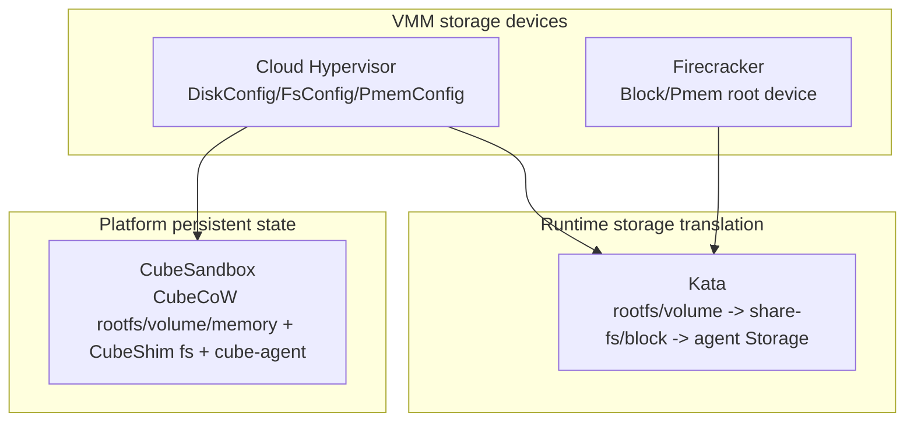
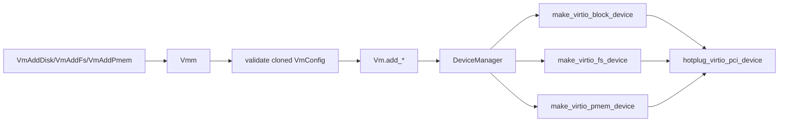
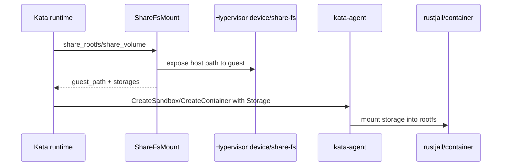
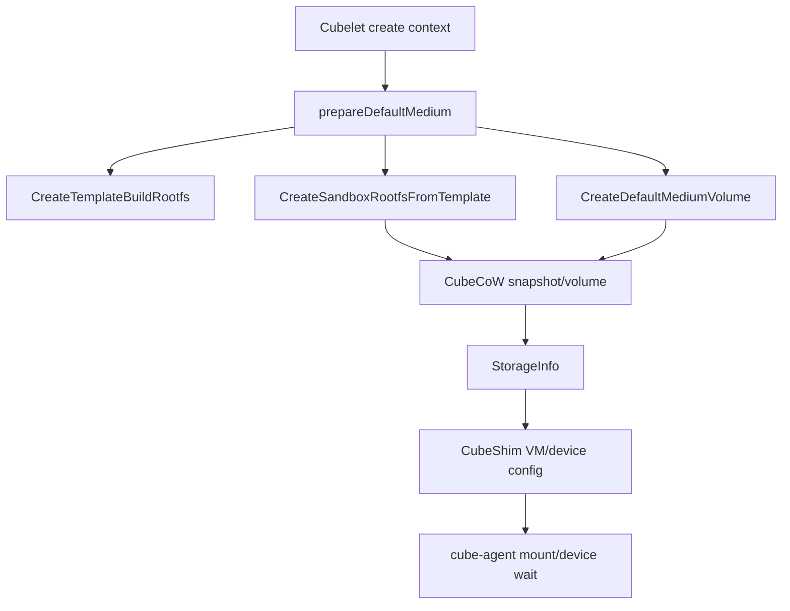

# 存储、rootfs 与共享文件系统跨项目专题分析

本文横向比较当前四个重点项目中“guest 如何看到磁盘、rootfs、共享目录和可持久化状态”。这条路线直接影响启动、设备模型、snapshot/clone、恢复和 ARM64 支持。

源码基线：当前仓库工作树。

相关项目路线：

- [Firecracker 深入路线](../firecracker/analysis/deep-routes.md)
- [Cloud Hypervisor 深入路线](../cloud-hypervisor/analysis/deep-routes.md)
- [Kata Containers 深入路线](../kata-containers/analysis/deep-routes.md)
- [CubeSandbox 深入路线](../CubeSandbox-sandbox-clone/analysis/deep-routes.md)

crosvm 当前暂停继续扩展，因此本文主线不再把它作为当前对照对象。

## 1. 总体分层

| 层级 | 主要抽象 | 关注点 |
|---|---|---|
| VMM 层 | virtio-blk、virtio-fs、pmem、vhost-user | 设备枚举、热插拔、I/O 隔离、snapshot state |
| Runtime 层 | rootfs、volume、share-fs、agent `Storage` | OCI rootfs/volume 如何进入 guest namespace |
| Platform 层 | template、clone、rollback、CubeCoW | rootfs/memory/metadata 的一致恢复 |

结论：Firecracker 和 Cloud Hypervisor 解决“把存储设备暴露给 VM”；Kata 解决“把容器 rootfs/volume 暴露到 VM 内的容器”；CubeSandbox 解决“把 sandbox 状态变成可克隆、可回滚、可恢复的产品对象”。

## 2. Firecracker：rootfs 主要是 block/pmem 边界，不展开通用 share-fs

Firecracker 的存储边界最窄。它的核心不是通用存储编排，而是把少量块设备暴露给 guest，并通过 kernel cmdline 决定 rootfs。

项目级收口文档已经单独展开：[Firecracker 存储 / rootfs / share-fs 边界链路](../firecracker/analysis/storage-rootfs-sharefs-boundary-chain.md)。

它的关键结论可以直接压成四点：

1. rootfs 主要通过 virtio-blk 或 pmem 暴露；
2. `root=/dev/vda`、`root=PARTUUID=...`、`root=/dev/pmemX` 这类表达是主入口；
3. 没有 Cloud Hypervisor / Kata 风格的通用 share-fs 主线；
4. 运行期更新更像已有设备字段收窄更新，不是通用存储热插拔框架。

这意味着 Firecracker 的存储线，应该按下面顺序读：

1. drive / pmem API 如何进入 `VmResources`
2. `build_microvm_for_boot()` 如何 attach block/pmem
3. root device 如何转成 kernel cmdline
4. snapshot/restore 为什么只保存设备状态和 host backing file 引用，而不保存 backing file 字节

Firecracker 这条线再压实一点，就是五个源码可证的边界：

1. `BlockBuilder` 和 `PmemBuilder` 在 builder 层就互斥 root；
2. root block 映射成 `root=/dev/vda` 或 `root=PARTUUID=...`；
3. root pmem 映射成 `root=/dev/pmem{i}`；
4. block 运行期可换 backing path，但 pmem update 只开放 rate limiter；
5. snapshot 前只做 I/O 收敛和 transport/device state 保存，不打包 backing file 字节。

如果读到这里还在找 guest agent `Storage`、share-fs translator 或运行期 `vm_add_fs` 一类接口，那就已经越过了 Firecracker 的能力边界。

## 3. Cloud Hypervisor：Disk/Fs/Pmem 是 DeviceManager 的热插拔对象

Cloud Hypervisor 的存储入口来自 VM config。`DiskConfig` 包含 path、readonly、direct、iommu、vhost-user、队列、rate limit、backing files、image type、lock granularity 等字段：[cloud-hypervisor/vmm/src/vm_config.rs](../cloud-hypervisor/vmm/src/vm_config.rs#L267)。

`FsConfig` 是 virtio-fs/vhost-user-fs 风格的共享目录配置，核心字段是 `tag`、`socket`、队列和 PCI segment：[cloud-hypervisor/vmm/src/vm_config.rs](../cloud-hypervisor/vmm/src/vm_config.rs#L461)。

`PmemConfig` 使用 host file 暴露持久内存设备，可配置 size、iommu、discard_writes、PCI segment：[cloud-hypervisor/vmm/src/vm_config.rs](../cloud-hypervisor/vmm/src/vm_config.rs#L508)。

运行中新增磁盘、fs、pmem 都先在 `Vmm` 层克隆并验证 config；如果 VM 已存在，就调用 `vm.add_disk/add_fs/add_pmem`，否则只把设备加入 `VmConfig`，等待 boot 时创建：[cloud-hypervisor/vmm/src/lib.rs](../cloud-hypervisor/vmm/src/lib.rs#L2257)。

`DeviceManager::add_disk()`、`add_fs()`、`add_pmem()` 都校验 identifier，然后调用对应 `make_virtio_*`，最后统一走 `hotplug_virtio_pci_device()`：[cloud-hypervisor/vmm/src/device_manager.rs](../cloud-hypervisor/vmm/src/device_manager.rs#L4980)。

`hotplug_virtio_pci_device()` 会把 virtio device 放入 `virtio_devices` 列表，再加入 PCI 设备并更新 PCI bitmap。注释说明该列表会用于内存更新通知等场景：[cloud-hypervisor/vmm/src/device_manager.rs](../cloud-hypervisor/vmm/src/device_manager.rs#L4935)。

机制判断：

1. Disk/Fs/Pmem 在 Cloud Hypervisor 中都被抽象成 `MetaVirtioDevice`，最终进入统一 PCI hotplug 路径。
2. `DiskConfig`/`PmemConfig` 实现 Landlock path 规则，说明存储路径也是 VMM 沙箱边界的一部分。
3. 共享目录不是 VMM 自己遍历 host filesystem，而是通过 `FsConfig.socket` 连接外部 virtio-fs/vhost-user 后端。
4. snapshot/restore 依赖 DeviceManager 的 device list 和 device tree，因此存储设备不仅是 I/O 通道，也是 VM 状态的一部分。

ARM64/x86_64 差异：

- Disk/Fs/Pmem 配置模型基本一致。
- 设备枚举会受 PCI/MMIO、ACPI/FDT、GIC/IOAPIC 差异影响。
- ARM64 上如果依赖 PCI virtio 设备，需要确认 guest firmware、kernel config、FDT/ACPI 设备描述与 Cloud Hypervisor 的 ARM64 路径匹配。

## 4. Kata Containers：把 OCI rootfs/volume 翻译成 guest 内 `Storage`

Kata 不直接把 host rootfs 暴露给容器进程。它先把 OCI rootfs/volume 转成共享文件系统或块设备，再让 guest agent 在 VM 内 mount 到容器 rootfs namespace。

runtime-rs 的 `VirtiofsShareMount` 实现 `ShareFsMount`。`share_rootfs()` 调 `share_to_guest(...)`，把 host source/target 映射到 guest path，并返回 `ShareFsMountResult`：[kata-containers/src/runtime-rs/crates/resource/src/share_fs/virtio_fs_share_mount.rs](../kata-containers/src/runtime-rs/crates/resource/src/share_fs/virtio_fs_share_mount.rs#L47)。

`share_volume()` 同样调用 `share_to_guest(...)`。如果是 watchable mount，会额外创建 watchable host path，并生成 agent `Storage`，driver 为 `watchable-bind`：[kata-containers/src/runtime-rs/crates/resource/src/share_fs/virtio_fs_share_mount.rs](../kata-containers/src/runtime-rs/crates/resource/src/share_fs/virtio_fs_share_mount.rs#L65)。

agent 协议里的 `Storage` 表示 rootfs 或 volume。字段包括 driver、driver_options、source、fstype、options、mount_point、fs_group、shared：[kata-containers/src/runtime/virtcontainers/pkg/agent/protocols/grpc/agent.pb.go](../kata-containers/src/runtime/virtcontainers/pkg/agent/protocols/grpc/agent.pb.go#L3408)。

guest 内 mount 最终落到 agent/rustjail。`mount_from()` 会根据 OCI mount 类型处理 bind mount、创建目标目录或文件、应用 SELinux mount label，然后调用 Linux `mount()`：[kata-containers/src/agent/rustjail/src/mount.rs](../kata-containers/src/agent/rustjail/src/mount.rs#L755)。

agent 的 `Sandbox` 保存 `storages: HashMap<String, u32>`。`set_sandbox_storage()` 用引用计数记录 sandbox 级 storage，`unset_sandbox_storage()` 在计数归零后允许清理：[kata-containers/src/agent/src/sandbox.rs](../kata-containers/src/agent/src/sandbox.rs#L37)。

机制判断：

1. Kata 的存储路径至少跨三层：host runtime share、hypervisor/VMM device、guest agent mount。
2. rootfs/volume 是否可用，不仅取决于 VMM 支持 virtio-fs/block，还取决于 agent 是否能解析并 mount 对应 `Storage`。
3. watchable mount、ephemeral storage、block volume 等 runtime 语义是在 VMM 设备之上再建一层协议。
4. snapshot/restore 时，Kata 需要保证 runtime metadata、hypervisor device state、guest mount/storage 引用一致。

再压实一点，Kata 的代码已经把 “storage 已表达” 和 “guest 已收敛” 分成了两个明确边界：

1. host 侧 `handler_rootfs()` / `handler_volumes()` 负责把 rootfs/volume 分类成 `ShareFsRootfs`、`BlockRootfs` 或其他 volume 类型；
2. `CreateContainerRequest.storages` 是 host -> guest 的语义交接点；
3. guest 侧 `do_create_container()` 先 `add_storages(...)`，之后再依赖 rustjail/OCI mount 流程真正落地；
4. 因此如果问题已经落到 `add_storages()`、`mount_storage()`、`mount_from()`，它就已经越过了 host runtime 和 hypervisor device 表达层，进入 guest-visible storage convergence 层。

这也是当前 Kata storage seed 的真正价值：它不是在追问“block 或 virtio-fs 是否支持”，而是在固定 `translation -> request propagation -> guest storage landing -> guest-visible result` 这条排查顺序。

ARM64/x86_64 差异：

- runtime share-fs 抽象尽量架构无关。
- guest 内差异集中在 virtio-fs、virtio-blk、pmem、DAX、SELinux、mount namespace、uevent 行为。
- ARM64 上要确认 guest kernel 支持对应 virtio transport 和 filesystem；否则 runtime 层逻辑相同也无法 mount 成功。

## 5. CubeSandbox：CubeCoW 把 rootfs/volume 变成可克隆平台状态

CubeSandbox 的存储层不是简单的 virtio block 或 shared fs。它把 rootfs、默认介质 volume、memory volume 和模板/快照关系交给 CubeCoW 管理。

Cubelet `prepareDefaultMedium()` 根据请求上下文选择存储策略：创建模板 rootfs、从 snapshot/template 派生 sandbox rootfs、走 v1 snapshot medium，或创建普通 default medium：[CubeSandbox-sandbox-clone/Cubelet/storage/local.go](../CubeSandbox-sandbox-clone/Cubelet/storage/local.go#L954)。

`normalizeRootfsSizes()` 把用户请求 size 转为后端分配大小、snapshot 可比较大小和 fs quota 大小。`newDefaultMediumBackendInfo()` 会把 normalized size、file path、volume name、kind、gen 写入 `StorageInfo`：[CubeSandbox-sandbox-clone/Cubelet/storage/local.go](../CubeSandbox-sandbox-clone/Cubelet/storage/local.go#L981)。

`CowVolumeManager::CreateDefaultMediumVolume()` 创建以 sandbox/volume 命名的 volume，并初始化 ext4 block device：[CubeSandbox-sandbox-clone/Cubelet/storage/cubecow_volume_manager.go](../CubeSandbox-sandbox-clone/Cubelet/storage/cubecow_volume_manager.go#L96)。

`CreateSandboxRootfsFromTemplate()` 从模板 rootfs 派生新 generation，并在需要时扩容 snapshot：[CubeSandbox-sandbox-clone/Cubelet/storage/cubecow_volume_manager.go](../CubeSandbox-sandbox-clone/Cubelet/storage/cubecow_volume_manager.go#L139)。

`CommitTemplateMemory()` 的注释说明 memory snapshot 通过 reflink-backed `CreateSnapshot` 保留源 memory bytes，使 hypervisor 的增量 pagemap_anon snapshot 只覆盖 CoW 匿名页：[CubeSandbox-sandbox-clone/Cubelet/storage/cubecow_volume_manager.go](../CubeSandbox-sandbox-clone/Cubelet/storage/cubecow_volume_manager.go#L218)。

CubeShim 侧，`CubeHypervisor::set_fs()` 把 `FsConfig` 封装成 `ApiRequest::VmSetFs` 发送给底层 VMM，用于更新 virtio-fs 允许目录：[CubeSandbox-sandbox-clone/CubeShim/shim/src/hypervisor/cube_hypervisor.rs](../CubeSandbox-sandbox-clone/CubeShim/shim/src/hypervisor/cube_hypervisor.rs#L185)。

guest 内 cube-agent 的 `Sandbox` 也维护 storage 引用计数；`set_sandbox_storage()` 新增或增加引用，`remove_sandbox_storage()` 会卸载 mount 并尝试删除目录：[CubeSandbox-sandbox-clone/agent/src/sandbox.rs](../CubeSandbox-sandbox-clone/agent/src/sandbox.rs#L37)。

cube-agent 的 device 逻辑会等待 virtio-blk/scsi/pmem/pci uevent，例如 `get_virtio_blk_pci_device_name()` 根据 PCI path 等待对应 block device 出现：[CubeSandbox-sandbox-clone/agent/src/device.rs](../CubeSandbox-sandbox-clone/agent/src/device.rs#L267)。

机制判断：

1. CubeSandbox 的 rootfs 是平台对象，不只是 VM block device。
2. CubeCoW 的 volume/snapshot/name/gen 关系决定 clone/rollback 是否能快速完成。
3. CubeShim 继承 Cloud Hypervisor 的 VM/fs API，但上层多了模板、memory volume、metadata 和 network 状态。
4. cube-agent 的 uevent 等待是 ready 边界的一部分；设备热插入成功不代表容器 rootfs 已经可用。

ARM64/x86_64 差异：

- CubeCoW 作为平台存储抽象相对架构无关。
- ARM64 差异集中在底层 VMM 设备枚举、guest kernel virtio/pmem 支持、agent uevent path、eBPF/network-agent 与镜像构建。
- CubeShim 中已经存在 x86_64/aarch64 seccomp 差异；存储路径也需要验证 guest 内 block/pmem/sysfs 路径是否一致。

## 6. 源码阅读顺序

和 I/O / 中断横线一样，存储线也更适合按固定问题去读，而不是按设备名散读。

建议一直固定为五个问题：

1. rootfs 在这个项目里是“设备表达”还是“运行时语义”？
2. 共享目录是内建能力、外部 backend，还是 guest agent 协议的一部分？
3. 运行期 add/update 到底是在加设备，还是在改 guest mount 语义？
4. snapshot/restore 持久化的是设备状态、backing file 引用，还是整个平台对象？
5. ARM64 风险落在 transport/枚举层，还是 guest mount / uevent / filesystem 支持层？

按这个问题顺序，当前四项目可以直接这样读：

| 项目 | 第一站：rootfs 表达 | 第二站：share-fs 边界 | 第三站：运行期更新 | 第四站：恢复边界 |
|---|---|---|---|---|
| Firecracker | `VmResources`、block/pmem attach、kernel cmdline | 结论就是“没有通用 share-fs 主线” | 只看已有 block/pmem 设备窄更新 | backing file 必须在恢复环境中语义一致 |
| Cloud Hypervisor | `DiskConfig` / `PmemConfig` / `FsConfig` | `FsConfig.socket` 连接外部 backend | `vm_add_disk/fs/pmem` -> `Vm.add_*` -> `DeviceManager` | 设备树、PCI hotplug 与 backing file 一起恢复 |
| Kata Containers | `handler_rootfs()`、`BlockRootfs`、`ShareFsRootfs` | `ShareFsMount` 与 agent `Storage` | `add_device()` 与 guest agent mount 共同完成 | runtime metadata、device state、guest mount 引用都要一致 |
| CubeSandbox | `prepareDefaultMedium()`、CubeCoW rootfs/template/snapshot | `VmSetFs`、cube-agent mount、device wait | Cubelet / CubeShim / CubeHypervisor / agent 多层收敛 | rootfs、memory、metadata、network 一起形成平台恢复边界 |

对 Kata 来说，这个表还可以再翻译成一个更直接的判断：

- `Storage generated` 不等于 `storage mounted`
- `device added into VM` 不等于 `rootfs/volume guest-visible`

所以只验证到 `CreateContainerRequest.storages` 为止，只能证明 host 侧 translation 和 request propagation 成立；还不能证明 guest 侧 rootfs/volume 已经可用。

这也解释了一个关键误读。

“支持 block / fs / pmem” 只是设备面信息，不足以说明 rootfs 语义已经成立。真正的 rootfs 语义，要看 guest 是否能发现设备、是否发生 mount，以及 restore 后这些对象是否还能重新收敛。

Kata 是这句话最典型的例子。

它完全可能出现：

1. host runtime 已经正确生成了 `Storage`
2. hypervisor 也已经把 block/share-fs 设备暴露进 VM
3. 但 guest 仍然停在 `add_storages()` / `mount_from()` / 设备等待 / mount 收敛阶段

因此后续对 Kata 补真实样本时，最低证据门槛不该只停在 host 侧 request，而必须同时覆盖：

1. rootfs/volume translation
2. `CreateContainerRequest.storages`
3. guest `add_storages()` / `mount_from()`
4. guest rootfs/volume 真正可用性

## 7. 能力边界对照

| 问题 | Firecracker | Cloud Hypervisor | Kata Containers | CubeSandbox |
|---|---|---|---|---|
| rootfs 表达 | block/pmem + kernel cmdline | disk/pmem/payload 配置 | OCI rootfs 经 share-fs/block 转入 guest | CubeCoW rootfs/template/snapshot |
| 共享目录 | 无通用 share-fs 主线 | `FsConfig` 连接 socket 后端 | share-fs 抽象 + agent Storage | CubeShim fs config + agent mount |
| 热插拔 | 已有设备字段窄更新 | `vm_add_disk/fs/pmem` -> DeviceManager | hypervisor AddDevice + agent update/mount | Cubelet/CubeShim/CubeHypervisor + agent uevent |
| 隔离边界 | jailer/seccomp + host backing file | Landlock + VMM seccomp +外部 backend | host share + VMM + guest agent | CubeCoW + CubeShim + VMM + cube-agent |
| snapshot 关系 | device state + backing file 引用一致性 | device state + backing file 一致性 | runtime state + guest mount/storage | rootfs/memory/metadata/network 一致性 |
| ARM64 风险 | guest 设备发现与驱动路径 | FDT/ACPI/PCI/MMIO/virtio 支持 | guest kernel/agent mount path | CubeCoW 之外的 guest/VMM/device path |

## 8. 关键理解

第一，VMM 层的“磁盘”不是 runtime 层的“rootfs”。Firecracker 和 Cloud Hypervisor 只能保证设备出现在 guest，不能保证容器 rootfs 已被正确 mount。

第二，共享目录的安全边界不同。Firecracker 基本不把通用 share-fs 当成主能力；Cloud Hypervisor 偏向外部 vhost-user/virtio-fs 后端；Kata/Cube 还要穿过 guest agent。

第三，Kata 的存储语义是翻译层。OCI rootfs/volume 先变成 share-fs 或 block device，再变成 agent `Storage`，最后由 guest 内 runtime mount。

第四，CubeSandbox 的存储语义是产品状态层。CubeCoW rootfs、memory volume、snapshot metadata 和 agent mount 必须共同一致，clone/rollback 才能成立。

第五，ARM64 对存储路线的影响不在 API 表层，而在 guest kernel、virtio transport、FDT/ACPI、pmem/DAX、uevent/sysfs path、vhost/vfio/eBPF 支持。

## 9. 横向验证重点

如果继续沿这条横线下钻，最值得补的不是更多设备名词，而是四类能直接判定“rootfs 语义是否真的成立”的验证点：

1. host backing file 或共享目录是否已经被正确暴露成 guest 可见设备；
2. guest 是否真的发现了设备，而不是只有 VMM 侧创建成功；
3. guest 内是否真的发生了 mount，而不是只完成了 hotplug；
4. restore 后 rootfs / volume / metadata 是否还能重新收敛到一致状态。

当前四项目最值得先补的验证点是：

| 项目 | 最该先验证的点 |
|---|---|
| Firecracker | root block/pmem 设备与 kernel cmdline 是否一致，restore 后 host backing file 是否仍满足 guest rootfs 语义 |
| Cloud Hypervisor | `vm_add_disk/fs/pmem` 成功后，guest 是否真的看见设备；restore 后 `DeviceManager` / `device_tree` / backend socket 是否还能把原设备拓扑接回 |
| Kata Containers | `handler_rootfs()` / `handler_volumes()` 之后，agent `add_storages()` 与 rustjail mount 是否真正落地，避免把“device 已加进 VM”误判成“rootfs 已可用” |
| CubeSandbox | `StorageInfo -> CubeShim -> CubeHypervisor -> cube-agent` 这条链是否真正走通，特别是 `VmSetFs`、uevent 等待和 guest mount 是否一致；restore/rollback 后是否还能重新达成 ready |

其中 `Cloud Hypervisor + CubeSandbox` 已经可以先沉淀一个交叉判断：

1. Cloud Hypervisor 的 share-fs/rootfs 恢复更偏 VMM 设备拓扑恢复。`vm_add_disk/fs/pmem` 会回写 `VmConfig`，`VirtioPciDevice::snapshot()` 保存 transport/PCI/common/MSI-X state，restore 时 `DeviceManager` 和 `device_tree` 负责把设备重新接回。
2. 但这不自动等价于“guest rootfs 语义已恢复”。如果是 `FsConfig.socket` 路径，backend socket 和 backend 自身状态仍必须可用；如果是 disk/pmem 路径，guest 内是否重新看到设备、重新 mount，仍要继续验证。
3. CubeSandbox 的 restore/rollback 更进一步，它不仅恢复 VMM 设备，还要重新对接 `StorageInfo`、`VmSetFs`、guest uevent 等待、cube-agent mount 与 ready 语义。native virtio-fs 还会尝试恢复 `back_state`，而普通 net/tap/backend 会按当前节点资源重新绑定。
4. 所以同样一个“restore 成功但 guest rootfs/共享目录不可用”的症状，在 CH 里更像设备拓扑或 backend 可用性问题；在 CubeSandbox 里更常是“平台对象恢复成功，但 guest-visible state 没有完成重新收敛”。

如果需要直接按步骤排查，已经单独整理为：

- [Cloud Hypervisor 与 CubeSandbox：Restore 后 Guest 不可用验证清单](./ch-cubesandbox-restore-guest-unavailability-checklist.md)

如果需要看另外一组完全不同的问题边界，也已经单独整理为：

- [Firecracker 与 Kata：Rootfs / Backing / Guest-Visible Storage 交叉线](./fc-kata-storage-semantics-crossline.md)

如果需要直接落到可回填的样本资产，当前已经有四份 checklist seeds：

- [Cloud Hypervisor backend/notifier/restore checklist seed](./samples/ch-backend-notifier-restore-checklist-seed-20260622/SUMMARY.md)
- [CubeSandbox guest-visible restore checklist seed](./samples/cubesandbox-guest-visible-restore-checklist-seed-20260622/SUMMARY.md)
- [Firecracker rootfs/backing/restore checklist seed](./samples/fc-rootfs-backing-restore-checklist-seed-20260622/SUMMARY.md)
- [Kata storage convergence checklist seed](./samples/kata-storage-convergence-checklist-seed-20260622/SUMMARY.md)

当前这条横线已经有的 `real` / baseline 资产是：

- [CubeSandbox guest-visible restore baseline real](./samples/cubesandbox-guest-visible-restore-baseline-real-20260622/SUMMARY.md)
- [CubeSandbox rollback `sandbox is not running` real](./samples/cubesandbox-rollback-sandbox-not-running-real-20260622/SUMMARY.md)

也就是说，存储线当前并不是“没有真实样本”，而是：

1. `CubeSandbox` 已有成功基线 `real`
2. `CubeSandbox` 已有控制面失败 `real`
3. `Firecracker` 与 `Kata` 仍只有 seed / baseline seed

后续如果继续补 `real`，最值得优先补的是：

1. `CubeSandbox guest-visible restore` 失败类 `real`
2. `Firecracker rootfs/backing/restore` 第一份 `real`
3. `Kata storage convergence` 第一份 `real`

如果下一步要直接把这条线推进成新的 `real`，建议不要从零开始判断顺序。

先看：

- [非网络下一批真实样本目标图](./non-network-next-target-map.md)

再按统一动作顺序走：

- [非网络样本采集 Runbook](./non-network-sample-collection-runbook.md)
- [非网络证据包记录模板](./non-network-evidence-bundle-template.md)

## 10. 后续深挖路线

1. 对 Cloud Hypervisor 展开 `make_virtio_block_device/make_virtio_fs_device/make_virtio_pmem_device` 的设备构造细节。
2. 对 Firecracker 补一份更偏验证视角的 rootfs / backing file / restore 观测清单。
3. 对 Kata 展开 `CreateContainerRequest.Storages` 如何从 runtime share-fs 传入 agent，并最终进入 rustjail mount。
4. 对 CubeSandbox 展开 `StorageInfo -> CubeShim config -> CubeHypervisor add_dev/set_fs -> cube-agent mount` 的完整链路。
5. 建立 ARM64 实测矩阵：virtio-blk、virtio-fs、pmem、DAX、uevent、snapshot rootfs restore、CubeCoW rollback。
