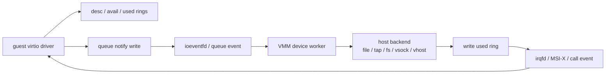

# Virtio 传输与设备数据路径跨项目专题分析

本文从源码出发，比较当前四个重点项目的 virtio 传输、队列、事件、中断和设备 worker 边界：Firecracker、Cloud Hypervisor、Kata Containers、CubeSandbox。

这里的核心问题不是“支持哪些 virtio 设备”，而是 guest driver 写 queue notify 以后，请求如何到达 host 设备后端，又如何通过 used ring 和 interrupt 返回 guest。

## 1. 通用数据路径

virtio 数据路径可以拆成四段：transport 负责 guest 可见配置和 notify，中间 eventfd 把 notify 转成 host 事件，设备 worker 消费 descriptor，interrupt 把完成通知送回 guest。

Firecracker、Cloud Hypervisor 和 CubeHypervisor 都在 VMM 层实现这条链路。Kata 的 runtime/platform 层主要编排设备请求，本身不直接消费 virtqueue。

crosvm 当前暂停继续扩展，因此本文不再把它作为当前主线对照对象，只在必要处保留历史背景。

## 2. 总体矩阵

| 项目 | transport | queue event | worker 模型 | 中断返回 | vhost/外部后端 | 平台边界 |
|---|---|---|---|---|---|---|
| Firecracker | virtio-mmio，部分 virtio-pci | KVM ioeventfd 到设备 queue eventfd | `MutEventSubscriber` + EventManager | MMIO IRQ 或 PCI MSI-X | 主要是内置设备，vsock UDS 后端 | VMM 直接处理 queue |
| Cloud Hypervisor | virtio-pci 主路径 | `VirtioPciDevice::ioeventfds` 注册到 VM | 每队列或队列组 `spawn_virtio_thread` | `VirtioInterruptMsix` | vhost-user、vDPA、VFIO | VMM 直接处理或配置外部 backend |
| Kata Containers | 取决于 QEMU/CLH/FC/Dragonball | 委托 hypervisor plugin | 委托底层 VMM | 委托底层 VMM | runtime 配置 vhost/virtiofsd | runtime 编排，不实现 queue |
| CubeSandbox | CubeHypervisor virtio-pci | 与 Cloud Hypervisor 风格相同 | CubeHypervisor virtio thread | MSI-X | vhost-user、native virtio-fs、tap、CubeVS | 平台编排 + VMM 实现 |

## 3. Firecracker

Firecracker 的 `VirtioDevice` trait 要求设备暴露 queues、queue event fds、interrupt trigger，并继承 `MutEventSubscriber + Send`。

证据在 `firecracker/src/vmm/src/devices/virtio/device.rs:73`。这说明设备可以被 EventManager 作为事件订阅者驱动。

MMIO transport 注册时，`register_mmio_virtio` 会把 notify register 地址注册为 KVM ioeventfd，datamatch 是 queue index。

证据在 `firecracker/src/vmm/src/device_manager/mmio.rs:175`。

PCI transport 也把 notification BAR 的每个 queue notify 地址注册到对应 queue eventfd。

证据在 `firecracker/src/vmm/src/devices/virtio/transport/pci/device.rs:595`。

queue 本身负责从 avail ring 取 descriptor chain。`pop_or_enable_notification` 在启用 notification suppression 时先设置通知条件，再决定是否继续 pop。

证据在 `firecracker/src/vmm/src/devices/virtio/queue.rs:478` 和 `:511`。

block 是最清楚的单队列样例。queue event 到来后，设备先读 eventfd，再检查 rate limiter 和 async engine throttle，最后进入 `process_queue`。

证据在 `firecracker/src/vmm/src/devices/virtio/block/virtio/device.rs:356`。

`process_queue` 循环取 descriptor，解析 block request，执行 host file I/O。同步完成时写 used ring，异步提交则等 completion event。

证据在 `firecracker/src/vmm/src/devices/virtio/block/virtio/device.rs:389` 和 `:470`。

写 used ring 后，Firecracker 调 `prepare_kick` 决定是否触发 queue interrupt。

证据在 `firecracker/src/vmm/src/devices/virtio/block/virtio/device.rs:446`。

机制结论：Firecracker 的设备路径很短。transport 与设备解耦，但设备后端主要在 VMM 内，复杂度集中在 queue、限速、异步完成和 snapshot 一致性。

## 4. Cloud Hypervisor

Cloud Hypervisor 的 `ActivationContext` 把 guest memory、interrupt callback、queues 和 device status 一次性交给设备。

证据在 `cloud-hypervisor/virtio-devices/src/device.rs:62`。

`VirtioDevice::activate` 是设备真正开始处理 I/O 的边界。注释明确：guest driver 配置完成后，VMM 会调用 activate，把事件、内存和 queues 移入设备。

证据在 `cloud-hypervisor/virtio-devices/src/device.rs:69`。

这条注释很关键。它意味着在 Cloud Hypervisor 里，真正拥有 queue、eventfd 和 interrupt 回调的边界不是“设备对象被创建”，而是 `activate(context)` 这一刻。把热插拔、restore 或 backend 重绑问题往下压时，这个边界比“设备是否存在于 PCI tree”更有解释力。

`VirtioPciDevice::new` 按每个 queue 创建 `EventFd`。`ioeventfds` 用 notification BAR base 和 queue index 计算每个 notify 地址。

证据在 `cloud-hypervisor/virtio-devices/src/transport/pci_device.rs:399` 和 `:849`。

DeviceManager 添加 virtio-pci 设备时，会计算 MSI-X vector 数量，创建 `VirtioPciDevice`，插入 PCI，再把 ioeventfds 注册到 hypervisor VM。

证据在 `cloud-hypervisor/vmm/src/device_manager.rs:4191` 和 `:4315`。

再往里看，`VirtioPciDevice::ioeventfds()` 只是把 notification BAR 上每个 queue 的 notify 地址映射到一组 `EventFd`。也就是说，PCI transport 暴露给 KVM 的不是“某个抽象设备事件”，而是“每个 virtqueue 各有一个 queue eventfd”。

block activate 会为每个 queue 创建 `BlockEpollHandler`，再通过 `spawn_virtio_thread` 启动线程。handler 监听 queue event、completion event 和 rate limiter event。

证据在 `cloud-hypervisor/virtio-devices/src/block.rs:621` 和 `:1079`。

从 `block.rs:1079` 往下读还能看到更硬的一层：`activate()` 解包 `ActivationContext` 后，先 `self.common.activate(&queues, interrupt_cb.clone())`，然后为每个 queue 拿出 `(Queue, EventFd)`，构造 `BlockEpollHandler`，最后 `spawn_virtio_thread(...)`。因此 Cloud Hypervisor 的 block 数据路径是显式的“transport queue eventfd -> queue-specific handler thread -> host backend -> interrupt callback”。

net activate 会按 RX/TX queue pair 启动 `NetEpollHandler`，同时处理 TAP、queue events、rate limiter 和 control queue。

证据在 `cloud-hypervisor/virtio-devices/src/net.rs:743`。

中断由 `VirtioInterruptMsix` 实现。它按 Config 或 Queue 选择 vector，若 MSI-X mask 则设置 PBA bit，否则触发 interrupt source group。

证据在 `cloud-hypervisor/virtio-devices/src/transport/pci_device.rs:884`。

Cloud Hypervisor 的外部后端路径很重要。vhost-user setup 会发送 memory table、vring num、vring addr、vring base、call eventfd 和 kick eventfd。

证据在 `cloud-hypervisor/virtio-devices/src/vhost_user/vu_common_ctrl.rs:162`。

vDPA 路径也类似，但通过 vhost/vDPA fd 设置 vring num、addr、base、call、kick 和 config call。

证据在 `cloud-hypervisor/virtio-devices/src/vdpa.rs:221`。

这里最值得单独记住的是 ownership 边界。

在 `vu_common_ctrl.rs` 里，`set_vring_call()` 用的是 `virtio_interrupt.notifier(VirtioInterruptType::Queue(index))`，而 `set_vring_kick()` 用的是 transport 已经持有的 queue eventfd。vDPA 路径同样通过 `virtio_interrupt.notifier(...)` 传 `set_vring_call()`，并把 queue eventfd 传给 `set_vring_kick()`。

这说明外部 backend 接手的是 vring 的实际消费，不是中断拓扑主权。queue notify 入口、call eventfd、MSI-X mask/PBA、interrupt source group 仍然由 Cloud Hypervisor transport/VMM 这一侧定义和持有。

机制结论：Cloud Hypervisor 的设备路径比 Firecracker 更通用。它既能 VMM 内处理队列，也能把 vring 交给 vhost-user 或 vDPA 后端。

## 5. Kata Containers

Kata 的关键边界是：它不实现 virtqueue 数据路径，而是把设备语义转成 hypervisor plugin 调用和 guest agent 操作。

Go runtime 的 `Hypervisor` interface 包含 `AddDevice`、`HotplugAddDevice` 和 `HotplugRemoveDevice` 等设备操作。

证据在 `kata-containers/src/runtime/virtcontainers/hypervisor.go:1297`。

网络 endpoint attach 时，Kata 先连接 host 侧网络，再调用 hypervisor `AddDevice` 或 `HotplugAddDevice`。

证据在 `kata-containers/src/runtime/virtcontainers/veth_endpoint.go:108` 和 `:139`。

runtime-rs 的 `Hypervisor` trait 同样只暴露 `add_device/remove_device/update_device`，不暴露 queue 或 eventfd。

证据在 `kata-containers/src/runtime-rs/crates/hypervisor/src/lib.rs:98`。

Dragonball plugin 收到 `DeviceType` 后，按 Network、Block、VhostUserBlk、ShareFs、VhostUserNetwork 等分派到底层 VMM API。

证据在 `kata-containers/src/runtime-rs/crates/hypervisor/src/dragonball/inner_device.rs:41`。

QEMU plugin 在 VM 已运行时通过 QMP hotplug network、block、VFIO 等设备。virtio queue 由 QEMU 自身实现。

证据在 `kata-containers/src/runtime-rs/crates/hypervisor/src/qemu/inner.rs:812`。

kata-agent 负责 guest 内 container、storage、network 和资源语义。它不处理 host virtqueue，而是处理已经出现在 guest 里的设备和 mount。

证据在 `kata-containers/src/runtime/virtcontainers/kata_agent.go:814` 和 agent RPC 文档链路。

机制结论：Kata 的设备数据路径要分两层看。VMM 层由 QEMU/Cloud Hypervisor/Firecracker/Dragonball 实现，Kata 层负责把 container runtime 语义映射到这些设备能力。

因此对 Kata 的 I/O 线，最容易犯的错就是把 `AddDevice` / `HotplugAddDevice` 当成“数据路径已经实现”。它只能证明 runtime 已经把设备语义下发给了 plugin，不能证明 queue event、worker、used ring 和 interrupt 已经在底层 VMM 中闭环。

更进一步，Kata 的源码还明确把 “设备请求已下发” 和 “guest 已经可见” 拆成了两段。

以网络为例：

1. `VethEndpoint::HotAttach()` 先完成 host 侧桥接，再调用 `h.HotplugAddDevice(ctx, endpoint, NetDev)`；
2. host 侧 `kataAgent.updateInterface()` 明确写了重试逻辑，因为设备热插拔是异步的，guest 内设备可能还没 ready；
3. guest 侧 `update_interface()` 如果请求里带 `devicePath`，会先 `wait_for_pci_net_interface(...)`，等设备在 guest 内真正出现后才做 rtnetlink 配置。

storage 和资源 resize 也是同样模式：

1. `do_create_container()` 里先 `add_storages(...)`，之后再靠 guest 内 mount 语义落地；
2. host 侧 CPU/memory resize 完成后，还要继续调用 `onlineCPUMem`；
3. guest 侧 `online_cpu_memory()` 才真正 online CPU 和 memory。

因此如果问题已经落到 `UpdateInterface`、`UpdateRoutes`、`add_storages()` 或 `online_cpu_mem()` 这些步骤，它就已经越过了 Kata runtime 自己的“设备请求表达”边界，进入了 guest-visible 收敛层。

## 6. CubeSandbox

CubeSandbox 同时有平台层和 VMM 层。平台层发起 sandbox/device/fs 更新；CubeHypervisor 层实现 virtio-pci、queue event、worker 和 interrupt。

CubeHypervisor 的 `VirtioPciDevice` 保存 PCI config、common config、MSI-X、virtio device、queues、queue events 和 guest memory。

证据在 `CubeSandbox-sandbox-clone/hypervisor/virtio-devices/src/transport/pci_device.rs:325`。

它按每个 queue 创建 `EventFd`，`ioeventfds` 根据 notification BAR 计算每个 queue notify 地址。

证据在 `CubeSandbox-sandbox-clone/hypervisor/virtio-devices/src/transport/pci_device.rs:398` 和 `:756`。

DeviceManager 添加 virtio-pci 设备后，把 `ioeventfds` 注册到 VM。

证据在 `CubeSandbox-sandbox-clone/hypervisor/vmm/src/device_manager.rs:3685`。

CubeHypervisor 的 net activate 与 Cloud Hypervisor 风格接近。它按 RX/TX pair 创建 `NetEpollHandler`，传入 TAP、queue event、rate limiter 和 interrupt callback。

证据在 `CubeSandbox-sandbox-clone/hypervisor/virtio-devices/src/net.rs:646`。

native virtio-fs activate 会初始化 backend fs server，restore 时反序列化 `back_state`，再为每个 queue 启动 `FsEpollHandler`。

证据在 `CubeSandbox-sandbox-clone/hypervisor/virtio-devices/src/fs.rs:916`。

CubeSandbox 的平台更新路径不直接改 queue。CubeShim 的 `set_fs` 发送 `ApiRequest::VmSetFs`，VMM 再把 `FsEvent` 放入 pending message 并唤醒 fs worker。

证据在 `CubeShim/shim/src/hypervisor/cube_hypervisor.rs:185` 和 `CubeSandbox-sandbox-clone/hypervisor/vmm/src/device_manager.rs:1173`。

CubeShim 也能发送 `VmAddDevice`，Cubelet 的 shim API 负责记录 hotplug device 请求。

证据在 `CubeShim/shim/src/hypervisor/cube_hypervisor.rs:197` 和 `Cubelet/pkg/apis/shimapi/devices.go:25`。

机制结论：CubeSandbox 的 VMM 数据路径近似 Cloud Hypervisor fork/改造，但平台层额外包了 Cubelet、CubeShim、network-agent、CubeVS 和 guest agent。

从源码位置上也能看出这条边界：queue 消费和 `signal_used_queue()` 仍在 `hypervisor/virtio-devices/src/net.rs`、`fs.rs` 这类 VMM 设备文件里；而 `VmSetFs`、`VmAddDevice`、shim API 则在 CubeShim/Cubelet。也就是说，平台控制面成功只能证明“请求进入了 VMM/平台边界”，不能直接证明“worker 已跑完、guest 已可见”。

## 8. ARM64 与 x86_64 差异

virtqueue ring 读写本身基本不按架构分裂。descriptor、avail ring、used ring、event idx、packed/split queue 都是 virtio 协议层逻辑。

架构差异主要发生在 transport 暴露、设备枚举和中断投递。

Firecracker 在 ARM64 上更依赖 MMIO/FDT/GIC 路径，x86_64 可见更多 PCI/ACPI/PIO 组合。设备 worker 逻辑基本共享。

Cloud Hypervisor 和 CubeHypervisor 以 virtio-pci 为主。x86_64 通常由 ACPI/MCFG 枚举 PCI，ARM64 需要 FDT/ACPI 描述 PCI host bridge 和 GIC/MSI。

Kata 和 CubeSandbox 平台层会把架构差异隐藏在 hypervisor plugin 或 CubeHypervisor 配置之后，但 guest kernel 仍必须支持对应 bus、interrupt 和 virtio driver。

## 8. 源码阅读顺序

如果后续继续沿“深入路线”做代码阅读，最有效的办法不是先看设备 feature table，而是按同一条因果链读四个项目。

建议固定成下面五步：

1. 先找 transport 如何为 queue notify 建立 `ioeventfd` 或等价入口。
2. 再找 device activate 边界，确认 queue/eventfd/interrupt 是在哪里一起交给 worker。
3. 再找 worker 如何从 queue 取 descriptor，并落到 host backend。
4. 再找 used ring 更新后由谁决定 `prepare_kick` 或 `signal_used_queue`。
5. 最后再看外部 backend、snapshot/restore、ARM64/x86_64 差异是否改变这条主链。

按这个顺序，四个当前范围内项目可以直接这样读：

| 项目 | 第一站：notify 注册 | 第二站：activate/worker | 第三站：backend 与完成返回 | 第四站：边界重点 |
|---|---|---|---|---|
| Firecracker | `device_manager/mmio.rs` 的 `register_mmio_virtio`；`transport/pci/device.rs` 的 `ioeventfds` | `devices/virtio/device.rs`、`queue.rs`、block/net 事件处理 | block `process_queue`、net TX/RX 路径、`prepare_kick`、`interrupt_trigger()` | 内置 backend 为主；运行期更新窄；ARM64 主要变在 MMIO/FDT/GIC |
| Cloud Hypervisor | `VirtioPciDevice::ioeventfds()`；`DeviceManager::register_ioevent` | `ActivationContext`；block/net 的 `activate()`；`spawn_virtio_thread()` | `signal_used_queue()`、`VirtioInterruptMsix`、`vu_common_ctrl.rs`、`vdpa.rs` | VMM 内 worker 与外部 vhost-user/vDPA 共存；迁移状态更重 |
| Kata Containers | 不先找 queue；先看 `add_device()`/`HotplugAddDevice()` | hypervisor plugin 分发到 QEMU/CH/FC/Dragonball | guest agent 等待设备出现并做网络/存储配置 | Kata 只表达设备语义，不实现 virtqueue/irqfd |
| CubeSandbox | `transport/pci_device.rs` 的 `ioeventfds()`；`device_manager.rs` 注册 | net/fs activate、`NetEpollHandler`/`FsEpollHandler` | `signal_used_queue()`、`VirtioInterruptMsix`、`VmSetFs` pending message | 既有 CH-like VMM 主链，又有 CubeShim/Cubelet 平台包装 |

有两个常见误读需要提前排除。

第一，不要把 “设备可 hotplug” 误读成 “这个项目自己实现了完整 virtqueue 数据路径”。Kata 就是最典型反例，它能 hotplug device，但 queue/interrupt 仍由下层 VMM 负责。

第二，不要把 “支持 vhost-user 或 vDPA” 误读成 “VMM 不再拥有数据路径主权”。Cloud Hypervisor 和 CubeSandbox 仍然负责 queue/kick/call/notifier 的绑定，以及恢复时的设备拓扑和 interrupt 重建。

第三，不要把 “activate 已发生” 和 “guest 已经可见” 混成一个判断。activate 只证明 queue/eventfd/interrupt 已经移入设备 worker；guest 内是否真正收敛，还要继续看 backend、used ring、中断以及 guest agent/driver 配置路径。

对 Kata 来说，这条边界需要再收紧一点：

`HotplugAddDevice succeeded` 也不等于 `guest-visible convergence completed`。

它最多只能证明 host runtime 已经把设备请求交给了 hypervisor 或 plugin。之后是否能被 guest 看到、是否完成网络配置、是否完成 mount、是否 online 资源，仍要继续看 agent RPC 和 guest 内等待逻辑。

## 9. 横向验证重点

这条横线继续往下做，最值得补的不是更多 transport 背景，而是三类可直接观测的横向问题：

1. queue notify 是否已经绕开 VM exit，真正走了 `ioeventfd`
2. worker 是否已经完成 descriptor 消费，但 used ring / interrupt 仍未对 guest 生效
3. 外部 backend 接入后，VMM 是否仍然保有 kick/call/notifier 的主导权

这三类问题在当前四项目里的最佳抓手分别是：

| 项目 | 最该先验证的点 |
|---|---|
| Firecracker | MMIO 与 PCI 两条 notify 注册路径是否都能稳定进入 queue event，再到 `process_queue` / `prepare_kick` |
| Cloud Hypervisor | `ActivationContext` 到 `spawn_virtio_thread()` 是否完整接通，外部 vhost-user/vDPA 的 `kick/call` 是否复用同一 interrupt/notifier 模型 |
| Kata Containers | runtime `add_device()` 之后，问题到底停在 hypervisor plugin、底层 VMM，还是 guest agent 的设备可见性与配置收敛 |
| CubeSandbox | `VmSetFs`、`VmAddDevice` 等平台更新，是否只改控制面状态，还是已经真正唤醒到底层 fs/net worker 并完成 guest 可见更新 |

其中 `Cloud Hypervisor + CubeSandbox` 这条交叉线已经可以先落一个更硬的源码结论：

1. Cloud Hypervisor 的外部 backend 仍然复用 VMM 自己的 notifier 模型。vhost-user 通过 `set_vring_call()` 取 `virtio_interrupt.notifier(Queue(index))`，通过 `set_vring_kick()` 取 queue eventfd；vDPA 也同样复用 `set_vring_call()` / `set_vring_kick()` / `set_config_call()`。
2. 这说明 backend 只是接过 vring 的实际消费，不接管 VMM 的中断拓扑主权。route、mask、MSI-X、controller state 仍然由 CH 的 transport 和 interrupt manager 持有。
3. CubeSandbox 的 VMM 层延续了同一模式，但平台层额外插入 `VmSetFs`、`VmAddDevice`、TAP fd passing 和 guest agent ready 等阶段。因此它更容易出现“控制面成功，但 worker/guest 不可见尚未完成”的中间断层。
4. 对 restore 更要单独看：CH 侧 `VirtioPciDevice::snapshot()` 会保存 transport state、PCI/common/MSI-X state，GIC/IOAPIC 也单独 snapshot；CubeSandbox 的 native virtio-fs 还会序列化 `back_state`，而普通 net/tap 后端则依赖恢复请求重新提供当前节点的 TAP/fd/backing config。

再进一步压成一句话：

`backend can consume vring` 不等于 `backend owns delivery semantics`。

当前代码能证明的恰好相反：delivery semantics 仍由 transport、interrupt object、route 和 controller restore 顺序定义。

这条结论意味着，后续如果补真实验证样本，`Cloud Hypervisor` 更应优先抓 `notifier + route + controller restore` 是否一致，`CubeSandbox` 更应优先抓 `平台更新请求 -> worker 唤醒 -> guest agent 可见` 是否完整闭环。

Kata 则应优先抓另一条线：

1. host runtime 是否已经把设备请求成功下发给了 hypervisor plugin；
2. plugin 之后是否已经进入 `UpdateInterface` / `UpdateRoutes` / `add_storages` / `onlineCPUMem` 这类 agent RPC；
3. guest agent 是否还在等待设备出现或执行 guest-visible 配置；
4. 如果卡在这些步骤，就不要优先把问题描述成 Kata runtime 自己的 virtqueue 或 interrupt 故障。

如果需要直接落到可回填的样本资产，当前已经有两份更贴近这条横线的 checklist seeds：

- [Cloud Hypervisor backend/notifier/restore checklist seed](./samples/ch-backend-notifier-restore-checklist-seed-20260622/SUMMARY.md)
- [CubeSandbox guest-visible restore checklist seed](./samples/cubesandbox-guest-visible-restore-checklist-seed-20260622/SUMMARY.md)

当前这条横线已经有的 `real` / baseline 资产是：

- [Cloud Hypervisor backend/notifier/restore baseline real](./samples/ch-backend-notifier-restore-baseline-real-20260622/SUMMARY.md)
- [CubeSandbox guest-visible restore baseline real](./samples/cubesandbox-guest-visible-restore-baseline-real-20260622/SUMMARY.md)
- [CubeSandbox rollback `sandbox is not running` real](./samples/cubesandbox-rollback-sandbox-not-running-real-20260622/SUMMARY.md)

也就是说，I/O 虚拟化线当前已经有：

1. `Cloud Hypervisor` 的成功基线 `real`
2. `CubeSandbox` 的成功基线 `real`
3. `CubeSandbox` 的控制面失败 `real`

它最缺的不是“有没有 real”，而是：

1. `Cloud Hypervisor` 的失败类 `real`
2. `CubeSandbox` 真正落在 worker / guest-visible 断层上的失败类 `real`

如果需要直接按步骤排查，已经单独整理为：

- [Cloud Hypervisor 与 CubeSandbox：Restore 后 Guest 不可用验证清单](./ch-cubesandbox-restore-guest-unavailability-checklist.md)

如果下一步要直接把这条线推进成新的 `real`，建议先看：

- [非网络下一批真实样本目标图](./non-network-next-target-map.md)

再按统一动作顺序走：

- [非网络样本采集 Runbook](./non-network-sample-collection-runbook.md)
- [非网络证据包记录模板](./non-network-evidence-bundle-template.md)

## 10. 验证路线

验证 Firecracker 时，观察 guest notify 是否注册到 ioeventfd，block queue event 是否进入 `process_queue_event`，used ring 和 interrupt 是否同步推进。

验证 Cloud Hypervisor 时，覆盖 virtio-pci add、ioeventfds 注册、block/net worker 启动、MSI-X vector、vhost-user vring setup。

验证 Kata 时，不要找 virtqueue 处理代码。应验证 runtime device request 是否正确到达 hypervisor plugin，再到对应 VMM 的设备数据路径。

验证 CubeSandbox 时，要分层验证 Cubelet/CubeShim API、CubeHypervisor ioeventfd、net/fs worker、VmSetFs pending message 和 guest agent 可见效果。

除此之外，这条横线继续推进时，还应专门补一类“看起来像 I/O 故障，其实是 restore 或 guest-visible state 断层”的验证点：

1. Cloud Hypervisor 的 vhost-user / vDPA 设备在 restore 后，是否不仅 transport state 重建成功，而且 backend 的 `kick/call` 关系仍然与原队列一致；
2. CubeSandbox 的 `VmSetFs`、`VmAddDevice` 或 restore 成功后，是否真的唤醒到底层 worker，并让 guest agent 看到新设备或新 mount；
3. Kata 的 hypervisor plugin 返回成功后，问题是否其实停在 guest agent 对设备的等待、配置和可见性收敛，而不是停在 VMM 数据路径。

## 11. 结论

Firecracker 是最短路径：queue event 到 VMM 内设备，再到 host backend 和 interrupt。

Cloud Hypervisor 是通用云 VMM 路径：virtio-pci、MSI-X、多队列 worker、vhost-user 和 vDPA 都是主线能力。

Kata 不是 VMM 数据路径实现者，而是 runtime 编排者。它把设备需求交给 QEMU、Cloud Hypervisor、Firecracker 或 Dragonball。

CubeSandbox 在底层继承 Cloud Hypervisor 风格数据路径，在上层把设备更新包装进 sandbox 生命周期、snapshot/rollback 和网络/存储策略。
