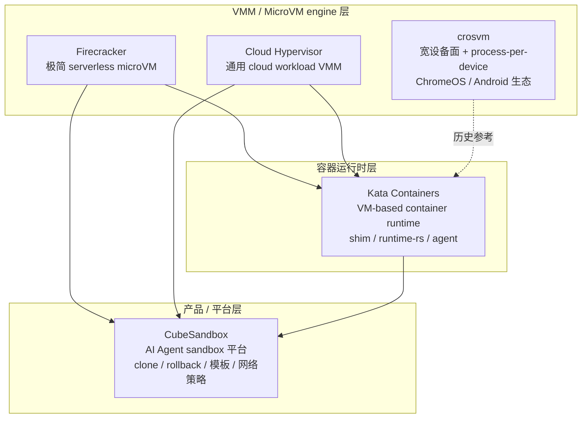
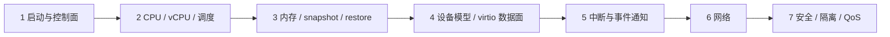
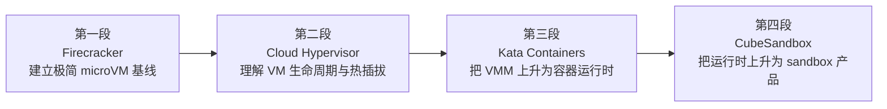

# 轻量化虚拟机设计全景与学习路线

本文是面向“想完整理解轻量化虚拟机（MicroVM）设计”的读者入口。

它与 [Analysis 导航入口](./README.md) 的区别在于：`README.md` 是按“项目路线 / 跨项目专题 / ARM64 网络 / 样本”组织的**导航索引**，而本文是按**学习目标**组织的**课程路线**——先建立完整面貌，再说明每个设计维度为什么这样取舍，最后给出一条从源码到性能与安全的设计依据路径。

源码基线：当前工作树。本文只综合已有专题与链路文档的结论，不重复展开函数级调用链；需要深入时一律跳转到对应链路文档。

## 1. 三个学习目标

后续所有内容都围绕这三个目标组织：

1. **完整面貌**：五个项目各自解决什么问题、设计哲学是什么、在架构分层里处在什么位置。
2. **如何构建高性能 VM**：性能从哪些设计决策里来。详见 [性能设计依据跨项目专题分析](./performance-design-basis-cross-project.md)。
3. **性能与安全的设计依据**：在性能与安全之间如何推理、如何取舍。详见 [安全设计依据跨项目专题分析](./security-design-basis-cross-project.md)。

如果你只读一篇，读本文；如果要动手对照源码，再进入 [四项目深入路线总览](./four-project-deep-routes.md) 与各项目 `deep-routes.md`。

## 2. 完整面貌：五个项目的设计坐标

五个项目不是“同一个东西的五个实现”。它们处在不同的分层、面向不同的工作负载、做出了截然不同的设计取舍。先看分层：

这张图回答了一个最容易混淆的问题：**这五个项目不在一个层面上竞争**。Firecracker、Cloud Hypervisor、crosvm 是 VMM（虚拟机监视器，用户态进程 + KVM）；Kata 是把 VMM 包成容器运行时；CubeSandbox 是把运行时包成 AI Agent sandbox 产品。上层可以复用下层（CubeSandbox 的 CubeHypervisor 内嵌了 Cloud Hypervisor 派生实现，见 [CubeSandbox arch chain](../CubeSandbox-sandbox-clone/analysis/arch-arm64-x86-chain.md)）。

### 2.1 设计哲学一句话对照

| 项目 | 一句话设计哲学 | 哲学的代价 |
|---|---|---|
| Firecracker | **极简即性能即安全**：刻意收窄设备面，一个进程管一个 microVM | 设备能力有限，复杂 workload 跑不了 |
| Cloud Hypervisor | **模块化通用 VM**：用 manager 抽象 CPU/Memory/Device，支持热插拔与迁移 | 比 Firecracker 重，启动与内存占用更高 |
| crosvm | **进程级设备隔离**：宽设备面，但每个设备 fork 进独立 Minijail 进程 | IPC 与跨进程状态协调复杂，snapshot/hotplug 都要跨进程 |
| Kata Containers | **VM 即容器**：用 VM 提供容器语义隔离，runtime 把 OCI 翻译成 VM + guest agent | 边界跨 host 与 guest，资源语义是双层的 |
| CubeSandbox | **sandbox 即产品**：在运行时之上叠加 clone/rollback/模板/网络策略/调度 | 平台状态一致性最复杂 |

这五行是后面所有专题的锚。任何一个设计差异，最终都能回溯到这几句哲学。

### 2.2 为什么这五个项目值得一起读

单看任何一个项目，都会把它当地的实现当成“本来就该这样”。五个一起读，才能看清**设计空间**：

- Firecracker 证明“极简能换来亚毫秒级启动与上千实例密度”。
- Cloud Hypervisor 证明“要热插拔和迁移，就必须接受 manager 抽象与更复杂的状态机”。
- crosvm 证明“设备隔离可以做到进程级，代价是 IPC 协调”。
- Kata 证明“VM 可以假装成容器，代价是双层资源语义”。
- CubeSandbox 证明“snapshot 能升级成产品级 clone/rollback，代价是平台状态一致性”。

这正是 [性能设计依据](./performance-design-basis-cross-project.md) 与 [安全设计依据](./security-design-basis-cross-project.md) 想提炼的：**每一个能力，都有一个对应的代价**。

> 说明：crosvm 在当前研究范围里被设为“历史参考、暂停继续扩展”（见 [四项目深入路线总览](./four-project-deep-routes.md) 第 10 节）。但它的 process-per-device 是五个项目里**唯一**的进程级设备隔离范式，对理解“完整面貌”不可替代，因此在全景与设计依据中保留为对照项，不再产出新的 crosvm 函数级链路。

## 3. 七个设计维度

要把“完整面貌”变成可推理的判断，下面七个维度是最有用的轴。每个维度都已有专题文档展开，这里只给坐标与一句话差异。

| 维度 | 关键问题 | 入口专题 |
|---|---|---|
| 1. 启动与控制面 | VM 怎么从 API/CLI 变成可运行的？pre-boot 与 runtime 边界在哪？ | [启动路径与控制面](./boot-control-plane-cross-project.md) |
| 2. CPU / vCPU / 调度 | vCPU 线程怎么跑 KVM_RUN？怎么 kick、怎么热插拔？ | [Hypervisor/KVM/vCPU](./hypervisor-kvm-vcpu-cross-project.md)、[CPU/中断/机器描述](./cpu-interrupt-machine-cross-project.md) |
| 3. 内存 / snapshot / restore | guest 内存怎么存？dirty log 怎么用？snapshot 怎么快？ | [Guest Memory/DMA/IOMMU](./guest-memory-dma-iommu-cross-project.md)、[Snapshot/Restore/Clone](./snapshot-restore-cross-project.md) |
| 4. 设备模型 / virtio 数据面 | 设备请求怎么从 guest 到后端？ioeventfd/vhost-user 在哪分流？ | [设备模型与隔离边界](./device-model-isolation-cross-project.md)、[Virtio 传输与数据路径](./virtio-data-path-cross-project.md) |
| 5. 中断与事件通知 | guest 怎么知道“请求处理完了”？irqfd/MSI-X/GIC 怎么联动？ | [中断与事件通知](./interrupt-event-notification-cross-project.md) |
| 6. 网络 | 一张网卡从 host 到 guest 要经过哪几层 ready？ | [网络与连接模型](./network-connectivity-cross-project.md) |
| 7. 安全 / 隔离 / QoS | 攻击面怎么收敛？资源怎么限？ | [安全隔离边界](./security-isolation-cross-project.md)、[资源管理与 QoS](./resource-qos-cross-project.md)、[安全设计依据](./security-design-basis-cross-project.md) |

每个维度的横向结论都已经成型，本文不重复。学习时建议**先看维度表建立框架，再带着框架去读对应专题**，而不是线性通读。

> 关于跨项目专题文档的价值：上表里的每一份 `*-cross-project.md` 都不只是功能清单，而是**机制叙事**——它们解释每个项目“为什么这样实现、机制如何串联、差异从哪来”。这是快速建立设计/实现直觉最有效的材料。本文与两份设计依据文档的作用，是在这些机制叙事之上再叠加一层“性能/安全如何据此推理、如何量化、如何取舍”，而不是替代它们。学机制读专题，学取舍读设计依据，两者互补。

## 4. ARM64 与 x86_64：贯穿所有维度的第二根轴

七个维度之外，还有一根贯穿性的轴：**架构差异**。它不是独立的第八个维度，而是给前七个维度都加了一层“在 ARM64 上是否一样”的检验。

来源：[ARM64 与 x86_64 跨项目架构差异专题分析](./arm64-x86-cross-project-matrix.md)。

| 维度 | x86_64 主路径 | ARM64 差异点 |
|---|---|---|
| CPU 身份 | CPUID / topology | MPIDR / CLIDR，且 Firecracker 明确拒绝 aarch64 SMT（`vmm_config/machine_config.rs` 的 `InvalidSmtValueOnAarch64`） |
| 中断控制器 | IOAPIC / LAPIC / MSI | GIC v3 / ITS，restore 时多一份 GIC 状态 |
| 设备描述 | ACPI / PCI | FDT / MMIO / 平台中断 |
| 启动固件 | setup header / PVH | direct boot / FDT，或 UEFI |
| 安全 | seccomp / jailer / Landlock | syscall allowlist 按架构变（如 `mkdir` vs `mkdirat`），eBPF 需验证 arm64 |

学习要点：**架构差异的重点不是“换了一套安全模型”，而是同一套框架在 syscall allowlist、设备 policy、guest kernel 能力、eBPF load 上都按架构改变**。这也解释了为什么当前工作树里 ARM64 网络线特别厚——它是把架构差异落到真实判错场景的最集中体现（见 [ARM64 网络文档索引](./arm64-network-document-index.md)）。

## 5. 推荐学习路线（四段式）

与其按目录线性读，不如按“从机制到产品”的四段式读。每一段都建立在前一段的语义之上。

### 第一段：Firecracker —— 建立极简基线

目标：理解“一个 microVM 最少需要哪些部件”。Firecracker 是最好的基线，因为它刻意做得少。

阅读顺序：

1. [Firecracker API start boot chain](../firecracker/analysis/api-start-boot-chain.md)：HTTP API 怎么聚合成一次 `StartMicroVm`。
2. [Firecracker build microvm boot chain](../firecracker/analysis/build-microvm-boot-chain.md)：`build_microvm_for_boot` 怎么拼出 KVM/VM/vCPU/设备/内存。
3. [Firecracker vCPU KVM_RUN chain](../firecracker/analysis/vcpu-kvm-run-chain.md)：vCPU 线程的状态机与 KVM_RUN。
4. [Firecracker isolation seccomp jailer chain](../firecracker/analysis/isolation-seccomp-jailer-chain.md)：jailer 怎么收敛攻击面。

读完这一段，你应该能回答：“为什么 Firecracker 能在 15 秒内拉起 1000 个实例”（见 [high-density 实测](../sandbox-bench/docs/high-density-firecracker-notes.md)：384 CPU 主机、1000 实例、约 133GiB 内存、约 15s 创建）。

### 第二段：Cloud Hypervisor —— 理解生命周期与热插拔

目标：理解“当 VM 需要 resize、热插拔、迁移时，架构要付出什么代价”。

阅读顺序：

1. [Cloud Hypervisor VM create / boot chain](../cloud-hypervisor/analysis/vm-create-boot-chain.md)：`vm_create` / `vm_boot` 的对象图。
2. [Cloud Hypervisor DeviceManager chain](../cloud-hypervisor/analysis/device-manager-chain.md)：设备、中断控制器、热插拔的聚合点。
3. [Cloud Hypervisor MemoryManager chain](../cloud-hypervisor/analysis/memory-manager-chain.md)：内存 slot、热插拔、snapshot transport、dirty log。
4. [Cloud Hypervisor CPU runtime hotplug migration chain](../cloud-hypervisor/analysis/cpu-runtime-hotplug-migration-chain.md)：resize、热插拔、迁移。

读完这一段，对比第一段，你会清楚地看到：**热插拔与迁移能力，是用 manager 抽象和更复杂的状态机换来的**。

### 第三段：Kata Containers —— VM 上升为容器运行时

目标：理解“VM 怎么假装成容器，代价是什么”。

阅读顺序：

1. [Kata shim sandbox lifecycle chain](../kata-containers/analysis/shim-sandbox-lifecycle-chain.md)：containerd shim v2 怎么映射到 hypervisor + agent。
2. [Kata runtime-rs Manager request chain](../kata-containers/analysis/runtime-rs-manager-request-chain.md)：runtime-rs 的请求分发。
3. [Kata agent RPC boundary chain](../kata-containers/analysis/agent-rpc-boundary-chain.md)：guest agent 的 RPC 与 policy。
4. [Kata share-fs rootfs volume agent chain](../kata-containers/analysis/sharefs-rootfs-volume-agent-chain.md)：rootfs/volume 怎么进 guest。

读完这一段，关键收获是：**Kata 的资源语义是双层的——host runtime 改 VM 拓扑，guest agent 改容器 cgroup**（见 [资源管理与 QoS](./resource-qos-cross-project.md) 第 6 节）。

### 第四段：CubeSandbox —— 运行时上升为 sandbox 产品

目标：理解“当 snapshot 变成 clone/rollback、当网络变成策略，平台层要解决什么”。

阅读顺序：

1. [CubeSandbox API Master Cubelet create chain](../CubeSandbox-sandbox-clone/analysis/api-master-cubelet-create-chain.md)：API 到调度的控制面。
2. [CubeSandbox CubeCoW storage engine chain](../CubeSandbox-sandbox-clone/analysis/cubecow-storage-engine-chain.md)：CubeCoW 怎么让 rootfs/memory 可 clone。
3. [CubeSandbox snapshot create commit chain](../CubeSandbox-sandbox-clone/analysis/snapshot-create-commit-chain.md)：平台 snapshot 的提交语义。
4. [CubeSandbox CubeVS eBPF data plane chain](../CubeSandbox-sandbox-clone/analysis/cubevs-ebpf-data-plane-chain.md)：网络策略数据面。

读完这一段，结合实测（[create-only 调优总结](../CubeSandbox/.trellis/tasks/05-06-arm64-ci-release/research/tap-fd-timeout-10s-20260602/restore-bottleneck-current-summary-zh.md)：c100 并发 restore p99 约 2.5–2.7s，瓶颈从网络迁移到 VMM snapshot restore），你会看到：**平台产品化的真正难点，不是单点性能，而是并发下的状态一致性**。

## 6. 横向专题：什么时候读

四段式给的是“纵向深入”。当你想横向比较时，按需进入下表。建议在完成第一、二段后再读横向专题，否则缺乏对照。

| 想理解的问题 | 读这个专题 |
|---|---|
| 谁启动得快、为什么 | [启动路径与控制面](./boot-control-plane-cross-project.md) + [性能设计依据](./performance-design-basis-cross-project.md) 第 2 节 |
| snapshot 到底是哪一层的状态 | [Snapshot/Restore/Clone](./snapshot-restore-cross-project.md) |
| 中断怎么从 KVM 到 guest | [中断与事件通知](./interrupt-event-notification-cross-project.md) |
| DMA/IOMMU 怎么管设备内存 | [Guest Memory/DMA/IOMMU](./guest-memory-dma-iommu-cross-project.md) |
| 攻击面怎么收敛 | [安全隔离边界](./security-isolation-cross-project.md) + [安全设计依据](./security-design-basis-cross-project.md) |
| 资源限制在哪一层生效 | [资源管理与 QoS](./resource-qos-cross-project.md) |
| ARM64 上哪里会不一样 | [ARM64/x86_64 差异](./arm64-x86-cross-project-matrix.md) |
| 出了问题怎么判错 | [可观测性与故障诊断](./observability-diagnostics-cross-project.md) |

## 7. 设计依据：把“完整面貌”变成“能做判断”

“完整面貌”本身不是目的。目的是能回答这类问题：

- 我要做一个 serverless 函数平台，该选哪种 VMM？→ 看启动延迟与密度，Firecracker 基线。
- 我要热插拔和在线迁移？→ 必须接受 manager 抽象，Cloud Hypervisor 范式。
- 我要极强设备隔离？→ process-per-device，crosvm 范式。
- 我要容器生态兼容？→ Kata，但要接受双层资源语义。
- 我要产品级 clone/rollback？→ CubeSandbox 范式，但要解决并发一致性。

这类判断的依据，分散在机制文档里。本文与两份设计依据文档的作用，就是把它收成可推理的结论：

- 性能判断 → [性能设计依据跨项目专题分析](./performance-design-basis-cross-project.md)
- 安全判断 → [安全设计依据跨项目专题分析](./security-design-basis-cross-project.md)

## 8. 已知边界与诚实声明

本文是综合层，不产生新的源码结论。以下几点必须明确：

1. **crosvm 的结论来自已有（暂停的）文档**，未做新的函数级验证。process-per-device 的定位来自 `crosvm/README.md` 与 `ARCHITECTURE.md`，机制细节见 [crosvm device isolation chain](../crosvm/analysis/device-isolation-chain.md)。
2. **性能数字来自 `sandbox-bench/` 与 `.trellis/` 实测**，口径与机器已在原文注明，不能外推到任意硬件。
3. **CoCo / 机密计算路径**（TDX/SEV-SNP/CCA）在 Kata 上暂缓，在 Cloud Hypervisor 与 CubeSandbox 上保留为历史参考，不作主线。见 [CoCo/pVM/protected VM 专题](./coco-pvm-protected-vm-cross-project.md)。
4. 本文不替代任何链路文档。所有“为什么”都要回到对应 `*-chain.md` 的源码锚点。

## 9. 下一步

读完本文后，按顺序：

1. 选一个学习目标（完整面貌 / 高性能 / 安全依据）。
2. 进入对应设计依据文档或四段式路线。
3. 在源码层验证时，用 `codegraph` 或 `rg` 抽查关键锚点（见 `Agent.md` 的 CodeGraph 使用约定）。
4. 如果发现本文结论与源码矛盾，以源码为准，并回来修订本文——这正是 [Claude Code 协同研究工作流](./claude-code-research-workflow.md) 第 7 节的校验要求。
