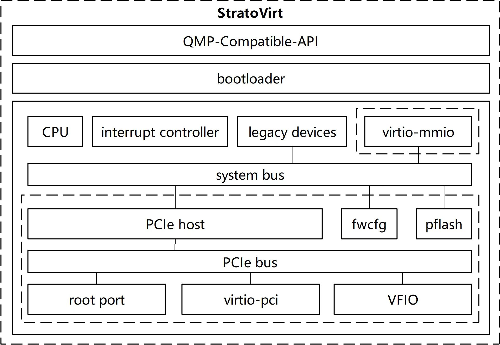

# StratoVirt 分析

## StratoVirt 架构

[设计文档](https://github.com/openeuler-mirror/stratovirt/blob/master/docs/design.md)

StratoVirt核心架构自顶向下分为以下
层。

1. OCI（Open Container Initiative，开放容器倡仪）兼容接口。兼容QMP（QEMU Monitor Protocol，QEMU监控协议）​，具有完备的OCI兼容能力。
2. 引导加载程序(BootLoader)。抛弃传统的BIOS+GRUB（GRand Unified Bootloader，多重操作系统启动管理器）启动模式，实现了更轻更快的BootLoader，并达到极限启动时延。
3. 轻量级虚拟机(MicroVM)。充分利用软硬件协同能力，精简化设备模型，低时延资源伸缩能力。

### 相关技术概念

#### QMP

qmp 协议的简介 --- QMP protocol

## StratoVirt 优缺点分析

* 优势是什么？来自于哪里？

项目描述中提到：`Supports a maximum of 254 CPUs;`。

## 设计与实现

整个系统可以划分为 CPU 子系统、内存子系统、设备子系统，代码中主要分为四个部分：

- address_space 地址空间模拟，实现地址堆叠等复杂地址管理模式
- boot_loader 内核引导程序
- device_model 仿真各类设备，可扩展、可组合
- machine_manager 提供虚拟机管理接口，兼容QMP等常用协议，可扩展

### CPU 模型

**与传统模型的不同**：

在x86的硬件辅助虚拟化下，敏感指令（如I/O指令）会强制将CPU退出到**根模式**下交给Hypervisor程序（内核态KVM模块/用户态StratoVirt）去处理，处理完再重新返回到非根模式，执行下一条虚拟机的指令。

StratoVirt为每个vCPU创建了一个独立的线程，用来**处理退出到根模式的事件，包括I/O的下发、系统关机事件、系统异常事件**等，这些事件的处理以及KVM对vCPU接口的run函数独占一个单独线程，用户可以自己通过对vCPU线程进行绑核等方式让虚拟机的vCPU获取物理机CPU近似百分之百的性能。

StratoVirt的CPU模型较为精简，**许多CPU特性以及硬件信息都将直接透传到虚拟机中**，之后将在现有架构的基础上实现更多的高级CPU特性。

> 疑问：为什么此处不用进入到KVM来处理呢？敏感指令应当是内核态才能处理才对？或者说，它实质上还是借助KVM进行的处理?如果是借助KVM来处理，那么它的性能提升来自哪里呢？绑定核心的话，qemu也可以进行绑定的吧？

**vCPU的生命周期设计**

1. 主要负责模拟 vCPU，创建独立的线程，处理独立到Root模式的事件。
2. 管理vCPU的生命周期，包括创建、使能、运行、暂停、恢复和销毁。

状态流转:
Running -> Stoppig -> Stopped

### 内存模型设计

内存区域：
1. RAM
2. I/O
3. Container

地址空间、内存区域、平坦地址空间、平坦视图。

平坦内存地址空间以不同优先级属性和不同大小的树状拓扑进行组织。
平坦视图则包含多个平坦地址空间的线性视图。

设计中采用树状结构和平坦视图结合的方案。

平坦视图的内存信息需要与KVM 进行同步，以借助硬件辅助虚拟化加速内存访问的性能。

作为Linux上的用户态进程，使用 mmap 来分配虚拟机的内存资源，支持匿名映射与文件映射两两种方式，并且基于文件映射实现了大页特性。

### IO 子系统

此时，Statovirt 实现了保存数据的磁盘，通信的网卡，登录系统的串口设备，以完全设备虚拟化（串口设备）和半虚拟化模拟（磁盘、网卡）的方式虚拟出各个I/O设备。

virt-io 协议是I/O虚拟化中常用的一种协议，本质上是无锁的前后端数据共享方案，具备高效的前后端数据传递性能。
StratoVirt基于MMIO协议，实现了 virtio-block设备，较标准的PCI协议，启动更快、更轻量。

把所有的设备都挂载在虚拟MMIO总线上。
