# 框架设计

针对后续 不同类型的资源，进行 Policy 框架设计，例如cpu、memory、disk、network等。
例如：需要支持对于不同资源的 Affinity 的综合比较与调度。

`runtimeHook` 总体结构：
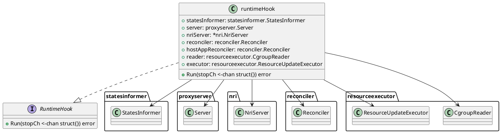

## proxyserver 

`proxyserver` 是与前端 runtime Proxy 对接的服务，主要负责处理来自 runtime Proxy 的请求，并将其转发给 nriServer/proxy。

* `Server` 接口：定义了服务器的基本操作，包括设置、启动、停止和注册。
* `server` 结构体：实现了 Server 接口，包含了 gRPC 服务器的监听器、服务器实例、配置选项以及未实现的运行时钩子服务服务器接口。
* `Options` 结构体：包含了服务器的配置选项，如网络类型、地址、主机端点、失败策略、插件失败策略、配置文件路径、禁用阶段、资源更新执行器和事件记录器。
* `config.FailurePolicyType`：定义了失败策略的类型。
* `runtimeapi.RuntimeHookServiceServer`：定义了运行时钩子服务的服务器接口。

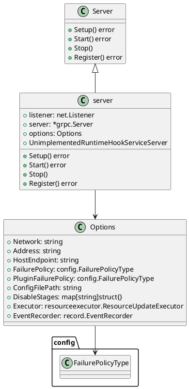

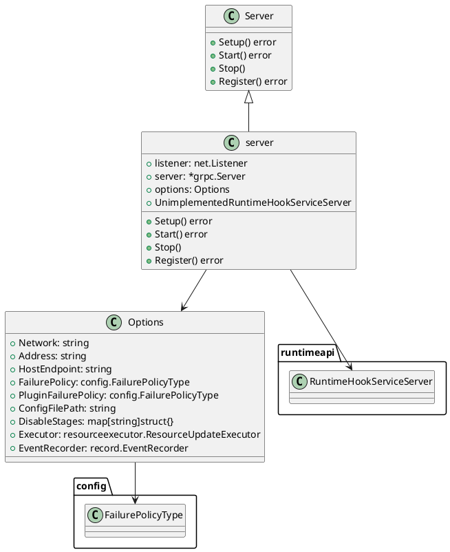


## Hook 与 Rule

`Hook` 结构：

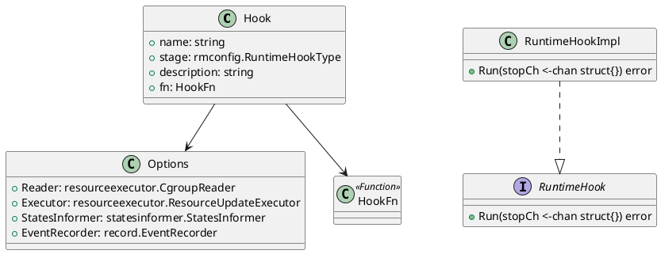

`Register` 流程：

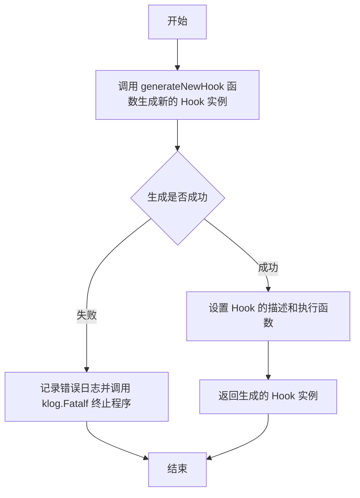

Hook `config` 有关配置：

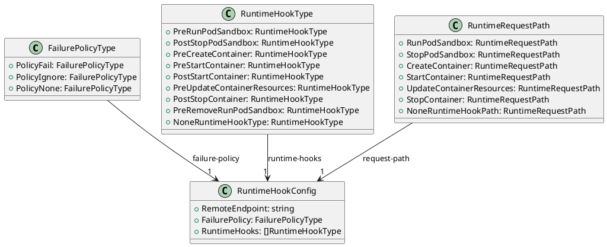

* `FailurePolicyType` 枚举定义了运行时钩子的失败策略，包括 PolicyFail、PolicyIgnore 和 PolicyNone。
* `RuntimeHookType` 枚举定义了不同类型的运行时钩子，如 PreRunPodSandbox、PostStopPodSandbox 等。
* `RuntimeHookConfig` 结构体定义了运行时钩子的配置，包括远程端点、失败策略和运行时钩子类型列表。
* `RuntimeRequestPath` 枚举定义了不同类型的运行时请求路径，如 RunPodSandbox、StopPodSandbox 等。


以 cpusetPlugin 为例，展示 cpusetPlugin 的结构：
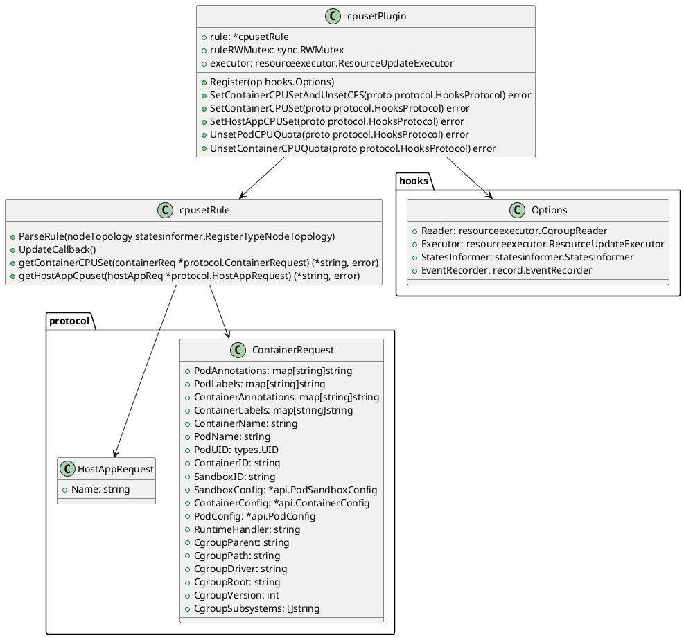

`cpusetPlugin` 是核心插件类，负责管理容器的 CPU 集合（CPUSet）分配。
* `rule` 字段是一个指向 `cpusetRule` 的指针，用于存储和应用 CPUSet 分配规则。
* `ruleRWMutex` 是一个读写锁，用于在多线程环境下安全地访问和修改 rule。
* `executor` 是一个资源更新执行器，用于执行实际的资源更新操作。
提供了多个方法，如 `Register`、`SetContainerCPUSetAndUnsetCFS`、`SetContainerCPUSet`、`SetHostAppCPUSet`、`UnsetPodCPUQuota` 和 `UnsetContainerCPUQuota`，用于处理不同的运行时钩子事件。

---

在 cpusetPlugin 中，`Rule`（即 cpusetRule）扮演着关键的角色：

* 规则定义: Rule 定义了如何根据 Pod 或主机应用的属性来分配 CPUSet。这包括解析节点拓扑结构、考虑 Pod 的 QoS 级别、以及其他可能的因素。

* 规则应用: 通过 `getContainerCPUSet` 和 `getHostAppCpuset` 方法，Rule 根据传入的请求计算并返回合适的 CPUSet。这使得 cpusetPlugin 能够根据预定义的规则动态地为容器和主机应用分配 CPU 资源。

* 动态更新: Rule 可能支持动态更新，例如在节点拓扑结构发生变化时。通过 UpdateCallback 等机制，Rule 可以确保分配规则始终与当前系统状态保持一致。


Rule 同样具备一套可扩展的框架：

存储：Rule 结构体的实例通过一个全局变量 globalHookRules 进行保存。globalHookRules 是一个映射（map），其键为规则的名称（string），值为指向 Rule 结构体的指针（*Rule）。

```go
var globalHookRules map[string]*Rule
var globalRWMutex sync.RWMutex
```
注册：通过 `Register` 函数，新的 Rule 可以被注册到 globalHookRules 中。

更新：通过 `UpdateRules` 函数实现。该函数接受规则类型、规则对象以及一个 CallbackTarget 作为参数，并遍历 globalHookRules 映射中的所有规则，根据规则类型和系统支持情况进行更新。

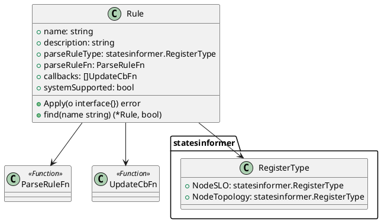

### 更新 CPUSet

```go
func (p *cpusetPlugin) SetContainerCPUSet(proto protocol.HooksProtocol) error {
    // 1. 将 proto 转换为 *protocol.ContainerContext 类型
    containerCtx, _ := proto.(*protocol.ContainerContext)
    if containerCtx == nil {
        return fmt.Errorf("container protocol is nil for plugin %v", name)
    }

    // 2. 从容器的 Pod 注解中获取 CPUSet
    if cpusetVal, err := util.GetCPUSetFromPod(containerCtx.Request.PodAnnotations); err != nil {
        return err
    } else if cpusetVal != "" {
        containerCtx.Response.Resources.CPUSet = pointer.String(cpusetVal)
        klog.V(5).Infof("get cpuset %v for container %v/%v from pod annotation", cpusetVal,
            containerCtx.Request.PodMeta.String(), containerCtx.Request.ContainerMeta.Name)
        return nil
    }

    // 3. 获取并应用规则
    r := p.getRule()
    if r == nil {
        klog.V(5).Infof("hook plugin rule is nil, nothing to do for plugin %v", name)
        return nil
    }
    cpusetValue, err := r.getContainerCPUSet(&containerReq)
    if err != nil {
        return err
    }
    if cpusetValue != nil {
        klog.V(5).Infof("get cpuset %v for container %v/%v from rule", *cpusetValue,
            containerCtx.Request.PodMeta.String(), containerCtx.Request.ContainerMeta.Name)
        containerCtx.Response.Resources.CPUSet = cpusetValue
        return nil
    }

    // 4. 设置默认的 CPUSet
    // 具体的默认设置逻辑可能涉及到其他方法或配置

    // 5. 返回结果
    return nil
}
```

## protocol 协议

protocol 包中，定义了一些与容器运行时钩子协议相关的结构体和方法。这些结构体和方法共同构成了容器运行时Hook协议的实现。其中不仅包括k8s集群中的资源控制，还有一些与宿主机应用相关的资源控制。

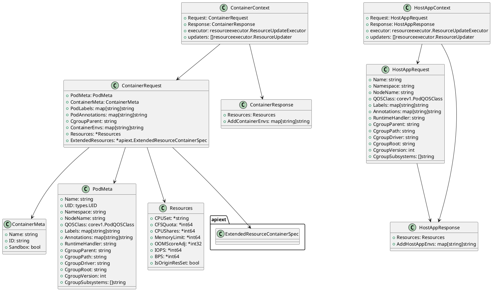

## resourceexecutor

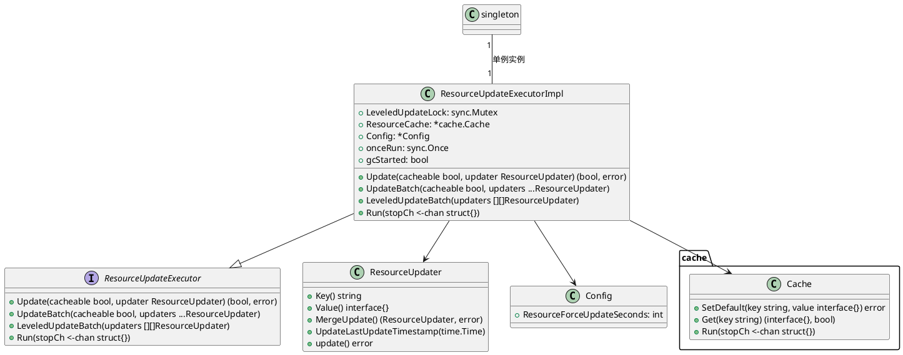

对象设计结构：
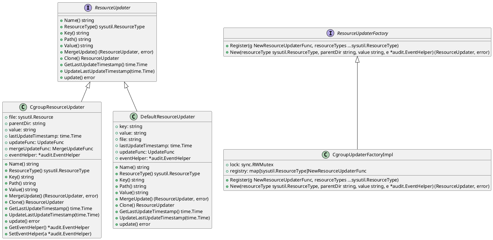

## Reconciler

`reconciler` 主要包含了资源协调器的实现，用于协调不同级别的资源更新。

* `ReconcilerLevel`：定义了资源协调器的级别枚举，包括 KubeQOSLevel、PodLevel、ContainerLevel、SandboxLevel 和 AllPodsLevel。
* `globalCgroupReconcilers`：定义了全局的 cgroup 协调器结构体，包含了不同级别（如 kubeQOSLevel、podLevel 等）的 cgroup 协调器映射。

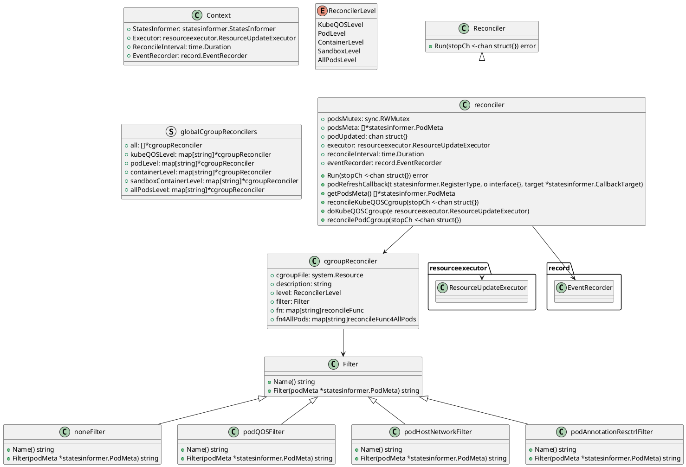

具体来说，它是如何进行资源协调的呢？
`reconcilePodCgroup` 方法协调 Pod 的 cgroup 设置，它会监听 podUpdated 通道，当有 Pod 更新时，它会获取所有 Pod 的元数据，并根据注册的 cgroup 协调器来更新相应的 cgroup 设置。以他为例：

1. 循环监听
```go
for {
    select {
    case <-c.podUpdated:
        // 处理 Pod 更新事件
    case <-stopCh:
        // 停止协调
        return
    }
}
```

```go
podsMeta := c.getPodsMeta()
for _, podMeta := range podsMeta {
    // 处理每个 Pod 的元数据
}

```
