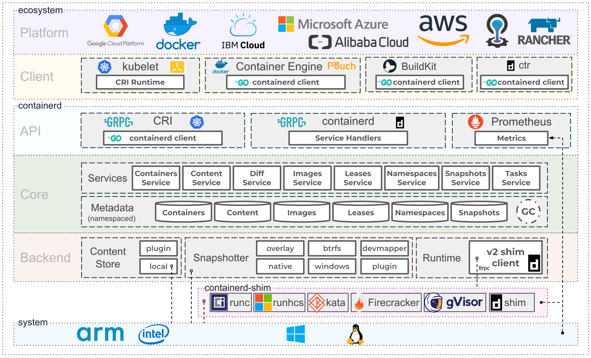

# Pod 生命周期-卸载Pod与容器

> kubernetes v1.24.17, containerd v1.6.21, runc v1.1.7

## kubectl 删除流程


---

关于隐藏的日志，kubelet 中可能可以增加到 --v=10 来查看，
```go
func (r *remoteRuntimeService) StopPodSandbox(podSandBoxID string) (err error) {
    klog.V(10).InfoS("[RemoteRuntimeService] StopPodSandbox", "podSandboxID", podSandBoxID, "timeout", r.timeout)

    ...

    klog.V(10).InfoS("[RemoteRuntimeService] StopPodSandbox Response", "podSandboxID", podSandBoxID)
}
```

链路上的其余日志的等级不超过 --v=4。containerd 和 runc 可以尽量尝试开启 debug 日志。

cgroup 的内部状态在systemd中进行管理，需要进一步挖掘内核的处理逻辑。

## kubelet 删除流程

```text
┌────────────────────────────┐
│        用户层               │
│  kubectl delete pod …      │
└────────────┬───────────────┘
             │
┌────────────▼───────────────┐
│        kubelet 进程         │
│  ┌────────────────────────┐ │
│  │ syncLoop               │ │
│  │ ├─ 收到 REMOVE         │ │
│  │ └─ 触发 podWorkers     │ │
│  └──────────┬─────────────┘ │
│             │               │
│  ┌──────────▼─────────────┐ │
│  │ podWorkers             │ │
│  │ ├─ Terminating 状态机  │ │
│  │ └─ killPod            │ │
│  └──────────┬─────────────┘ │
│             │ CRI gRPC      │
│  ┌──────────▼─────────────┐ │
│  │ containerd CRI 层       │ │
│  │ (kubelet 内部调用)      │ │
│  │ ├─ StopPodSandbox      │ │
│  │ │  ├─ 停所有容器       │ │
│  │ │  └─ 拆网络           │ │
│  │ └─ RemovePodSandbox    │ │
│  │    ├─ 清沙箱/容器      │ │
│  │    └─ 触发 GC          │ │
│  └──────────┬─────────────┘ │
└────────────┬───────────────┘
             │ containerd-shim
┌────────────▼───────────────┐
│        runc 进程            │
│ 1. runc delete --force      │
│ 2. libcontainer destroy     │
│    ├─ kill 全部进程         │
│    ├─ 清 rootfs             │
│    └─ 调用 cgroup 清理      │
└────────────┬───────────────┘
             │  D-Bus
┌────────────▼───────────────┐
│      systemd 进程           │
│ 通过 D-Bus StopUnit         │
│  ├─ SIGTERM → SIGKILL       │
│  └─ 删除 cgroup 目录        │
└────────────────────────────┘
```

### 1. 用户删除 Pod（kubectl delete pod …）
- apiserver 把 DeletionTimestamp 写进 Pod 对象。  
- kubelet 的 syncLoop 收到 `REMOVE` 事件，调用 `HandlePodRemoves`。

---

### 2. kubelet：把“停止指令”塞进队列
- `deletePod` → `podWorkers.UpdatePod(SyncPodKill)`  
- 生成 `TerminatingPodWork` 任务，启动/复用专属于该 Pod 的 goroutine（pod worker）。  
- 该 worker 立即调用 `syncTerminatingPod`：

  1. 生成最后一次 API status（Running → Terminating）。  
  2. `probeManager.StopLivenessAndStartup` 停止探针。  
  3. `killPod` 发 SIGTERM → 等 gracePeriod → 必要时 SIGKILL。  
  4. 成功后把状态改成 Terminated，并向 apiserver 上报。

---

### 3. kubelet → CRI（containerd）：只“停止”不“删除”
- `killPod` 内调用 CRI `StopPodSandbox`（仅 stop）。  
- 返回后 kubelet 立即认为「Pod 已终止」，但**容器和沙箱目录仍留在磁盘**。

---

### 4. CRI（containerd）：把「停」与「拆」做完
收到 `StopPodSandbox` 后：

1. 遍历所有容器 → 对每个容器 `StopContainer` → SIGTERM → 等待 → SIGKILL。  
2. `stopSandboxContainer` → 向 containerd task 发送 `Kill(SIGKILL)`。  
3. `teardownPodNetwork` → CNI Del → 拆网络、删 NetNS。  
4. 清理 sandbox 文件（/var/lib/…/pods/…/sandboxes/…）。

---

### 5. kubelet 内部：真正「删除」延后到 GC
- kubelet 定时触发 `GarbageCollect`；  
- `evictSandboxes` 检查 `ShouldPodRuntimeBeRemoved` → true 时调用 `removeSandbox`；  
- `removeSandbox` 再调用 CRI `RemovePodSandbox`，这回才一次性把：
  - sandbox 容器（pause）
  - 所有业务容器
  - snapshot
  - rootfs 目录
  全部删掉。

---

### 6. containerd → runc：最后的 kill/delete
`RemovePodSandbox` 走到 containerd-shim-v2 → runc：

```bash
runc delete --force <sandbox-id>
```

- runc 进入 libcontainer：  
  1. Signal(SIGKILL) 所有进程  
  2. 等 cgroup.procs 为空  
  3. 调用 destroy → 清理 rootfs、Intel RDT、cgroup 目录

---

### 7. runc → systemd：通过 D-Bus 打扫 cgroup 现场（systemd 作为驱动场景）
- runc 的 `legacyManager.Destroy()`：  
  - 通过 D-Bus 调用 `org.freedesktop.systemd1.Manager.StopUnit`  
  - systemd 收到后：
    - 发 SIGTERM → 等 90 s → SIGKILL → 进程全灭  
    - 删除 `/sys/fs/cgroup/systemd/…/xxx.scope` 等目录  
- 如果 StopUnit 失败，runc 会 `resetFailedUnit` 再试；  
  systemd 定期也会 `cleanup_abandoned_cgroups` 兜底。

**从 kubelet 的“状态机”开始，经过 containerd 的“停-删分离”策略，再到 runc 的强制删除，最终由 systemd 把 cgroup 彻底打扫干净，一条链路上层只管发号施令，下层负责真刀真枪地清理资源。**

## Kubelet 发起卸载Pod请求

Pod 的卸载请求由kubelet发起，而对Pod状态的更新/删除操作从入口 syncLoop()统一处理：

```go
kl.syncLoop(updates, kl)
```

```go
func (kl *Kubelet) syncLoop(updates <-chan kubetypes.PodUpdate, handler SyncHandler) {}

--> func (kl *Kubelet) syncLoopIteration(configCh <-chan kubetypes.PodUpdate, handler SyncHandler, syncCh <-chan time.Time, housekeepingCh <-chan time.Time, plegCh <-chan *pleg.PodLifecycleEvent) bool {
    ...

    switch u.Op {
		case kubetypes.ADD:
			klog.V(2).InfoS("SyncLoop ADD", "source", u.Source, "pods", klog.KObjs(u.Pods))
			// After restarting, kubelet will get all existing pods through
			// ADD as if they are new pods. These pods will then go through the
			// admission process and *may* be rejected. This can be resolved
			// once we have checkpointing.
			handler.HandlePodAdditions(u.Pods)
		case kubetypes.UPDATE:
			klog.V(2).InfoS("SyncLoop UPDATE", "source", u.Source, "pods", klog.KObjs(u.Pods))
			handler.HandlePodUpdates(u.Pods)
		case kubetypes.REMOVE:
			klog.V(2).InfoS("SyncLoop REMOVE", "source", u.Source, "pods", klog.KObjs(u.Pods))
			handler.HandlePodRemoves(u.Pods)
		case kubetypes.RECONCILE:
			klog.V(4).InfoS("SyncLoop RECONCILE", "source", u.Source, "pods", klog.KObjs(u.Pods))
			handler.HandlePodReconcile(u.Pods)
		case kubetypes.DELETE:
			klog.V(2).InfoS("SyncLoop DELETE", "source", u.Source, "pods", klog.KObjs(u.Pods))
			// DELETE is treated as a UPDATE because of graceful deletion.
			handler.HandlePodUpdates(u.Pods)
		case kubetypes.SET:
			// TODO: Do we want to support this?
			klog.ErrorS(nil, "Kubelet does not support snapshot update")
		default:
			klog.ErrorS(nil, "Invalid operation type received", "operation", u.Op)
		}
    
    ...
}

--> func (kl *Kubelet) HandlePodRemoves(pods []*v1.Pod) {
	start := kl.clock.Now()
	for _, pod := range pods {
		kl.podManager.DeletePod(pod)   // 删除Pod的索引
		if kubetypes.IsMirrorPod(pod) {   // 处理static Pod的删除
			kl.handleMirrorPod(pod, start)
			continue
		}
		// Deletion is allowed to fail because the periodic cleanup routine
		// will trigger deletion again.
		if err := kl.deletePod(pod); err != nil {
			klog.V(2).InfoS("Failed to delete pod", "pod", klog.KObj(pod), "err", err)
		}
	}
}

--> func (kl *Kubelet) deletePod(pod *v1.Pod) error {
	if pod == nil {
		return fmt.Errorf("deletePod does not allow nil pod")
	}
	if !kl.sourcesReady.AllReady() {
		// If the sources aren't ready, skip deletion, as we may accidentally delete pods
		// for sources that haven't reported yet.
		return fmt.Errorf("skipping delete because sources aren't ready yet")
	}
	klog.V(3).InfoS("Pod has been deleted and must be killed", "pod", klog.KObj(pod), "podUID", pod.UID)
	kl.podWorkers.UpdatePod(UpdatePodOptions{
		Pod:        pod,
		UpdateType: kubetypes.SyncPodKill,
	})
    
    // volume 等不会在此处删除，而是转移到周期性清理routine
	// We leave the volume/directory cleanup to the periodic cleanup routine.
	return nil
}

// UpdatePod 是一个状态机的核心控制器，
// 1. 接收各种 pod 更新事件（创建、更新、删除、驱逐等）
// 2. 维护 pod 状态转换（运行 → 终止中 → 已终止）
// 3. 管理 worker goroutine 生命周期
// 4. 处理并发和优先级（取消、重试、排队）
// 5. 确保静态 pod 的顺序启动
// 6. 计算优雅终止期间
--> func (p *podWorkers) UpdatePod(options UpdatePodOptions) {
    // 1. 输入参数处理和验证
    // 处理运行时 pod（orphan pod）的特殊情况
    if options.RunningPod != nil {
        if options.Pod == nil {
            pod = options.RunningPod.ToAPIPod()
            if options.UpdateType != kubetypes.SyncPodKill {
                klog.InfoS("Pod update is ignored, runtime pods can only be killed")
                return
            }
            isRuntimePod = true
        }
    }
    // 2. Pod同步状态初始化
    status, ok := p.podSyncStatuses[uid]
    if !ok {
        klog.V(4).InfoS("Pod is being synced for the first time")
        // 为新 pod 创建同步状态跟踪
        status = &podSyncStatus{
            syncedAt: now,
            fullname: kubecontainer.GetPodFullName(pod),
        }
        // 检查是否为终端状态（Failed/Succeeded）的 pod
        if !isRuntimePod && (pod.Status.Phase == v1.PodFailed || pod.Status.Phase == v1.PodSucceeded) {
            // 如果 pod 已终端且容器已停止，直接标记为已终止 Terminated
            if statusCache, err := p.podCache.Get(pod.UID); err == nil {
                if isPodStatusCacheTerminal(statusCache) {
                    status = &podSyncStatus{
                        terminatedAt:       now,
                        terminatingAt:      now,
                        // ...
                    }
                }
            }
        }
        p.podSyncStatuses[uid] = status
    }
    // 3. 处理重启请求
    if status.IsTerminationRequested() { // 处理同一 UID 的 pod 重启请求
        if options.UpdateType == kubetypes.SyncPodCreate {
            status.restartRequested = true
            klog.V(4).InfoS("Pod is terminating but has been requested to restart with same UID")
            return
        }
    }

    // 4. 检查Pod是否已经完成
    // 防止对已完成的 pod 进行进一步处理，确保 pod 生命周期的单向性
    if status.IsFinished() {
        klog.V(4).InfoS("Pod is finished processing, no further updates")
        return
    }

    // 5. 判断是否转入Terminating 状态
    // 检测触发 pod 终止的各种条件：
    // * 孤儿 pod
    // * 设置了删除时间戳
    // * pod 状态为 Failed 或 Succeeded
    // * 收到 Kill 请求（包括驱逐）
    var becameTerminating bool
    if !status.IsTerminationRequested() {
        switch {
        case isRuntimePod:
            status.deleted = true
            status.terminatingAt = now
            becameTerminating = true
        case pod.DeletionTimestamp != nil:
            status.deleted = true
            status.terminatingAt = now
            becameTerminating = true
        case pod.Status.Phase == v1.PodFailed, pod.Status.Phase == v1.PodSucceeded:
            status.terminatingAt = now
            becameTerminating = true
        case options.UpdateType == kubetypes.SyncPodKill:
            if options.KillPodOptions != nil && options.KillPodOptions.Evict {
                status.evicted = true
            }
            status.terminatingAt = now
            becameTerminating = true
        }
    }

    // 6. 确定podWorkType 和 Option
    // 根据 pod 状态确定工作类型：
    // * SyncPodWork：正常同步
    // * TerminatingPodWork：正在终止
    // * TerminatedPodWork：已终止
    var workType PodWorkType
    switch {
    case status.IsTerminated():
        workType = TerminatedPodWork
        // 关闭完成通道
        if options.KillPodOptions != nil {
            if ch := options.KillPodOptions.CompletedCh; ch != nil {
                close(ch)
            }
        }

    case status.IsTerminationRequested():
        workType = TerminatingPodWork
        // 计算有效的优雅终止时间
        gracePeriod, gracePeriodShortened := calculateEffectiveGracePeriod(status, pod, options.KillPodOptions)
        status.gracePeriod = gracePeriod

    default:
        workType = SyncPodWork
    }
    // 7. 启动或管理 Pod Worker Goroutine
    podUpdates, exists := p.podUpdates[uid]  // 为每个 pod 创建专用的工作通道
    if !exists {
        // 创建带缓冲的通道
        podUpdates = make(chan podWork, 1)
        p.podUpdates[uid] = podUpdates

        // 确保静态 pod 按接收顺序启动
        if kubetypes.IsStaticPod(pod) {
            p.waitingToStartStaticPodsByFullname[status.fullname] =
                append(p.waitingToStartStaticPodsByFullname[status.fullname], uid)
        }

        // 启动新的 pod worker goroutine
        go func() {
            defer runtime.HandleCrash()
            p.managePodLoop(outCh)
        }()
    }
    // 8. 分发工作请求
    // 如果 worker 空闲，直接分发工作
    if !status.IsWorking() {
        status.working = true
        podUpdates <- work
        return
    }

    // 如果 worker 忙碌，更新待处理的工作
    p.lastUndeliveredWorkUpdate[pod.UID] = work

    // 如果需要立即中断当前工作
    if (becameTerminating || wasGracePeriodShortened) && status.cancelFn != nil {
        klog.V(3).InfoS("Cancelling current pod sync")
        status.cancelFn()
        return
    }
}
```

* `podSyncStatuses`：跟踪每个 pod 的同步状态
* `podUpdates`：每个 pod 的工作通道
* `lastUndeliveredWorkUpdate`：缓存待处理的工作

PodWorder中完整的处理流程：

```text
UpdatePod (TerminatingPodWork)
    ↓
managePodLoop 接收工作
    ↓
acknowledgeTerminating()
    ├── 设置 startedTerminating = true
    └── 返回状态更新函数
    ↓
syncTerminatingPod()
    ├── 更新 pod 状态到 API server
    ├── 停止存活性和启动探针
    ├── killPod() - 终止所有容器
    │   ├── 发送 SIGTERM
    │   ├── 等待优雅终止期间
    │   └── 必要时发送 SIGKILL
    └── 执行状态回调函数
    ↓
根据 pod 类型分支：
├── 运行时 pod → completeTerminatingRuntimePod()
│   ├── 标记 finished = true
│   ├── 清理静态 pod 跟踪
│   └── 清理通道，退出 worker
└── 普通 pod → completeTerminating()
    ├── 设置 terminatedAt 时间
    ├── 关闭等待通道
    ├── 清理状态回调
    └── 排队 TerminatedPodWork
```

进入 `podWorkers.managerPodLoop(podUpdates <-chan PodWork)` 当中：

```go
managePodLoop(podUpdates <-chan podWork) {
    for update := range podUpdates {
        // ...
        switch {
        case update.WorkType == TerminatedPodWork:
            err = p.syncTerminatedPodFn(ctx, pod, status)

        case update.WorkType == TerminatingPodWork:
            var gracePeriod *int64
            if opt := update.Options.KillPodOptions; opt != nil {
                gracePeriod = opt.PodTerminationGracePeriodSecondsOverride
            }
            podStatusFn := p.acknowledgeTerminating(pod)

            err = p.syncTerminatingPodFn(ctx, pod, status, update.Options.RunningPod, gracePeriod, podStatusFn)

        default:
            isTerminal, err = p.syncPodFn(ctx, update.Options.UpdateType, pod, update.Options.MirrorPod, status)
        }
    }
}

--> acknowledgeTerminating(pod *v1.Pod) PodStatusFunc {
    // 设置 startedTerminating = true，标记 pod worker 已观察到终止请求
    
    // 返回状态更新函数（如果有的话）
    
    // 这确保其他组件知道不会再启动新容器

}
// 对应于 syncTerminatingPodFn 字段中赋值的 kubelet.syncTerminatingPod 方法
// 核心的删除处理逻辑
--> func (p *podWorkers) syncTerminatingPod(ctx context.Context, pod *v1.Pod, status *podSyncStatus, runningPod *kubecontainer.Pod, gracePeriod *int64, podStatusFn PodStatusFunc) error {
    ...
    // 生成最新的 pod 状态
    apiPodStatus := kl.generateAPIPodStatus(pod, podStatus)
    kl.statusManager.SetPodStatus(pod, apiPodStatus)
 
    // 停止健康检查,liveness 和 startup probe
    kl.probeManager.StopLivenessAndStartup(pod)

    // killPod 会发送 SIGTERM 并等待优雅终止期间
    p := kubecontainer.ConvertPodStatusToRunningPod(kl.getRuntime().Type(), podStatus)
	if err := kl.killPod(pod, p, gracePeriod); err != nil {
        // 记录错误事件
		kl.recorder.Eventf(pod, v1.EventTypeWarning, events.FailedToKillPod, "error killing pod: %v", err)
		// there was an error killing the pod, so we return that error directly
		utilruntime.HandleError(err)
		return err
	}
    ...
}
```

正式开始 **KillPod**的处理：

```go
func (kl *Kubelet) killPod(pod *v1.Pod, p kubecontainer.Pod, gracePeriodOverride *int64) error {
    // Call the container runtime KillPod method which stops all known running containers of the pod
    if err := kl.containerRuntime.KillPod(pod, p, gracePeriodOverride); err != nil {
        return err
    }
    if err := kl.containerManager.UpdateQOSCgroups(); err != nil {
        klog.V(2).InfoS("Failed to update QoS cgroups while killing pod", "err", err)
    }
    return nil
}
```

---

我们使用 cotainerd 作为runtime，那么调用到 `kubeGenericRuntimeManager.KillPod()` 方法，采用 **停止-删除分离** 的设计。

```go
func (m *kubeGenericRuntimeManager) KillPod(pod *v1.Pod, runningPod kubecontainer.Pod, gracePeriodOverride *int64) error {
	err := m.killPodWithSyncResult(pod, runningPod, gracePeriodOverride)
	return err.Error()
}
```

首先，kill所有Pod中包括的container。

```go
func (m *kubeGenericRuntimeManager) killPodWithSyncResult(pod *v1.Pod, runningPod kubecontainer.Pod, gracePeriodOverride *int64) (result kubecontainer.PodSyncResult) {
    // 阶段一：杀死容器
	killContainerResults := m.killContainersWithSyncResult(pod, runningPod, gracePeriodOverride)
	for _, containerResult := range killContainerResults {
		result.AddSyncResult(containerResult)
	}
    // 阶段二：停止沙箱
	// stop sandbox, the sandbox will be removed in GarbageCollect
	killSandboxResult := kubecontainer.NewSyncResult(kubecontainer.KillPodSandbox, runningPod.ID)
	result.AddSyncResult(killSandboxResult)
	// Stop all sandboxes belongs to same pod
	for _, podSandbox := range runningPod.Sandboxes {
        // 只是停止，而非删除
		if err := m.runtimeService.StopPodSandbox(podSandbox.ID.ID); err != nil && !crierror.IsNotFound(err) {
			killSandboxResult.Fail(kubecontainer.ErrKillPodSandbox, err.Error())
			klog.ErrorS(nil, "Failed to stop sandbox", "podSandboxID", podSandbox.ID)
		}
	}

	return
}
```

注意注释：**"the sandbox will be removed in GarbageCollect"** - 沙箱将在垃圾回收中被删除。

**删除操作由垃圾回收器负责**

### GarbageCollect 入口
````go path=pkg/kubelet/kuberuntime/kuberuntime_manager.go mode=EXCERPT
func (m *kubeGenericRuntimeManager) GarbageCollect(gcPolicy kubecontainer.GCPolicy, allSourcesReady bool, evictNonDeletedPods bool) error {
	return m.containerGC.GarbageCollect(gcPolicy, allSourcesReady, evictNonDeletedPods)
}
````

### 垃圾回收器的删除逻辑
````go path=pkg/kubelet/kuberuntime/kuberuntime_gc.go mode=EXCERPT
func (cgc *containerGC) GarbageCollect(gcPolicy kubecontainer.GCPolicy, allSourcesReady bool, evictNonDeletedPods bool) error {
	errors := []error{}
	// 删除可驱逐的容器
	if err := cgc.evictContainers(gcPolicy, allSourcesReady, evictNonDeletedPods); err != nil {
		errors = append(errors, err)
	}

	// 删除零容器的沙箱
	if err := cgc.evictSandboxes(evictNonDeletedPods); err != nil {
		errors = append(errors, err)
	}

	// 删除 pod 沙箱日志目录
	if err := cgc.evictPodLogsDirectories(allSourcesReady); err != nil {
		errors = append(errors, err)
	}
	return utilerrors.NewAggregate(errors)
}
````

### 沙箱删除的具体实现

#### evictSandboxes 方法
````go path=pkg/kubelet/kuberuntime/kuberuntime_gc.go mode=EXCERPT
func (cgc *containerGC) evictSandboxes(evictNonDeletedPods bool) error {
    ...
    for podUID, sandboxes := range sandboxesByPod {
        if cgc.podStateProvider.ShouldPodContentBeRemoved(podUID) || (evictNonDeletedPods && cgc.podStateProvider.ShouldPodRuntimeBeRemoved(podUID)) {
            // 如果 pod 已被删除，删除所有可驱逐的沙箱
            // 注意：如果已经有活跃的沙箱，最新的死沙箱也会被删除
            cgc.removeOldestNSandboxes(sandboxes, len(sandboxes))
        } else {
            // 如果 pod 仍然存在，保留最新的一个
            cgc.removeOldestNSandboxes(sandboxes, len(sandboxes)-1)
        }
    }
    ...
}
````

#### removeSandbox 方法
从 `removeOldestNSandboxes()` 中进入到 removeSandbox下统一删除：

````go path=pkg/kubelet/kuberuntime/kuberuntime_gc.go mode=EXCERPT
func (cgc *containerGC) removeSandbox(sandboxID string) {
	klog.V(4).InfoS("Removing sandbox", "sandboxID", sandboxID)
	// 正常情况下，kubelet 应该在 GC 启动前已经调用了 StopPodSandbox
	// 为了防止极少数情况下这不成立，在删除前尝试停止沙箱
	if err := cgc.client.StopPodSandbox(sandboxID); err != nil {
		klog.ErrorS(err, "Failed to stop sandbox before removing", "sandboxID", sandboxID)
		return
	}
	if err := cgc.client.RemovePodSandbox(sandboxID); err != nil {
		klog.ErrorS(err, "Failed to remove sandbox", "sandboxID", sandboxID)
	}
}
````

### 删除条件判断

#### podStateProvider 接口
````go path=pkg/kubelet/kuberuntime/kuberuntime_manager.go mode=EXCERPT
type podStateProvider interface {
	IsPodTerminationRequested(kubetypes.UID) bool
	ShouldPodContentBeRemoved(kubetypes.UID) bool
	ShouldPodRuntimeBeRemoved(kubetypes.UID) bool
}
````

#### 删除条件实现
````go path=pkg/kubelet/pod_workers.go mode=EXCERPT
func (p *podWorkers) ShouldPodRuntimeBeRemoved(uid types.UID) bool {
	p.podLock.Lock()
	defer p.podLock.Unlock()
	if status, ok := p.podSyncStatuses[uid]; ok {
		return status.IsTerminated()
	}
	// 尚未发送到 pod worker 的 pod 在同步所有内容后应该没有运行时组件
	return p.podsSynced
}

func (p *podWorkers) ShouldPodContentBeRemoved(uid types.UID) bool {
	p.podLock.Lock()
	defer p.podLock.Unlock()
	if status, ok := p.podSyncStatuses[uid]; ok {
		return status.IsEvicted() || (status.IsDeleted() && status.IsTerminated())
	}
	// 尚未发送到 pod worker 的 pod 在同步所有内容后应该没有磁盘内容
	return p.podsSynced
}
````

### 容器删除流程

#### killContainersWithSyncResult 中的容器处理
````go path=pkg/kubelet/kuberuntime/kuberuntime_container.go mode=EXCERPT
for _, container := range runningPod.Containers {
	go func(container *kubecontainer.Container) {
		defer utilruntime.HandleCrash()
		defer wg.Done()

		killContainerResult := kubecontainer.NewSyncResult(kubecontainer.KillContainer, container.Name)
		if err := m.killContainer(pod, container.ID, container.Name, "", reasonUnknown, gracePeriodOverride); err != nil {
			killContainerResult.Fail(kubecontainer.ErrKillContainer, err.Error())
			klog.ErrorS(err, "Kill container failed", "pod", klog.KRef(runningPod.Namespace, runningPod.Name), "podUID", runningPod.ID,
				"containerName", container.Name, "containerID", container.ID)
		}
	}(container)
}
````

### 完整的删除时序图

```
KillPod 调用
    ↓
killContainersWithSyncResult()
    ├── 并发杀死所有容器
    ├── 发送 SIGTERM
    ├── 等待优雅终止期间
    └── 必要时发送 SIGKILL
    ↓
StopPodSandbox()
    ├── 停止沙箱网络
    ├── 停止沙箱进程
    └── 标记沙箱为已停止状态
    ↓
[稍后] GarbageCollect() 定期执行
    ↓
evictSandboxes()
    ├── 检查 ShouldPodRuntimeBeRemoved()
    ├── 检查 ShouldPodContentBeRemoved()
    └── 决定是否删除沙箱
    ↓
removeSandbox()
    ├── 再次确保沙箱已停止
    ├── 调用 RemovePodSandbox()
    └── 从运行时彻底删除沙箱
```

## 7. 为什么采用分离设计？

### 1. 性能考虑
- **快速响应**：`KillPod` 只负责停止，可以快速返回
- **异步清理**：删除操作在后台异步进行，不阻塞主流程

### 2. 可靠性考虑
- **重试机制**：垃圾回收器可以重试失败的删除操作
- **状态一致性**：确保 pod 状态转换的原子性

### 3. 资源管理
- **批量处理**：垃圾回收器可以批量删除多个资源
- **策略控制**：可以根据不同策略决定何时删除

### 删除失败的处理

如果删除失败，垃圾回收器会：
1. 记录错误日志
2. 在下次 GC 周期重试
3. 不影响其他资源的清理

这种设计确保了 pod 终止的可靠性和系统的整体稳定性。

## CRI - Containerd 对 RemovePodSandbox 的处理

containerd 作为 Runtime 时，kubelet 通过 CRI Interface（gRPC协议） 与其对接，请求通过第三方库 criapi.client 直接发送。
kubelet借助 CRI 发送请求
```go
// RemovePodSandbox removes the sandbox. If there are any containers in the
// sandbox, they should be forcibly removed.
func (r *remoteRuntimeService) RemovePodSandbox(podSandBoxID string) (err error) {
	klog.V(10).InfoS("[RemoteRuntimeService] RemovePodSandbox", "podSandboxID", podSandBoxID, "timeout", r.timeout)
	ctx, cancel := getContextWithTimeout(r.timeout)
	defer cancel()
    
	if r.useV1API() {
        // 使用 v1 版本API
		_, err = r.runtimeClient.RemovePodSandbox(ctx, &runtimeapi.RemovePodSandboxRequest{
			PodSandboxId: podSandBoxID,
		})
	} else {
        // 使用 v1alpha2 版本API
		_, err = r.runtimeClientV1alpha2.RemovePodSandbox(ctx, &runtimeapiV1alpha2.RemovePodSandboxRequest{
			PodSandboxId: podSandBoxID,
		})
	}
	if err != nil {
		klog.ErrorS(err, "RemovePodSandbox from runtime service failed", "podSandboxID", podSandBoxID)
		return err
	}

	klog.V(10).InfoS("[RemoteRuntimeService] RemovePodSandbox Response", "podSandboxID", podSandBoxID)

	return nil
}
```

此后，containerd 接收到`RemovePodSandbox`的处理请求， `pkg/cri/server/instrumented_service.go` 中的`RemovePodSandbox`方法作为gRPC服务的入口点。

`func (in *instrumentedService) RemovePodSandbox` 
-> `func (c *criService) RemovePodSandbox(ctx context.Context, r *runtime.RemovePodSandboxRequest) (*runtime.RemovePodSandboxResponse, error)` 进行具体的 sandbox 移除操作。

```go pkg/cri/server/sandbox_remove.go
func (c *criService) RemovePodSandbox(ctx context.Context, r *runtime.RemovePodSandboxRequest) (*runtime.RemovePodSandboxResponse, error) {
    start := time.Now()
    // 1. 查询目标 PodSandbox 是否存在
    sandbox, err := c.sandboxStore.Get(r.GetPodSandboxId())
    if err != nil {
        if !errdefs.IsNotFound(err) {
            return nil, fmt.Errorf("an error occurred when try to find sandbox %q: %w",
                r.GetPodSandboxId(), err)
        }
        // Do not return error if the id doesn't exist.
        log.G(ctx).Tracef("RemovePodSandbox called for sandbox %q that does not exist",
            r.GetPodSandboxId())
        return &runtime.RemovePodSandboxResponse{}, nil
    }
    // Use the full sandbox id.
    id := sandbox.ID
    
    // 2. 强制停止sandbox
    logrus.Infof("Forcibly stopping sandbox %q", id)
    if err := c.stopPodSandbox(ctx, sandbox); err != nil {
        return nil, fmt.Errorf("failed to forcibly stop sandbox %q: %w", id, err)
    }
    
    // 3. 检查 Network Namespace 是否关闭
    ...
    // 4. 移除 sandbox 内的所有 container
    cntrs := c.containerStore.List()
    for _, cntr := range cntrs {
        if cntr.SandboxID != id {
            continue
        }
        _, err = c.RemoveContainer(ctx, &runtime.RemoveContainerRequest{ContainerId: cntr.ID})
    }
    
    // ... 其他清理操作
    // 5. 清理sandbox根目录
    // 6. 删除containerd容器
    // 7. 从store中删除sandbox
    // 8. 释放sandbox名称
}
```

继续深入`RemovePodSandbox`的完整处理流程：

1. **验证和获取**: 从store获取sandbox信息
2. **强制停止**: 调用`stopPodSandbox`停止所有相关组件
3. **容器清理**: 停止并移除sandbox内所有容器
4. **文件清理**: 清理sandbox相关文件和挂载点
5. **网络拆除**: 通过CNI插件拆除网络配置，移除网络命名空间
6. **容器删除**: 删除containerd中的sandbox容器
7. **存储清理**: 从各种store和索引中移除sandbox记录
8. **资源释放**: 释放sandbox名称等资源

### 主要处理步骤

````go path=pkg/cri/server/sandbox_remove.go mode=EXCERPT
func (c *criService) RemovePodSandbox(ctx context.Context, r *runtime.RemovePodSandboxRequest) (*runtime.RemovePodSandboxResponse, error) {
	// 1. 获取sandbox
	sandbox, err := c.sandboxStore.Get(r.GetPodSandboxId())
	
	// 2. 强制停止sandbox
	if err := c.stopPodSandbox(ctx, sandbox); err != nil {
		return nil, fmt.Errorf("failed to forcibly stop sandbox %q: %w", id, err)
	}
	
	// 3. 检查网络命名空间是否关闭
	if sandbox.NetNS != nil {
		if closed, err := sandbox.NetNS.Closed(); err != nil {
			return nil, fmt.Errorf("failed to check sandbox network namespace %q closed: %w", nsPath, err)
		} else if !closed {
			return nil, fmt.Errorf("sandbox network namespace %q is not fully closed", nsPath)
		}
	}
	
	// 4. 移除sandbox内的所有容器
	cntrs := c.containerStore.List()
	for _, cntr := range cntrs {
		if cntr.SandboxID != id {
			continue
		}
		_, err = c.RemoveContainer(ctx, &runtime.RemoveContainerRequest{ContainerId: cntr.ID})
	}
	
	// 5. 清理sandbox根目录
    sandboxRootDir := c.getSandboxRootDir(id)
	if err := ensureRemoveAll(ctx, sandboxRootDir); err != nil {
		return nil, fmt.Errorf("failed to remove sandbox root directory %q: %w",
			sandboxRootDir, err)
	}
    ...
	// 6. 删除containerd容器
    if err := sandbox.Container.Delete(ctx, containerd.WithSnapshotCleanup); err != nil {
		if !errdefs.IsNotFound(err) {
			return nil, fmt.Errorf("failed to delete sandbox container %q: %w", id, err)
		}
		log.G(ctx).Tracef("Remove called for sandbox container %q that does not exist", id)
	}
	// 7. 从store中删除sandbox
	// 8. 释放sandbox名称
}
````

### stopPodSandbox详细流程

````go path=pkg/cri/server/sandbox_stop.go mode=EXCERPT
func (c *criService) stopPodSandbox(ctx context.Context, sandbox sandboxstore.Sandbox) error {
	// 1. 停止sandbox内所有容器
	containers := c.containerStore.List()
	for _, container := range containers {
		if container.SandboxID != id {
			continue
		}
		if err := c.stopContainer(ctx, container, 0); err != nil {
			return fmt.Errorf("failed to stop container %q: %w", container.ID, err)
		}
	}
	
	// 2. 清理sandbox文件
	if err := c.cleanupSandboxFiles(id, sandbox.Config); err != nil {
		return fmt.Errorf("failed to cleanup sandbox files: %w", err)
	}
	
	// 3. 停止sandbox容器
	state := sandbox.Status.Get().State
	if state == sandboxstore.StateReady || state == sandboxstore.StateUnknown {
		if err := c.stopSandboxContainer(ctx, sandbox); err != nil {
			return fmt.Errorf("failed to stop sandbox container %q in %q state: %w", id, state, err)
		}
	}
	
	// 4. 拆除网络
	if sandbox.NetNS != nil {
		if err := c.teardownPodNetwork(ctx, sandbox); err != nil {
			return fmt.Errorf("failed to destroy network for sandbox %q: %w", id, err)
		}
		if err := sandbox.NetNS.Remove(); err != nil {
			return fmt.Errorf("failed to remove network namespace for sandbox %q: %w", id, err)
		}
	}
}
````

### stopSandboxContainer核心逻辑

````go path=pkg/cri/server/sandbox_stop.go mode=EXCERPT
func (c *criService) stopSandboxContainer(ctx context.Context, sandbox sandboxstore.Sandbox) error {
	task, err := container.Task(ctx, nil)
	if err != nil {
		if !errdefs.IsNotFound(err) {
			return fmt.Errorf("failed to get sandbox container: %w", err)
		}
		if state == sandboxstore.StateUnknown {
			return cleanupUnknownSandbox(ctx, id, sandbox)
		}
		return nil
	}
	
	// 处理未知状态
	if state == sandboxstore.StateUnknown {
		waitCtx, waitCancel := context.WithCancel(ctrdutil.NamespacedContext())
		defer waitCancel()
		exitCh, err := task.Wait(waitCtx)
		// 启动退出监控器
		stopCh := c.eventMonitor.startSandboxExitMonitor(exitCtx, id, task.Pid(), exitCh)
	}
	
	// 杀死sandbox容器
	if err = task.Kill(ctx, syscall.SIGKILL); err != nil && !errdefs.IsNotFound(err) {
		return fmt.Errorf("failed to kill sandbox container: %w", err)
	}
	
	return c.waitSandboxStop(ctx, sandbox)
}
````

### 网络拆除流程

````go path=pkg/cri/server/sandbox_stop.go mode=EXCERPT
func (c *criService) teardownPodNetwork(ctx context.Context, sandbox sandboxstore.Sandbox) error {
	netPlugin := c.getNetworkPlugin(sandbox.RuntimeHandler)
	if netPlugin == nil {
		return errors.New("cni config not initialized")
	}
	
	var (
		id     = sandbox.ID
		path   = sandbox.NetNSPath
		config = sandbox.Config
	)
	opts, err := cniNamespaceOpts(id, config)
	if err != nil {
		return fmt.Errorf("get cni namespace options: %w", err)
	}
	
	// 调用CNI插件移除网络
	err = netPlugin.Remove(ctx, id, path, opts...)
	if err != nil {
		return err
	}
	return nil
}
````

### 事件处理和清理

当sandbox容器退出时，会触发事件处理：

````go path=pkg/cri/server/events.go mode=EXCERPT
func handleSandboxExit(ctx context.Context, e *eventtypes.TaskExit, sb sandboxstore.Sandbox) error {
	task, err := sb.Container.Task(ctx, nil)
	if err != nil {
		if !errdefs.IsNotFound(err) {
			return fmt.Errorf("failed to load task for sandbox: %w", err)
		}
	} else {
		// 删除task，包含NRI处理
		if _, err = task.Delete(ctx, WithNRISandboxDelete(sb.ID), containerd.WithProcessKill); err != nil {
			if !errdefs.IsNotFound(err) {
				return fmt.Errorf("failed to stop sandbox: %w", err)
			}
		}
	}
}
````


## containerd 与 runc 的对接

containerd 的架构简要层次：



```text
┌─────────────────────────────────────────────────────────────┐
│                    Client Layer (CRI/CLI)                   │
├─────────────────────────────────────────────────────────────┤
│                    gRPC API Services                        │
│  ┌─────────────┐ ┌─────────────┐ ┌─────────────┐           │
│  │ Containers  │ │   Tasks     │ │   Images    │  ...      │
│  │   Service   │ │  Service    │ │  Service    │           │
│  └─────────────┘ └─────────────┘ └─────────────┘           │
├─────────────────────────────────────────────────────────────┤
│                    Core Services                            │
│  ┌─────────────┐ ┌─────────────┐ ┌─────────────┐           │
│  │  Metadata   │ │   Content   │ │ Snapshots   │  ...      │
│  │   Store     │ │   Store     │ │   Store     │           │
│  └─────────────┘ └─────────────┘ └─────────────┘           │
├─────────────────────────────────────────────────────────────┤
│                   Runtime Layer                             │
│  ┌─────────────────────────────────────────────────────────┐ │
│  │              Runtime Manager                            │ │
│  │  ┌─────────────┐ ┌─────────────┐ ┌─────────────┐       │ │
│  │  │   Shim v1   │ │   Shim v2   │ │   Other     │       │ │
│  │  │  (legacy)   │ │  (current)  │ │  Runtimes   │       │ │
│  │  └─────────────┘ └─────────────┘ └─────────────┘       │ │
│  └─────────────────────────────────────────────────────────┘ │
├─────────────────────────────────────────────────────────────┤
│                    Shim Process                             │
│  ┌─────────────────────────────────────────────────────────┐ │
│  │           containerd-shim-runc-v2                       │ │
│  │  ┌─────────────┐ ┌─────────────┐ ┌─────────────┐       │ │
│  │  │   Task      │ │  Container  │ │   Process   │       │ │
│  │  │  Service    │ │  Management │ │ Management  │       │ │
│  │  └─────────────┘ └─────────────┘ └─────────────┘       │ │
│  └─────────────────────────────────────────────────────────┘ │
├─────────────────────────────────────────────────────────────┤
│                   OCI Runtime                               │
│  ┌─────────────────────────────────────────────────────────┐ │
│  │                     runc                                │ │
│  │  ┌─────────────┐ ┌─────────────┐ ┌─────────────┐       │ │
│  │  │   create    │ │    start    │ │   delete    │  ...  │ │
│  │  └─────────────┘ └─────────────┘ └─────────────┘       │ │
│  └─────────────────────────────────────────────────────────┘ │
└─────────────────────────────────────────────────────────────┘
```

containerd 与 runc 的对接流程：
1. CRI层: `RemovePodSandbox` → `stopPodSandbox` → `stopSandboxContainer`
2. containerd层: `container.Delete()` → `task service`
3. shim层: service.Delete() → container.Delete()
4. process层: process.Delete() → runtime.Delete()
5. runc层: 执行 runc delete --force <container-id>

完整调用链总结：

```text
kubelet CRI client
    ↓ gRPC RemovePodSandbox
[CRI gRPC API层] instrumentedService.RemovePodSandbox()
    ↓
[CRI Service层] criService.RemovePodSandbox()
    ↓ stopPodSandbox() + Container.Delete()
[containerd核心层] Task Service
    ↓ taskAPI.Delete
[Shim管理层] service.Delete() → container.Delete()
    ↓
[Process管理层] process.Delete() → runtime.Delete()
    ↓
[runc包装层] go-runc.Delete()
    ↓
[OCI Runtime层] runc delete --force <id>
```

每一层都有其特定职责：
- **CRI层**：处理Kubernetes接口和业务逻辑
- **containerd核心层**：管理容器生命周期和元数据
- **Shim层**：进程隔离和容器运行时管理
- **Process层**：具体的进程和资源管理
- **runc层**：OCI标准的容器运行时实现

基于上述架构，整理一下RemovePodSandbox到runc的完整调用流程：

### 第一层：CRI gRPC API层

````go path=pkg/cri/server/instrumented_service.go mode=EXCERPT
func (in *instrumentedService) RemovePodSandbox(ctx context.Context, r *runtime.RemovePodSandboxRequest) (*runtime.RemovePodSandboxResponse, error) {
	// gRPC入口点，负责日志和错误处理
	return in.c.RemovePodSandbox(ctrdutil.WithNamespace(ctx), r)
}
````

### 第二层：CRI Service实现层

````go path=pkg/cri/server/sandbox_remove.go mode=EXCERPT
func (c *criService) RemovePodSandbox(ctx context.Context, r *runtime.RemovePodSandboxRequest) (*runtime.RemovePodSandboxResponse, error) {
	// 1. 获取sandbox信息
	sandbox, err := c.sandboxStore.Get(r.GetPodSandboxId())
	
	// 2. 强制停止sandbox (关键调用)
	if err := c.stopPodSandbox(ctx, sandbox); err != nil {
		return nil, fmt.Errorf("failed to forcibly stop sandbox: %w", err)
	}
	
	// 3. 删除containerd容器 (进入containerd核心层)
	if err := sandbox.Container.Delete(ctx, containerd.WithSnapshotCleanup); err != nil {
		return nil, fmt.Errorf("failed to delete sandbox container: %w", err)
	}
}
````

### 第三层：containerd核心服务层

当调用`sandbox.Container.Delete()`时，会通过containerd的Task Service：

````go path=runtime/v2/runc/task/service.go mode=EXCERPT
func (s *service) Delete(ctx context.Context, r *taskAPI.DeleteRequest) (*taskAPI.DeleteResponse, error) {
	s.mu.Lock()
	defer s.mu.Unlock()

	container, ok := s.containers[r.ID]
	if !ok {
		return nil, errdefs.ToGRPCf(errdefs.ErrNotFound, "container does not exist %s", r.ID)
	}

	// 调用container的Delete方法
	p, err := container.Delete(ctx, r)
	if err != nil {
		return nil, errdefs.ToGRPC(err)
	}

	// 发送删除事件
	s.send(&eventstypes.TaskDelete{
		ContainerID: container.ID,
		Pid:         uint32(p.Pid()),
		ExitStatus:  uint32(p.ExitStatus()),
		ExitedAt:    p.ExitedAt(),
	})

	return &taskAPI.DeleteResponse{
		ExitStatus: uint32(p.ExitStatus()),
		ExitedAt:   p.ExitedAt(),
		Pid:        uint32(p.Pid()),
	}, nil
}
````

### 第四层：Shim容器管理层

````go path=runtime/v2/runc/container.go mode=EXCERPT
func (c *Container) Delete(ctx context.Context, r *task.DeleteRequest) (process.Process, error) {
	// 获取进程(通常是init进程)
	p, err := c.Process(r.ExecID)
	if err != nil {
		return nil, err
	}
	
	// 调用进程的Delete方法
	if err := p.Delete(ctx); err != nil {
		return nil, err
	}
	
	// 如果删除的是主进程，从进程列表中移除
	if r.ExecID != "" {
		c.ProcessRemove(r.ExecID)
	}
	return p, nil
}
````

### 第五层：Process管理层

````go path=pkg/process/init.go mode=EXCERPT
func (p *Init) Delete(ctx context.Context) error {
	p.mu.Lock()
	defer p.mu.Unlock()
	
	// 调用runc delete命令
	err := p.runtime.Delete(ctx, p.id, &runc.DeleteOpts{
		Force: true,  // 强制删除
	})
	if err != nil {
		if strings.Contains(err.Error(), "does not exist") {
			err = nil  // 容器不存在不算错误
		} else {
			return p.runtimeError(err, "delete runtime")
		}
	}
	
	// 关闭IO
	if p.io != nil && !p.stdio.IsNull() {
		if err := p.io.Close(); err != nil {
			return err
		}
	}
	
	// 卸载rootfs
	if err := mount.UnmountAll(p.Rootfs, 0); err != nil {
		return err
	}
	
	return nil
}
````

### 第六层：runc包装层

````go path=vendor/github.com/containerd/go-runc/runc.go mode=EXCERPT
func (r *Runc) Delete(context context.Context, id string, opts *DeleteOpts) error {
	args := []string{"delete"}
	if opts != nil {
		args = append(args, opts.args()...)  // 添加--force等参数
	}
	// 执行 runc delete --force <container-id>
	return r.runOrError(r.command(context, append(args, id)...))
}
````

runOrError 方法的处理逻辑：

```go
func (r *Runc) runOrError(cmd *exec.Cmd) error {
    if cmd.Stdout != nil || cmd.Stderr != nil {
        // 路径1: 如果已设置输出流，使用Monitor执行
        ec, err := Monitor.Start(cmd)
        if err != nil {
            return err
        }
        status, err := Monitor.Wait(cmd, ec)
        if err == nil && status != 0 {
            err = fmt.Errorf("%s did not terminate successfully: %w", cmd.Args[0], &ExitError{status})
        }
        return err
    }
    // 路径2: 默认路径，捕获输出用于错误报告
    data, err := cmdOutput(cmd, true, nil)
    defer putBuf(data)
    if err != nil {
        return fmt.Errorf("%s: %s", err, data.String())
    }
    return nil
}
```

`runc delete` 命令通常没有特别的输出设置，会进入默认路径。
```go
func cmdOutput(cmd *exec.Cmd, combined bool, started chan<- int) (*bytes.Buffer, error) {
    b := getBuf()  // 从缓冲池获取buffer

    cmd.Stdout = b
    if combined {
        cmd.Stderr = b  // stdout和stderr合并到同一个buffer
    }
    
    // 使用Monitor启动命令
    ec, err := Monitor.Start(cmd)
    if err != nil {
        return nil, err
    }
    
    if started != nil {
        started <- cmd.Process.Pid  // 可选：通知进程已启动
    }

    // 等待命令完成
    status, err := Monitor.Wait(cmd, ec)
    if err == nil && status != 0 {
        err = fmt.Errorf("%s did not terminate successfully: %w", cmd.Args[0], &ExitError{status})
    }

    return b, err  // 返回输出buffer和错误
}
```
可以看到，Monitor 是一个进程监视器，用于处理子进程的生命周期。

```go
// Start starts the command a registers the process with the reaper
func (m *Monitor) Start(c *exec.Cmd) (chan runc.Exit, error) {
    ec := m.Subscribe()  // 订阅退出事件
    if err := c.Start(); err != nil {
        m.Unsubscribe(ec)
        return nil, err
    }
    return ec, nil
}

// Wait blocks until a process is signal as dead.
func (m *Monitor) Wait(c *exec.Cmd, ec chan runc.Exit) (int, error) {
    for e := range ec {
        if e.Pid == c.Process.Pid {
            // make sure we flush all IO
            c.Wait()
            m.Unsubscribe(ec)
            return e.Status, nil
        }
    }
    return -1, ErrNoSuchProcess
}
```

### 第七层：OCI Runtime层

最终执行的runc命令：
```bash
runc delete --force <container-id>
```

实际执行的系统调用类似于：
```bash
/usr/bin/runc --root /run/containerd/runc/k8s.io \
              --log /var/log/containerd/runc.log \
              delete --force sandbox-abc123
```

### 错误处理机制

错误处理的层次结构：
* runc层面：返回具体的退出码和错误信息
* go-runc层面：包装成Go error，包含stdout/stderr输出
* process层面：特殊处理"does not exist"等常见情况
* containerd层面：转换为gRPC错误码
* CRI层面：转换为Kubernetes API错误

1. 命令执行失败的情况

```go
// 如果runc delete命令返回非0退出码
if err == nil && status != 0 {
    err = fmt.Errorf("%s did not terminate successfully: %w", cmd.Args[0], &ExitError{status})
}
```

2. 错误信息组合

如果cmdOutput返回错误：
```go
if err != nil {
    return fmt.Errorf("%s: %s", err, data.String())
}
```
最终错误信息类似于：
```text
runc delete did not terminate successfully: exit status 1: container "abc123" does not exist
```

## runc的删除处理

runc采用分层架构设计：

1. **CLI层**: 使用`urfave/cli`框架处理命令行参数和路由
2. **Container管理层**: `libcontainer`包提供容器生命周期管理
3. **进程管理层**: 处理容器内进程的创建、监控和销毁
4. **系统调用层**: 封装Linux系统调用，如namespace、cgroup等

### runc delete命令处理流程

**完整处理流程**

当containerd发送`runc delete`命令后：

1. **参数解析**: 解析容器ID和force标志
2. **容器查找**: 通过`getContainer()`获取容器实例
3. **异常处理**: 如果容器不存在但目录存在，直接删除目录
4. **状态判断**:
   - `Stopped`: 直接调用`destroy()`
   - `Created`: 调用`killContainer()`先杀死进程
   - `Running/Paused`: 需要`--force`标志才能删除
5. **资源清理**: 
   - 杀死所有相关进程
   - 销毁cgroup
   - 清理Intel RDT资源（如果存在）
   - 删除容器根目录
   - 运行poststop hooks


#### 命令入口和参数解析

````go path=delete.go mode=EXCERPT
var deleteCommand = cli.Command{
    Name:  "delete",
    Usage: "delete any resources held by the container often used with detached container",
    Flags: []cli.Flag{
        cli.BoolFlag{
            Name:  "force, f",
            Usage: "Forcibly deletes the container if it is still running (uses SIGKILL)",
        },
    },
    Action: func(context *cli.Context) error {
        // 参数验证和容器获取
        id := context.Args().First()
        force := context.Bool("force")
        container, err := getContainer(context)
        // ...
    },
}
````

#### 容器状态检查和处理逻辑
deleteCommand当中的删除处理逻辑：

````go path=delete.go mode=EXCERPT
s, err := container.Status()
if err != nil {
    return err
}
switch s {
case libcontainer.Stopped:
    destroy(container)    // 清理容器资源
case libcontainer.Created:
    return killContainer(container)
default:
    if force {
        return killContainer(container)
    }
    return fmt.Errorf("cannot delete container %s that is not stopped: %s", id, s)
}
````

#### 强制删除流程 (killContainer)

````go path=delete.go mode=EXCERPT
func killContainer(container libcontainer.Container) error {
    _ = container.Signal(unix.SIGKILL, false)
    for i := 0; i < 100; i++ {
        time.Sleep(100 * time.Millisecond)
        if err := container.Signal(unix.Signal(0), false); err != nil {
            destroy(container)
            return nil
        }
    }
    return errors.New("container init still running")
}
````

#### 资源清理 (destroy函数)

````go path=libcontainer/state_linux.go mode=EXCERPT
func destroy(c *linuxContainer) error {
    if !c.config.Namespaces.Contains(configs.NEWPID) ||
        c.config.Namespaces.PathOf(configs.NEWPID) != "" {
        if err := signalAllProcesses(c.cgroupManager, unix.SIGKILL); err != nil {
            logrus.Warn(err)
        }
    }
    err := c.cgroupManager.Destroy()  // 清理cgroup
    if c.intelRdtManager != nil {
        if ierr := c.intelRdtManager.Destroy(); err == nil {
            err = ierr
        }
    }
    if rerr := os.RemoveAll(c.root); err == nil {
        err = rerr
    }
    // ...
}
````


### systemd 下的销毁流程

再来看看 systemd 下详细的销毁流程：

依据OS所使用cgroup的版本和驱动不同，cgroupManager 的实现也分为四种 fs,fs2,systemd-v1,systemd-v2。据此来看，使用的是 systemd-v1:

第一阶段：systemd单元管理
1. 获取单元名称: 通过`getUnitName()`获取systemd单元名（如`runc-container.scope`）
2. D-Bus通信: 通过`systemd D-Bus` API调用`StopUnitContext`
3. 异步等待: 等待systemd返回停止状态，超时时间30秒
4. 状态检查: 确认单元状态为"done"

第二阶段：cgroup文件系统清理
1. 路径遍历: 遍历所有subsystem路径（memory、cpu、devices等）
2. 目录删除: 调用`cgroups.RemovePaths(m.paths)`删除cgroup目录
3. 混合模式处理: 如果启用cgroup-hybrid模式，还会清理额外路径

```go
func (m *legacyManager) Destroy() error {
	m.mu.Lock()  // 加锁，保证并发安全
	defer m.mu.Unlock()
	// 1. systemd 单元管理
	stopErr := stopUnit(m.dbus, getUnitName(m.cgroups))

	// 2. cgroup 文件系统清理，即便systemd 删除失败，也会清理cgroup的路径
	// Both on success and on error, cleanup all the cgroups
	// we are aware of, as some of them were created directly
	// by Apply() and are not managed by systemd.
	if err := cgroups.RemovePaths(m.paths); err != nil && stopErr == nil {
		return err
	}

	return stopErr
}
```

```go
func stopUnit(cm *dbusConnManager, unitName string) error {
    statusChan := make(chan string, 1)
    err := cm.retryOnDisconnect(func(c *systemdDbus.Conn) error {
		// 异步操作，等待返回结果
        _, err := c.StopUnitContext(context.TODO(), unitName, "replace", statusChan)
        return err
    })
    if err == nil {
        timeout := time.NewTimer(30 * time.Second)  // 设置超时时间
        defer timeout.Stop()

        select {
        case s := <-statusChan:
            close(statusChan)
			// 确认单元状态为 done
            if s != "done" {
                logrus.Warnf("error removing unit `%s`: got `%s`. Continuing...", unitName, s)
            }
        case <-timeout.C:
            return errors.New("Timed out while waiting for systemd to remove " + unitName)
        }
    }
	// In case of a failed unit, let systemd remove it.
   	_ = resetFailedUnit(cm, unitName)  // 如果失败，重新尝试删除

    return nil
}
```

可能需要进一步了解的是：
* d-bus 是什么？
* d-bus 如何与 systemd 关联起来
* runc 如何使用 d-bus 

## D-Bus 与 systemd 的联系

### 什么是D-Bus？

D-Bus (Desktop Bus) 是Linux系统中的进程间通信(IPC)机制，提供了一个标准化的消息总线系统。它允许不同进程之间进行安全、可靠的通信。

D-Bus 由如下几个部分构成：
* 消息总线守护进程: dbus-daemon
* 系统总线: 系统级服务通信 (`/var/run/dbus/system_bus_socket`)
* 会话总线: 用户会话级通信
* 客户端库: 应用程序通过库与D-Bus交互

systemd 作为 D-Bus 服务。

## D-Bus服务详解

### 什么是D-Bus？

D-Bus (Desktop Bus) 是Linux系统中的**进程间通信(IPC)机制**，提供了一个标准化的消息总线系统。它允许不同进程之间进行安全、可靠的通信。

### D-Bus架构组成

1. **消息总线守护进程**: `dbus-daemon`
2. **系统总线**: 系统级服务通信 (`/var/run/dbus/system_bus_socket`)
3. **会话总线**: 用户会话级通信
4. **客户端库**: 应用程序通过库与D-Bus交互

### systemd作为D-Bus服务

systemd既是init系统，也是一个D-Bus服务提供者：

````go path=vendor/github.com/coreos/go-systemd/v22/dbus/dbus.go mode=EXCERPT
func systemdObject(conn *dbus.Conn) dbus.BusObject {
	return conn.Object("org.freedesktop.systemd1", dbus.ObjectPath("/org/freedesktop/systemd1"))
}
````

systemd在D-Bus上注册了：
- **服务名**: `org.freedesktop.systemd1`
- **对象路径**: `/org/freedesktop/systemd1`
- **接口**: `org.freedesktop.systemd1.Manager`

### systemd D-Bus接口功能

systemd通过D-Bus暴露了完整的管理接口：
- 启动/停止服务单元
- 查询单元状态
- 设置单元属性
- 监听状态变化事件

### runc中的D-Bus调用实现

#### 1. 连接建立

````go path=libcontainer/cgroups/systemd/dbus.go mode=EXCERPT
func (d *dbusConnManager) getConnection() (*systemdDbus.Conn, error) {
	dbusMu.RLock()
	if conn := dbusC; conn != nil {
		dbusMu.RUnlock()
		return conn, nil
	}
	dbusMu.RUnlock()

	dbusMu.Lock()
	defer dbusMu.Unlock()
	if conn := dbusC; conn != nil {
		return conn, nil
	}

	conn, err := d.newConnection()
	if err != nil {
		return nil, fmt.Errorf("failed to connect to dbus: %w", err)
	}
	dbusC = conn
	return conn, nil
}
````

#### 2. 连接类型选择

````go path=libcontainer/cgroups/systemd/dbus.go mode=EXCERPT
func (d *dbusConnManager) newConnection() (*systemdDbus.Conn, error) {
	if dbusRootless {
		return newUserSystemdDbus()
	}
	return systemdDbus.NewWithContext(context.TODO())
}
````

#### 3. 用户模式D-Bus连接

````go path=libcontainer/cgroups/systemd/user.go mode=EXCERPT
func newUserSystemdDbus() (*systemdDbus.Conn, error) {
	addr, err := DetectUserDbusSessionBusAddress()
	if err != nil {
		return nil, err
	}
	uid, err := DetectUID()
	if err != nil {
		return nil, err
	}

	return systemdDbus.NewConnection(func() (*dbus.Conn, error) {
		conn, err := dbus.Dial(addr)
		if err != nil {
			return nil, fmt.Errorf("error while dialing %q: %w", addr, err)
		}
		methods := []dbus.Auth{dbus.AuthExternal(strconv.Itoa(uid))}
		err = conn.Auth(methods)
		// ...
	})
}
````

### StopUnit的D-Bus调用流程

#### 1. 重试机制包装

````go path=libcontainer/cgroups/systemd/dbus.go mode=EXCERPT
func (d *dbusConnManager) retryOnDisconnect(op func(*systemdDbus.Conn) error) error {
	for {
		conn, err := d.getConnection()
		if err != nil {
			return err
		}
		err = op(conn)
		if err == nil {
			return nil
		}
		if !errors.Is(err, dbus.ErrClosed) {
			return err
		}
		d.resetConnection(conn)
	}
}
````

#### 2. 实际D-Bus方法调用

````go path=vendor/github.com/coreos/go-systemd/v22/dbus/methods.go mode=EXCERPT
func (c *Conn) StopUnitContext(ctx context.Context, name string, mode string, ch chan<- string) (int, error) {
	return c.startJob(ctx, ch, "org.freedesktop.systemd1.Manager.StopUnit", name, mode)
}

func (c *Conn) startJob(ctx context.Context, ch chan<- string, job string, args ...interface{}) (int, error) {
	if ch != nil {
		c.jobListener.Lock()
		defer c.jobListener.Unlock()
	}

	var p dbus.ObjectPath
	err := c.sysobj.CallWithContext(ctx, job, 0, args...).Store(&p)
	if err != nil {
		return 0, err
	}

	if ch != nil {
		c.jobListener.jobs[p] = ch
	}

	jobID, _ := strconv.Atoi(path.Base(string(p)))
	return jobID, nil
}
````

## 完整调用链路

1. **runc delete** → `legacyManager.Destroy()`
2. **获取D-Bus连接** → `dbusConnManager.getConnection()`
3. **调用stopUnit** → `retryOnDisconnect()`包装
4. **D-Bus方法调用** → `StopUnitContext()`
5. **systemd处理** → 停止cgroup单元
6. **异步响应** → 通过channel返回结果

#### D-Bus消息格式
```
Method Call:
  Destination: org.freedesktop.systemd1
  Object Path: /org/freedesktop/systemd1
  Interface: org.freedesktop.systemd1.Manager
  Method: StopUnit
  Arguments: [unit_name, "replace"]
```

runc与systemd之间解耦开，通过标准化的D-Bus接口进行通信，一定程度上确保系统的稳定性和可维护性。

## systemd 与 cgroup 的读写和删除

当systemd通过D-Bus接收到StopUnit请求后，会启动一个复杂的内部处理流程来管理cgroup资源。

### systemd的cgroup管理架构

systemd为每个服务单元维护对应的cgroup层次结构，例如：
```text
/sys/fs/cgroup/systemd/system.slice/
├── runc-container1.scope/
│   ├── cgroup.procs
│   ├── tasks
│   └── ...
└── runc-container2.scope/
```

内部处理流程主要分为三个部分：
1. Job 调度
```
// systemd内部伪代码
job_new() -> StopJob
job_add_to_queue()
job_start() -> unit_stop()
```

2. Unit 状态切换
```
unit_stop() {
    // 1. 状态检查
    if (unit->state != UNIT_ACTIVE)
        return;
    
    // 2. 发送SIGTERM给主进程
    kill(unit->main_pid, SIGTERM);
    
    // 3. 启动超时定时器
    start_timeout_timer(unit->timeout_stop_sec);
    
    // 4. 状态转换
    unit_set_state(unit, UNIT_DEACTIVATING);
}
```
3. 进程终止处理

```c
on_sigchld() {
    // 1. 收集子进程退出状态
    waitpid(pid, &status, WNOHANG);
    
    // 2. 如果是主进程退出
    if (pid == unit->main_pid) {
        unit->main_pid = 0;
        unit_check_finished(unit);
    }
}
```

进程终止顺序：
1. SIGTERM阶段：优雅终止
2. 等待超时：默认90秒
3. SIGKILL阶段：强制终止
4. cgroup清理：删除空的cgroup目录

```c
// systemd内部cgroup清理伪代码
cgroup_context_done() {
    // 1. 移除所有进程
    cgroup_kill_recursive(unit->cgroup_path, SIGKILL);
    
    // 2. 等待进程完全退出
    while (cgroup_has_processes(unit->cgroup_path)) {
        usleep(100000); // 100ms
    }
    
    // 3. 删除cgroup目录
    for (controller in controllers) {
        rmdir(controller_path + unit->cgroup_path);
    }
    
    // 4. 清理父级空目录
    cleanup_empty_parent_dirs();
}
```

**失败处理和恢复机制**：

runc 中会调用 `func resetFailedUnit(cm *dbusConnManager, name string) error` 让systemd重新删除。
systemd本身也具备重复进行cgroup清理的操作：
```c
// systemd定期清理机制
cleanup_abandoned_cgroups() {
    // 1. 扫描所有cgroup目录
    // 2. 检查是否有对应的systemd单元
    // 3. 清理孤立的cgroup
    // 4. 记录清理日志
}
```
