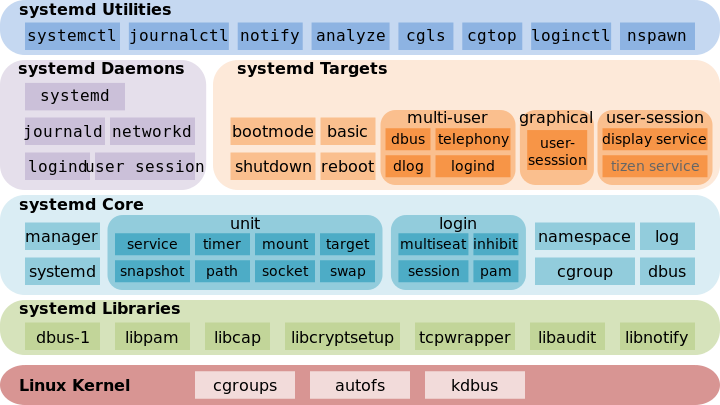

# systemd 与 cgroup 机制解析

> systemd v243

> [systemd官方手册](https://systemd.io/)
> [systemd使用参考指南](https://docs.redhat.com/en/documentation/red_hat_enterprise_linux/7/html/system_administrators_guide/chap-managing_services_with_systemd)

* Target: group of units
* Automount: filesystem auto-mountpoint
* Device: kernel device names, which you can see in sysfs and udev
* Mount: filesystem mountpoint
* Path: file or directory
* Scope: external processes not started by systemd
* Slice: a management unit of processes
* Snapshot: systemd saved state
* Socket: IPC (inter-process communication) socket
* Swap: swap file
* Timer: systemd timer.

| Unit Type | File Extension | Description |
| -- | -- | -- |
| Service unit | `.service` | 	
A system service. |
| Target unit | `.target` | 	
A group of systemd units. |
| Automount unit | `.automount` | 	
A file system automount point. |
| Device unit | `.device` | 	
A kernel device name, which you can see in sysfs and udev. |
| Mount unit | `.mount` | 	
A file system mount point. |
| Path unit | `.path` | 	
A file or directory. |
| Scope unit | `.scope` | 	
An external process not started by systemd. |
| Slice unit | `.slice` | 	
A management unit of processes. |
| Snapshot unit | `.snapshot` | 	
A systemd saved state. |
| Socket unit | `.socket` | 	
An IPC (inter-process communication) socket. |
| Swap unit | `.swap` | 	
A swap file. |
| Timer unit | `.timer` | 	
A systemd timer. |

| Directory | Description |
| -- | -- |
| `/usr/lib/systemd/system/` | Systemd unit files distributed with installed RPM packages. |
| `/run/systemd/system/` | Systemd unit files created at run time. This directory takes precedence over the directory with installed service unit files. |
| `/etc/systemd/system/` | Systemd unit files created by `systemctl enable` as well as unit files added for extending a service. This directory takes precedence over the directory with runtime unit files. |

