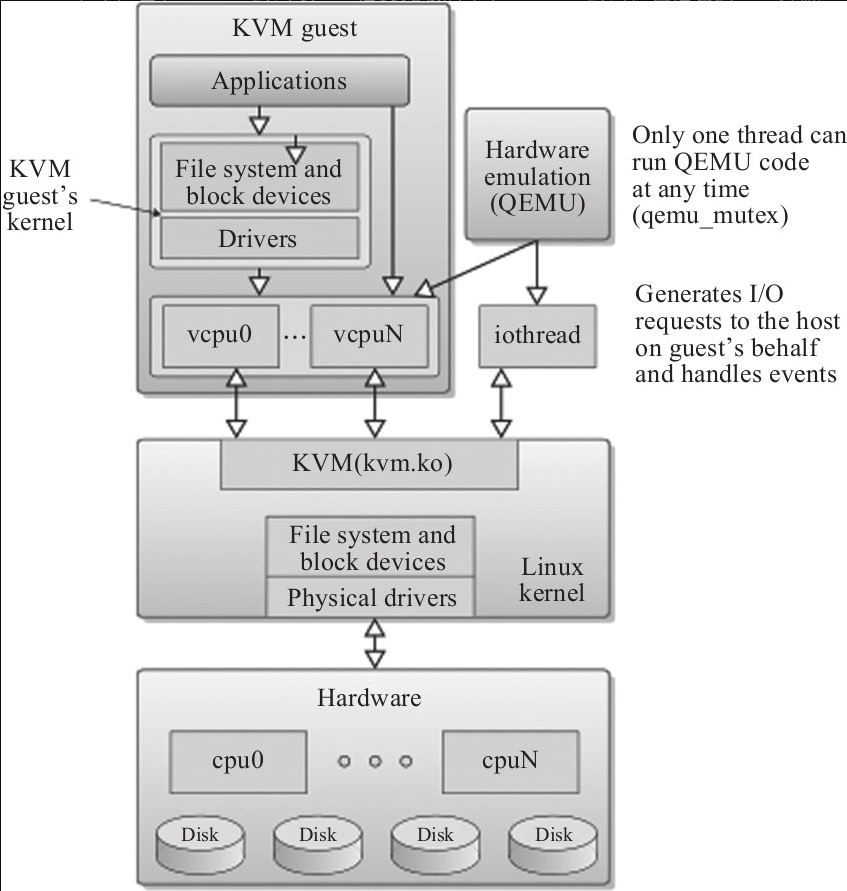

# Virtio

Virtio is a typical ttechniques for half-virtualization, 使用virtio需要在宿主机/VMM和客户机里都相应地装上驱动。

On the contrast, Full virtualization alwasy insisted that the guestos don't need to change anything.

KVM 基于Linux kernel，通过加载模块使Linux kernel本身变成一个Hypervisor.

## Basic concepts about KVM

一个KVM客户机对应于一个Linux进程，每个vCPU则是这个进程下的一个线程，还有单独的处理IO的线程，也在一个线程组内。
客户机所看到的硬件设备是QEMU模拟出来的（不包括VT-d透传的设备）​，当客户机对模拟设备进行操作时，由QEMU截获并转换为对实际的物理设备（可能设置都不实际物理地存在）的驱动操作来完成.

Shadow Page Table - KVM hypervisor give every guest os a piece of shadow page table, which described the relation between GPA and HPA. Then it's replaced by hardware to improve efficiency.

